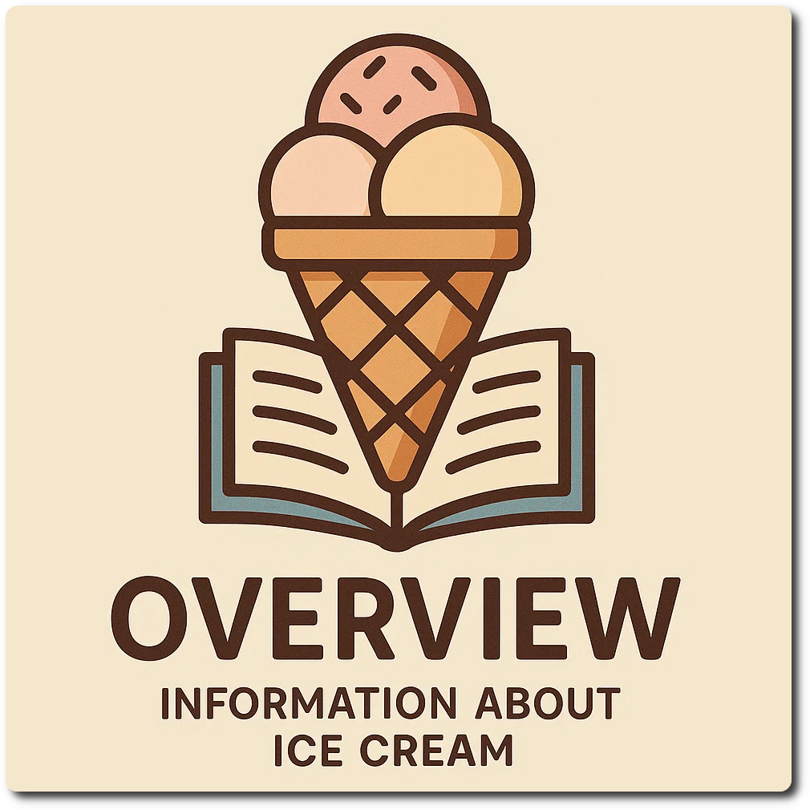

# Overview
<!--
summarize the top-level source sections in concise form, without extensive citations.
use the Markdown format for the output.
-->

> ℹ️ Also check out the [wiki](https://github.com/jhermann/ice-creamery/wiki) which has some fundamental knowledge base articles.

*   **Overview**

    *You are here.* Use the left sidebar, or the hamburger menu in the mobile view, to select a section of interest.

*   **Frequently Asked Questions (FAQ)**

    This section answers common questions about the Ninja Creami recipes and process.

*   **Glossary**

    This section provides definitions for various technical terms relevant to ice cream making.

    Key terms defined include Freezing Point Depression Factor (FPDF), Glycemic Index (GI),
    Potere Anti Congelante (PAC), and Potere Dolcificante (POD).

*   **Ingredients**

    This section offers background information on key ice cream ingredients, categorized by their function.

    It lists Freezing Point Depression Factors for various ingredients. It also details properties, usage, and effects of different *sweeteners*, describes various *thickeners* (hydrocolloids), and explains the function of *emulsifiers* in improving texture and stability.

*   **Nutritional Values**

    Lists the nutritional values and PAC / MSNF of common ingredients, with a regional bias towards Germany.
    All the ingredients are sourcable in German supermarkets (REWE/Aldi), or on amazon.de.

*   **Plating & Presentation**

    How to present your home-made ice cream favorably to other people, when you don't eat it directly out of the tub. 😋🥣😄

*   **"Polar Ice Creamery" Wisdoms**

    Important ideas and facts regarding various ice cream topics, drawing information directly from
    the YouTube video transscripts of the well-known *Polar Ice Creamery* channel.

    This accompanies the information on the other pages here, and you can expect some duplication.

*   **Philosophy & Principles**

    A summary of the core components and principles underpinning the recipe formulations.

*   **Recently Changed**

    This section lists recipes that have been created within the last two months.

*   **Tips & Tricks**

    This section provides practical advice for using the Ninja Creami.

    It offers hints like these:

     * making recipes that remain scoopable after refreezing,
     * streamlining the ingredient weighing and mixing process using a kitchen scale and immersion blender,
     * scaling recipes for different Ninja Creami models,
     * preparing dry ingredient mixes in bulk for efficiency,
     * guidance on choosing processing modes based on their speed and duration profiles for different desired textures,
     * the importance of performing a scrape test before processing,
     * and methods for the handling of icy container walls after the initial processing step.

*   **Resources on the Web**

    A list of well-known web sites and other resources like YouTube channels found on the internet.
