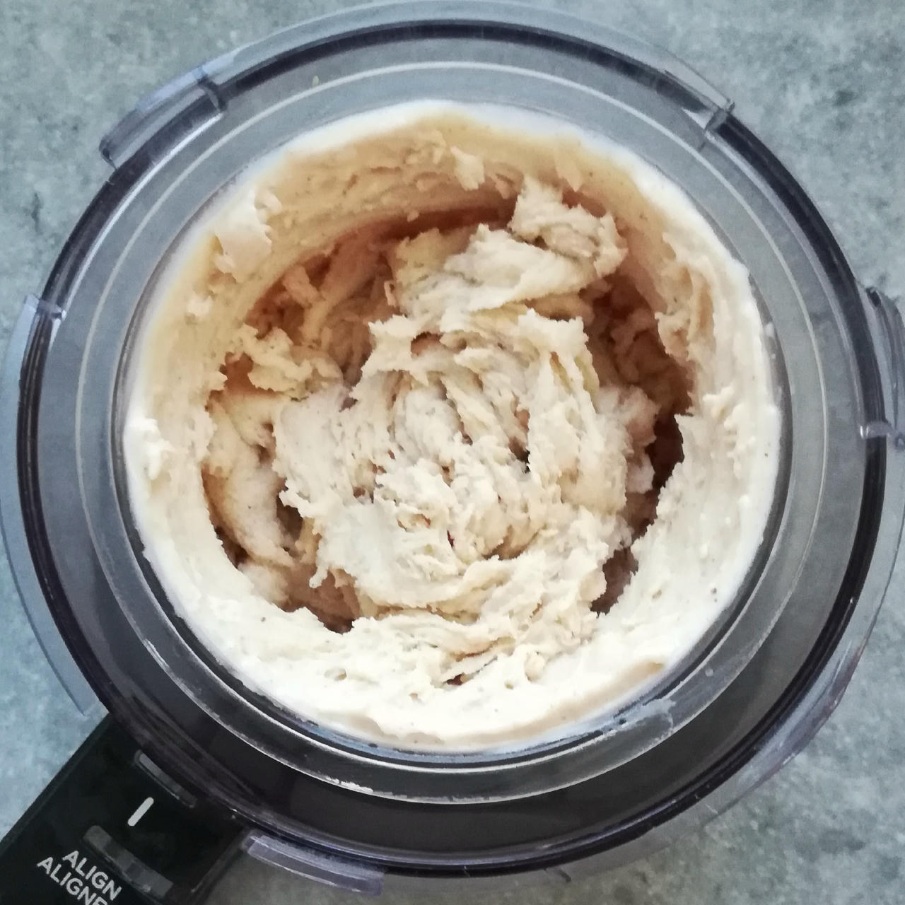
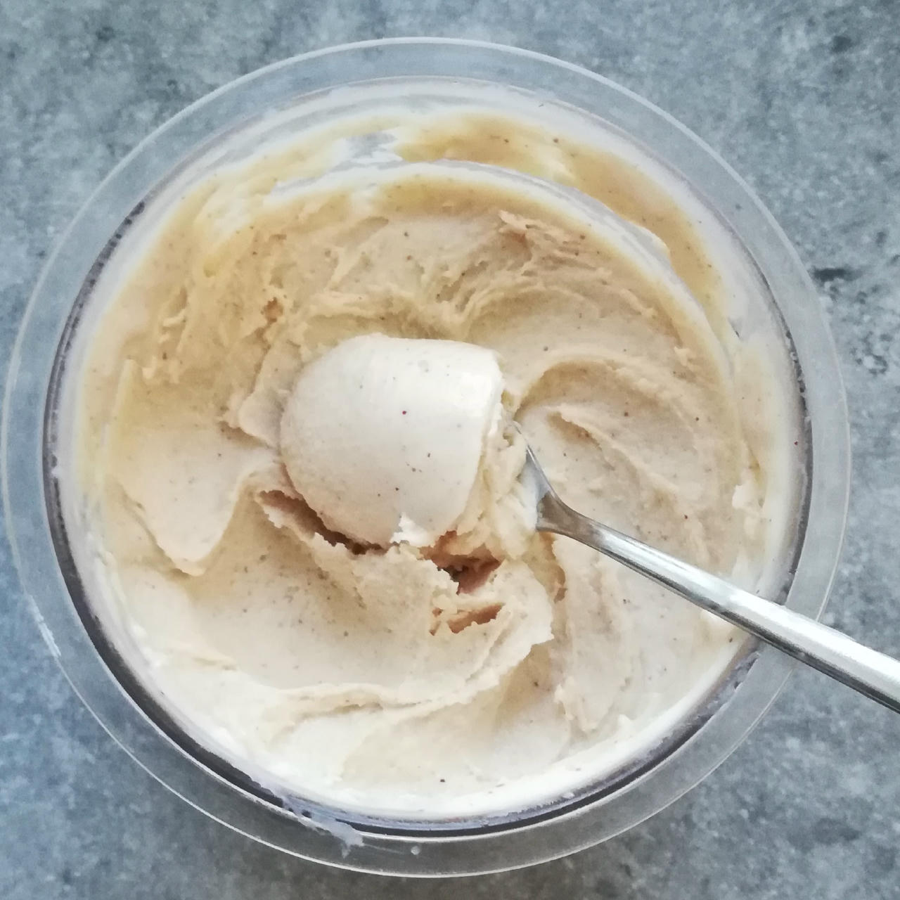
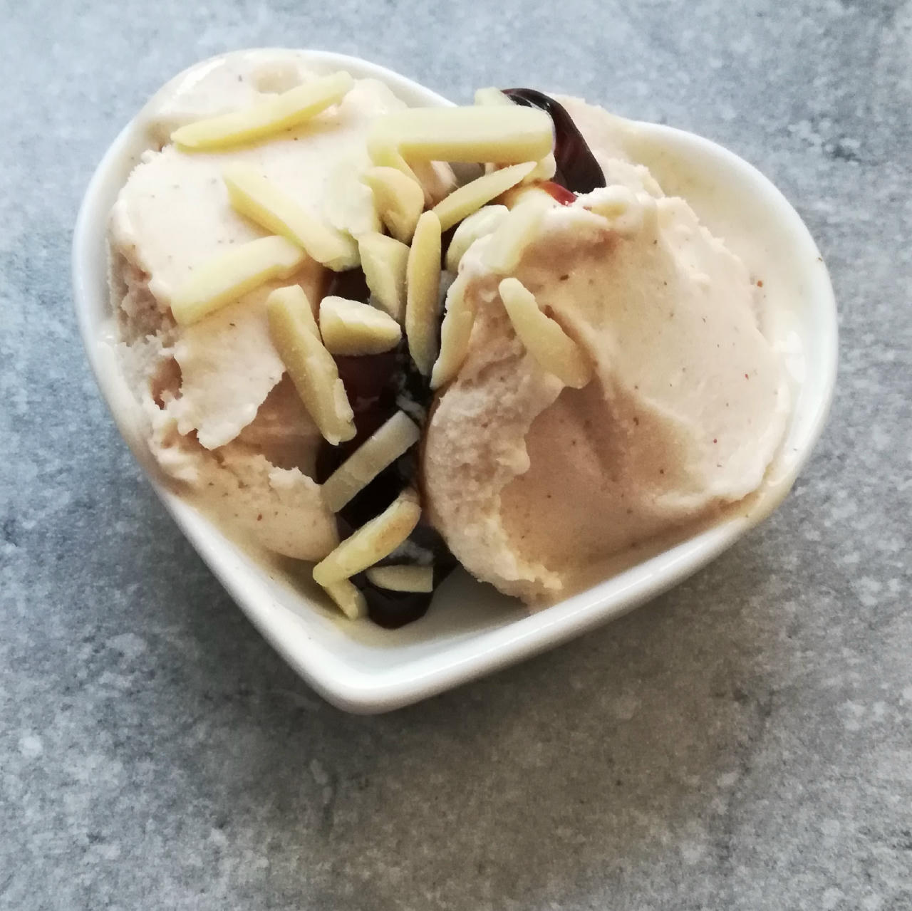

# Almond Buttermilk (Deluxe)

Processed on *Lite Ice Cream*, with scrape-down and a respin.

> 

After 2 hours of freezing for firmer consistency — still on the soft side, but this will firm up further overnight.

> 

Rating: 😋😋😋😋😋

> 
> 
> 
>
> *Final version from Sat 2025-06-07 (after lite ice cream & mix-in, and scooped).*

> 
> 
> *Served with a topping of black sesame in a creamy pomegranate sauce.*

Added 2g GMS (emulsifier) and dissolved that, the SMP and the almond butter in heated soy milk. That improved texture a lot, and it needed only one Sorbet spin, no respins.

> 
> 
> 
> 
> *Served with molasses and almond slivers, directly after processing.*

# INGREDIENTS

ℹ️ Brand names are in square brackets `[...]`.

**Prep**

  - _200ml_ [Soy milk 1.6% (sugar-free) \[Berief\]](/ice-creamery/info/ingredients/#soy-milk){target="_blank"}↗
  - _40g_ [Almond butter (creamy) \[Seba Garden\]](/ice-creamery/info/ingredients/#almond-milk-butter){target="_blank"}↗
  - _15g_ [Skim milk powder 1:10 (SMP) \[Vita2You\]](/ice-creamery/info/ingredients/#skim-milk-powder-smp){target="_blank"}↗
  - _2g_ [Glycerol Monostearate (E471) \[Bulk\]](/ice-creamery/info/ingredients/#glycerol-monostearate-gms-e471){target="_blank"}↗

**Wet**

  - _300ml_ Buttermilk 1% [REWE]
  - _15g_ [Glycerin (E422, VG) \[hd-line\]](/ice-creamery/info/ingredients/#vegetable-glycerin-glycerol-vg-e422){target="_blank"}↗ • Sweetness = 60%; GI = 5; Density = 1.26 g/ml
  - _10g_ [Brandy or Vodka 40 vol%](/ice-creamery/info/ingredients/#alcohol-ethanol){target="_blank"}↗

**Dry**

  - _30g_ ICSv2 [Erythritol / Inulin / CMC / Guar / XG / Salt] • [http﹕//bit.ly/4frc4Vj](https://jhermann.github.io/ice-creamery/I/Ice%20Cream%20Stabilizer%20(ICS)/)
  - _30g_ [Xylitol (E967)](/ice-creamery/info/ingredients/#xylitol-e967){target="_blank"}↗ • POD = 100%; GI = 7

**Fill to MAX**

  - _78ml_ Buttermilk 1% [REWE]
  - _≈10 drops_ Flavor drops Cookies&Cream (stevia) [Nick’s] • to taste

**Mix-ins**

  - _25g_ Dark chocolate 70% [Moser-Roth/Aldi] • add chopped or shaved as a mix-in [145kcal, 7g sugar]
  - _10g_ Almond slivers [naturix24] • add as a topping or mix-in [59kcal, 0.4g sugar]

# DIRECTIONS

 1. Microwave the soy milk and almond butter to 70°C.
 1. Mix SMP and GMS and blend it into the hot milk.
 1. Add the rest of the ‘wet’ ingredients.
 1. Weigh and mix dry ingredients, easiest by adding to a jar with a secure lid and shaking vigorously.
 1. Pour into the tub and *QUICKLY* use an immersion blender on full speed to homogenize everything.
 1. Let blender run until thickeners are properly hydrated, up to 1-2 min. Or blend again after waiting that time.
 1. Add remaining ingredients (to the MAX line) and stir with a spoon.
 1. Put on the lid, freeze for 24h, then spin as usual. Flatten any humps before that.
 1. Process with RE-SPIN mode when not creamy enough after the first spin.
 1. Process with MIX-IN after adding mix-ins evenly. For that, add partial amounts into a hole going down to the bottom, and fold the ice cream over, building pockets of mix-ins.

# NUTRITIONAL & OTHER INFO
- **Nutritional values per 100g/ml:** 100g; 95.1 kcal; fat 3.6g; carbs 14.2g; sugar 3.6g; protein 4.6g; salt 0.2g
- **Nutritional values per ½ Deluxe Tub:** 360g; 342.5 kcal; fat 13.1g; carbs 51.0g; sugar 12.9g; protein 16.5g; salt 0.7g
- **Nutritional values total:** 720g; 685.1 kcal; fat 26.3g; carbs 102.0g; sugar 25.7g; protein 33.0g; salt 1.4g
- **FPDF / [PAC](/ice-creamery/info/glossary/#potere-anti-congelante-pac){target="_blank"}↗ (target 20..30):** 31.05
- **Protein / Energy Ratio (ok=12%; hi=20%):** 19.25% • Low-Sugar
- **Milk Solids Non-Fat ([MSNF](/ice-creamery/info/glossary/#milk-solids-not-fat-msnf){target="_blank"}↗, 7-11%):** 46.2g • 6.4%
- **Net carbs:** 37.3g • *∝ 5 servings@144g:* 7.5g • *∝ 3 servings@240g:* 12.4g
- **30g Ice Cream Stabilizer (ICSv2) is:** 13.8g Erythritol (E968) • 13.8g Inulin • 1.4g Tylose powder (E466, Tylo, CMC) • 0.48g Guar gum (E412) • 0.48g Salt • 0.14g Xanthan gum (E415, XG).
