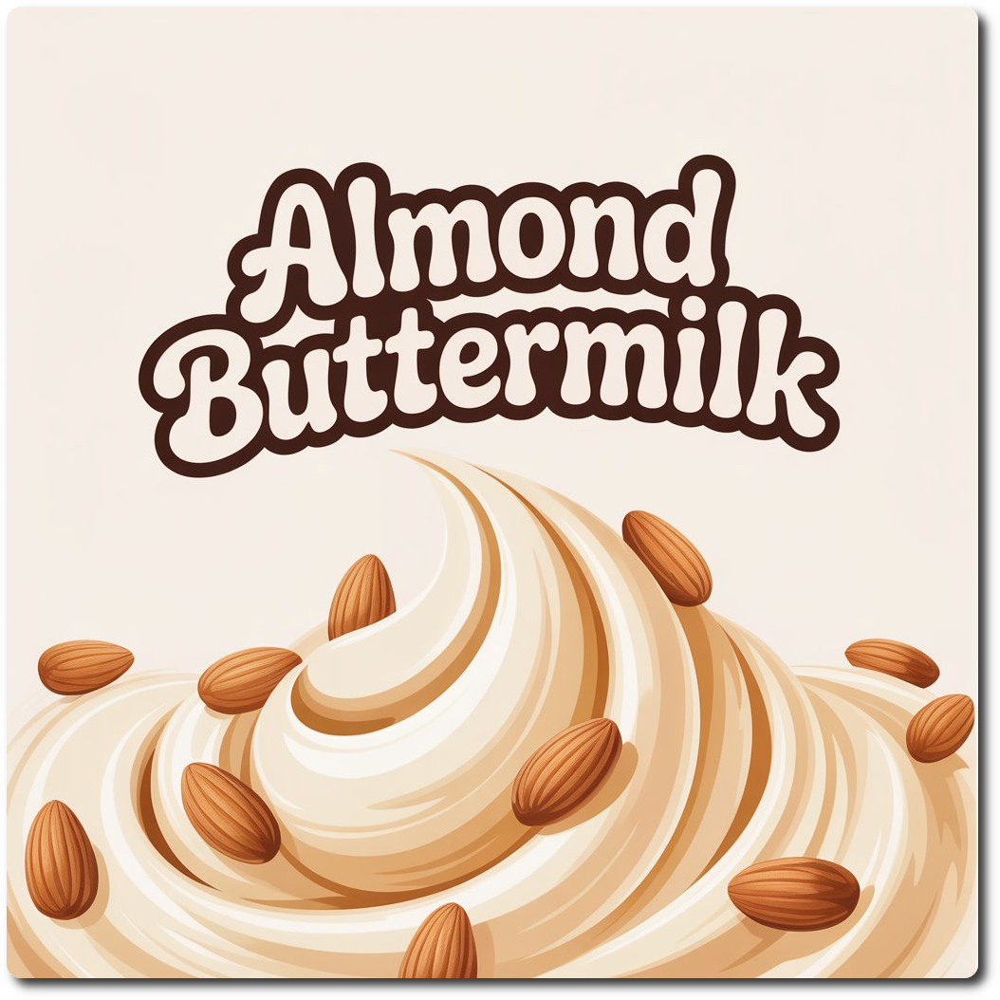
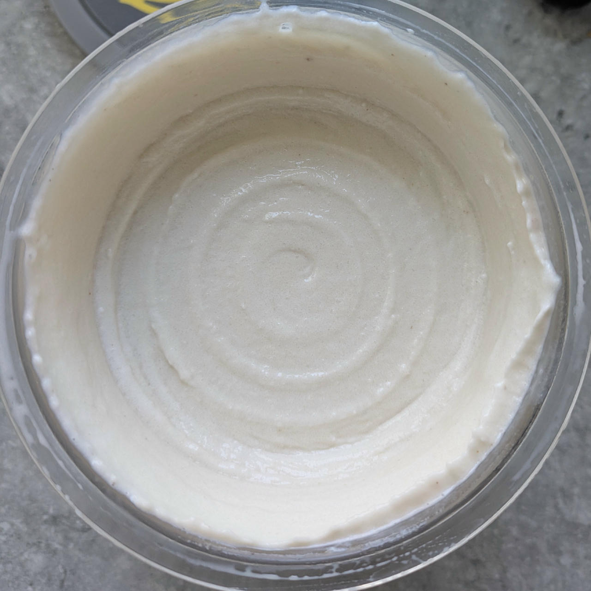
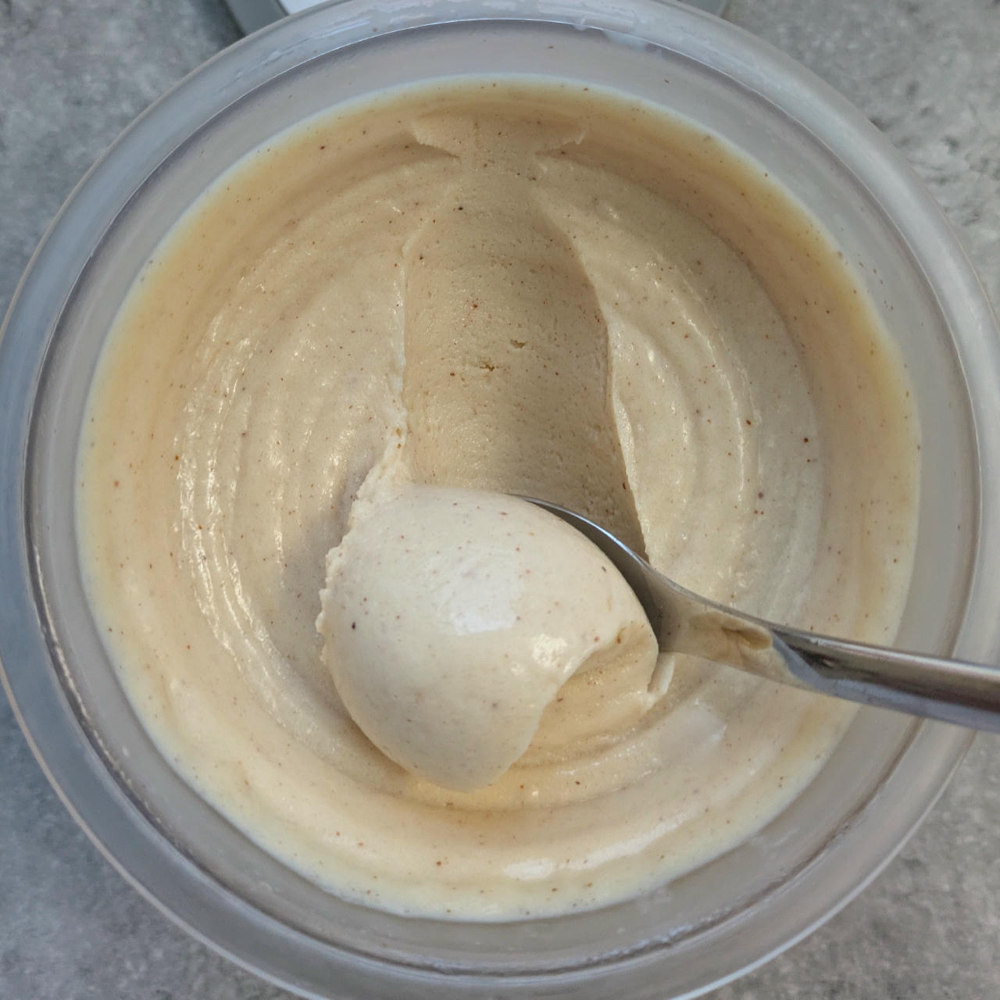
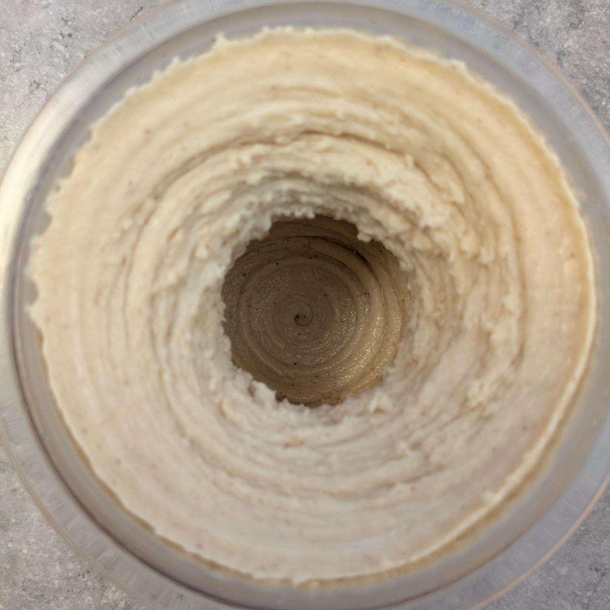
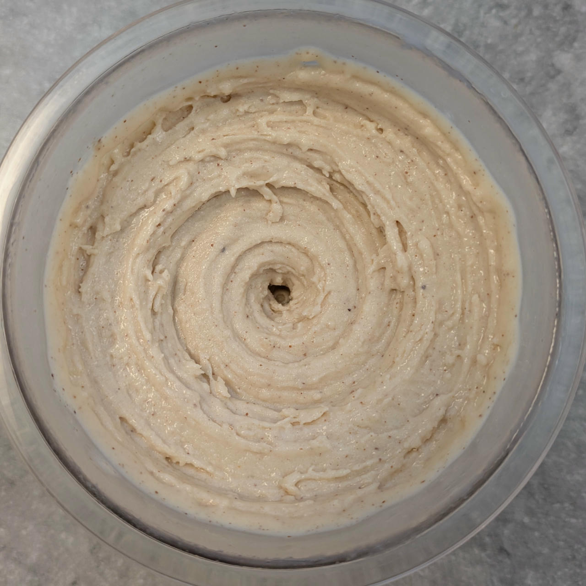
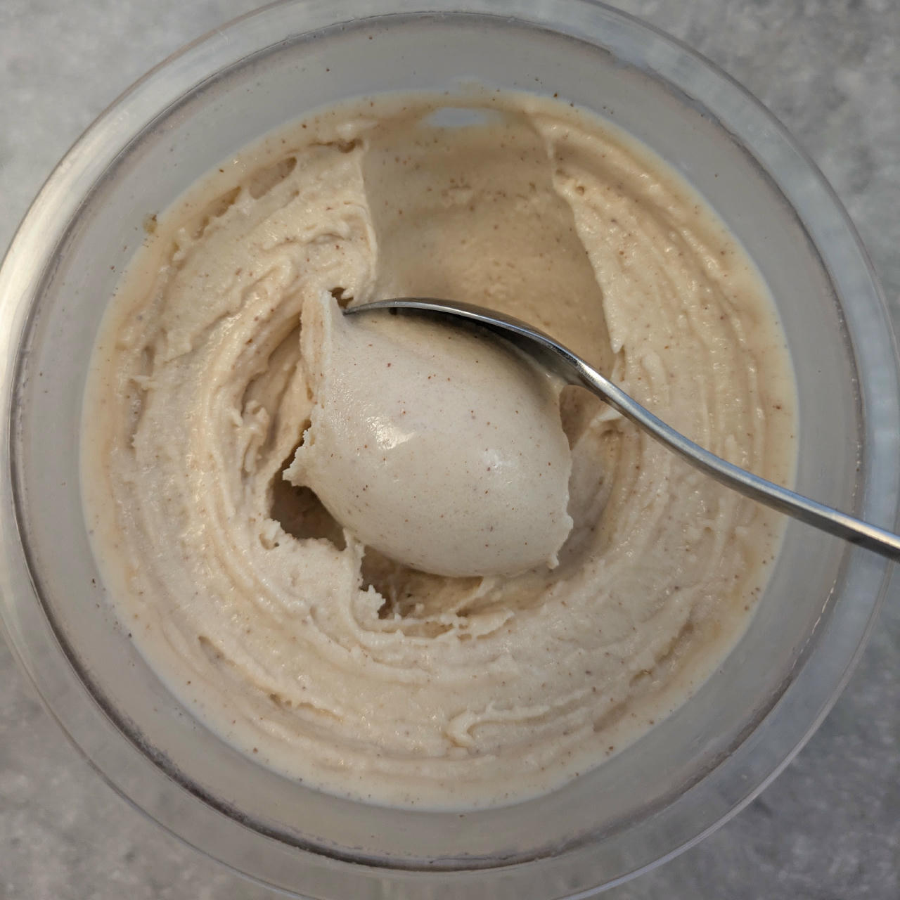
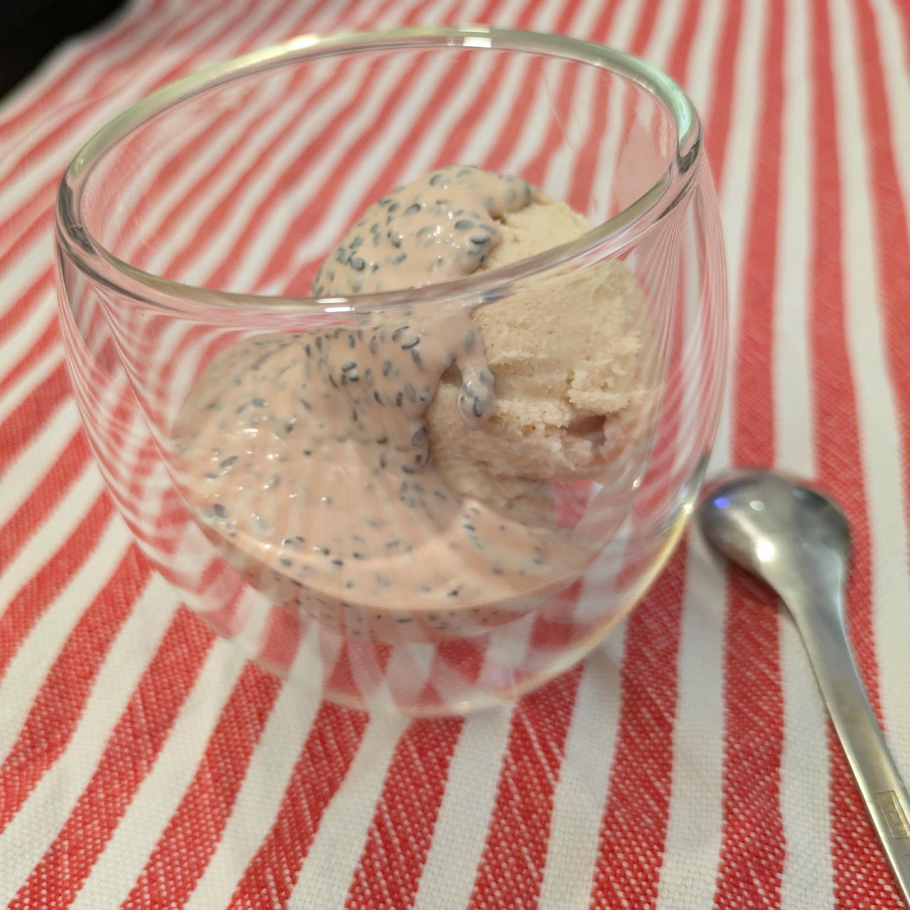

# Almond Buttermilk (Deluxe)

Processed on *Lite Ice Cream*, with scrape-down and a respin.

> 

After 2 hours of freezing for firmer consistency — still on the soft side, but this will firm up further overnight.

> 

Rating: 😋😋😋😋😋

> 
> 
> 
>
> *Final version from Sat 2025-06-07 (after lite ice cream & mix-in, and scooped).*

> 
>
> *Served with a topping of black sesame in a creamy pomegranate sauce.*

# INGREDIENTS

ℹ️ Brand names are in square brackets `[...]`.

**Wet**

  - _350ml_ Buttermilk 1% [REWE]
  - _200ml_ [Skim Milk 1.5% \[Weihenstephan\]](/ice-creamery/info/ingredients/#skim-milk){target="_blank"}↗
  - _40g_ [Almond butter (creamy) \[Seba Garden\]](/ice-creamery/info/ingredients/#almond-milk-butter){target="_blank"}↗
  - _15g_ [Glycerin (E422, VG) \[hd-line\]](/ice-creamery/info/ingredients/#vegetable-glycerin-glycerol-vg-e422){target="_blank"}↗ • POD = 60%; GI = 5; Density = 1.26 g/ml
  - _10g_ [Brandy “Williams Birne” 40 vol%](/ice-creamery/info/ingredients/#alcohol-ethanol){target="_blank"}↗
  - _10 drops_ Flavor drops Cookies&Cream [Nick’s] • with stevia

**Dry**

  - _30g_ ICSv2 [Erythritol / CMC / Tara / XG / Inulin] • [http﹕//bit.ly/4frc4Vj](https://jhermann.github.io/ice-creamery/I/Ice%20Cream%20Stabilizer%20(ICS)/)
  - _30g_ [Xylitol](/ice-creamery/info/ingredients/#xylitol-e967){target="_blank"}↗ • POD = 100%; GI = 7
  - _15g_ [Skim milk powder 1:10 (SMP) \[Vita2You\]](/ice-creamery/info/ingredients/#skim-milk-powder-smp){target="_blank"}↗

**Fill to MAX**

  - _30ml_ Water to MAX line

# DIRECTIONS

 1. Add "wet" ingredients to empty Creami tub.
 1. Weigh and mix dry ingredients, easiest by adding to a jar with a secure lid and shaking vigorously.
 1. Pour into the tub and *QUICKLY* use an immersion blender on full speed to homogenize everything.
 1. Let blender run until thickeners are properly hydrated, up to 1-2 min. Or blend again after waiting that time.
 1. Add remaining ingredients (to the MAX line) and stir with a spoon.
 1. Put on the lid, freeze for 24h, then spin as usual. Flatten any humps before that.
 1. Process with RE-SPIN mode when not creamy enough after the first spin.

# NUTRITIONAL & OTHER INFO
- **Nutritional values per 100g/ml:** 100g; 97.4 kcal; fat 3.6g; carbs 13.4g; sugar 4.8g; protein 4.6g; salt 0.2g
- **Nutritional values per ½ Deluxe Tub:** 360g; 350.5 kcal; fat 13.0g; carbs 48.3g; sugar 17.2g; protein 16.5g; salt 0.7g
- **Nutritional values total:** 720g; 701.0 kcal; fat 25.9g; carbs 96.7g; sugar 34.4g; protein 33.0g; salt 1.4g
- **FPDF / [PAC](/ice-creamery/info/glossary/#potere-anti-congelante-pac){target="_blank"}↗ (target 20..30):** 32.27
- **Protein / Energy Ratio (ok=12%; hi=20%):** 18.82% • Low-Sugar
- **Milk Solids Non-Fat ([MSNF](/ice-creamery/info/glossary/#milk-solids-not-fat-msnf){target="_blank"}↗, 7-11%):** 62.2g • 8.6%
- **30g Ice Cream Stabilizer (ICSv2) is:** 14.3g erythritol, 1.43g Tylose powder (CMC, E466), 
0.5g tara gum (E417), 0.15g xanthan (E415),
14.3g inulin, 0.5g salt.
