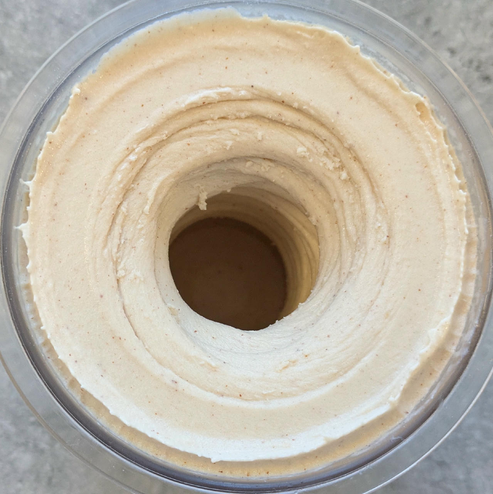
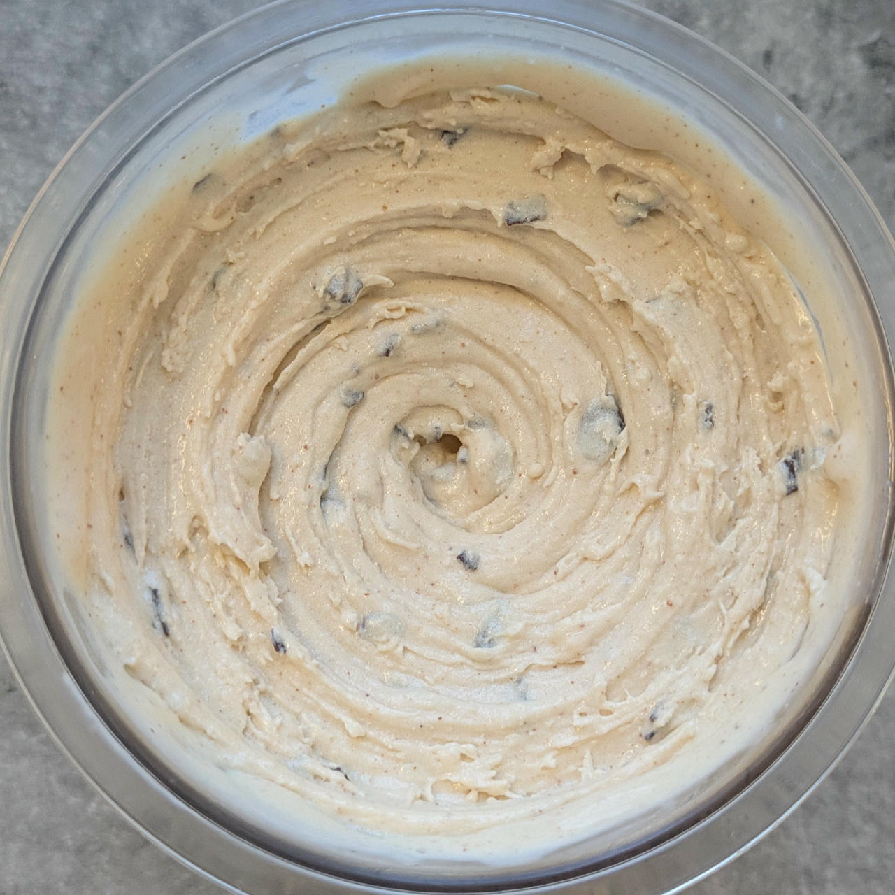
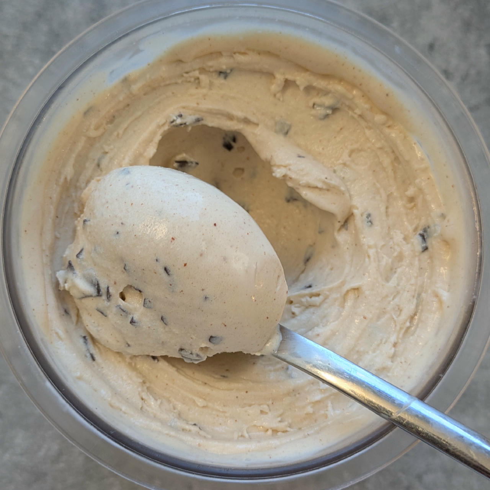

# Almond Buttermilk (Deluxe)

Ice cream based on almond butter and Amaretto as the main flavor component, adding buttermilk and unsweetened soy milk (to keep sugar lower).
An emulsifier is used to properly integrate the nut butter.

Processed on *Lite Ice Cream*, with scrape-down and a respin.

> 

After 2 hours of freezing for firmer consistency — still on the soft side, but this will firm up further overnight.

> 

Rating: 😋😋😋😋😋

> 
> 
> 
>
> *Final version from Sat 2025-06-07 (after lite ice cream & mix-in, and scooped).*

> 
> 
> *Served with a topping of black sesame in a creamy pomegranate sauce.*

Added 2g GMS (emulsifier) and dissolved that, the SMP and the almond butter in heated soy milk. That improved texture a lot, and it needed only one Sorbet spin, no respins.

> 
> 
> 
> 
> *Served with molasses and almond slivers, directly after processing.*

> 
> 
> 
> 
> *Added 100g cottage cheese, processed using FroYo, and used dark chocolate flakes as a mix-in.*

# INGREDIENTS

ℹ️ Brand names are in square brackets `[...]`.

**Prep**

  - _150ml_ [Soy milk 1.6% (sugar-free) \[Berief\]](/ice-creamery/info/ingredients/#soy-milk){target="_blank"}↗
  - _40g_ [Almond butter (creamy) \[Seba Garden\]](/ice-creamery/info/ingredients/#almond-milk-butter){target="_blank"}↗
  - _15g_ [Skim milk powder 1:10 (SMP) \[Vita2You\]](/ice-creamery/info/ingredients/#skim-milk-powder-smp){target="_blank"}↗
  - _2g_ [Glycerol Monostearate (E471) \[Bulk\]](/ice-creamery/info/ingredients/#glycerol-monostearate-gms-e471){target="_blank"}↗

**Wet**

  - _350ml_ Buttermilk 1% [REWE]
  - _10g_ [Glycerin (E422, VG) \[hd-line\]](/ice-creamery/info/ingredients/#vegetable-glycerin-glycerol-vg-e422){target="_blank"}↗ • Sweetness = 60%; GI = 5; Density = 1.26 g/ml
  - _25ml_ [Amaretto 28 vol%](/ice-creamery/info/ingredients/#alcohol-ethanol){target="_blank"}↗

**Dry**

  - _40g_ [SweEX (Erythritol + Xylitol 3:2)](/ice-creamery/info/ingredients/#sweex-erythritol-xylitol-blend){target="_blank"}↗ • POD ≈ 90%; GI < 7
  - _15g_ [Salty Stability \[Inulin / GMS / CMC / Guar / XG / Salt\]](/ice-creamery/S/Salty%20Stability/){target="_blank"}↗ • unsweetened “ICSv2”

**Fill to MAX**

  - _73ml_ Buttermilk 1% [REWE]
  - _≈10 drops_ Flavor drops Cookies&Cream (stevia) [Nick’s] • to taste

**Mix-ins**

  - _25g_ Dark chocolate 70% [Moser-Roth/Aldi] • add chopped or shaved as a mix-in [145kcal, 7g sugar]
  - _10g_ Almond slivers [naturix24] • add as a topping or mix-in [59kcal, 0.4g sugar]
  - _14g_ Amarettini [REWE/Gadeschi] • 10 pcs = 13.8g; add as a topping or mix-in [58kcal, 9.1g sugar]

**Topping Options**

  - _5ml_ Molasses [Grafschafter Goldsaft] • add as a topping [15kcal, 3.3g sugar]

# DIRECTIONS

 1. Microwave the soy milk and almond butter to 70°C.
 1. Mix SMP and GMS and blend it into the hot milk.
 1. Add the rest of the ‘wet’ ingredients.
 1. Weigh and mix dry ingredients, easiest by adding to a jar with a secure lid and shaking vigorously.
 1. Pour into the tub and *QUICKLY* use an immersion blender on full speed to homogenize everything.
 1. Let blender run until thickeners are properly hydrated, up to 1-2 min. Or blend again after waiting that time.
 1. Add remaining ingredients (to the MAX line) and stir with a spoon.
 1. Put on the lid, freeze for 24h, then spin as usual. Flatten any humps before that.
 1. Process with RE-SPIN mode when not creamy enough after the first spin.
 1. Process with MIX-IN after adding mix-ins evenly. For that, add partial amounts into a hole going down to the bottom, and fold the ice cream over, building pockets of mix-ins.

# NUTRITIONAL & OTHER INFO
- **Nutritional values per 100g/ml:** 100g; 95.7 kcal; fat 3.6g; carbs 14.0g; sugar 4.8g; protein 4.6g; salt 0.2g
- **Nutritional values per ½ Deluxe Tub:** 360g; 344.4 kcal; fat 13.1g; carbs 50.3g; sugar 17.4g; protein 16.5g; salt 0.7g
- **Nutritional values total:** 720g; 688.7 kcal; fat 26.2g; carbs 100.6g; sugar 34.8g; protein 33.1g; salt 1.4g
- **FPDF / [PAC](/ice-creamery/info/glossary/#potere-anti-congelante-pac){target="_blank"}↗ (target 20..30):** 31.04
- **Protein / Energy Ratio (ok=12%; hi=20%):** 19.20% • Low-Sugar
- **Milk Solids Non-Fat ([MSNF](/ice-creamery/info/glossary/#milk-solids-not-fat-msnf){target="_blank"}↗, 7-11%):** 56.1g • 7.8%
- **Net carbs:** 44.5g • *∝ 5 servings@144g:* 8.9g • *∝ 3 servings@240g:* 14.8g • *energy ratio (low <20%):* 25.8%
- **15g 'Salty Stability' is:** 11.0g Inulin • 1.8g Glycerol Monostearate (GMS / E471) • 0.9g Tylose powder (E466, Tylo, CMC) • 0.6g Guar gum (E412) • 0.5g Salt • 0.2g Xanthan gum (E415, XG).
