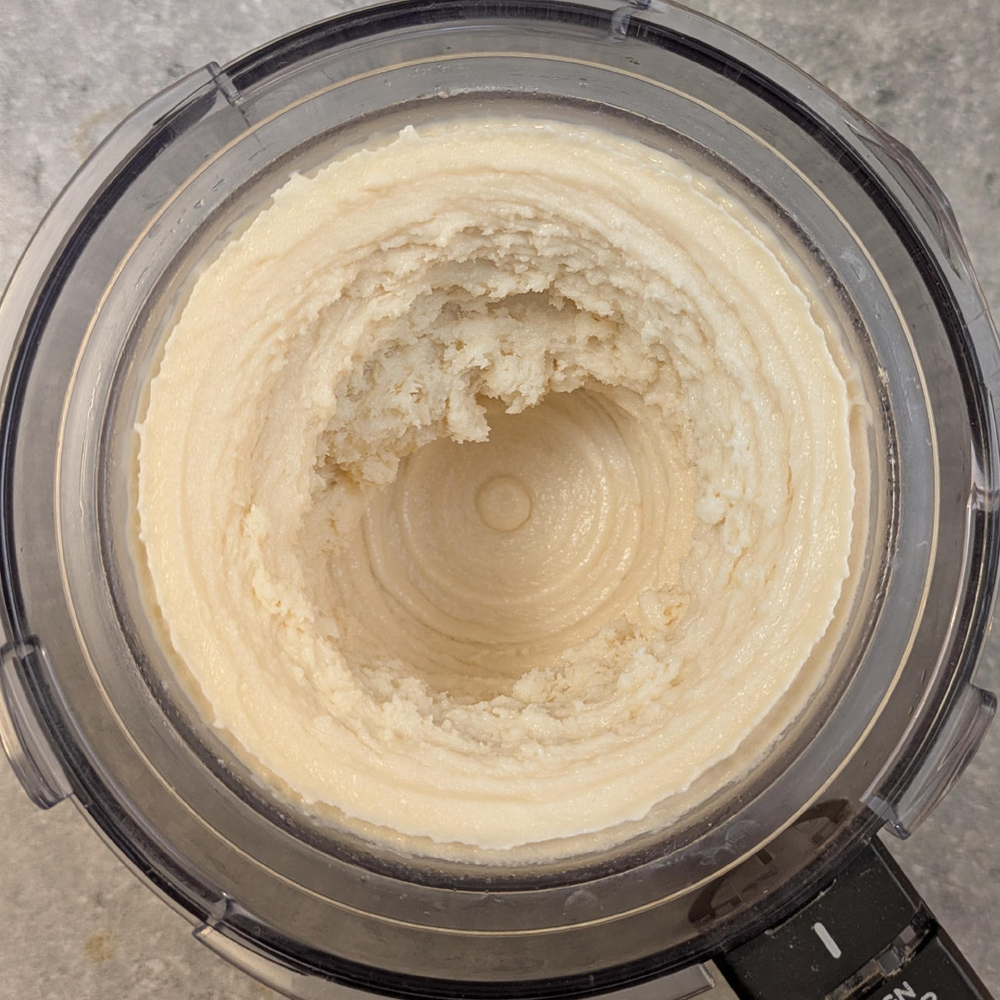
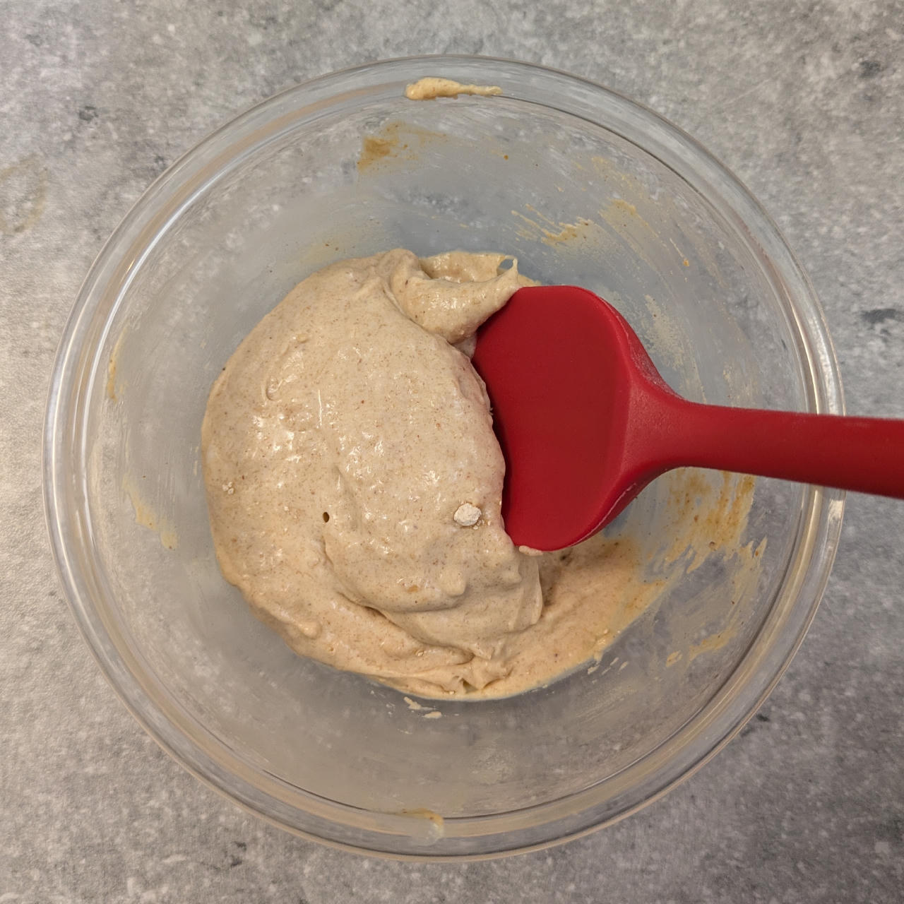

## *Variant:* Peanut Buttermilk with PB Cream Mix-in

Use peanut butter instead of the almond butter, with this optional mix-in for more flavor and creaminess (and ~960kcal for the whole tub):

  - _50ml_ Cream 32% [REWE Beste Wahl]
  - _20g_ PB powder \[Vilgain\]
  - _10g_ [Trehalose \[SaporePuro\]](/ice-creamery/info/ingredients/#trehalose-e965){target="_blank"}↗ • POD = 45%; GI = 38
  - _0.2g_ Salt

Combine everything in a bowl to a smooth paste, and add as a mix-in.

> 
> 
> 
> 

**Nutritional Info for the Mix-in:** 80g; 268.4 kcal; fat 18.8g; carbs 13.9g; sugar 12.3g; protein 10.9g; salt 0.3g
