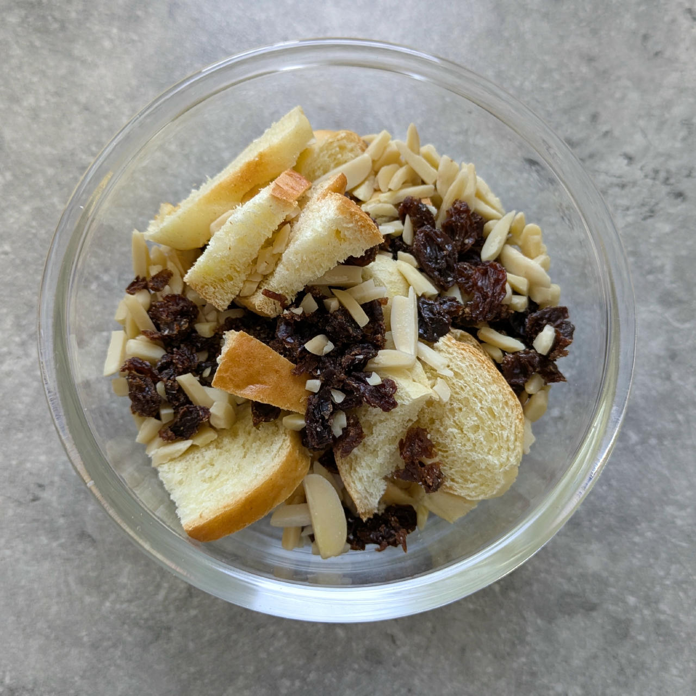
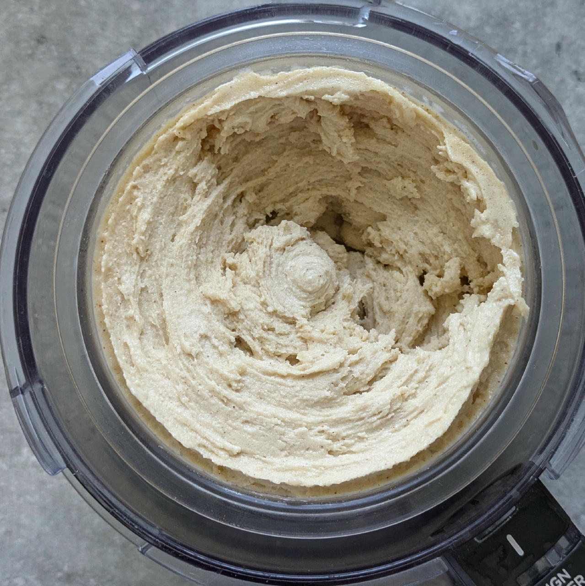
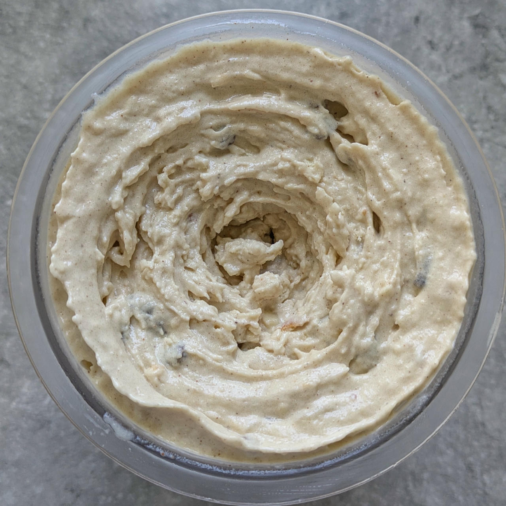
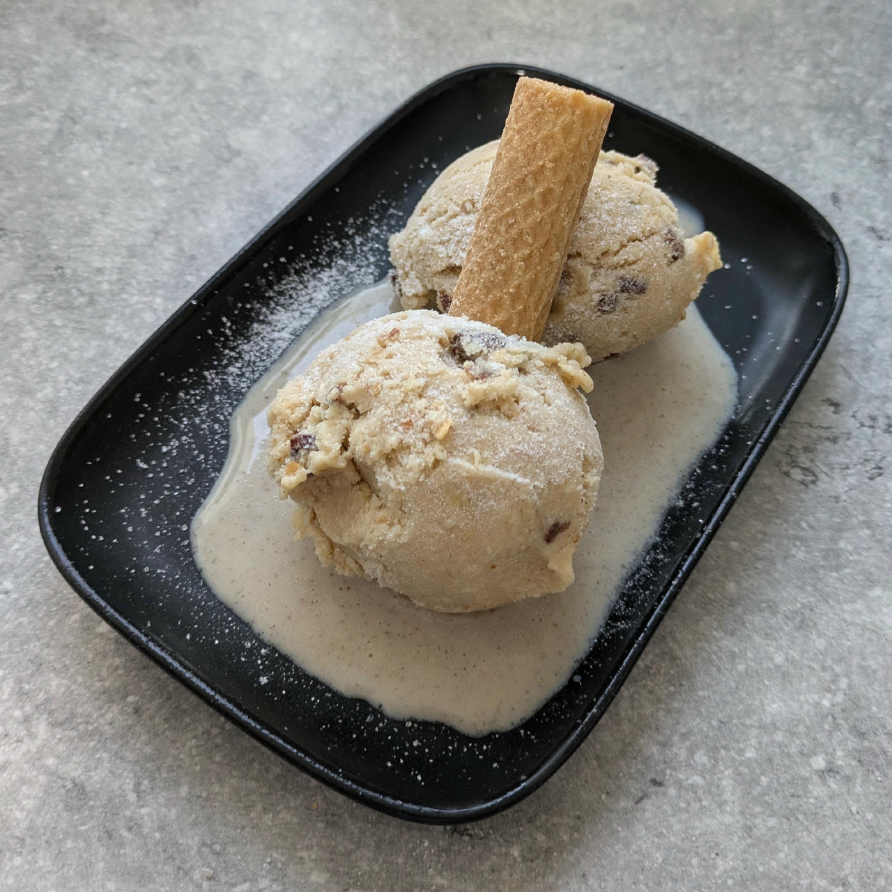

# Apple Strudel (Deluxe)

Applesauce sherbet with cinnamon, almonds, raisins, and half a croissant to stand in for the strudel dough.
70g of mix-ins are included in the nutritional info.

> 

Spin on “Sorbet”, followed by a scrape-down and a mix-in run for the almonds and raisins.

> 
> 
> 
> 
>
> *Served on a bed of vanilla sauce and with a wafer roll.*

Rating: 😋🍎🍏🍇🥐

# INGREDIENTS

ℹ️ Brand names are in square brackets `[...]`.

**Wet**

  - _350ml_ Apple Sauce (no added sugar) [Gut Bio/Aldi] • 1 jar = 355g
  - _180ml_ [Soy milk 1.6% (sugar-free) \[Berief\]](/ice-creamery/info/ingredients/#soy-milk){target="_blank"}↗
  - _10g_ [Glycerin (E422, VG) \[hd-line\]](/ice-creamery/info/ingredients/#vegetable-glycerin-glycerol-vg-e422){target="_blank"}↗ • Sweetness = 60%; GI = 5; Density = 1.26 g/ml
  - _10g_ [Brandy or Vodka 40 vol%](/ice-creamery/info/ingredients/#alcohol-ethanol){target="_blank"}↗

**Dry**

  - _30g_ [SweEX (Erythritol + Xylitol 3:2)](/ice-creamery/info/ingredients/#sweex-erythritol-xylitol-blend){target="_blank"}↗ • POD ≈ 85%; GI < 7
  - _10g_ [Salty Stability \[Inulin / GMS / CMC / Guar / XG / Salt\]](/ice-creamery/S/Salty%20Stability/){target="_blank"}↗ • unsweetened “ICSv2”
  - _20g_ [Whey + Casein protein (grass-fed) \[Vilgain\]](/ice-creamery/info/ingredients/#whey-protein){target="_blank"}↗ • with stevia
  - _1.5g_ Cinnamon (Ceylon) • 1tsp = 3g

**Fill to MAX**

  - _❕_ Stay BELOW the MAX line (leave room for mix-ins)
  - _≈2 drops_ Flavor drops Vanilla (sucralose) [IronMaxx] • to taste
  - _≈2 drops_ Flavor drops Caramel (sucralose) [IronMaxx] • to taste

**Mix-ins**

  - _20g_ Almond slivers [naturix24] • add as a mix-in [118kcal, 0.8g sugar]
  - _15g_ Raisins (chopped) • add as a mix-in [45kcal, 10.2g sugar]
  - _35g_ Half a croissant, sliced • add as a mix-in [156kcal, 1.5g sugar]

**Topping Options**

  - _75g_ [Vanilla Sauce](/ice-creamery/T/Toppings/#vanilla-sauce-topping) (Topping) • [42kcal, 0g sugar]
  - _10g_ Wafer Rolls [REWE] • 1pc = 5g [52kcal, 3g sugar]

# DIRECTIONS

 1. Add "wet" ingredients to empty Creami tub.
 1. Weigh and mix dry ingredients, easiest by adding to a jar with a secure lid and shaking vigorously.
 1. Pour into the tub and *QUICKLY* use an immersion blender on full speed to homogenize everything.
 1. Let blender run until thickeners are properly hydrated, up to 1-2 min. Or blend again after waiting that time.
 1. Add remaining ingredients (to the MAX line) and stir with a spoon.
 1. Put on the lid, freeze for 24h, then spin as usual. Flatten any humps before that.
 1. Process with RE-SPIN mode when not creamy enough after the first spin.
 1. Process with MIX-IN after adding mix-ins evenly. For that, add partial amounts into a hole going down to the bottom, and fold the ice cream over, building pockets of mix-ins.

# NUTRITIONAL & OTHER INFO

- **Nutritional values per 100g/ml:** 100g; 111.3 kcal; fat 4.0g; carbs 17.2g; sugar 7.2g; protein 4.5g; salt 0.1g
- **Nutritional values per ½ Deluxe Tub:** 340g; 378.5 kcal; fat 13.6g; carbs 58.4g; sugar 24.6g; protein 15.4g; salt 0.5g
- **Nutritional values total:** 682g; 758.7 kcal; fat 27.2g; carbs 117.1g; sugar 49.2g; protein 30.8g; salt 1.0g
- **FPDF / [PAC](/ice-creamery/info/glossary/#potere-anti-congelante-pac){target="_blank"}↗ (target 20..30):** 30.32
- **Protein / Energy Ratio (ok=12%; hi=20%):** 16.23%
- **Milk Solids Non-Fat ([MSNF](/ice-creamery/info/glossary/#milk-solids-not-fat-msnf){target="_blank"}↗, 7-11%):** 25.3g • 4.1%
- **Net carbs:** 74.7g • *∝ 5 servings@136g:* 14.9g • *∝ 3 servings@227g:* 24.9g • *energy ratio (low <20%):* 39.4%
- **10g 'Salty Stability' is:** 7.3g Inulin • 1.2g Glycerol Monostearate (GMS / E471) • 0.6g Tylose powder (E466, Tylo, CMC) • 0.4g Guar gum (E412) • 0.33g Salt • 0.13g Xanthan gum (E415, XG).
