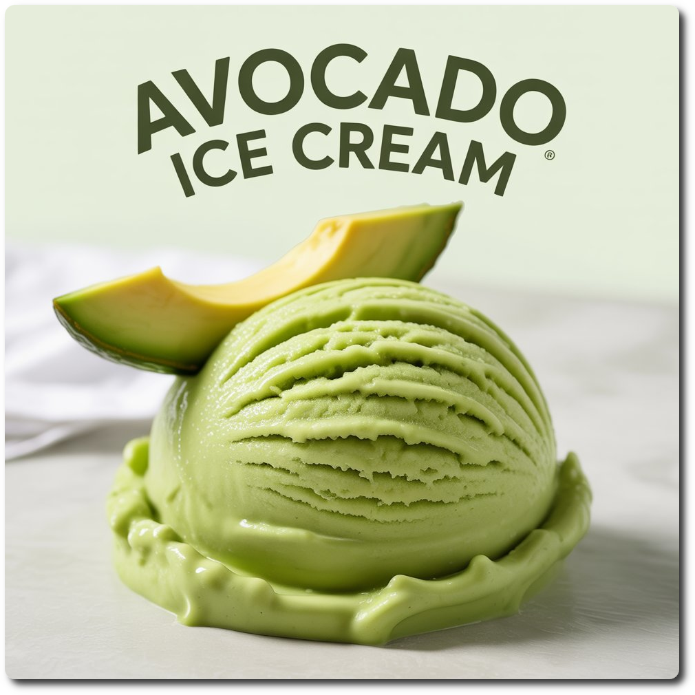

# Avocado pure (Deluxe)

Made simply with ripe avocados, water, and avocado oil, it’s a dairy-free scoop of silky goodness, rich in healthy fats.

> 🌿 **Vegan & Dairy-free**

Process on Lite Ice Cream.

> 
> 
> 

Rating: 😋🥑 (untested)

> 💡 **Alcohol Replacement** 
> If you don't want alcohol in your ice cream, or prepare it for kids,
> replace the small amount of alcohol with vegetable glycerin.
> For 10g booze (40 vol%) use 8g VG instead.

# INGREDIENTS

ℹ️ Brand names are in square brackets `[...]`.

**Prep**

  - _20ml_ Avocado oil (extra virgin) [Hunter & Gather]
  - _2g_ [Glycerol Monostearate (E471) \[Bulk\]](/ice-creamery/info/ingredients/#glycerol-monostearate-gms-e471){target="_blank"}↗

**Wet**

  - _350g_ Avocado pulp (fresh) • ~73% water
  - _225ml_ Water (cold)
  - _15g_ [Glycerin (E422, VG) \[hd-line\]](/ice-creamery/info/ingredients/#vegetable-glycerin-glycerol-vg-e422){target="_blank"}↗ • Sweetness = 60%; GI = 5; Density = 1.26 g/ml
  - _10g_ [Brandy or Vodka 40 vol%](/ice-creamery/info/ingredients/#alcohol-ethanol){target="_blank"}↗

**Dry**

  - _50g_ [Allulose](/ice-creamery/info/ingredients/#allulose){target="_blank"}↗ • *alternative:* 38g SweEX (Erythritol + Xylitol 3:2)
  - _2.5g_ [Gum arabic (Acacia, E414)](/ice-creamery/info/ingredients/#acacia-gum-gum-arabic-e414){target="_blank"}↗
  - _2.20g_ Salt
  - _0.80g_ [Guar gum (E412)](/ice-creamery/info/ingredients/#guar-gum-e412){target="_blank"}↗
  - _1.5g_ Matcha green tea powder (organic) [Mandoi] • *optional*, for color; ½ tsp = 1g

# DIRECTIONS

 1. First, dissolve the GMS in the avocado oil — you might need to heat it up a bit for that (flash 10 secs in the microwave).
 1. Add "wet" ingredients to empty Creami tub.
 1. Weigh and mix dry ingredients, easiest by adding to a jar with a secure lid and shaking vigorously.
 1. Pour into the tub and *QUICKLY* use an immersion blender on full speed to homogenize everything.
 1. Let blender run until thickeners are properly hydrated, up to 1-2 min. Or blend again after waiting that time.
 1. Put on the lid, freeze for 24h, then spin as usual. Flatten any humps before that.
 1. Process with RE-SPIN mode when not creamy enough after the first spin.

# NUTRITIONAL & OTHER INFO

- **Nutritional values per 100g/ml:** 100g; 125.5 kcal; fat 10.4g; carbs 13.0g; sugar 0.4g; protein 1.1g; salt 0.3g
- **Nutritional values per ½ Deluxe Tub:** 340g; 426.8 kcal; fat 35.4g; carbs 44.3g; sugar 1.2g; protein 3.8g; salt 1.1g
- **Nutritional values total:** 679g; 852.3 kcal; fat 70.8g; carbs 88.4g; sugar 2.5g; protein 7.5g; salt 2.3g
- **FPDF / [PAC](/ice-creamery/info/glossary/#potere-anti-congelante-pac){target="_blank"}↗ (target 20..30):** 30.40
- **Protein / Energy Ratio (ok=12%; hi=20%):** 3.54% • Low-Sugar
- **Milk Solids Non-Fat ([MSNF](/ice-creamery/info/glossary/#milk-solids-not-fat-msnf){target="_blank"}↗, 7-11%):** 0.0g • 0.0%
- **Net carbs:** 80.9g • *∝ 5 servings@136g:* 16.2g • *∝ 3 servings@226g:* 27g • *energy ratio (low <20%):* 38%
