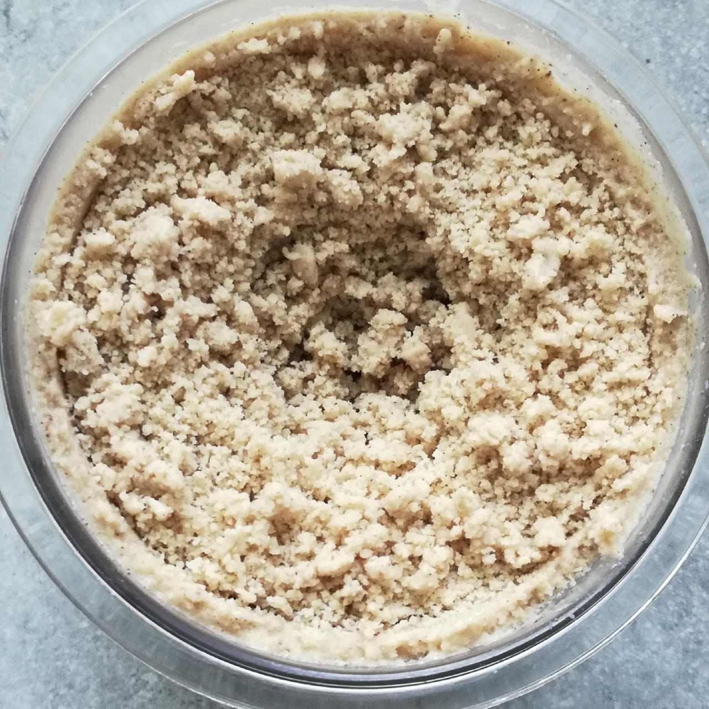
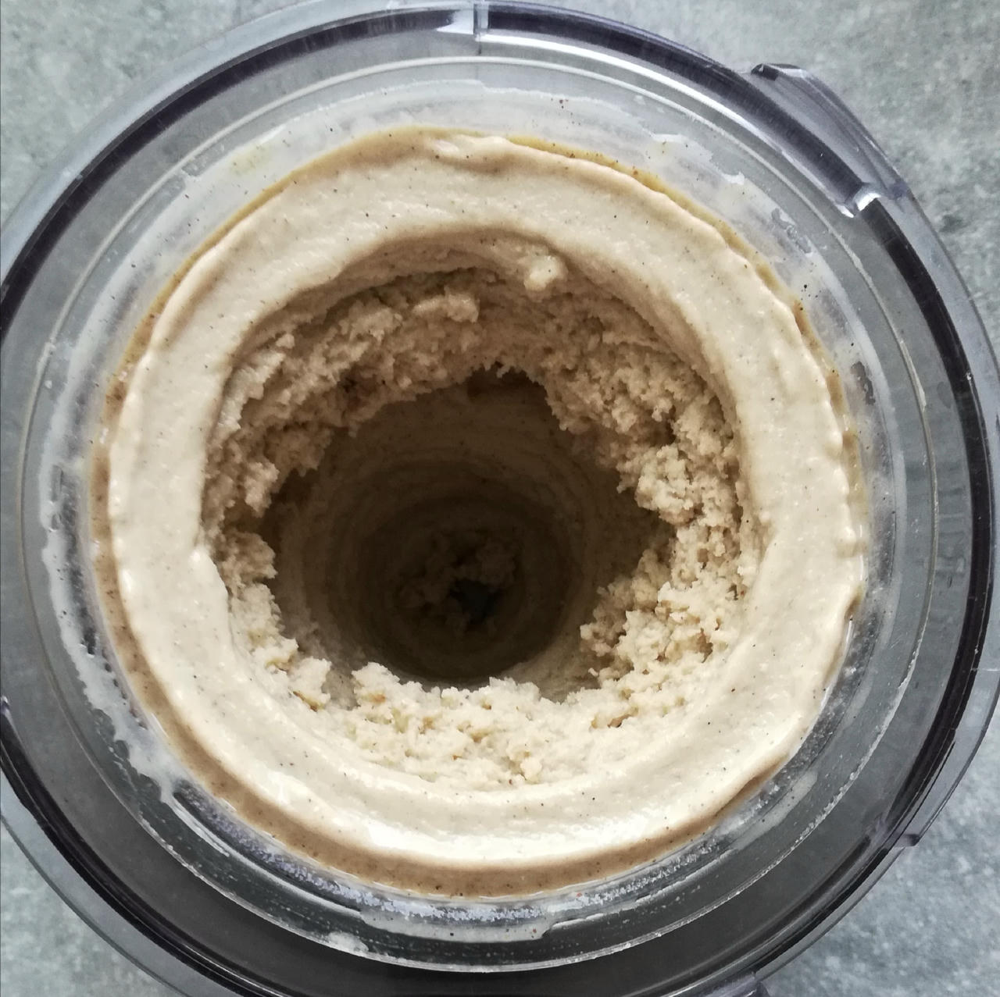
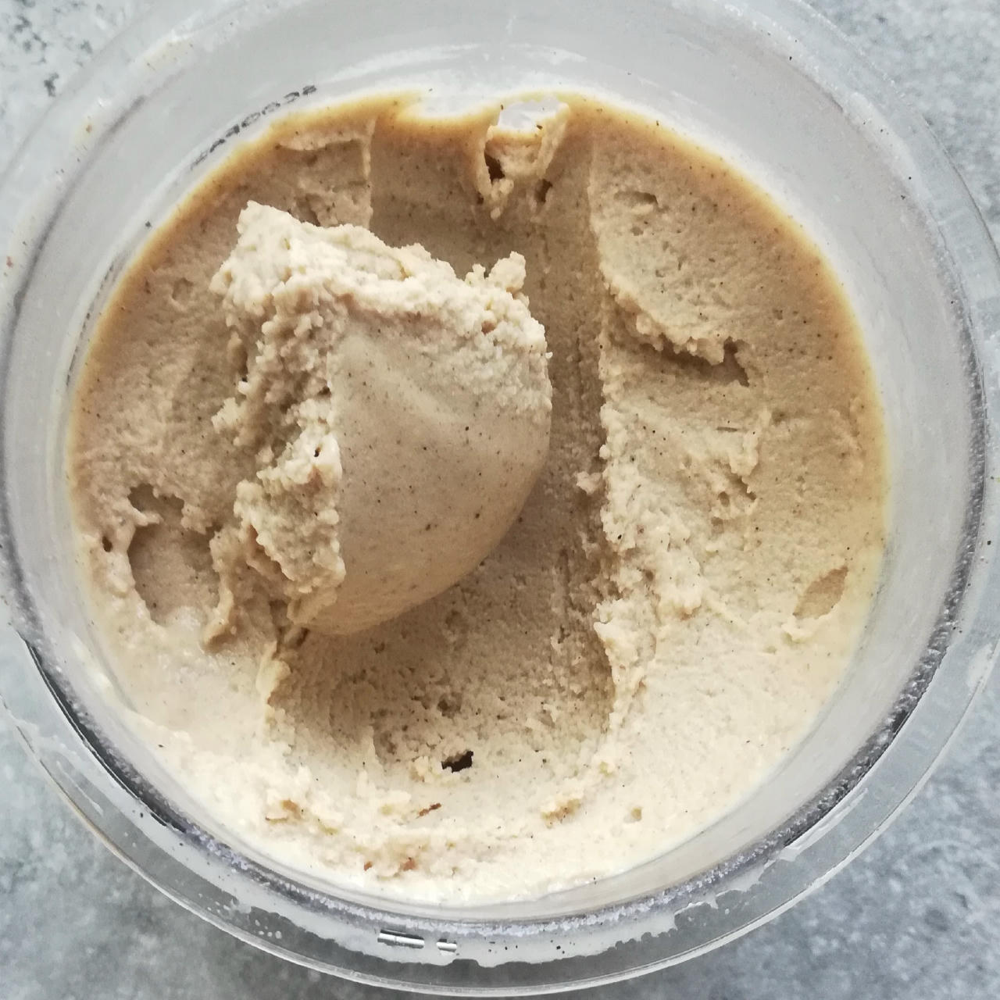

# Banafaba (Deluxe)

> 🌿 **Vegan & Dairy-free** Recipe is using only soy milk and protein.

This uses aquafaba in the base, and only one mid-sized banana.
Healthy fat is provided by hemp seeds.

Since there are no extra thickeners, the base is relatively fluid.
It also leads to a rather watery melt, 1g of CMC or another stabilizer will prevent that.

Process on *Sorbet*, [hold it shortly under running water](https://jhermann.github.io/ice-creamery/info/tips%2Btricks/#handling-of-icy-sides-bottom)
*after* that. Then a scrape-down with compaction, and a respin.

> 
> 
> 

Rating: 😋😋😋🍌

Directly after the respin, you get a “soft scoopable” consistency, smooth and crystal-free.
It’s a tiny bit gritty — from the hemp seeds? The banana flavor is very mild.



# INGREDIENTS

ℹ️ Brand names are in square brackets `[...]`.

**Prep**

  - _150ml_ Aquafaba (chickpea liquid)
  - _100g_ Banana (peeled) • 1 mid-size banana, eat any surplus 😋
  - _20g_ Hemp hearts (organic, shelled) [alnatura]

**Wet**

  - _300ml_ [Soy milk 1.6% (sugar-free) \[Berief\]](/ice-creamery/info/ingredients/#soy-milk){target="_blank"}↗ • *alternative*: use any other preferred milk (~2% fat)
  - _15g_ [Glycerin (E422, VG) \[hd-line\]](/ice-creamery/info/ingredients/#vegetable-glycerin-glycerol-vg-e422){target="_blank"}↗ • Sweetness = 60%; GI = 5; Density = 1.26 g/ml
  - _10g_ [Brandy or Vodka 40 vol%](/ice-creamery/info/ingredients/#alcohol-ethanol){target="_blank"}↗ • *alternative:* 8g (additional) vegetable glycerin for a sober recipe

**Dry**

  - _40g_ [SweEX (Erythritol + Xylitol 3:2)](/ice-creamery/info/ingredients/#sweex-erythritol-xylitol-blend){target="_blank"}↗ • *alternative:* 53g allulose or dextrose
  - _15g_ [Soy protein isolate (nature) \[Powerstar\]](/ice-creamery/info/ingredients/#soy-protein-isolate){target="_blank"}↗ • 1kg bag, unsweetened, unflavored
  - _2g_ Vanilla Bean Powder [InterVanilla]
  - _1g_ [Tylose powder (E466 / CMC) \[GoodBake\]](/ice-creamery/info/ingredients/#cocoa-powder){target="_blank"}↗ • optional, for chewier texture and slower melting

**Fill to MAX**

  - _27ml_ Water to MAX line
  - _5 drops_ Flavor drops Vanilla (sucralose) [IronMaxx] • to taste

# DIRECTIONS

 1. In an empty tub, blend the hemp hearts, banana, and aquafaba to a smooth puree.
 1. Then add all the other ‘wet’ ingredients.
 1. Weigh and mix dry ingredients, easiest by adding to a jar with a secure lid and shaking vigorously.
 1. Pour into the tub and *QUICKLY* use an immersion blender on full speed to homogenize everything.
 1. Add remaining ingredients (to the MAX line) and stir with a spoon.
 1. Before freezing, let it rest in the fridge for at least 2 hours.
 1. Put on the lid, freeze for 24h, then spin as usual. Flatten any humps before that.
 1. Process with RE-SPIN mode when not creamy enough after the first spin.

# NUTRITIONAL & OTHER INFO

- **Nutritional values per 100g/ml:** 100g; 83.6 kcal; fat 2.5g; carbs 12.6g; sugar 2.6g; protein 4.6g; salt 0.1g
- **Nutritional values per ½ Deluxe Tub:** 340g; 284.2 kcal; fat 8.4g; carbs 42.9g; sugar 8.7g; protein 15.8g; salt 0.3g
- **Nutritional values total:** 680g; 568.4 kcal; fat 16.7g; carbs 85.8g; sugar 17.4g; protein 31.6g; salt 0.7g
- **FPDF / [PAC](/ice-creamery/info/glossary/#potere-anti-congelante-pac){target="_blank"}↗ (target 20..30):** 30.50
- **Protein / Energy Ratio (ok=12%; hi=20%):** 22.23% • LOW-FAT • Low-Sugar • Hi-Protein • Low-Salt
- **Milk Solids Non-Fat ([MSNF](/ice-creamery/info/glossary/#milk-solids-not-fat-msnf){target="_blank"}↗, 7-11%):** 26.0g • 3.8%
- **Net carbs:** 38.3g • *∝ 5 servings@136g:* 7.7g • *∝ 3 servings@227g:* 12.8g • *energy ratio (low <20%):* 26.9%
