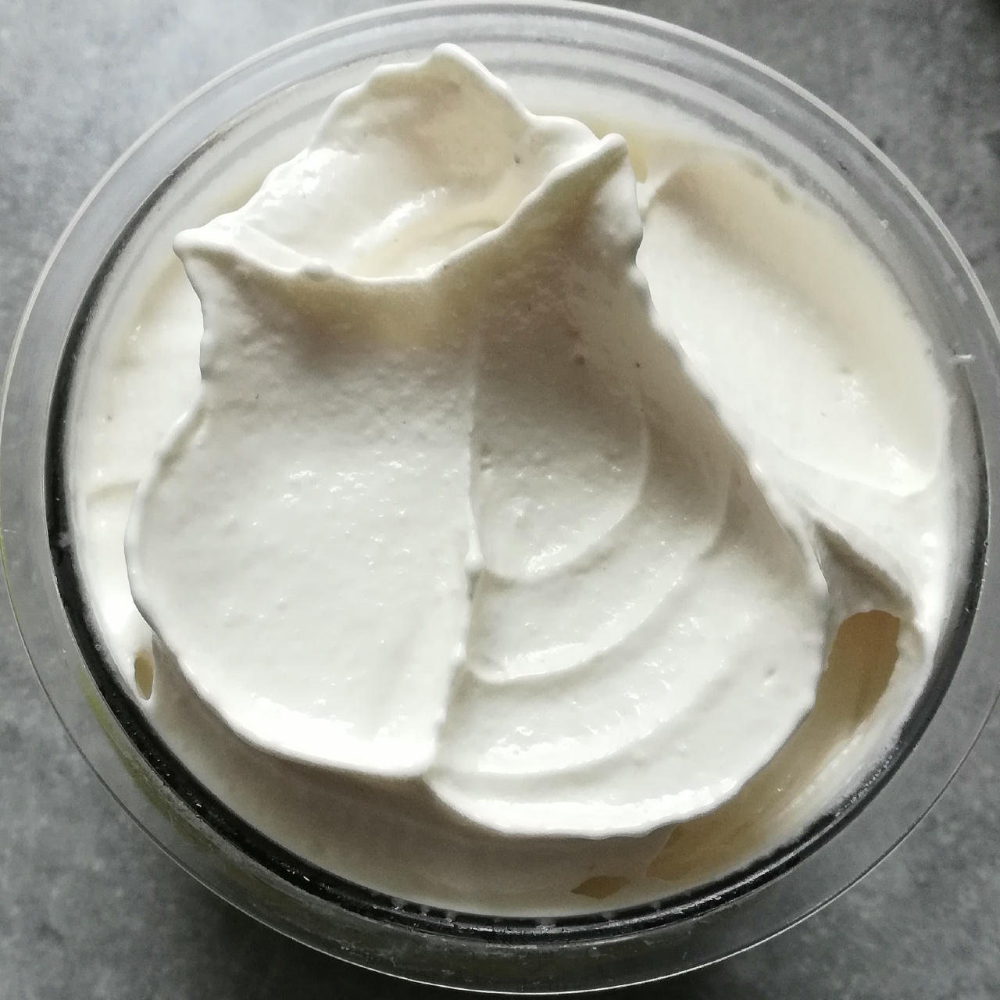
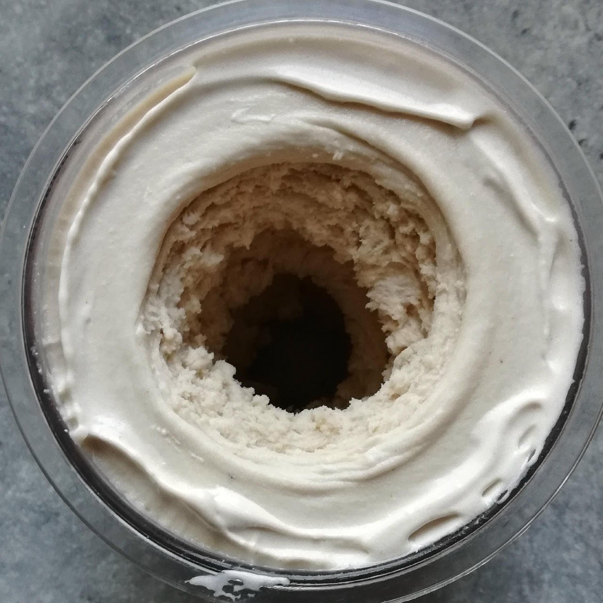
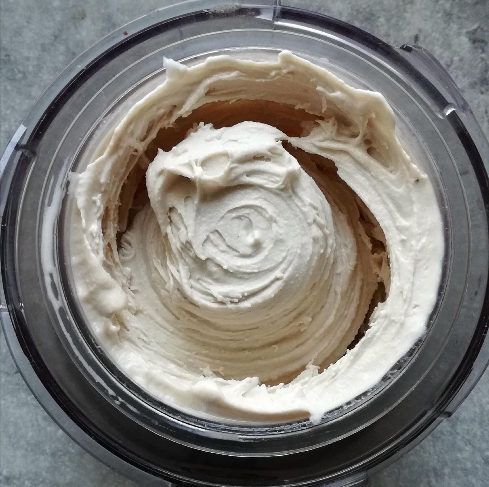

# Banana Ice Cream (Deluxe)

FroYo spin, mix-in with crushed cantuccini, and topped with almonds.

> 

Very dense and non-melty, no ice crystals whatsoever.

> 

With brandy added: ice-free soft-serve after Light Ice Cream spin, scrape down, and a Respin.

Rating: 😋😋🍌🍌🍦

> 
> 
>
> *2025-06-18: Made with soy milk,* Lite Ice Cream *and a re-mix.*

# INGREDIENTS

ℹ️ Brand names are in square brackets `[...]`.

**Prep**

  - _225g_ Bananas (peeled) • 2 mid-size or 3 small pieces, eat any surplus 😋
  - _10ml_ Lemon juice
  - _100g_ [Cottage Cheese 4% \[REWE Bio\]](/ice-creamery/info/ingredients/#cottage-cheese){target="_blank"}↗

**Wet**

  - _250ml_ [Soy milk 1.6% (sugar-free) \[Berief\]](/ice-creamery/info/ingredients/#soy-milk){target="_blank"}↗
  - _15g_ [Glycerin (E422, VG) \[hd-line\]](/ice-creamery/info/ingredients/#vegetable-glycerin-glycerol-vg-e422){target="_blank"}↗ • Sweetness = 60%; GI = 5; Density = 1.26 g/ml
  - _10g_ [Brandy or Vodka 40 vol%](/ice-creamery/info/ingredients/#alcohol-ethanol){target="_blank"}↗

**Dry**

  - _30g_ ICSv2 [Erythritol / CMC / Tara / XG / Inulin] • [http﹕//bit.ly/4frc4Vj](https://jhermann.github.io/ice-creamery/I/Ice%20Cream%20Stabilizer%20(ICS)/)
  - _20g_ [Whey protein Vanilla \[MaxiNutrition\]](/ice-creamery/info/ingredients/#whey-protein){target="_blank"}↗
  - _20g_ [Xylitol](/ice-creamery/info/ingredients/#xylitol-e967){target="_blank"}↗ • Sweetness = 100%; GI = 7

**Fill to MAX**

  - _40ml_ [Soy milk 1.6% (sugar-free) \[Berief\]](/ice-creamery/info/ingredients/#soy-milk){target="_blank"}↗ • fill to MAX
  - _3–5 drops_ Flavor drops Vanilla (sucralose) [IronMaxx] • to taste

# DIRECTIONS

 1. Blend the bananas, cottage cheese and the lemon juice in the empty tub to a soft puree.
 1. Add "wet" ingredients to the banana puree.
 1. Weigh and mix dry ingredients, easiest by adding to a jar with a secure lid and shaking vigorously.
 1. Pour into the tub and *QUICKLY* use an immersion blender on full speed to homogenize everything.
 1. Let blender run until thickeners are properly hydrated, up to 1-2 min. Or blend again after waiting that time.
 1. Add remaining ingredients (to the MAX line) and stir with a spoon.
 1. Put on the lid, freeze for 24h, then spin as usual. Flatten any humps before that.
 1. Process with RE-SPIN mode when not creamy enough after the first spin.

# NUTRITIONAL & OTHER INFO
- **Nutritional values per 100g/ml:** 100g; 93.0 kcal; fat 1.6g; carbs 14.6g; sugar 5.5g; protein 5.5g; salt 0.2g
- **Nutritional values per ½ Deluxe Tub:** 360g; 334.8 kcal; fat 5.6g; carbs 52.4g; sugar 19.7g; protein 19.9g; salt 0.8g
- **Nutritional values total:** 720g; 669.7 kcal; fat 11.2g; carbs 104.8g; sugar 39.3g; protein 39.8g; salt 1.6g
- **FPDF / [PAC](/ice-creamery/info/glossary/#potere-anti-congelante-pac){target="_blank"}↗ (target 20..30):** 30.06
- **Protein / Energy Ratio (ok=12%; hi=20%):** 23.78% • LOW-FAT • Hi-Protein
- **Milk Solids Non-Fat ([MSNF](/ice-creamery/info/glossary/#milk-solids-not-fat-msnf){target="_blank"}↗, 7-11%):** 33.8g • 4.7%
- **30g Ice Cream Stabilizer (ICSv2) is:** 14.3g erythritol, 1.43g Tylose powder (CMC, E466), 
0.5g tara gum (E417), 0.15g xanthan (E415),
14.3g inulin, 0.5g salt.
- **Nov 15, 2024:** Add 1cl brandy
- **Jan 1, 2025:** Add lemon juice
- **Jun 8, 2025:** Use soy milk (less sugar)
