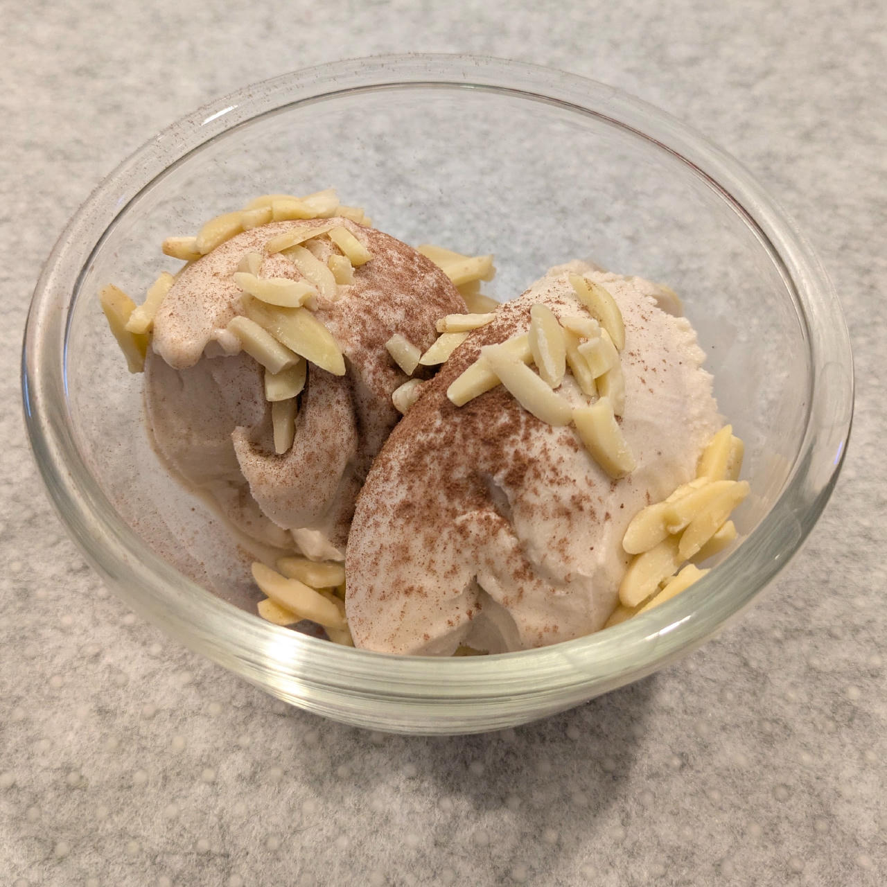
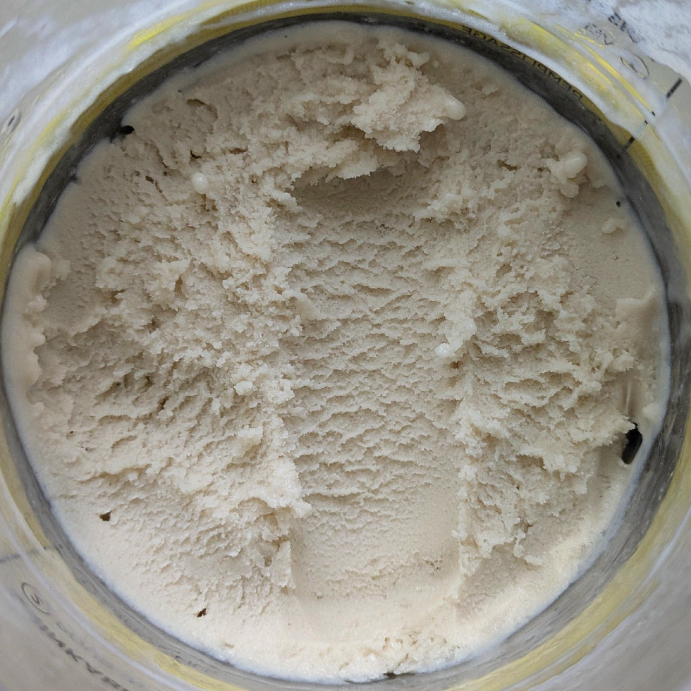
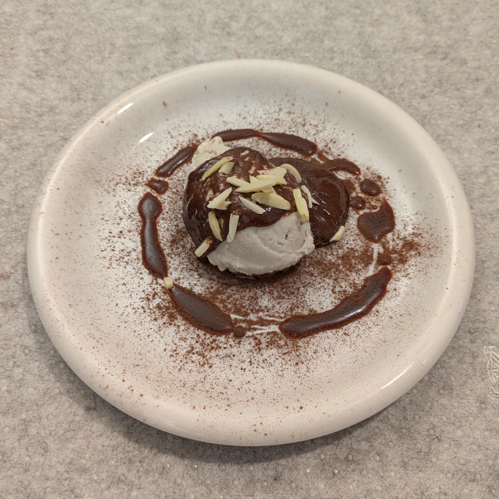

# Banana Ice Cream (Deluxe)

> 🌿 **Vegan Option** Replace the cottage cheese with 75g silken tofu
> (or 50g firm tofu and 30ml water),
> and use soy protein isolate instead of the whey.

FroYo spin, mix-in with crushed cantuccini, and topped with almonds.

> 

Very dense and non-melty, no ice crystals whatsoever.

> 

With brandy added: ice-free soft-serve after Light Ice Cream spin, scrape down, and a Respin.

Rating: 😋😋🍌🍌🍦

> 
> 
> 
> 
> 
> *2025-06-18: Served with a cocoa powder sprinkle and almond slivers. Made with soy milk, spun on* Lite Ice Cream *and a re-mix. The last picture is scooping texture after 2 days in the freezer.*
>
> Still rated 😋😋🍌🍌🍦
>  
> 
> 
> *Served with cocoa powder dusting, pomegranate syrup swirl, dark chocolate ganache, and almond slivers.*

# INGREDIENTS

ℹ️ Brand names are in square brackets `[...]`.

**Prep**

  - _225g_ Bananas (peeled) • 2 mid-size or 3 small ripe pieces, eat any surplus 😋
  - _100g_ [Cottage Cheese 4% \[REWE Bio\]](/ice-creamery/info/ingredients/#cottage-cheese){target="_blank"}↗ • *alternative:* 30g cream cheese and 70ml more milk
  - _15g_ [Glycerin (E422, VG) \[hd-line\]](/ice-creamery/info/ingredients/#vegetable-glycerin-glycerol-vg-e422){target="_blank"}↗ • Sweetness = 60%; GI = 5; Density = 1.26 g/ml
  - _10g_ [Brandy or Vodka 40 vol%](/ice-creamery/info/ingredients/#alcohol-ethanol){target="_blank"}↗ • *alternative:* 8g (additional) VG for a sober recipe
  - _10ml_ Lemon juice

**Wet**

  - _275ml_ [Soy milk 1.6% (sugar-free) \[Berief\]](/ice-creamery/info/ingredients/#soy-milk){target="_blank"}↗ • *alternative*: any other preferred milk (~2% fat)

**Dry**

  - _30g_ [SweEX (Erythritol + Xylitol 3:2)](/ice-creamery/info/ingredients/#sweex-erythritol-xylitol-blend){target="_blank"}↗ • *alternative:* 40g allulose or dextrose
  - _10g_ [Whey + Casein protein (grass-fed) \[Vilgain\]](/ice-creamery/info/ingredients/#whey-protein){target="_blank"}↗ • with stevia
  - _10g_ [Salty Stability \[Inulin / GMS / CMC / Guar / XG / Salt\]](/ice-creamery/S/Salty%20Stability/){target="_blank"}↗ • *not-as-good substitute:* 1g guar, 0.3g xanthan, and 0.3g salt

**Adjust sweetness**

  - _≈4 drops_ Flavor drops Vanilla (sucralose) [IronMaxx] • to taste

# DIRECTIONS

 1. Blend the bananas, cottage cheese and the other ‘prep’ ingredients in an empty tub to a soft puree.
 1. Add "wet" ingredients to the banana puree.
 1. Weigh and mix dry ingredients, easiest by adding to a jar with a secure lid and shaking vigorously.
 1. Pour into the tub and *QUICKLY* use an immersion blender on full speed to homogenize everything.
 1. Let blender run until thickeners are properly hydrated, up to 1-2 min. Or blend again after waiting that time.
 1. Add remaining ingredients and stir with a spoon.
 1. For better results, let the base age in the fridge (covered, lid on), for a few hours or over night. This helps flavor development and gum hydration, especially with unheated bases.
 1. Freeze for 24h with lid on, then spin as usual. Flatten any humps before that.
 1. Process with RE-SPIN mode when not creamy enough after the first spin.

# NUTRITIONAL & OTHER INFO

- **Nutritional values per 100g/ml:** 100g; 88.3 kcal; fat 1.5g; carbs 15.5g; sugar 5.6g; protein 4.6g; salt 0.2g
- **Nutritional values per ½ Deluxe Tub:** 340g; 300.3 kcal; fat 5.3g; carbs 52.8g; sugar 19.0g; protein 15.8g; salt 0.7g
- **Nutritional values total:** 685g; 605.0 kcal; fat 10.6g; carbs 106.4g; sugar 38.3g; protein 31.8g; salt 1.4g
- **FPDF / [PAC](/ice-creamery/info/glossary/#potere-anti-congelante-pac){target="_blank"}↗ (target 20..30):** 30.41
- **Protein / Energy Ratio (ok=12%; hi=20%):** 20.99% • LOW-FAT • Hi-Protein
- **Milk Solids Non-Fat ([MSNF](/ice-creamery/info/glossary/#milk-solids-not-fat-msnf){target="_blank"}↗, 7-11%):** 36.0g • 5.3%
- **Net carbs:** 61.6g • *∝ 5 servings@137g:* 12.3g • *∝ 3 servings@228g:* 20.5g • *energy ratio (low <20%):* 40.7%
- **Nov 15, 2024:** Add 1cl brandy
- **Jan 1, 2025:** Add lemon juice
- **Jun 8, 2025:** Use soy milk (less sugar)
- **Jul 2, 2025:** Less ICS
- **Dec 13, 2025:** New blends
- **10g 'Salty Stability' is:** 7.3g Inulin • 1.2g Glycerol Monostearate (GMS / E471) • 0.6g Tylose powder (E466, Tylo, CMC) • 0.4g Guar gum (E412) • 0.33g Salt • 0.13g Xanthan gum (E415, XG).
