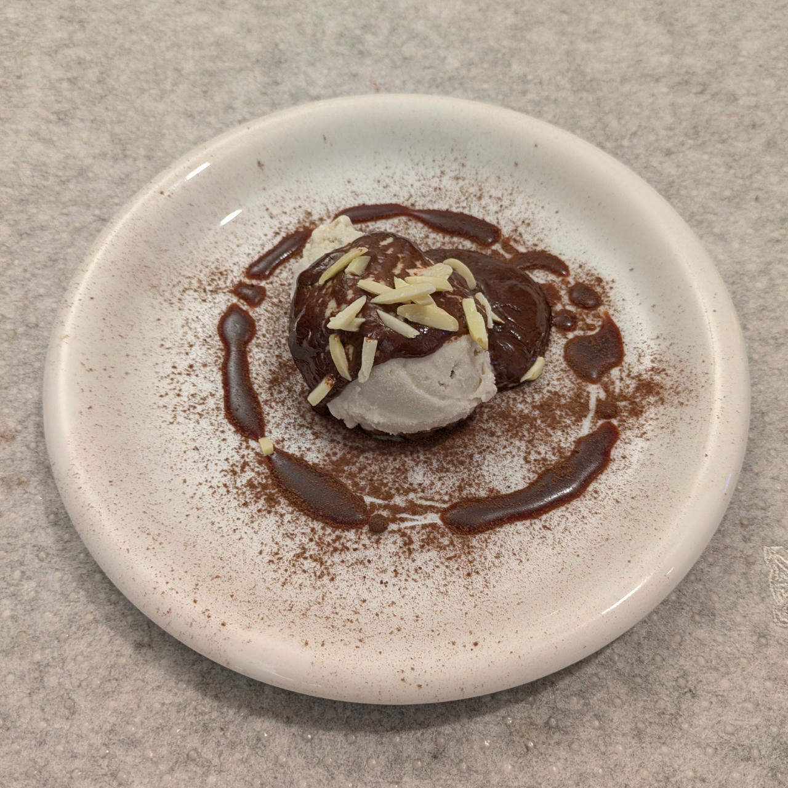

# The Money Shot
Still trying to get better at those food presentation shots,
this is what I made with my phone:

> 
> 
> *Banana ice cream served with cocoa powder, pomegranate syrup, dark chocolate ganache, and almond slivers.*

Then I was curious what different AIs would make of it.

## Copilot

This is based on the original image.

> 
>
> *improve this image to make a better food item shot.*

## Sora

This is, unsurprisingly if you used Sora before, the best of the fully generated bunch.

> 

> **Magic Prompt** the shot frames a scoop of banana ice cream, perfectly shaped, placed on a simple and pristine white ceramic plate. the dessert is drizzled generously with a glossy, rich chocolate sauce that trickles down the sides, creating an inviting visual appeal. atop the ice cream, delicate slivers of almond are sprinkled, adding texture and contrast to the creamy treat. a light dusting of cocoa powder encircles the ice cream on the plate, elevating the dish with an added touch of elegance. around the ice cream scoop, there is a drizzle of pomegranate syrup. the presentation is minimalist yet refined, highlighting the harmonious balance of textures and flavors in this delightful dessert. Style: Realistic

## Ideogram

The garnish adds a nice little accent.

> 
>
> *Using the Sora magic prompt.*

## Gemini

Unrealistic and too "perfect" (look at that circular syrup driple).

> 
>
> *Using the Sora magic prompt.*

## PopAi

Nice, but lacking perspective with that from-above shot.

> 
>
> *Using the Sora magic prompt.*

## Canva

A little over the top.

> 
>
> *Using the original image descriptiom.*
