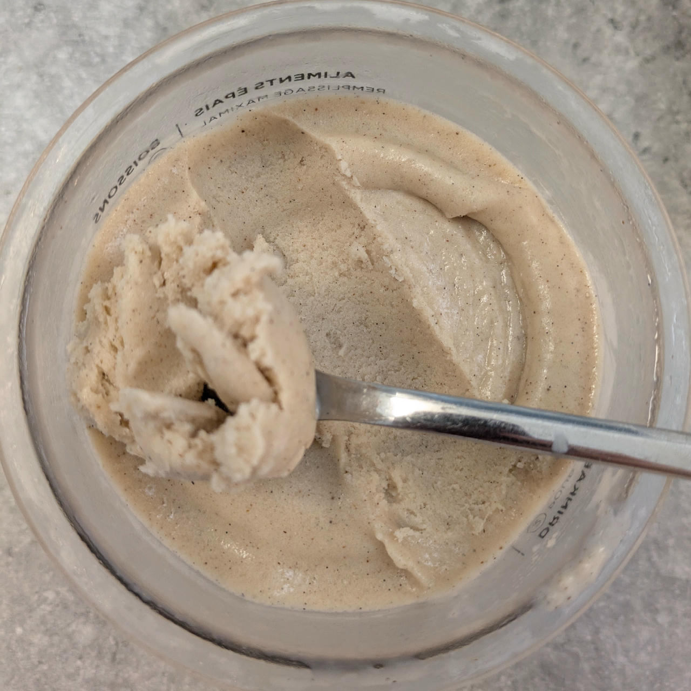

# Banana • Slim (Deluxe)

Process on *Frozen Yogurt*, [hold it shortly under running water](https://jhermann.github.io/ice-creamery/info/tips%2Btricks/#handling-of-icy-sides-bottom)
*after* that. Then a scrape-down and a respin.

> 

Rating: 😋😋😋😋🍌

# INGREDIENTS

ℹ️ Brand names are in square brackets `[...]`.

**Wet**

  - _250ml_ [Almond milk 1.7% (sugar-free) \[REWE Bio\]](/ice-creamery/info/ingredients/#almond-milk-butter){target="_blank"}↗ • with guar gum (<1.5g)
  - _125g_ Bananas (peeled) • 1 mid-size banana, eat any surplus 😋
  - _100g_ Greek Yogurt 9% [Lyttos]
  - _100ml_ [Skim Milk 1.5% \[Weihenstephan\]](/ice-creamery/info/ingredients/#skim-milk){target="_blank"}↗
  - _10g_ [Brandy or Vodka 40 vol%](/ice-creamery/info/ingredients/#alcohol-ethanol){target="_blank"}↗
  - _10g_ [Glycerin (E422, VG) \[hd-line\]](/ice-creamery/info/ingredients/#vegetable-glycerin-glycerol-vg-e422){target="_blank"}↗ • POD = 60%; GI = 5; Density = 1.26 g/ml

**Dry**

  - _30g_ ICSv2 [Erythritol / Inulin / CMC / Guar / XG / Salt] • [http﹕//bit.ly/4frc4Vj](https://jhermann.github.io/ice-creamery/I/Ice%20Cream%20Stabilizer%20(ICS)/)
  - _30g_ [Xylitol (E967)](/ice-creamery/info/ingredients/#xylitol-e967){target="_blank"}↗ • Sweetness = 100%; GI = 7
  - _3g_ Vanilla Bean Powder [InterVanilla]

**Fill to MAX**

  - _62ml_ Water to MAX line

# DIRECTIONS

 1. Add "wet" ingredients to empty Creami tub.
 1. Weigh and mix dry ingredients, easiest by adding to a jar with a secure lid and shaking vigorously.
 1. Pour into the tub and *QUICKLY* use an immersion blender on full speed to homogenize everything.
 1. Let blender run until thickeners are properly hydrated, up to 1-2 min. Or blend again after waiting that time.
 1. Add remaining ingredients (to the MAX line) and stir with a spoon.
 1. Put on the lid, freeze for 24h, then spin as usual. Flatten any humps before that.
 1. Process with RE-SPIN mode when not creamy enough after the first spin.

# NUTRITIONAL & OTHER INFO
- **Nutritional values per 100g/ml:** 100g; 72.6 kcal; fat 2.2g; carbs 14.5g; sugar 4.2g; protein 1.4g; salt 0.2g
- **Nutritional values per ½ Deluxe Tub:** 360g; 261.4 kcal; fat 7.9g; carbs 52.3g; sugar 15.1g; protein 5.1g; salt 0.6g
- **Nutritional values total:** 720g; 522.7 kcal; fat 15.7g; carbs 104.5g; sugar 30.2g; protein 10.3g; salt 1.2g
- **FPDF / [PAC](/ice-creamery/info/glossary/#potere-anti-congelante-pac){target="_blank"}↗ (target 20..30):** 28.86
- **Protein / Energy Ratio (ok=12%; hi=20%):** 7.85% • LOW-FAT • Low-Sugar
- **Milk Solids Non-Fat ([MSNF](/ice-creamery/info/glossary/#milk-solids-not-fat-msnf){target="_blank"}↗, 7-11%):** 17.1g • 2.4%
- **Net carbs:** 42.3g • *∝ 5 servings@144g:* 8.5g • *∝ 3 servings@240g:* 14.1g • *energy ratio (low <20%):* 32.4%
- **30g Ice Cream Stabilizer (ICSv2) is:** 13.8g Erythritol (E968) • 13.8g Inulin • 1.4g Tylose powder (E466, Tylo, CMC) • 0.48g Guar gum (E412) • 0.48g Salt • 0.14g Xanthan gum (E415, XG).
