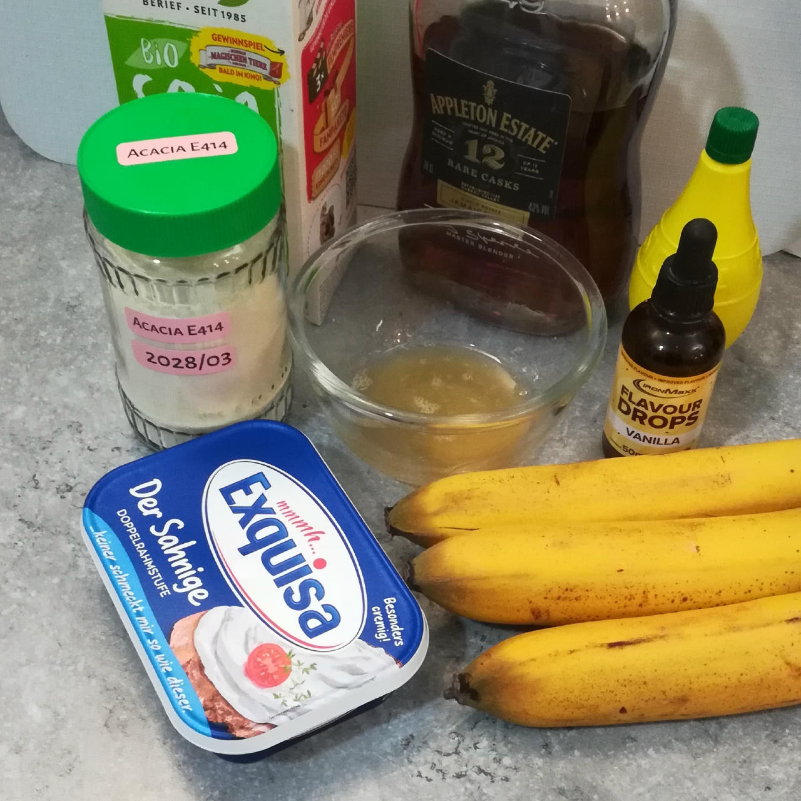

# Banana+Rum Gelato (Deluxe)

**🍌 A Taste of the Tropics 🍹**

Ripe bananas lend natural sweetness and creaminess, while a splash of rum adds depth and a hint of warmth.
The combination is simple & smooth, and offers a mellow tropical twist that's easy to love.

> 

Process on *Light Ice Cream*, [hold it shortly under running water](https://jhermann.github.io/ice-creamery/info/tips%2Btricks/#handling-of-icy-sides-bottom)
*after* that.Then a scrape-down and a respin.

> 
> 
> 

Rating: 😋🍌🍹 (untested)

> ℹ️ Read [About 'Simple' Recipes](/ice-creamery/info/tips%2Btricks/#about-simple-recipes) regarding 'exotic' ingredients and their alternatives.

# INGREDIENTS

ℹ️ Brand names are in square brackets `[...]`.

**Prep**

  - _10g_ [Gum Arabic (Acacia, E414) \[SaporePuro\]](/ice-creamery/info/ingredients/#acacia-gum-gum-arabic-e414){target="_blank"}↗ • *optional*; 85% fiber
  - _15ml_ Water (hot, 50–60°C) • for hydrating the gum
  - _300g_ Bananas (peeled) • 2-3 mid-size or 3-4 small ripe pieces, eat or freeze any surplus 😋
  - _50g_ [Cream Cheese 23% \[Exquisa\]](/ice-creamery/info/ingredients/#cream-cheese){target="_blank"}↗ • click the link for UK / US equivalents
  - _50g_ [Jamaica Rum 43 vol%](/ice-creamery/info/ingredients/#alcohol-ethanol){target="_blank"}↗
  - _10ml_ Lemon juice

**Wet**

  - _175ml_ [Soy milk 1.6% (sugar-free) \[Berief\]](/ice-creamery/info/ingredients/#soy-milk){target="_blank"}↗

**Fill to MAX**

  - _50ml_ Cream 32% [REWE Beste Wahl] • skip for improved macros [156kcal, 16g fat]
  - _20ml_ [Soy milk 1.6% (sugar-free) \[Berief\]](/ice-creamery/info/ingredients/#soy-milk){target="_blank"}↗
  - _≈10 drops_ Flavor drops Vanilla (sucralose) [IronMaxx] • to taste

# DIRECTIONS

 1. A few hours or a night before you make your Creami, hydrate the acacia gum with warm water, and let it rest.
 1. Blend the bananas, cream cheese and the other ‘prep’ ingredients (including the hydrated gum) in an empty tub to a smooth puree.
 1. Add "wet" ingredients to the banana puree, and blend to combine.
 1. Add remaining ingredients (to the MAX line) and stir with a spoon.
 1. Put on the lid, freeze for 24h, then spin as usual. Flatten any humps before that.
 1. Process with RE-SPIN mode when not creamy enough after the first spin.

# NUTRITIONAL & OTHER INFO

- **Nutritional values per 100g/ml:** 100g; 121.7 kcal; fat 4.7g; carbs 10.2g; sugar 7.5g; protein 2.0g; salt 0.1g
- **Nutritional values per ½ Deluxe Tub:** 340g; 413.8 kcal; fat 16.1g; carbs 34.8g; sugar 25.6g; protein 6.9g; salt 0.4g
- **Nutritional values total:** 680g; 827.5 kcal; fat 32.2g; carbs 69.7g; sugar 51.3g; protein 13.8g; salt 0.8g
- **FPDF / [PAC](/ice-creamery/info/glossary/#potere-anti-congelante-pac){target="_blank"}↗ (target 20..30):** 31.59
- **Protein / Energy Ratio (ok=12%; hi=20%):** 6.67% • Low-Salt
- **Milk Solids Non-Fat ([MSNF](/ice-creamery/info/glossary/#milk-solids-not-fat-msnf){target="_blank"}↗, 7-11%):** 15.8g • 2.3%
- **Net carbs:** 60.3g • *∝ 5 servings@136g:* 12.1g • *∝ 3 servings@227g:* 20.1g • *energy ratio (low <20%):* 29.1%
