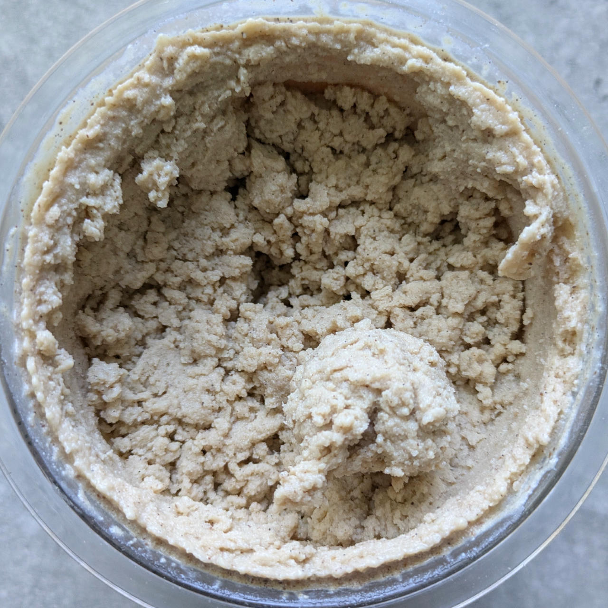
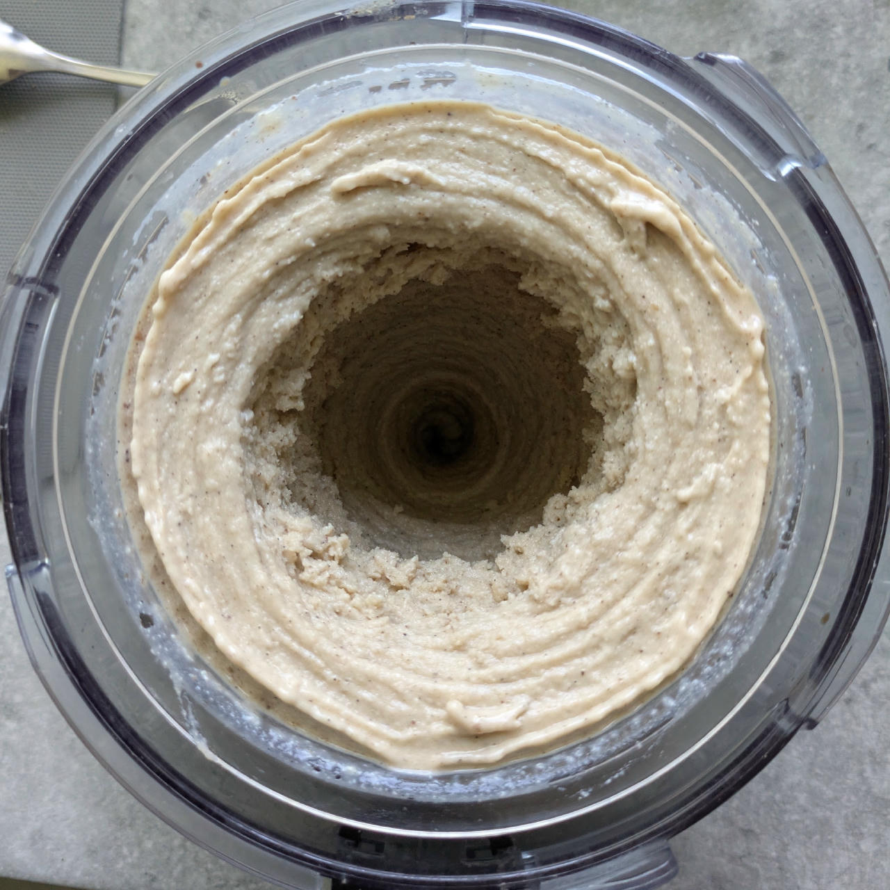
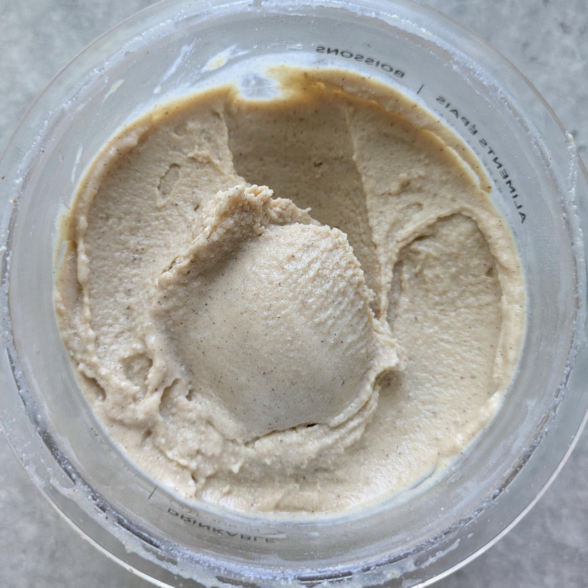

# Banoffee (Deluxe)

> 🌿 **Vegan & Dairy-free** Recipe is using only soy milk and protein.

*Banoffee* is a dessert that combines banana and toffee flavors. The name is a portmanteau of “banana” and “toffee.”

Top it with butter cookies or graham crackers, dulce de leche or caramel, sliced bananas, and whipped cream.
You might also add chocolate shavings or toffee bits.

Process on *Sorbet*, [hold it shortly under running water](https://jhermann.github.io/ice-creamery/info/tips%2Btricks/#handling-of-icy-sides-bottom)
*after* that.
Then a scrape-down and a respin or re-mix.

> 
> 
> 
> 
> *Spun on sorbet, then a respin, resulting in a soft and smooth consistency. Refreeze for optimal scoopability.*

Rating: 😋😋😋🍌🍌

# INGREDIENTS

ℹ️ Brand names are in square brackets `[...]`.

**Prep**

  - _100g_ Banana (peeled) • 1 mid-sized ripe banana, eat any surplus 😋
  - _100g_ [Tofu (plain) \[REWE Bio\]](/ice-creamery/info/ingredients/#tofu){target="_blank"}↗ • use 150g of silken tofu if you have it
  - _40g_ Medjool dates (pitted, organic) [Seba Garden] • 2 dates • distinctive caramel taste with hints of vanilla
  - _15g_ [Glycerin (E422, VG) \[hd-line\]](/ice-creamery/info/ingredients/#vegetable-glycerin-glycerol-vg-e422){target="_blank"}↗ • Sweetness = 60%; GI = 5; Density = 1.26 g/ml
  - _10g_ [Brandy or Vodka 40 vol%](/ice-creamery/info/ingredients/#alcohol-ethanol){target="_blank"}↗
  - _5ml_ Lemon juice

**Wet**

  - _250ml_ [Soy milk 1.6% (sugar-free) \[Berief\]](/ice-creamery/info/ingredients/#soy-milk){target="_blank"}↗

**Dry**

  - _15g_ [Soy protein isolate (nature) \[Powerstar\]](/ice-creamery/info/ingredients/#soy-protein-isolate){target="_blank"}↗ • 1kg bag, unsweetened, unflavored
  - _25g_ [Xylitol (E967)](/ice-creamery/info/ingredients/#xylitol-e967){target="_blank"}↗ • Sweetness = 100%; GI = 7
  - _10g_ ICSv2 [Erythritol / Inulin / CMC / Guar / XG / Salt] • [http﹕//bit.ly/4frc4Vj](https://jhermann.github.io/ice-creamery/I/Ice%20Cream%20Stabilizer%20(ICS)/)
  - _3g_ Vanilla Bean Powder [InterVanilla]

**Fill to MAX**

  - _147ml_ [Soy milk 1.6% (sugar-free) \[Berief\]](/ice-creamery/info/ingredients/#soy-milk){target="_blank"}↗ • make blending easier by splitting the milk
  - _3–7 drops_ Flavor drops Caramel (sucralose) [IronMaxx] • to taste

# DIRECTIONS

 1. Cut the dates into halves by their long side, and make sure they’re pitted and not spoiled. Use a splash of soy milk, if needed to combine things.
 1. In an empty Creami tub, blend the dates and the other ‘prep’ ingredients to a smooth paste.
 1. Add "wet" ingredients to the puree.
 1. Weigh and mix dry ingredients, easiest by adding to a jar with a secure lid and shaking vigorously.
 1. Pour into the tub and *QUICKLY* use an immersion blender on full speed to homogenize everything.
 1. Let blender run until thickeners are properly hydrated, up to 1-2 min. Or blend again after waiting that time.
 1. Add remaining ingredients (to the MAX line) and stir with a spoon.
 1. Put on the lid, freeze for 24h, then spin as usual. Flatten any humps before that.
 1. Process with RE-SPIN mode when not creamy enough after the first spin.

# NUTRITIONAL & OTHER INFO
- **Nutritional values per 100g/ml:** 100g; 95.9 kcal; fat 2.0g; carbs 14.9g; sugar 6.1g; protein 5.6g; salt 0.2g
- **Nutritional values per ½ Deluxe Tub:** 360g; 345.4 kcal; fat 7.3g; carbs 53.5g; sugar 21.9g; protein 20.2g; salt 0.5g
- **Nutritional values total:** 720g; 690.8 kcal; fat 14.7g; carbs 107.0g; sugar 43.7g; protein 40.3g; salt 1.1g
- **FPDF / [PAC](/ice-creamery/info/glossary/#potere-anti-congelante-pac){target="_blank"}↗ (target 20..30):** 28.09
- **Protein / Energy Ratio (ok=12%; hi=20%):** 23.36% • LOW-FAT • Hi-Protein
- **Milk Solids Non-Fat ([MSNF](/ice-creamery/info/glossary/#milk-solids-not-fat-msnf){target="_blank"}↗, 7-11%):** 29.5g • 4.1%
- **Net carbs:** 65.4g • *∝ 5 servings@144g:* 13.1g • *∝ 3 servings@240g:* 21.8g
- **10g Ice Cream Stabilizer (ICSv2) is:** 4.6g Erythritol (E968) • 4.6g Inulin • 0.46g Tylose powder (E466, Tylo, CMC) • 0.16g Guar gum (E412) • 0.16g Salt • 0.05g Xanthan gum (E415, XG).
