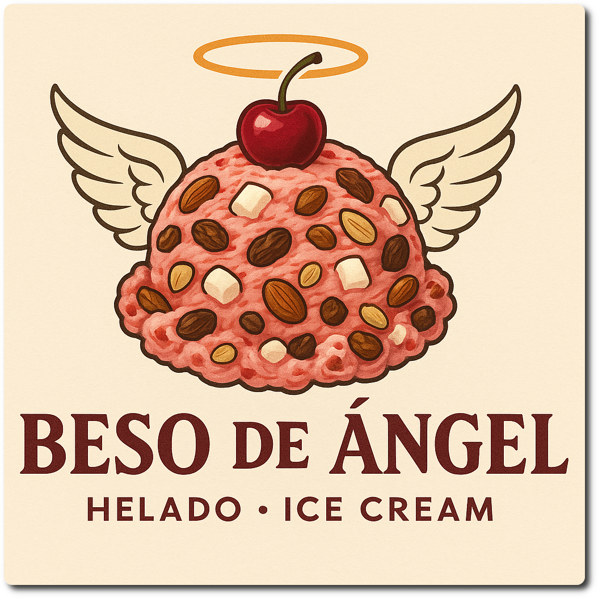
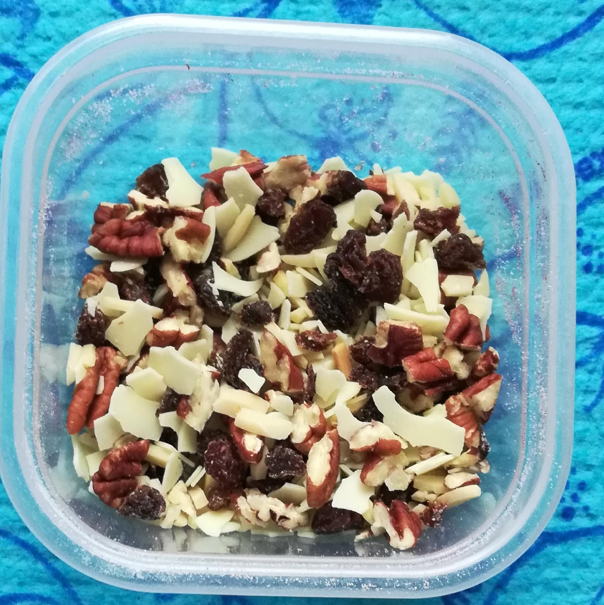

# Beso de Ángel (Deluxe)

*Beso de Ángel* (angel’s kiss)  is a traditional Mexican ice cream flavor, made with a cherry ice cream base and various mix-ins like nuts (almonds, walnuts, pecans), raisins, marshmallows, and sometimes other fruits or even chocolate.

The common theme is a sweet fruit base with a combination of sweet, chewy, and crunchy textures.

The base is just 600g on purpose, to leave room for plenty of mix-ins. The mix-ins as listed below add 230kcal and 20.1g sugar.

> 

Process on *Light Ice Cream*, do a scrape-down, then the mix-in run with your chosen add-ins.

> 
> 
> 

# INGREDIENTS

ℹ️ Brand names are in square brackets `[...]`.

**Prep**

  - _150g_ Cherries • pit the cherries, or defrost them

**Wet**

  - _330ml_ [Soy milk 1.6% (sugar-free) \[Berief\]](/ice-creamery/info/ingredients/#soy-milk){target="_blank"}↗ • use any other preferred milk (~2% fat)
  - _15g_ [Glycerin (E422, VG) \[hd-line\]](/ice-creamery/info/ingredients/#vegetable-glycerin-glycerol-vg-e422){target="_blank"}↗ • Sweetness = 60%; GI = 5; Density = 1.26 g/ml
  - _10g_ [Brandy or Vodka 40 vol%](/ice-creamery/info/ingredients/#alcohol-ethanol){target="_blank"}↗ • *alternative:* 8g (additional) VG for a sober recipe

**Dry**

  - _35g_ [Coconut Milk Powder 54% \[Green Essence\]](/ice-creamery/info/ingredients/#coconut-milk){target="_blank"}↗ • *alternative:* 90ml coconut milk 22%, 55ml less soy milk
  - _30g_ [SweEX (Erythritol + Xylitol 3:2)](/ice-creamery/info/ingredients/#sweex-erythritol-xylitol-blend){target="_blank"}↗ • *alternative:* 40g allulose or dextrose
  - _15g_ [Salty Stability \[Inulin / GMS / CMC / Guar / XG / Salt\]](/ice-creamery/S/Salty%20Stability/){target="_blank"}↗ • *not-as-good substitute:* 1.5g guar, 0.5g xanthan, and 0.5g salt
  - _15g_ [Whey + Casein protein (grass-fed) \[Vilgain\]](/ice-creamery/info/ingredients/#whey-protein){target="_blank"}↗ • with stevia
  - _2g_ Beet Root Powder (organic) [Mandoi] • *optional*, for color

**Fill to MAX**

  - _≈8 drops_ Flavor drops Vanilla (sucralose) [IronMaxx] • to taste

**Mix-ins**

  - _15g_ Sultanas (organic) [Biojoy] • chopped [45kcal, 10g sugar]
  - _8g_ Almond slivers [naturix24] • chopped [47kcal, 0.3g sugar]
  - _8g_ Pecan nuts (organic) [Biojoy] • crumbled; 10 halves = 15g [58kcal, 0.3g sugar]
  - _10g_ [White chocolate shavings \[Ruf\]](/ice-creamery/info/ingredients/#chocolate-shavings){target="_blank"}↗ • 35% fat [56kcal, 5.6g sugar]
  - _40g_ Cherries • fresh or frozen [24kcal, 4g sugar]

# DIRECTIONS

 1. Put the cherries into an empty Creami tub, and let them defrost a bit when frozen.
 1. Heat the ‘wet’ ingredients to about 60°C, and whisk in the dry ones that you mixed together beforehand.
 1. Pour into the Creami tub and blend together with the fruit to a smooth consistency.
 1. Let blender run until thickeners are properly hydrated, up to 1-2 min. Or blend again after waiting that time.
 1. Add remaining ingredients and stir with a spoon.
 1. Put on the lid, freeze for 24h, then spin as usual. Flatten any humps before that.
 1. Process with RE-SPIN mode when not creamy enough after the first spin.
 1. Process with MIX-IN after adding mix-ins evenly. For that, add partial amounts into a hole going down to the bottom, and fold the ice cream over, building pockets of mix-ins.

# NUTRITIONAL & OTHER INFO

- **Nutritional values per 100g/ml:** 100g; 106.3 kcal; fat 4.3g; carbs 16.3g; sugar 2.9g; protein 4.3g; salt 0.2g
- **Nutritional values per ½ Deluxe Tub:** 340g; 361.5 kcal; fat 14.6g; carbs 55.3g; sugar 9.9g; protein 14.6g; salt 0.5g
- **Nutritional values total:** 602g; 640.0 kcal; fat 25.9g; carbs 97.8g; sugar 17.5g; protein 25.8g; salt 0.9g
- **FPDF / [PAC](/ice-creamery/info/glossary/#potere-anti-congelante-pac){target="_blank"}↗ (target 20..30):** 30.46
- **Protein / Energy Ratio (ok=12%; hi=20%):** 16.10% • Low-Sugar
- **Milk Solids Non-Fat ([MSNF](/ice-creamery/info/glossary/#milk-solids-not-fat-msnf){target="_blank"}↗, 7-11%):** 43.0g • 7.1%
- **Net carbs:** 49.3g • *∝ 5 servings@120g:* 9.9g • *∝ 3 servings@201g:* 16.4g • *energy ratio (low <20%):* 30.8%
- **15g 'Salty Stability' is:** 11.0g Inulin • 1.8g Glycerol Monostearate (GMS / E471) • 0.9g Tylose powder (E466, Tylo, CMC) • 0.6g Guar gum (E412) • 0.5g Salt • 0.2g Xanthan gum (E415, XG).
