# Blueberry Buttermilk (Deluxe)
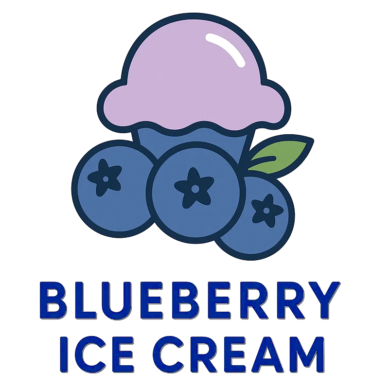

The buttermilk gives this a tangy and fresh profile, refreeze after processing for best texture and consistency.

You can replace the blueberries by other fruit, adapt the "Fill to MAX" liquid amount accordingly,
and use less buttermilk if you'd overfill otherwise.

> 💡 **Alcohol Replacement** 
> If you don't want alcohol in your ice cream, or prepare it for kids,
> replace the small amount of alcohol with vegetable glycerin.
> For 10g booze (40 vol%) use 8g VG instead.

Process on *Frozen Yogurt*, [hold it shortly under running water](https://jhermann.github.io/ice-creamery/info/tips%2Btricks/#handling-of-icy-sides-bottom)
*after* that.Then a scrape-down and a respin.

> 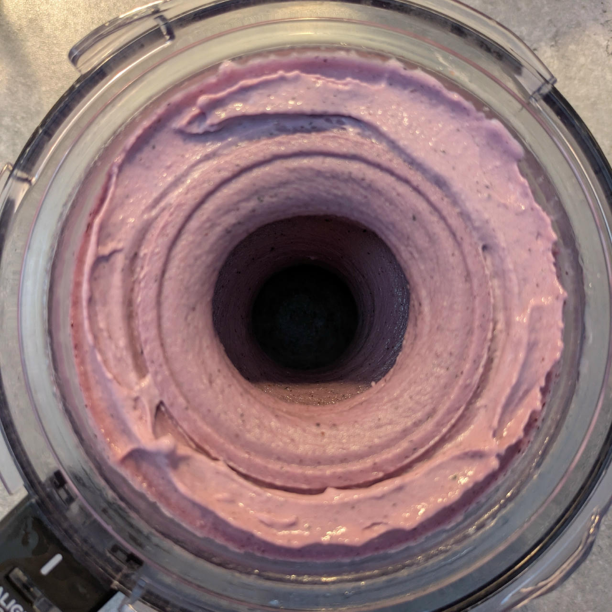
> 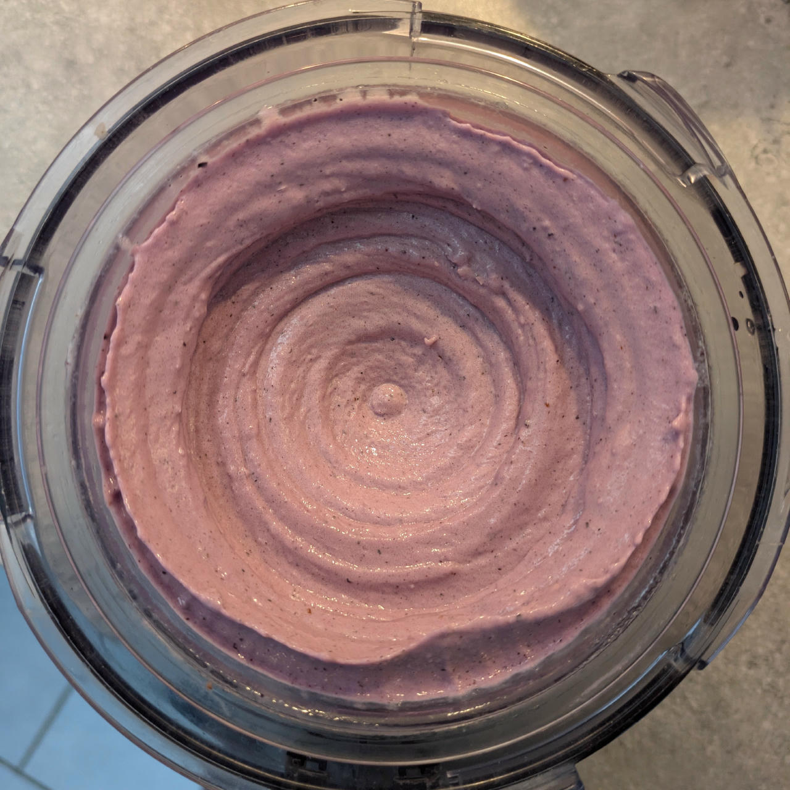
> 
> Rating: 😋😋😋😋😋

The variant made with strawberries, processed the same but with only a final Mix-In, since it was a bit softer.

> 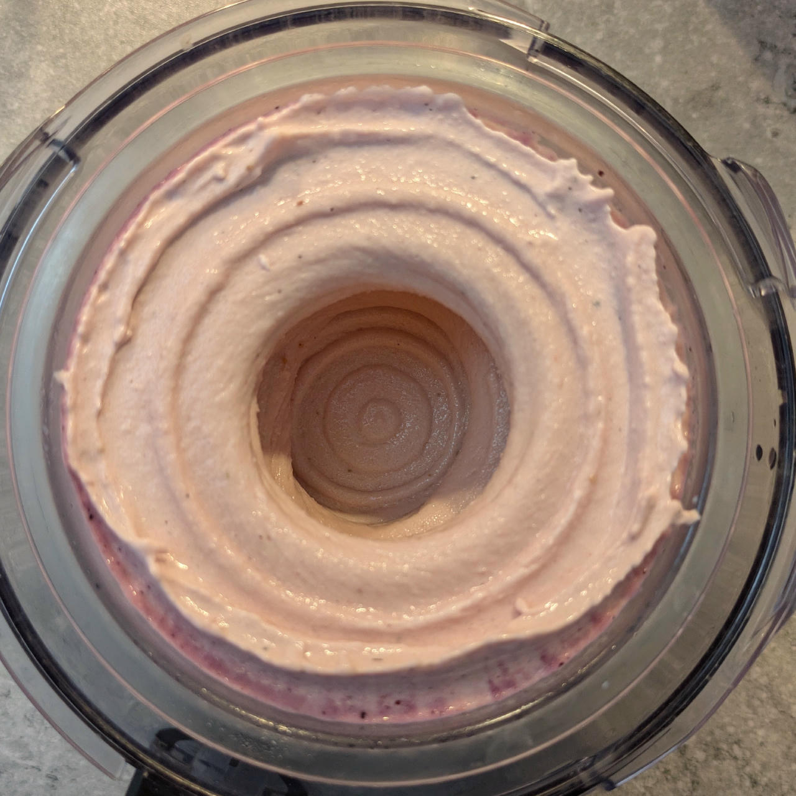
> 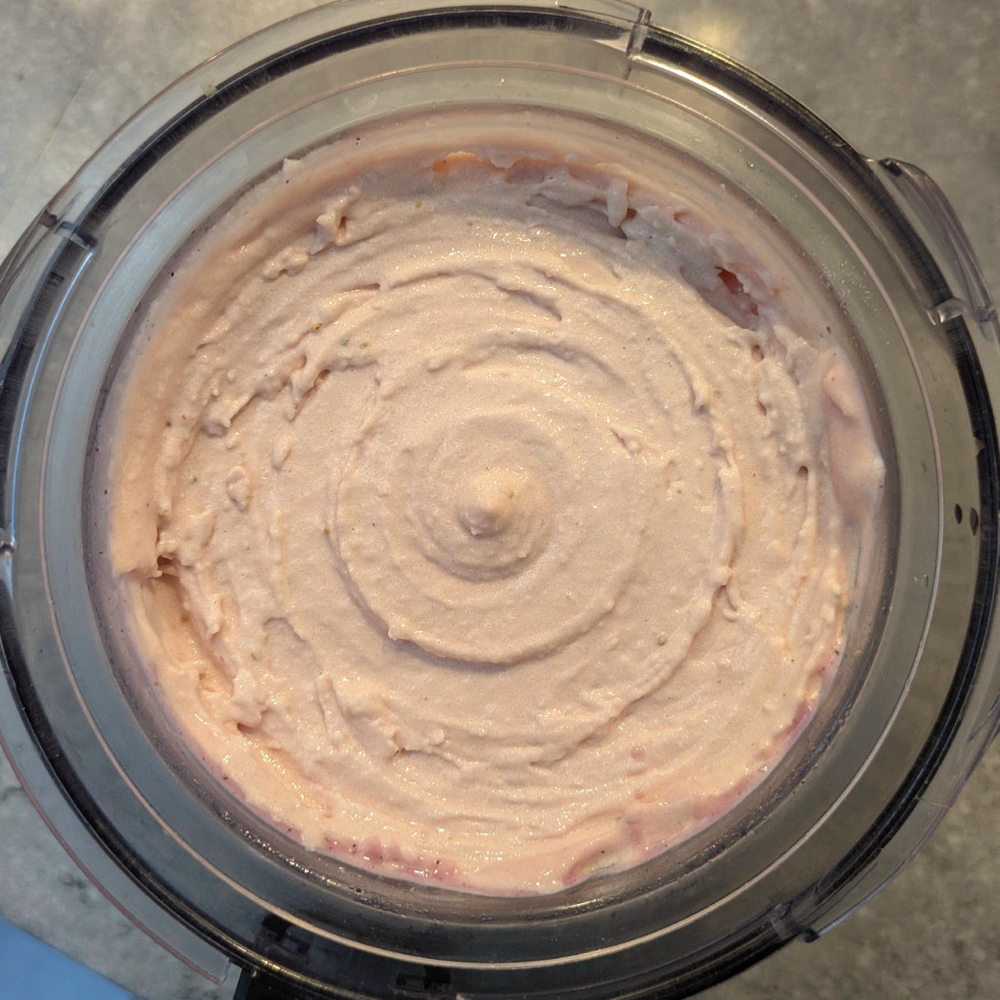
> 
> Rating: 😋😋😋😋😋

> 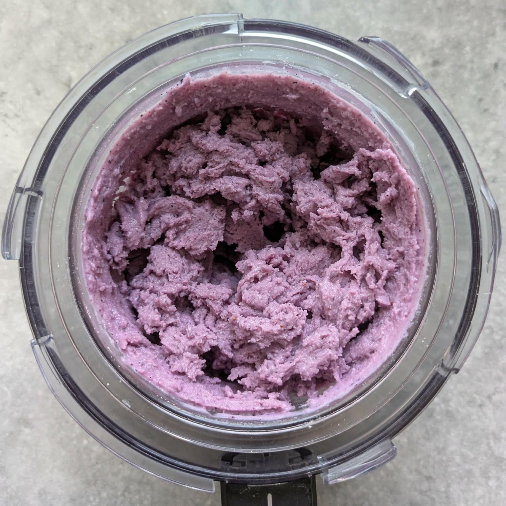
> 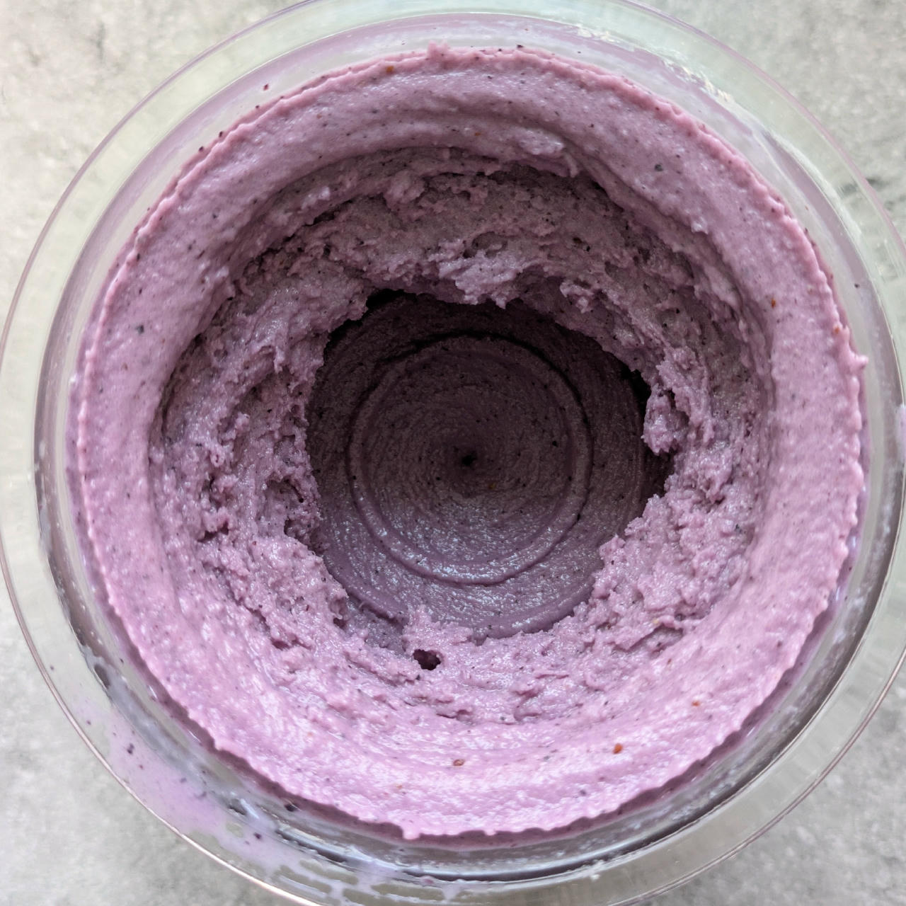
> 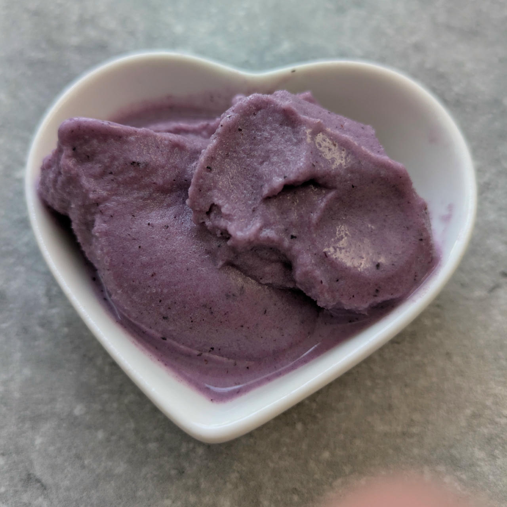
> 
> 2025-07-11: Made with soy protein isolate. Spun on Sorbet, followed by a scrape-down and respin. Soft-serve consistency.

> 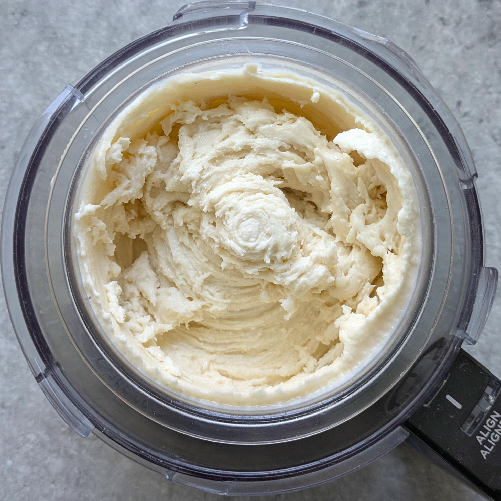
> 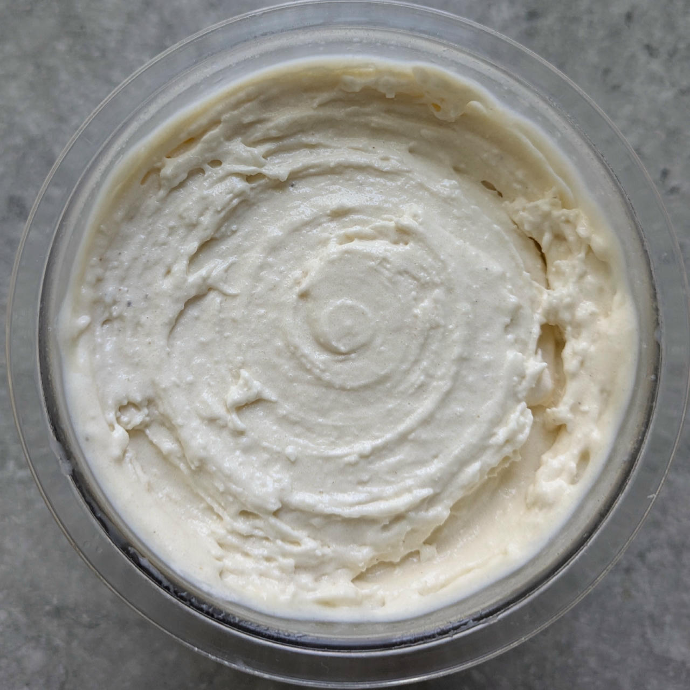
> 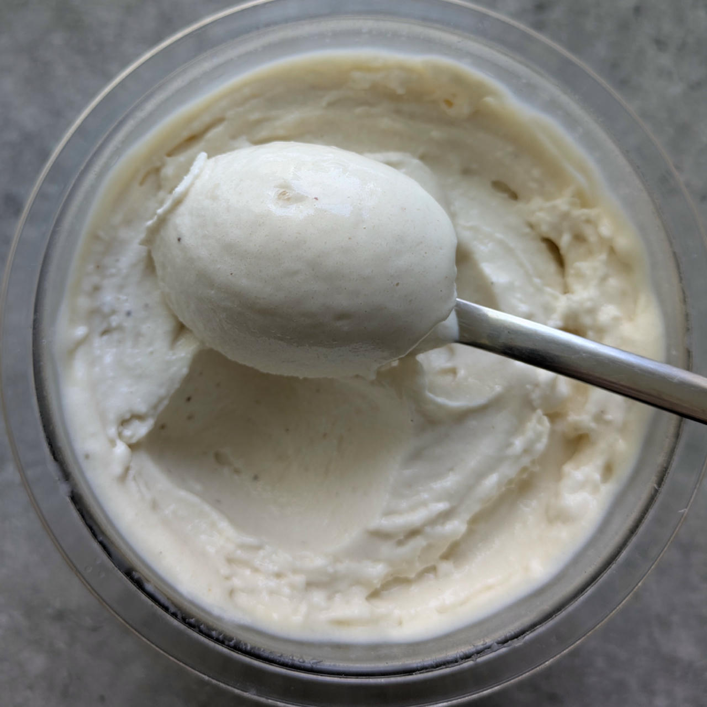
> 
> 2025-08-07: Banana variant, spun on Sorbet, followed by a scrape-down and mix-in. Soft but firmer than other fruit.

# INGREDIENTS

ℹ️ Brand names are in square brackets `[...]`.

**Wet**

  - _400ml_ Buttermilk 1% [REWE]
  - _125g_ Blueberries (frozen)
  - _25g_ [Cream Cheese 23% \[Exquisa\]](/ice-creamery/info/ingredients/#cream-cheese){target="_blank"}↗ • click the link for UK / US equivalents
  - _15g_ [Glycerin (E422, VG) \[hd-line\]](/ice-creamery/info/ingredients/#vegetable-glycerin-glycerol-vg-e422){target="_blank"}↗ • Sweetness = 60%; GI = 5; Density = 1.26 g/ml
  - _10g_ [Brandy or Vodka 40 vol%](/ice-creamery/info/ingredients/#alcohol-ethanol){target="_blank"}↗ • *alternative:* 8g (additional) VG for a sober recipe

**Dry**

  - _35g_ [SweEX (Erythritol + Xylitol 3:2)](/ice-creamery/info/ingredients/#sweex-erythritol-xylitol-blend){target="_blank"}↗ • *alternative:* 47g allulose or dextrose
  - _15g_ [Salty Stability \[Inulin / GMS / CMC / Guar / XG / Salt\]](/ice-creamery/S/Salty%20Stability/){target="_blank"}↗ • *not-as-good substitute:* 1.5g guar, 0.5g xanthan, and 0.5g salt
  - _20g_ [Whey + Casein protein (grass-fed) \[Vilgain\]](/ice-creamery/info/ingredients/#whey-protein){target="_blank"}↗ • with stevia

**Fill to MAX**

  - _35ml_ Buttermilk 1% [REWE]
  - _≈5 drops_ Flavor drops Vanilla (sucralose) [IronMaxx] • to taste

**Optional / Choices**

  - _175g_ Strawberries • fresh or frozen [54kcal, 10g sugar]
  - _125g_ Blueberries • fresh or frozen [60kcal, 11g sugar]
  - _125g_ Mango • fresh or frozen [78kcal, 16g sugar]
  - _125g_ Bananas (ripe, peeled) • 2 small pieces [135kcal, 20g sugar]

# DIRECTIONS

 1. Add "wet" ingredients to empty Creami tub.
 1. Weigh and mix dry ingredients, easiest by adding to a jar with a secure lid and shaking vigorously.
 1. Pour into the tub and *QUICKLY* use an immersion blender on full speed to homogenize everything.
 1. Let blender run until thickeners are properly hydrated, up to 1-2 min. Or blend again after waiting that time.
 1. Add remaining ingredients (to the MAX line) and stir with a spoon.
 1. Put on the lid, freeze for 24h, then spin as usual. Flatten any humps before that.
 1. Process with RE-SPIN mode when not creamy enough after the first spin.

# NUTRITIONAL & OTHER INFO

- **Nutritional values per 100g/ml:** 100g; 75.7 kcal; fat 1.4g; carbs 13.8g; sugar 4.6g; protein 4.9g; salt 0.2g
- **Nutritional values per ½ Deluxe Tub:** 340g; 257.5 kcal; fat 4.9g; carbs 46.9g; sugar 15.6g; protein 16.6g; salt 0.7g
- **Nutritional values total:** 680g; 515.0 kcal; fat 9.8g; carbs 93.8g; sugar 31.3g; protein 33.1g; salt 1.5g
- **FPDF / [PAC](/ice-creamery/info/glossary/#potere-anti-congelante-pac){target="_blank"}↗ (target 20..30):** 31.55
- **Protein / Energy Ratio (ok=12%; hi=20%):** 25.74% • LOW-FAT • Low-Sugar • Hi-Protein
- **Milk Solids Non-Fat ([MSNF](/ice-creamery/info/glossary/#milk-solids-not-fat-msnf){target="_blank"}↗, 7-11%):** 57.5g • 8.5%
- **Net carbs:** 40.2g • *∝ 5 servings@136g:* 8g • *∝ 3 servings@227g:* 13.4g • *energy ratio (low <20%):* 31.2%
- **15g 'Salty Stability' is:** 11.0g Inulin • 1.8g Glycerol Monostearate (GMS / E471) • 0.9g Tylose powder (E466, Tylo, CMC) • 0.6g Guar gum (E412) • 0.5g Salt • 0.2g Xanthan gum (E415, XG).
