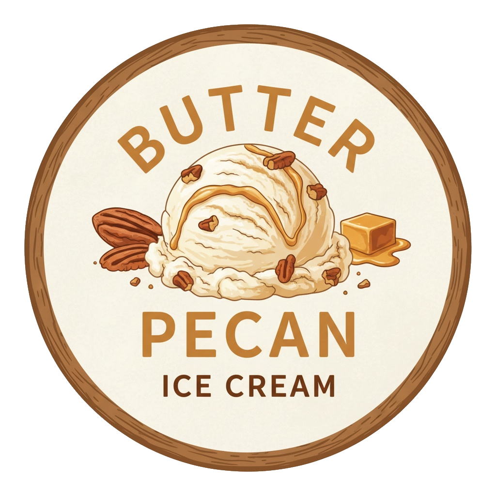

# Butter Pecan (Deluxe)

A vanilla base with roasted pecan chunks infused with brown butter. What’s not to like (except the macros)? 😺

Spin on “Sorbet”, scrape down, and re-mix.
> 

Rating: 😋🧈 (untested)

# INGREDIENTS

ℹ️ Brand names are in square brackets `[...]`.

**Prep**

  - _45g_ Pecan nuts (organic) [Biojoy]
  - _15g_ Butter (unsalted)
  - _0.75g_ Salt • 19 quick shakes (with my shaker)

**Wet**

  - _400ml_ [Soy milk 1.6% (sugar-free) \[Berief\]](/ice-creamery/info/ingredients/#soy-milk){target="_blank"}↗
  - _25g_ [Cream Cheese 23% \[Exquisa\]](/ice-creamery/info/ingredients/#cream-cheese){target="_blank"}↗
  - _10g_ [Glycerin (E422, VG) \[hd-line\]](/ice-creamery/info/ingredients/#vegetable-glycerin-glycerol-vg-e422){target="_blank"}↗ • POD = 60%; GI = 5; Density = 1.26 g/ml
  - _10g_ [Jamaica Rum 43 vol%](/ice-creamery/info/ingredients/#alcohol-ethanol){target="_blank"}↗
  - _3g_ Molasses [Grafschafter Goldsaft] • Sweetness = 66%

**Dry**

  - _40g_ [SweEX (Erythritol + Xylitol 3:2)](/ice-creamery/info/ingredients/#sweex-erythritol-xylitol-blend){target="_blank"}↗ • POD ≈ 90%; GI < 7
  - _25g_ [Skim milk powder 1:10 (SMP) \[Vita2You\]](/ice-creamery/info/ingredients/#skim-milk-powder-smp){target="_blank"}↗
  - _15g_ [Salty Stability \[Inulin / GMS / CMC / Guar / XG / Salt\]](/ice-creamery/S/Salty%20Stability/){target="_blank"}↗ • unsweetened “ICSv2”
  - _5g_ Vanilla Bean Powder [InterVanilla]

**Fill to MAX**

  - _86.25ml_ [Soy milk 1.6% (sugar-free) \[Berief\]](/ice-creamery/info/ingredients/#soy-milk){target="_blank"}↗
  - _≈1 drops_ Flavor drops Vanilla (sucralose) [IronMaxx] • to taste

# DIRECTIONS

 1. Break the pecans in half into a small empty sauce pan, and roast them on medium heat until fragrant, around 5 minutes. Stir occasionally.
 1. Set the roasted nuts aside in a glass or ceramic bowl.
 1. Brown the butter with the salt in the same pan, until golden, take off the heat, add the pecans.
 1. Set butter and pecans aside in the fridge, for the next day. Before that, take out 1 tsp (5g) of the browned butter back into the pan.
 1. Pour the ‘wet’ ingredients into the pan, heat them up to a moderate heast (50°C).
 1. Weigh dry ingredients, and mix them with a spoon.
 1. Whisk them in and dissolve everything. Let the liquid cool down a bit, then add to an empty Creami tub.
 1. Add remaining ingredients (to the MAX line) and stir with a spoon.
 1. Before freezing, cool down the base in the fridge and let the flavors meld.
 1. Put on the lid, freeze for 24h, then spin as usual. Flatten any humps before that.
 1. Process with RE-SPIN mode when not creamy enough after the first spin.
 1. As the mix-in, use the pecans and butter after heating them up a bit in the microwave to make the butter liquid again.
 1. Add it to your base and quickly engage the MIX-IN mode, so the butter does not freeze into one solid blob.

# NUTRITIONAL & OTHER INFO

- **Nutritional values per 100g/ml:** 100g; 133.3 kcal; fat 8.7g; carbs 12.6g; sugar 2.8g; protein 4.3g; salt 0.3g
- **Nutritional values per ½ Deluxe Tub:** 340g; 453.3 kcal; fat 29.5g; carbs 42.9g; sugar 9.4g; protein 14.5g; salt 1.0g
- **Nutritional values total:** 680g; 906.5 kcal; fat 58.9g; carbs 85.7g; sugar 18.8g; protein 29.1g; salt 2.1g
- **FPDF / [PAC](/ice-creamery/info/glossary/#potere-anti-congelante-pac){target="_blank"}↗ (target 20..30):** 30.29
- **Protein / Energy Ratio (ok=12%; hi=20%):** 12.82% • Low-Sugar
- **Milk Solids Non-Fat ([MSNF](/ice-creamery/info/glossary/#milk-solids-not-fat-msnf){target="_blank"}↗, 7-11%):** 45.4g • 6.7%
- **Net carbs:** 29.7g • *∝ 5 servings@136g:* 5.9g • *∝ 3 servings@227g:* 9.9g • *energy ratio (low <20%):* 13.1%
- **15g 'Salty Stability' is:** 11.0g Inulin • 1.8g Glycerol Monostearate (GMS / E471) • 0.9g Tylose powder (E466, Tylo, CMC) • 0.6g Guar gum (E412) • 0.5g Salt • 0.2g Xanthan gum (E415, XG).
