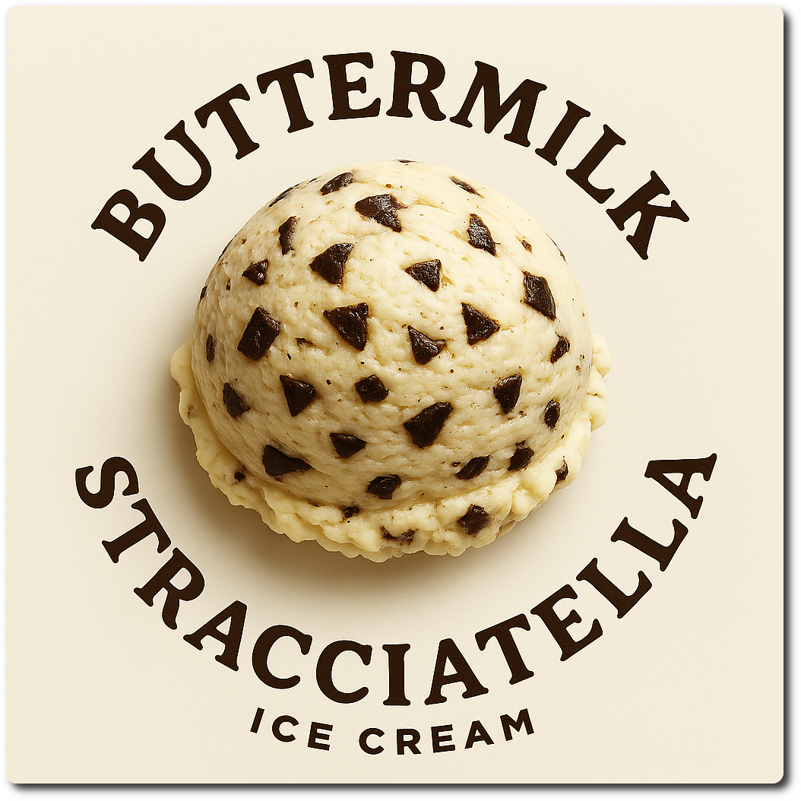
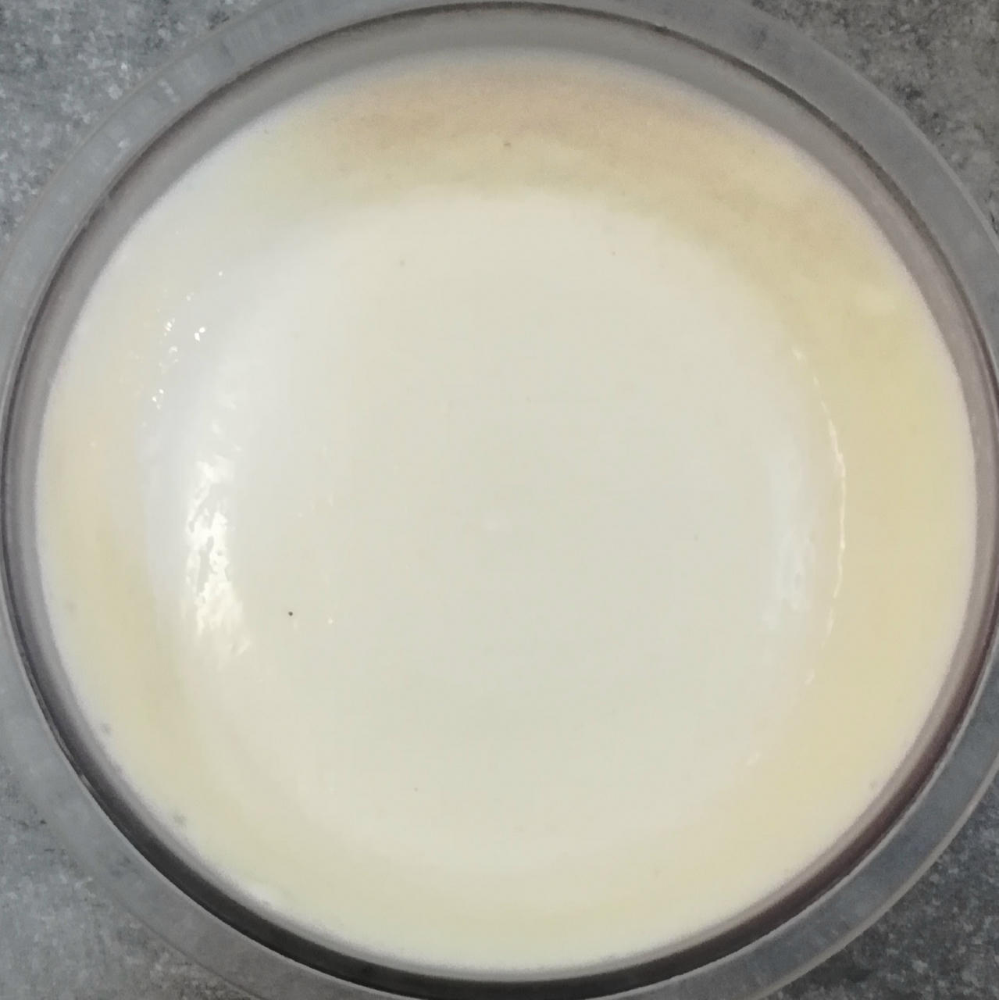
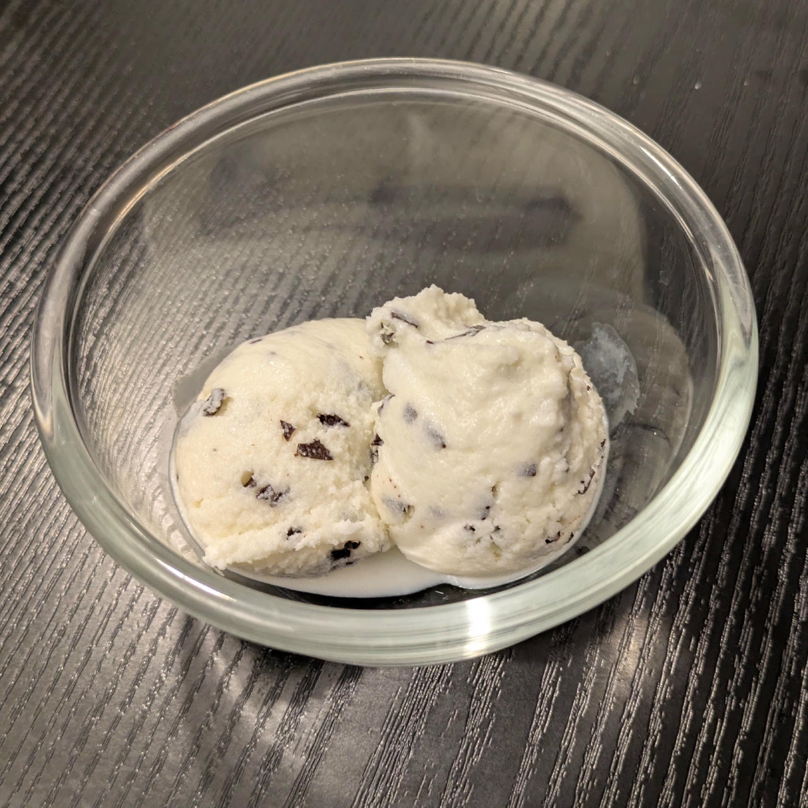

# Buttermilk Stracciatella (Deluxe)

> *Pure buttermilk. Dark chocolate. Just ice cream.*

This recipe combines tangy buttermilk with crisp shards of dark chocolate.
Still it is low-sugar and smooth.

Macros include the dark chocolate shavings.
Process on *Sorbet*, with scrape-down and a mix-in run to integrate the chocolate. 

> 
> 

Rating: 😋🥛🥛🍫🍫

# INGREDIENTS

ℹ️ Brand names are in square brackets `[...]`.

**Wet**

  - _500ml_ Buttermilk 1% [REWE]
  - _50g_ [Cottage Cheese 4% \[REWE Bio\]](/ice-creamery/info/ingredients/#cottage-cheese){target="_blank"}↗
  - _15g_ [Glycerin (E422, VG) \[hd-line\]](/ice-creamery/info/ingredients/#vegetable-glycerin-glycerol-vg-e422){target="_blank"}↗ • Sweetness = 60%; GI = 5; Density = 1.26 g/ml
  - _10g_ [Brandy or Vodka 40 vol%](/ice-creamery/info/ingredients/#alcohol-ethanol){target="_blank"}↗ • *alternative:* 8g (additional) VG for a sober recipe

**Dry**

  - _35g_ [SweEX (Erythritol + Xylitol 3:2)](/ice-creamery/info/ingredients/#sweex-erythritol-xylitol-blend){target="_blank"}↗ • POD ≈ 85%; GI < 7
  - _20g_ [Whey + Casein protein (grass-fed) \[Vilgain\]](/ice-creamery/info/ingredients/#whey-protein){target="_blank"}↗ • with stevia
  - _15g_ [Skim milk powder 1:10 (SMP) \[Vita2You\]](/ice-creamery/info/ingredients/#skim-milk-powder-smp){target="_blank"}↗
  - _10g_ [Salty Stability \[Inulin / GMS / CMC / Guar / XG / Salt\]](/ice-creamery/S/Salty%20Stability/){target="_blank"}↗ • *not-as-good substitute:* 1g guar, 0.3g xanthan, and 0.3g salt

**Fill to MAX**

  - _≈6 drops_ Flavor drops Vanilla (sucralose) [IronMaxx] • to taste

**Mix-ins**

  - _30g_ [1️⃣ Dark chocolate shavings \[Ruf\]](/ice-creamery/info/ingredients/#chocolate-shavings){target="_blank"}↗ • [152kcal, 14.3g sugar]
  - _50g_ [2️⃣ Dark chocolate 85% \[Moser-Roth/Aldi\]](/ice-creamery/info/ingredients/#chocolate-shavings){target="_blank"}↗ • Portion = 25g
  - _8ml_ 2️⃣ Avocado oil (extra virgin) [Hunter & Gather] • or extra virgin olive oil

# DIRECTIONS

 1. Add "wet" ingredients to empty Creami tub.
 1. Weigh and mix dry ingredients, easiest by adding to a jar with a secure lid and shaking vigorously.
 1. Pour into the tub and *QUICKLY* use an immersion blender on full speed to homogenize everything.
 1. Let blender run until thickeners are properly hydrated, up to 1-2 min. Or blend again after waiting that time.
 1. Add remaining ingredients (to the MAX line) and stir with a spoon.
 1. Put on the lid, freeze for 24h, then spin as usual. Flatten any humps before that.
 1. Process with RE-SPIN mode when not creamy enough after the first spin.
 1. As a mix-in, microwave the dark chocolate with the oil for 15 seconds at 600W, stir with a chopstick or a fork, heat for another 15 secs, stir again.
 1. Pour over the already processed and flattened ice cream, quickly close the lid, and start a mix-in cycle as fast as possible.
 1. **OR** Add ready-to-use dark chocolate shavings, and run the mix-in cycle.
 1. Firm up in the freezer for at least an hour.

# NUTRITIONAL & OTHER INFO

- **Nutritional values per 100g/ml:** 100g; 95.8 kcal; fat 2.1g; carbs 15.2g; sugar 6.4g; protein 6.9g; salt 0.2g
- **Nutritional values per ½ Deluxe Tub:** 340g; 325.6 kcal; fat 7.1g; carbs 51.6g; sugar 21.9g; protein 23.4g; salt 0.8g
- **Nutritional values total:** 685g; 655.9 kcal; fat 14.2g; carbs 104.0g; sugar 44.0g; protein 47.1g; salt 1.7g
- **FPDF / [PAC](/ice-creamery/info/glossary/#potere-anti-congelante-pac){target="_blank"}↗ (target 20..30):** 31.31
- **Protein / Energy Ratio (ok=12%; hi=20%):** 28.69% • LOW-FAT • Hi-Protein
- **Milk Solids Non-Fat ([MSNF](/ice-creamery/info/glossary/#milk-solids-not-fat-msnf){target="_blank"}↗, 7-11%):** 82.7g • 12.1%
- **Net carbs:** 54.2g • *∝ 5 servings@137g:* 10.8g • *∝ 3 servings@228g:* 18.1g • *energy ratio (low <20%):* 33%
- **10g 'Salty Stability' is:** 7.3g Inulin • 1.2g Glycerol Monostearate (GMS / E471) • 0.6g Tylose powder (E466, Tylo, CMC) • 0.4g Guar gum (E412) • 0.33g Salt • 0.13g Xanthan gum (E415, XG).
