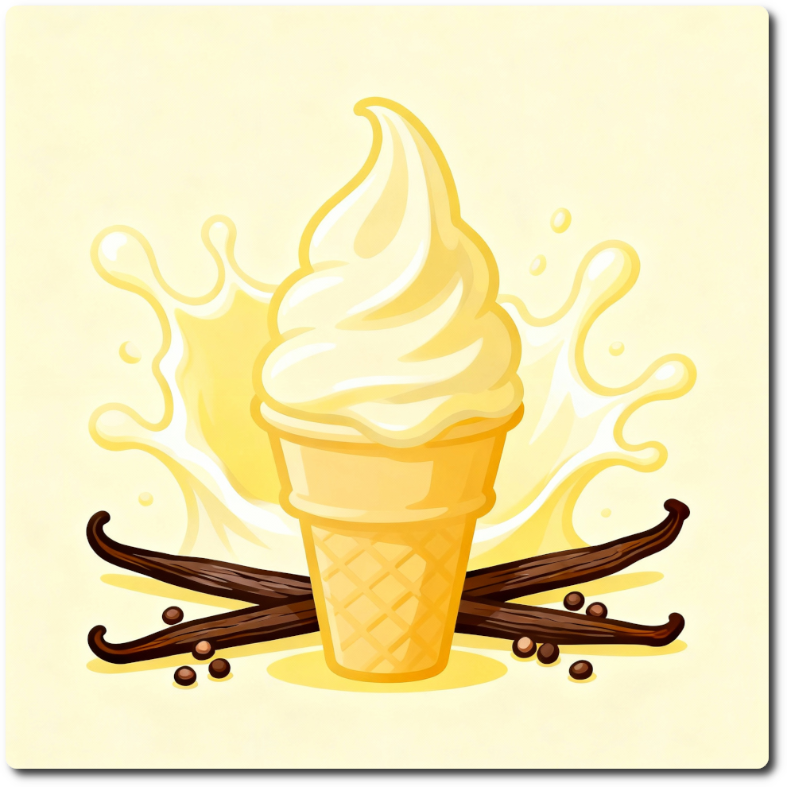

# Buttermilk Vanilla (Deluxe)

Mostly buttermilk, leaving room for some cream-y indulgence.

!!! tip "Lower Calories"

    If you use 575ml of 2% fairlife or another hi-protein milk and no cream,
    you get to about 525 kcal and almost 50g protein in total,
    while the recipe remains balanced and scoopable.

Change the vanilla flavoring to what you have, e.g. vanilla paste or essence. Just be sure to use enough, and taste the base.

Process on *Light Ice Cream*, with scrape-down, and a mix-in or respin run if needed. 

> 
> 
> 

Rating: 😋🥛🍦 (untested)

# INGREDIENTS

ℹ️ Brand names are in square brackets `[...]`.

**Wet**

  - _500ml_ Buttermilk 1% [REWE] • *alternative:* Milk zero fat / hi-protein [“Fairlife”]
  - _10g_ [Glycerin (E422, VG) \[hd-line\]](/ice-creamery/info/ingredients/#vegetable-glycerin-glycerol-vg-e422){target="_blank"}↗ • Sweetness = 60%; GI = 5; Density = 1.26 g/ml
  - _6ml_ Vanilla Extract (w/ alcohol) [Native Vanilla]

**Dry**

  - _45g_ [SweEX (Erythritol + Xylitol 3:2)](/ice-creamery/info/ingredients/#sweex-erythritol-xylitol-blend){target="_blank"}↗ • *alternative:* 60g allulose or dextrose
  - _20g_ [Whey + Casein protein (grass-fed) \[Vilgain\]](/ice-creamery/info/ingredients/#whey-protein){target="_blank"}↗ • with stevia
  - _10g_ [Waxy Maize Starch (E1442) \[Ultratex\]](/ice-creamery/info/ingredients/#waxy-maize-starch-e1442){target="_blank"}↗ • *alternative:* [E1422](https://jhermann.github.io/ice-creamery/info/ingredients/#acetylated-distarch-adipate-e1422) / *any* modified starch
  - _3g_ Vanilla Bean Powder [InterVanilla]
  - _1g_ Salt

**Fill to MAX**

  - _75ml_ Cream 32% [REWE Beste Wahl]
  - _≈1 drops_ Flavor drops Vanilla (sucralose) [IronMaxx] • to taste

# DIRECTIONS

 1. Add "wet" ingredients to empty Creami tub.
 1. Weigh and mix dry ingredients, easiest by adding to a jar with a secure lid and shaking vigorously.
 1. Pour into the tub and *QUICKLY* use an immersion blender on full speed to homogenize everything.
 1. Let blender run until thickeners are properly hydrated, up to 1-2 min. Or blend again after waiting that time.
 1. Add remaining ingredients (to the MAX line) and stir with a spoon.
 1. Put on the lid, freeze for 24h, then spin as usual. Flatten any humps before that.
 1. Process with RE-SPIN mode when not creamy enough after the first spin.

# NUTRITIONAL & OTHER INFO

- **Nutritional values per 100g/ml:** 100g; 95.5 kcal; fat 4.1g; carbs 13.2g; sugar 3.6g; protein 5.3g; salt 0.3g
- **Nutritional values per ½ Deluxe Tub:** 340g; 324.8 kcal; fat 13.9g; carbs 44.9g; sugar 12.1g; protein 18.0g; salt 1.0g
- **Nutritional values total:** 670g; 640.1 kcal; fat 27.4g; carbs 88.5g; sugar 23.9g; protein 35.4g; salt 2.0g
- **FPDF / [PAC](/ice-creamery/info/glossary/#potere-anti-congelante-pac){target="_blank"}↗ (target 20..30):** 30.85
- **Protein / Energy Ratio (ok=12%; hi=20%):** 22.14% • Low-Sugar • Hi-Protein
- **Milk Solids Non-Fat ([MSNF](/ice-creamery/info/glossary/#milk-solids-not-fat-msnf){target="_blank"}↗, 7-11%):** 65.3g • 9.7%
- **Net carbs:** 38.5g • *∝ 5 servings@134g:* 7.7g • *∝ 3 servings@223g:* 12.8g • *energy ratio (low <20%):* 24.1%
