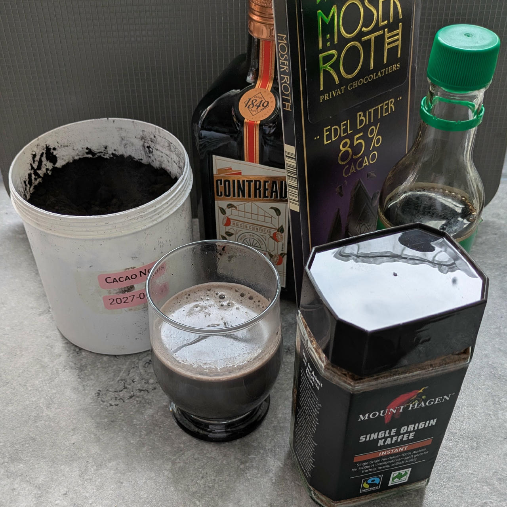
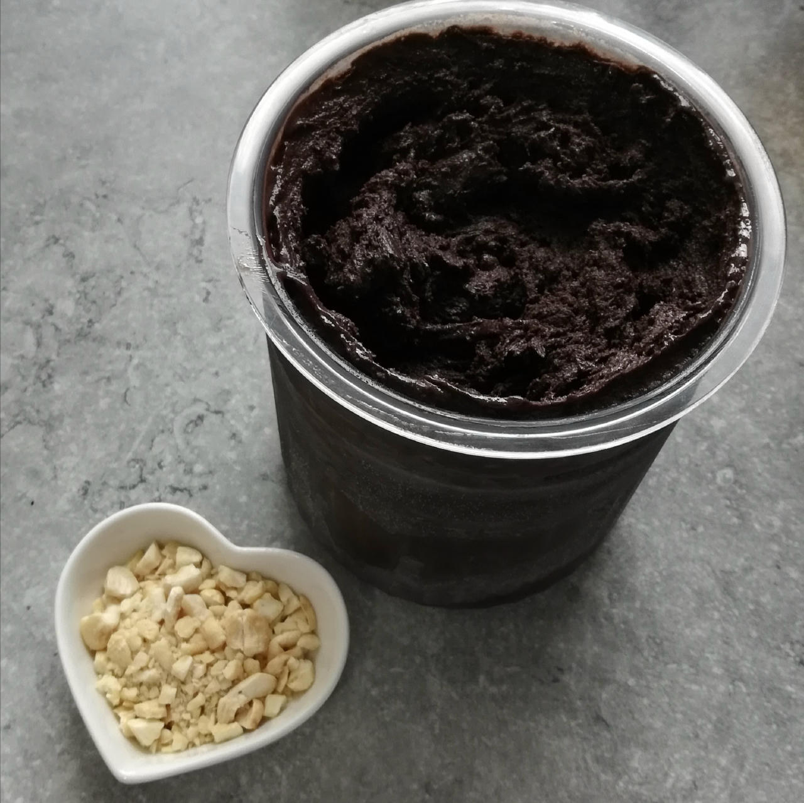
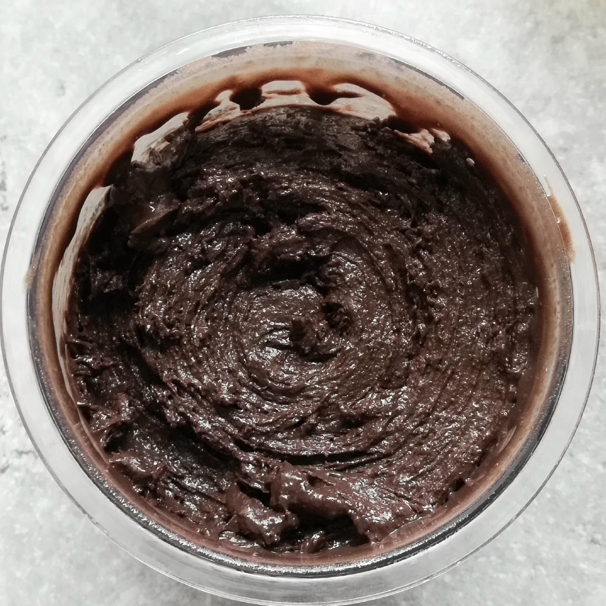

# Cacao Noir a/k/a Charcolate (Deluxe)

Chocolate ice cream using both dark cocoa powder and dark chocolate, and a strong coffee note.

> 

Spin on “Sorbet”, scrape down, and mix-in. I used 15g of crushed cashews here, included in the macros.

> 
> 

Rating: 😋🍫🍫🍫🕳️ (chocolate black hole, in a good way)

# INGREDIENTS

ℹ️ Brand names are in square brackets `[...]`.

**Prep**

  - _200ml_ Water (boiling)
  - _50g_ Dark chocolate 85% [Moser-Roth/Aldi] • Portion = 25g

**Wet**

  - _200ml_ [Soy milk 1.6% (sugar-free) \[Berief\]](/ice-creamery/info/ingredients/#soy-milk){target="_blank"}↗
  - _20g_ [Glycerin (E422, VG) \[hd-line\]](/ice-creamery/info/ingredients/#vegetable-glycerin-glycerol-vg-e422){target="_blank"}↗ • POD = 60%; GI = 5; Density = 1.26 g/ml
  - _15g_ Cointreau 40 vol% • 1 bottle = 70cl
  - _10ml_ Soy sauce • ½ tbsp

**Dry**

  - _45g_ [SweEX (Erythritol + Xylitol 3:2)](/ice-creamery/info/ingredients/#sweex-erythritol-xylitol-blend){target="_blank"}↗ • POD ≈ 90%; GI < 7
  - _20g_ [Cocoa Noir Intense 11% \[Cacao Barry\]](/ice-creamery/info/ingredients/#cocoa-powder){target="_blank"}↗ • intense, tart cocoa flavour
  - _15g_ [Skim milk powder 1:10 (SMP) \[Vita2You\]](/ice-creamery/info/ingredients/#skim-milk-powder-smp){target="_blank"}↗
  - _15g_ [Whey + Casein protein (grass-fed) \[Vilgain\]](/ice-creamery/info/ingredients/#whey-protein){target="_blank"}↗ • with stevia
  - _10g_ [Salty Stability \[Inulin / GMS / CMC / Guar / XG / Salt\]](/ice-creamery/S/Salty%20Stability/){target="_blank"}↗ • unsweetened “ICSv2”
  - _4.5g_ Instant Coffee [Mount Hagen] • 1.5g per 125ml
  - _0.5g_ Cinnamon (Ceylon)

**Fill to MAX**

  - _75ml_ [Soy milk 1.6% (sugar-free) \[Berief\]](/ice-creamery/info/ingredients/#soy-milk){target="_blank"}↗
  - _≈10 drops_ Flavor drops Vanilla (sucralose) [IronMaxx] • to taste

**Mix-ins**

  - _15g_ Cashew nuts (organic) [Biojoy] • crush them and use as a mix-in [90kcal, 0.9g sugar]

**Topping Options**

  - _8g_ Walnuts (organic) [Biojoy] • add as a topping [54kcal, 0.6g sugar]
  - _8g_ Pecan nuts (organic) [Biojoy] • 10 halves = 15g; add as a topping [58kcal, 0.3g sugar]

# DIRECTIONS

 1. In a medium-sized bowl, mix all the ‘dry’ ingredients with a whisk.
 1. Pour ½ the boiling water over the cocoa to bloom it, and whisk to combine to a smooth paste.
 1. Carefully integrate the other half of the water.
 1. Break the chocolate into pieces and melt them into the hot paste, then let it cool down a bit.
 1. Add "wet" ingredients and the chocolate paste to empty Creami tub (use a silicone spatula).
 1. Use an immersion blender on full speed to homogenize everything.
 1. Let blender run until thickeners are properly hydrated, up to 1-2 min. Or blend again after waiting that time.
 1. Add remaining ingredients (to the MAX line) and stir with a spoon.
 1. Put on the lid, freeze for 24h, then spin as usual. Flatten any humps before that.
 1. Process with RE-SPIN mode when not creamy enough after the first spin.
 1. Process with MIX-IN after adding mix-ins evenly. For that, add partial amounts into a hole going down to the bottom, and fold the ice cream over, building pockets of mix-ins.

# NUTRITIONAL & OTHER INFO

- **Nutritional values per 100g/ml:** 100g; 124.1 kcal; fat 5.8g; carbs 15.0g; sugar 3.1g; protein 5.6g; salt 0.5g
- **Nutritional values per ½ Deluxe Tub:** 340g; 421.8 kcal; fat 19.6g; carbs 51.0g; sugar 10.5g; protein 19.2g; salt 1.7g
- **Nutritional values total:** 695g; 862.2 kcal; fat 40.0g; carbs 104.2g; sugar 21.5g; protein 39.3g; salt 3.4g
- **FPDF / [PAC](/ice-creamery/info/glossary/#potere-anti-congelante-pac){target="_blank"}↗ (target 20..30):** 31.29
- **Protein / Energy Ratio (ok=12%; hi=20%):** 18.21% • Low-Sugar
- **Milk Solids Non-Fat ([MSNF](/ice-creamery/info/glossary/#milk-solids-not-fat-msnf){target="_blank"}↗, 7-11%):** 38.7g • 5.6%
- **Net carbs:** 41.8g • *∝ 5 servings@139g:* 8.4g • *∝ 3 servings@232g:* 13.9g • *energy ratio (low <20%):* 19.4%
- **10g 'Salty Stability' is:** 7.3g Inulin • 1.2g Glycerol Monostearate (GMS / E471) • 0.6g Tylose powder (E466, Tylo, CMC) • 0.4g Guar gum (E412) • 0.33g Salt • 0.13g Xanthan gum (E415, XG).
