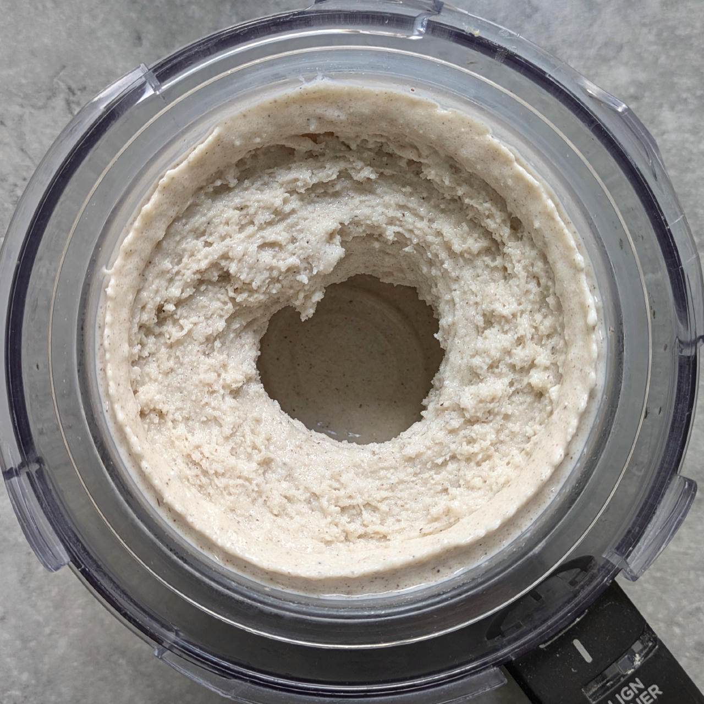
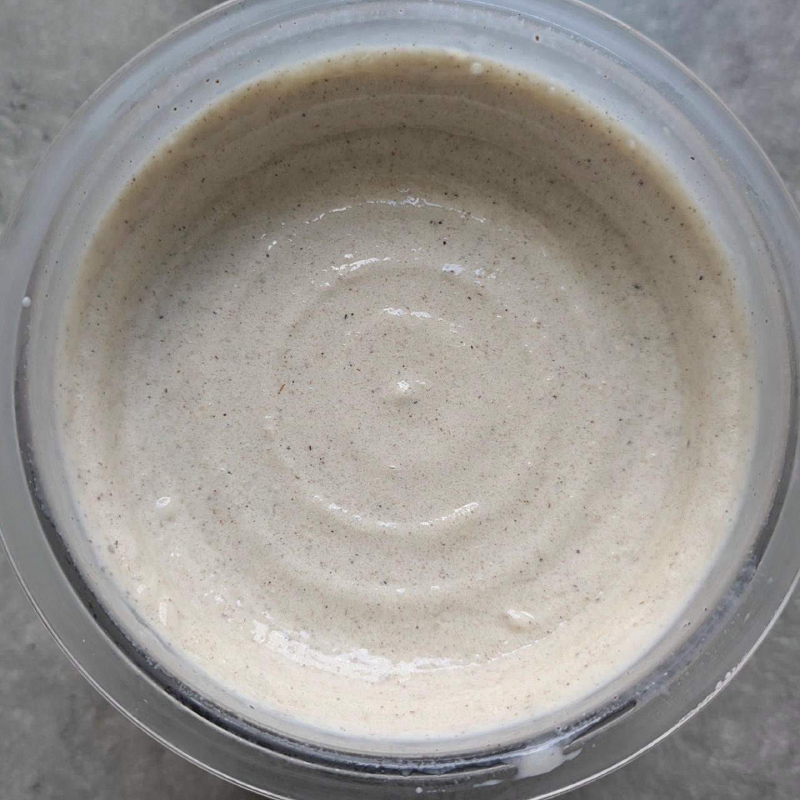
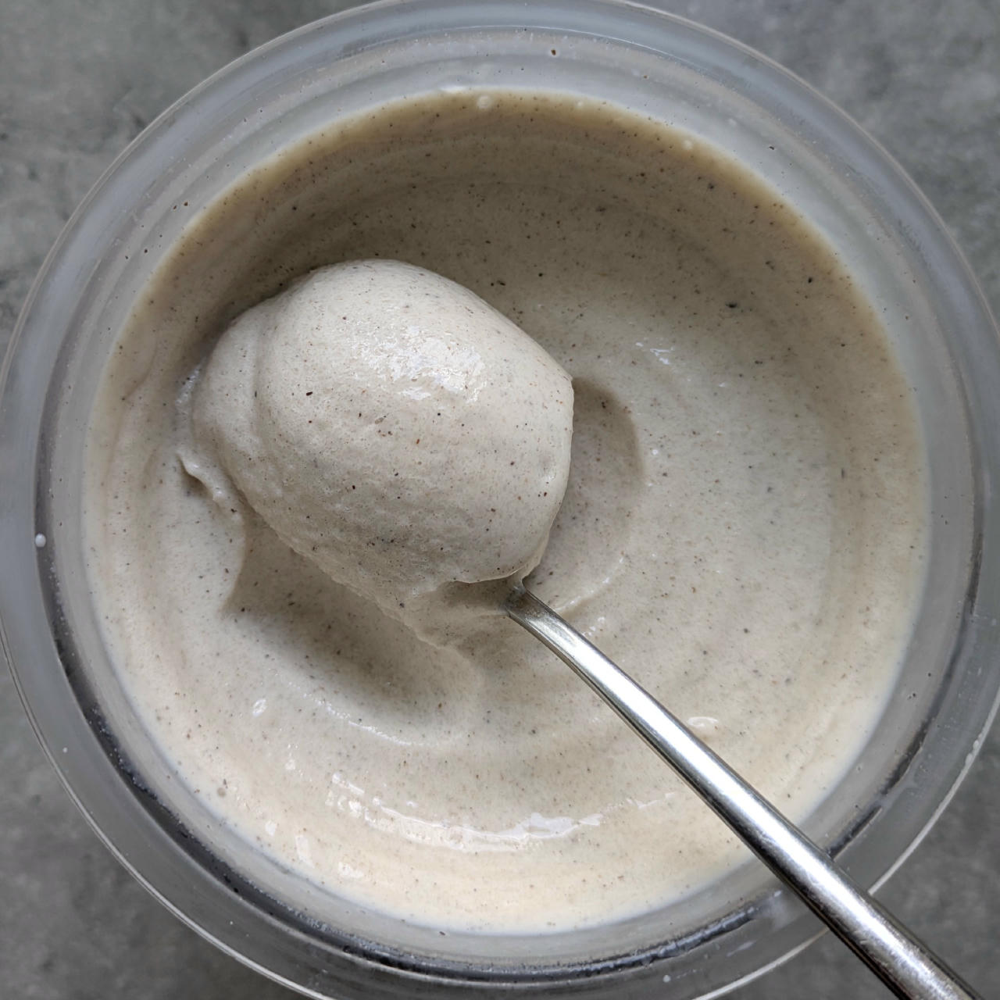

# Cheesecake Light (Deluxe)

Inspired by German cheesecake, which is made with ‘Quark’ or ‘Topfen’
– think of a cross between yogurt, cottage cheese and ricotta.

The buttermilk adds the necessary tanginess.

Spin on *Light Ice Cream*, do a scrape-down, and finish with a mix-in or respin run.

Serve with graham crackers or butter cookies to stand in for the pie crust.

> 
> 
> 

Rating: 😋😋😋😋😋

# INGREDIENTS

ℹ️ Brand names are in square brackets `[...]`.

**Wet**

  - _400ml_ Buttermilk 1% [REWE]
  - _200g_ [Topfen / Quark 0.6% \[Berchtesgadener\]](/ice-creamery/info/ingredients/#quark-topfen){target="_blank"}↗ • 250g container; *US alternative:* low-fat cream cheese
  - _15g_ [Glycerin (E422, VG) \[hd-line\]](/ice-creamery/info/ingredients/#vegetable-glycerin-glycerol-vg-e422){target="_blank"}↗ • POD = 60%; GI = 5; Density = 1.26 g/ml
  - _10g_ [Brandy or Vodka 40 vol%](/ice-creamery/info/ingredients/#alcohol-ethanol){target="_blank"}↗ • *alternative:* 8g (additional) VG for a sober recipe

**Dry**

  - _35g_ [SweEX (Erythritol + Xylitol 3:2)](/ice-creamery/info/ingredients/#sweex-erythritol-xylitol-blend){target="_blank"}↗ • *alternative:* 47g allulose or dextrose
  - _15g_ [Salty Stability \[Inulin / GMS / CMC / Guar / XG / Salt\]](/ice-creamery/S/Salty%20Stability/){target="_blank"}↗ • *not-as-good substitute:* 1.5g guar, 0.5g xanthan, and 0.5g salt
  - _10g_ [Whey + Casein protein (grass-fed) \[Vilgain\]](/ice-creamery/info/ingredients/#whey-protein){target="_blank"}↗ • with stevia
  - _2g_ Vanilla Bean Powder [InterVanilla]

**Fill to MAX**

  - _≈3 drops_ Flavor drops Vanilla (sucralose) [IronMaxx] • to taste
  - _≈10 drops_ Flavor drops Cookies&Cream (stevia) [Nick’s] • to taste

**Mix-ins**

  - _50g_ Frozen Fruit • add chopped as a mix-in [31kcal, 5g sugar]
  - _20g_ Sultanas (organic) [Biojoy] • add chopped as a mix-in [60kcal, 13g sugar]

**Topping Options**

  - _3-4 pieces_ Graham crackers / Butter cookies
  - _3-4 pieces_ Wafers (cream-filled)
  - _20ml_ Syrup Caramel (low-sugar) [Sukrin] • 14% sorbitol, erythritol, stevia [30kcal, 0.4g sugar]

# DIRECTIONS

 1. Add "wet" ingredients to empty Creami tub.
 1. Weigh and mix dry ingredients, easiest by adding to a jar with a secure lid and shaking vigorously.
 1. Pour into the tub and *QUICKLY* use an immersion blender on full speed to homogenize everything.
 1. Let blender run until thickeners are properly hydrated, up to 1-2 min. Or blend again after waiting that time.
 1. Add remaining ingredients (to the MAX line) and stir with a spoon.
 1. Put on the lid, freeze for 24h, then spin as usual. Flatten any humps before that.
 1. Process with RE-SPIN mode when not creamy enough after the first spin.
 1. Process with MIX-IN after adding mix-ins evenly. For that, add partial amounts into a hole going down to the bottom, and fold the ice cream over, building pockets of mix-ins.

# NUTRITIONAL & OTHER INFO

- **Nutritional values per 100g/ml:** 100g; 71.4 kcal; fat 0.6g; carbs 12.7g; sugar 3.6g; protein 6.7g; salt 0.2g
- **Nutritional values per ½ Deluxe Tub:** 340g; 242.8 kcal; fat 2.1g; carbs 43.1g; sugar 12.3g; protein 22.7g; salt 0.7g
- **Nutritional values total:** 687g; 490.6 kcal; fat 4.2g; carbs 87.1g; sugar 24.9g; protein 45.8g; salt 1.3g
- **FPDF / [PAC](/ice-creamery/info/glossary/#potere-anti-congelante-pac){target="_blank"}↗ (target 20..30):** 30.16
- **Protein / Energy Ratio (ok=12%; hi=20%):** 37.38% • LOW-FAT • Low-Sugar • Hi-Protein
- **Milk Solids Non-Fat ([MSNF](/ice-creamery/info/glossary/#milk-solids-not-fat-msnf){target="_blank"}↗, 7-11%):** 65.8g • 9.6%
- **Net carbs:** 33.6g • *∝ 5 servings@137g:* 6.7g • *∝ 3 servings@229g:* 11.2g • *energy ratio (low <20%):* 27.4%
- **15g 'Salty Stability' is:** 11.0g Inulin • 1.8g Glycerol Monostearate (GMS / E471) • 0.9g Tylose powder (E466, Tylo, CMC) • 0.6g Guar gum (E412) • 0.5g Salt • 0.2g Xanthan gum (E415, XG).
