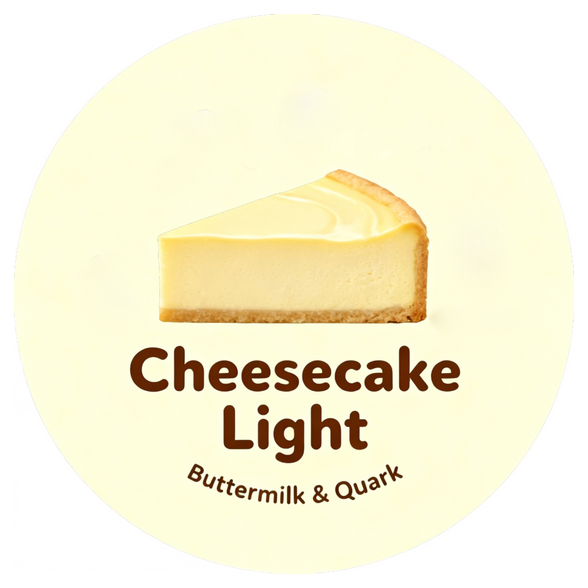
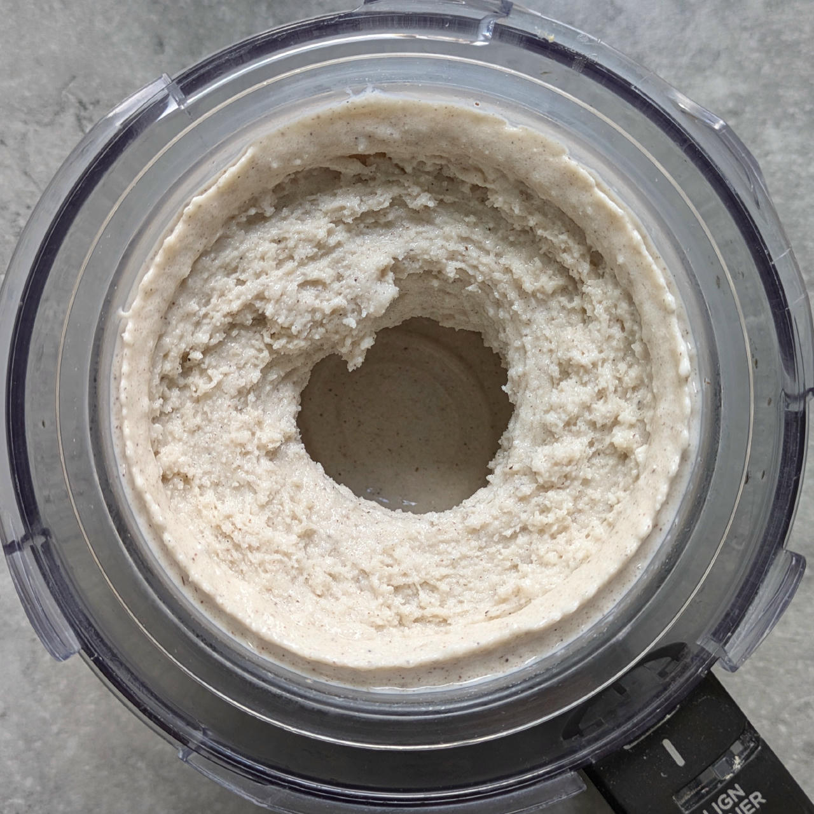
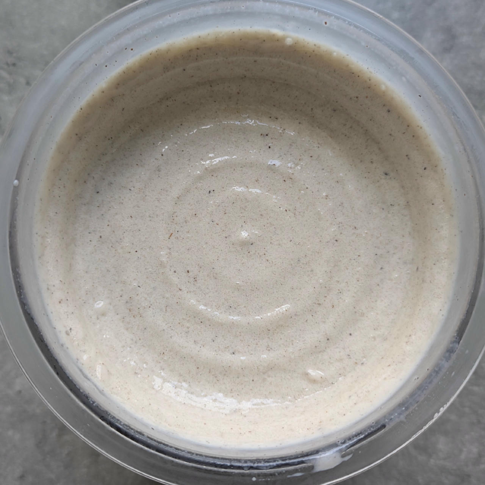
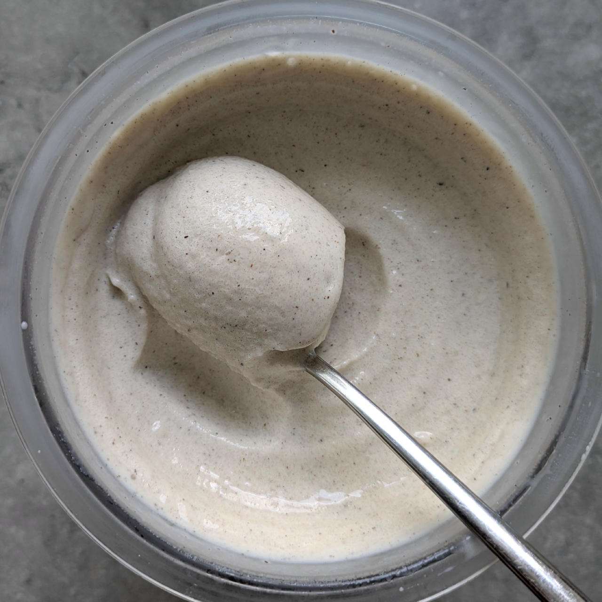

# Cheesecake Light (Deluxe)

Inspired by German cheesecake, which is made with ‘Quark’ or ‘Topfen’
– think of a cross between yogurt, cottage cheese and ricotta.

The buttermilk adds the necessary tanginess.

Spin on *Light Ice Cream*, do a scrape-down, and finish with a mix-in or respin run.

Serve with graham crackers or butter cookies to stand in for the pie crust.

> 
> 
> 

Rating: 😋😋😋😋😋

# INGREDIENTS

ℹ️ Brand names are in square brackets `[...]`.

**Wet**

  - _375ml_ Buttermilk 1% [REWE] (≈1 cup + 4 fl oz + 1 tbsp) <a id="id-6724d7f" href="https://jhermann.github.io/ice-creamery/info/nutrition/#id-6724d7f">ℹ️</a>
  - _200g_ [Topfen / Quark 0.6% \[Berchtesgadener\]](/ice-creamery/info/ingredients/#quark-topfen){target="_blank"}↗ (≈7 oz) • 250g container; *US alternative:* low-fat cream cheese <a id="id-41dd07b" href="https://jhermann.github.io/ice-creamery/info/nutrition/#id-41dd07b">ℹ️</a>
  - _15g_ [Glycerin (E422, VG) \[hd-line\]](/ice-creamery/info/ingredients/#vegetable-glycerin-glycerol-vg-e422){target="_blank"}↗ (≈1 tbsp) • POD = 60%; GI = 5; Density = 1.26 g/ml <a id="id-8717e6d" href="https://jhermann.github.io/ice-creamery/info/nutrition/#id-8717e6d">ℹ️</a>
  - _10g_ [Brandy or Vodka 40 vol%](/ice-creamery/info/ingredients/#alcohol-ethanol){target="_blank"}↗ (≈2 tsp) • *alternative:* 8g (additional) VG for a sober recipe <a id="id-63b8bf1" href="https://jhermann.github.io/ice-creamery/info/nutrition/#id-63b8bf1">ℹ️</a>

**Dry**

  - _40g_ [SweEX (Erythritol + Xylitol 3:2)](/ice-creamery/info/ingredients/#sweex-erythritol-xylitol-blend){target="_blank"}↗ (≈1 oz + 2 ¼ tsp) • *alternative:* 53g allulose or dextrose <a id="id-f44b101" href="https://jhermann.github.io/ice-creamery/info/nutrition/#id-f44b101">ℹ️</a>
  - _20g_ [Inulin \[Vit4ever\]](/ice-creamery/info/ingredients/#inulin){target="_blank"}↗ (≈1 tbsp + 1 tsp) • Sweetness = 8%; GI ~= 0 <a id="id-d8bc1db" href="https://jhermann.github.io/ice-creamery/info/nutrition/#id-d8bc1db">ℹ️</a>
  - _15g_ [Salty Stability \[Inulin / GMS / CMC / Guar / XG / Salt\]](/ice-creamery/S/Salty%20Stability/){target="_blank"}↗ (≈1 tbsp) • *not-as-good substitute:* 1.5g guar, 0.5g xanthan, and 0.5g salt <a id="id-3d1ecef" href="https://jhermann.github.io/ice-creamery/info/nutrition/#id-3d1ecef">ℹ️</a>
  - _10g_ [Whey + Casein protein (grass-fed) \[Vilgain\]](/ice-creamery/info/ingredients/#whey-protein){target="_blank"}↗ (≈2 tsp) • with stevia <a id="id-b954be3" href="https://jhermann.github.io/ice-creamery/info/nutrition/#id-b954be3">ℹ️</a>
  - _2g_ Vanilla Bean Powder [InterVanilla] (≈½ tsp) <a id="id-538e9f6" href="https://jhermann.github.io/ice-creamery/info/nutrition/#id-538e9f6">ℹ️</a>

**Fill to MAX**

  - _≈3 drops_ Flavor drops Vanilla (sucralose) [IronMaxx] • to taste
  - _≈10 drops_ Flavor drops Cookies&Cream (stevia) [Nick’s] • to taste

**Mix-ins**

  - _50g_ Frozen Fruit (≈1 oz + 1 tbsp + 1 ½ tsp) • add chopped as a mix-in [31kcal, 5g sugar]
  - _20g_ Sultanas (organic) [Biojoy] (≈1 tbsp + 1 tsp) • add chopped as a mix-in [60kcal, 13g sugar] <a id="id-7421325" href="https://jhermann.github.io/ice-creamery/info/nutrition/#id-7421325">ℹ️</a>

**Topping Options**

  - _3-4 pieces_ Graham crackers / Butter cookies
  - _3-4 pieces_ Wafers (cream-filled)
  - _20ml_ [Syrup Caramel (low-sugar) \[Sukrin\]](/ice-creamery/info/ingredients/#invert-sugar){target="_blank"}↗ (≈1 tbsp + 1 tsp) • 14% sorbitol, erythritol, stevia [30kcal, 0.4g sugar] <a id="id-9c54fa0" href="https://jhermann.github.io/ice-creamery/info/nutrition/#id-9c54fa0">ℹ️</a>

# DIRECTIONS

 1. Add "wet" ingredients to empty Creami tub.
 1. Weigh and mix dry ingredients, easiest by adding to a jar with a secure lid and shaking vigorously.
 1. Pour into the tub and *QUICKLY* use an immersion blender on full speed to homogenize everything.
 1. Let blender run until thickeners are properly hydrated, up to 1-2 min. Or blend again after waiting that time.
 1. Add remaining ingredients (to the MAX line) and stir with a spoon.
 1. For better results, let the base age in the fridge (covered, lid on), for a few hours or over night. This helps flavor development and gum hydration, especially with unheated bases.
 1. Freeze for 24h with lid on, then spin as usual. Flatten any humps before that.
 1. Process with RE-SPIN mode when not creamy enough after the first spin.
 1. Process with MIX-IN after adding mix-ins evenly. For that, add partial amounts into a hole going down to the bottom, and fold the ice cream over, building pockets of mix-ins.

# NUTRITIONAL & OTHER INFO

| 🥗 Value | 100g | Serving | Total |
| :--- | ---: | ---: | ---: |
| ⚖️ Weight (g) | 100 | 340 | 687 |
| 🔥 Energy (kcal) | 77.1 | 262.0 | 529.4 |
| 🫒 Fat (g) | 0.6 | 2.0 | 4.1 |
| 🍞 Carbohydrates (g) | 16.1 | 54.7 | 110.5 |
| 🍬 Sugars (g) | 3.7 | 12.6 | 25.5 |
| 💪 Protein (g) | 6.5 | 22.3 | 45.0 |
| 🧂 Salt (g) | 0.2 | 0.7 | 1.3 |

- **FPDF / [PAC](/ice-creamery/info/glossary/#potere-anti-congelante-pac){target="_blank"}↗ (target 20..30):** 32.14
- **Protein / Energy Ratio (ok=12%; hi=20%):** 33.98% • LOW-FAT • Low-Sugar • Hi-Protein
- **Milk Solids Non-Fat ([MSNF](/ice-creamery/info/glossary/#milk-solids-not-fat-msnf){target="_blank"}↗, 7-11%):** 63.7g • 9.3%
- **Net carbs:** 34.2g • *∝ 5 servings@137g:* 6.8g • *∝ 3 servings@229g:* 11.4g • *energy ratio (low <20%):* 25.8%
- **15g 'Salty Stability' is:** 11.0g Inulin • 1.8g Glycerol Monostearate (GMS / E471) • 0.9g Tylose powder (E466, Tylo, CMC) • 0.6g Guar gum (E412) • 0.5g Salt • 0.2g Xanthan gum (E415, XG).
