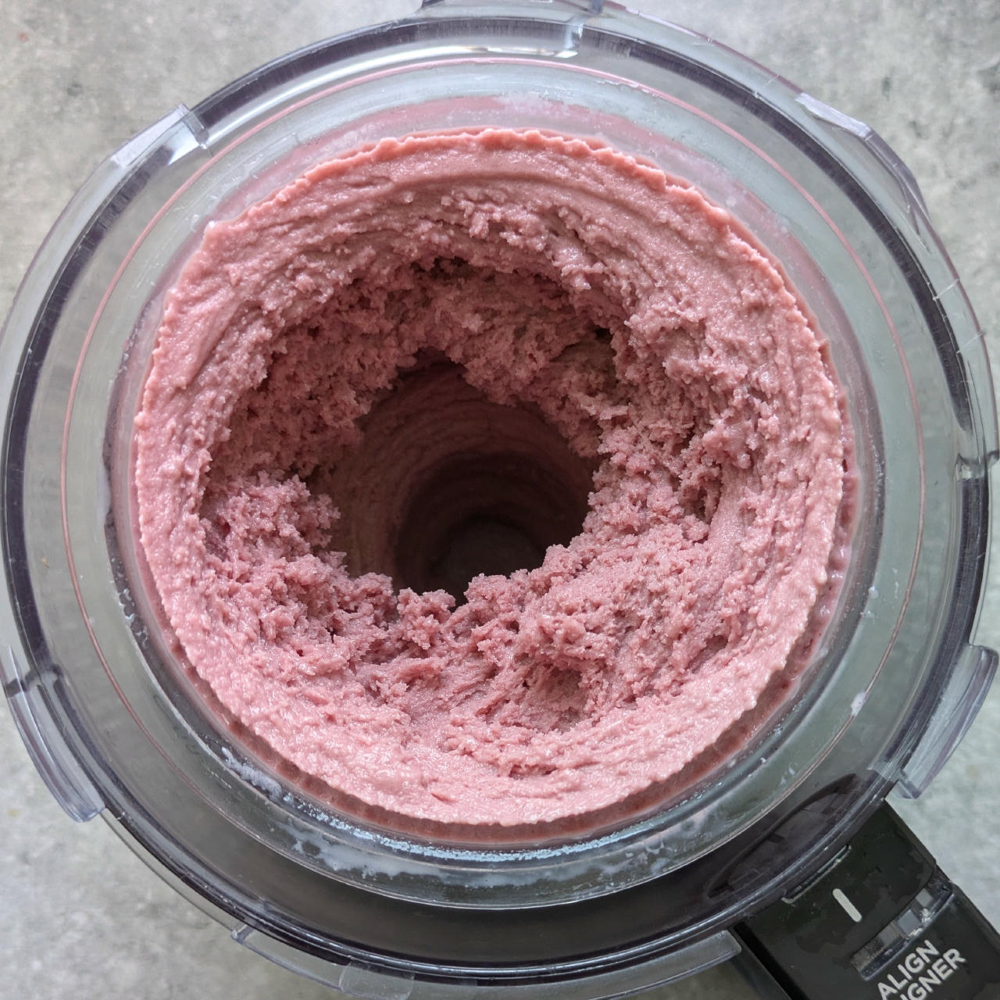
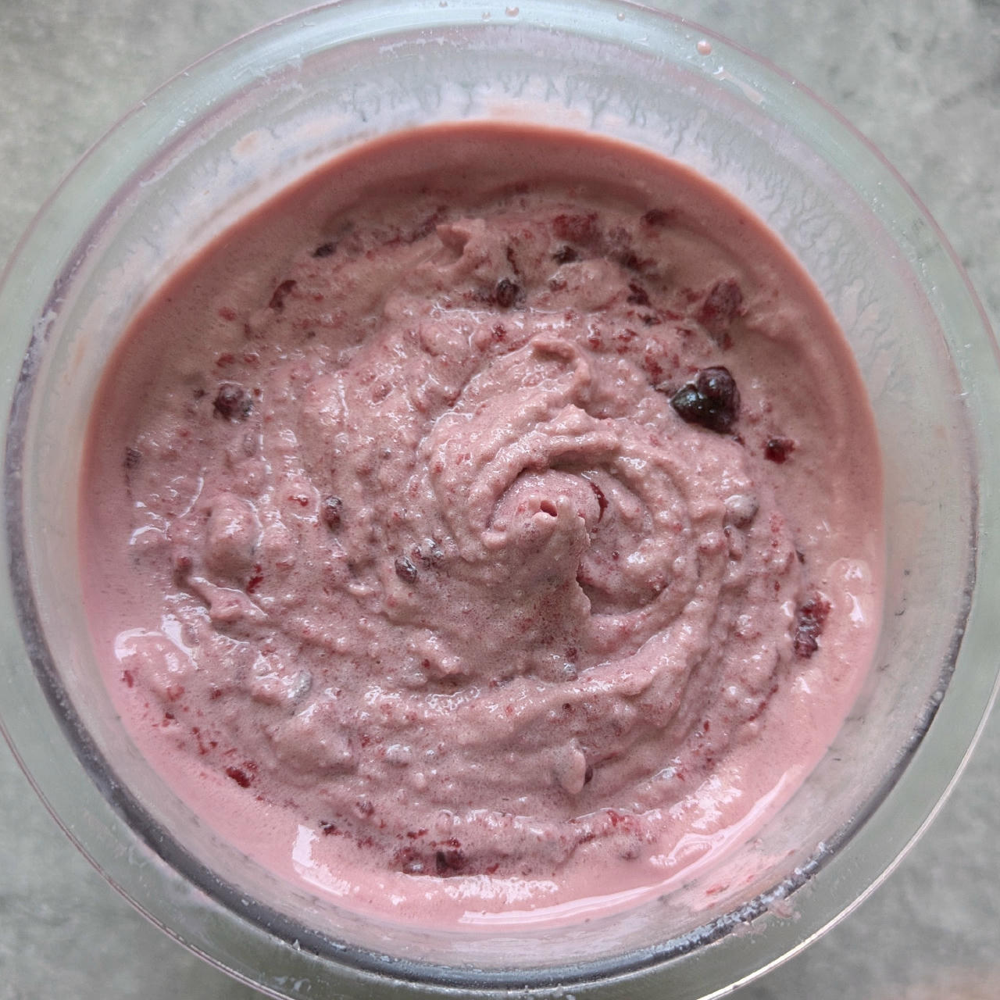
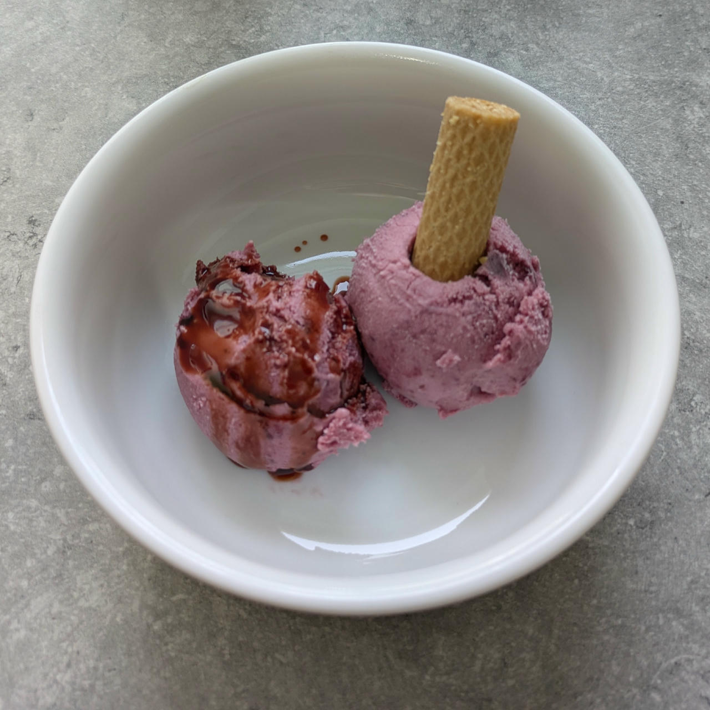

# Cherry Ice Cream (Deluxe)

🍒 Light, Creamy & Balanced

This recipe uses soy milk, cream cheese, and a mix of natural sweeteners and stabilizers to make an ice cream that is smooth, scoopable, and lower in sugar.
A splash of brandy or vodka helps with texture, and a dash of beet root powder deepens the red color.

> 🌿 **Vegan Option** Replace the cream cheese with 50g tofu and 10ml water, blended to a creamy paste. Swap the milk protein for soy protein isolate.

You can replace the cherries by other fruit, see *Optional / Choices* for some ideas. Blends are also possible.

> 

Rating: 😋😋🍒🍒🍒

> 
> 
> 
> 

Process on “Light Ice Cream”, add 1+1 tsp fruit spread in the center hole, followed by a mix-in run.
Then make a deep and a medium hole, fill each with 1 tsp spread,
finally bury 1 tsp on top in a shallow cavity — all these are placed on the corners of an imaginary triangle.
Then carefully fold all with a chopstick, *do not overmix*.



# INGREDIENTS

ℹ️ Brand names are in square brackets `[...]`.

**Wet**

  - _300ml_ [Soy milk 1.6% (sugar-free) \[Berief\]](/ice-creamery/info/ingredients/#soy-milk){target="_blank"}↗ • *alternative:* any other preferred milk (~2% fat)
  - _150g_ Cherries • frozen or fresh, pitted
  - _50g_ [Cream Cheese 23% \[Exquisa\]](/ice-creamery/info/ingredients/#cream-cheese){target="_blank"}↗ • click the link for UK / US equivalents
  - _20g_ [Glycerin (E422, VG) \[hd-line\]](/ice-creamery/info/ingredients/#vegetable-glycerin-glycerol-vg-e422){target="_blank"}↗ • POD = 60%; GI = 5; Density = 1.26 g/ml
  - _10g_ [Brandy or Vodka 40 vol%](/ice-creamery/info/ingredients/#alcohol-ethanol){target="_blank"}↗ • *alternative:* 8g (additional) VG for a sober recipe

**Dry**

  - _33g_ [SweEX (Erythritol + Xylitol 3:2)](/ice-creamery/info/ingredients/#sweex-erythritol-xylitol-blend){target="_blank"}↗ • *alternative:* 44g allulose or dextrose
  - _10g_ [Salty Stability \[Inulin / GMS / CMC / Guar / XG / Salt\]](/ice-creamery/S/Salty%20Stability/){target="_blank"}↗ • *not-as-good substitute:* 1g guar, 0.3g xanthan, and 0.3g salt
  - _10g_ [Whey + Casein protein (grass-fed) \[Vilgain\]](/ice-creamery/info/ingredients/#whey-protein){target="_blank"}↗ • optional, for texture; with stevia
  - _2g_ Beet Root Powder (organic) [Mandoi] • optional, for color

**Fill to MAX**

  - _95ml_ [Soy milk 1.6% (sugar-free) \[Berief\]](/ice-creamery/info/ingredients/#soy-milk){target="_blank"}↗ • *alternative*: any other preferred milk (~2% fat)
  - _≈3 drops_ Flavor drops Vanilla (sucralose) [IronMaxx] • to taste

**Mix-ins**

  - _30g_ Schwartau “Black Cherry” (Extra Zero) • *optional:* fruit spread, no added sugar; add as a mix-in or topping [18kcal, 2.1g sugar]

**Optional / Choices**

  - _225g_ Strawberries • fresh or frozen [70kcal, 13g sugar]
  - _175g_ Blueberries • fresh or frozen [84kcal, 16g sugar]
  - _150g_ Cherries • fresh or frozen [92kcal, 14g sugar]
  - _150g_ Mango • fresh or frozen [93kcal, 20g sugar]
  - _140g_ Pineapple (without the juice) [REWE] • canned [97kcal, 21g sugar]

# DIRECTIONS

 1. Add "wet" ingredients to empty Creami tub.
 1. Weigh and mix dry ingredients, easiest by adding to a jar with a secure lid and shaking vigorously.
 1. Pour into the tub and *QUICKLY* use an immersion blender on full speed to homogenize everything.
 1. Let blender run until thickeners are properly hydrated, up to 1-2 min. Or blend again after waiting that time.
 1. Add remaining ingredients (to the MAX line) and stir with a spoon.
 1. Put on the lid, freeze for 24h, then spin as usual. Flatten any humps before that.
 1. Process with RE-SPIN mode when not creamy enough after the first spin.
 1. Process with MIX-IN after adding mix-ins evenly. For that, add partial amounts into a hole going down to the bottom, and fold the ice cream over, building pockets of mix-ins.

# NUTRITIONAL & OTHER INFO

- **Nutritional values per 100g/ml:** 100g; 80.2 kcal; fat 2.7g; carbs 13.1g; sugar 2.6g; protein 3.6g; salt 0.2g
- **Nutritional values per ½ Deluxe Tub:** 340g; 272.6 kcal; fat 9.3g; carbs 44.5g; sugar 9.0g; protein 12.1g; salt 0.5g
- **Nutritional values total:** 680g; 545.3 kcal; fat 18.6g; carbs 89.1g; sugar 18.0g; protein 24.3g; salt 1.1g
- **FPDF / [PAC](/ice-creamery/info/glossary/#potere-anti-congelante-pac){target="_blank"}↗ (target 20..30):** 31.09
- **Protein / Energy Ratio (ok=12%; hi=20%):** 17.80% • LOW-FAT • Low-Sugar
- **Milk Solids Non-Fat ([MSNF](/ice-creamery/info/glossary/#milk-solids-not-fat-msnf){target="_blank"}↗, 7-11%):** 29.7g • 4.4%
- **Net carbs:** 38.7g • *∝ 5 servings@136g:* 7.7g • *∝ 3 servings@227g:* 12.9g • *energy ratio (low <20%):* 28.4%
- **Jun 21, 2025:** Switched to soy milk and protein
- **Aug 12, 2025:** Using new blends and casein/whey
- **10g 'Salty Stability' is:** 7.3g Inulin • 1.2g Glycerol Monostearate (GMS / E471) • 0.6g Tylose powder (E466, Tylo, CMC) • 0.4g Guar gum (E412) • 0.33g Salt • 0.13g Xanthan gum (E415, XG).
