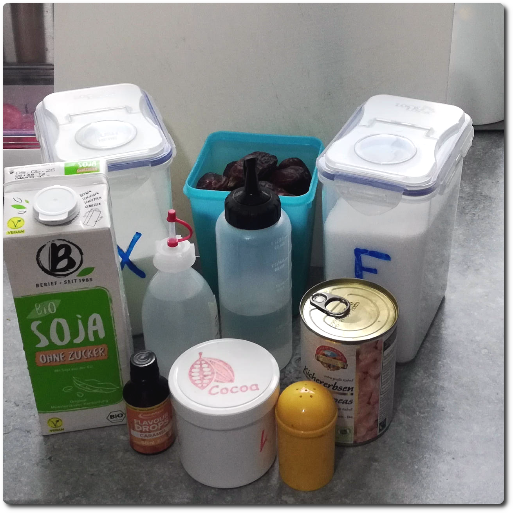

# Chico Caramel • Vegan (Deluxe)

> 🌿 **Vegan & Dairy-free** Recipe is using only soy milk and protein isolate.

Not the lowest in calories, but rich in chocolate+caramel flavor and high in protein.

> 

Process on Lite Ice Cream.

> 

Rating: 😋🍫 (untested)

**Topping & mix-in options**

 * Walnuts (crumbled) or [other nuts](../../T/Toppings/#chopped-nuts) (chopped)

# INGREDIENTS

ℹ️ Brand names are in square brackets `[...]`.

**Prep**

  - _150ml_ Water (boiling)
  - _40g_ Cocoa Powder Organic 11% [Sevenhills]

**Wet**

  - _60g_ Chickpeas (organic) • can:  258/400g
  - _40ml_ Aquafaba (chickpea liquid)
  - _40g_ Medjool dates (pitted, organic) [Seba Garden] • 2 dates • distinctive caramel taste with hints of vanilla
  - _200ml_ [Soy milk 1.6% (sugar-free) \[Berief\]](/ice-creamery/info/ingredients/#soy-milk){target="_blank"}↗
  - _15g_ [Glycerin (E422, VG) \[hd-line\]](/ice-creamery/info/ingredients/#vegetable-glycerin-glycerol-vg-e422){target="_blank"}↗ • POD = 60%; GI = 5; Density = 1.26 g/ml
  - _10g_ [Brandy “Williams Birne” 40 vol%](/ice-creamery/info/ingredients/#alcohol-ethanol){target="_blank"}↗
  - _7 drops_ Flavor drops Caramel (sucralose) [IronMaxx] • to taste

**Dry**

  - _20g_ [Soy protein isolate (nature) \[Powerstar\]](/ice-creamery/info/ingredients/#soy-protein-isolate){target="_blank"}↗ • 1kg bag, unsweetened, unflavored
  - _20g_ [Erythritol (E968)](/ice-creamery/info/ingredients/#erythritol-e968){target="_blank"}↗ • POD = 75%
  - _10g_ [Xylitol](/ice-creamery/info/ingredients/#xylitol-e967){target="_blank"}↗ • POD = 100%; GI = 7
  - _2g_ Salt

**Fill to MAX**

  - _113ml_ [Soy milk 1.6% (sugar-free) \[Berief\]](/ice-creamery/info/ingredients/#soy-milk){target="_blank"}↗ • fill to MAX line

# DIRECTIONS

 1. Mix the boiling water with the cocoa powder to bloom it, then let it cool down.
 1. Cut the dates into halves by their long side, and make sure they’re pitted and not spoiled.
 1. In an empty Creami tub, blend the chickpeas, aquafaba, and dates first, to a smooth paste.
 1. Then add the other ‘wet’ ingredients and the cocoa.
 1. Weigh and mix dry ingredients, easiest by adding to a jar with a secure lid and shaking vigorously.
 1. Pour into the tub and *QUICKLY* use an immersion blender on full speed to homogenize everything.
 1. Add remaining ingredients (to the MAX line) and stir with a spoon.
 1. Put on the lid, freeze for 24h, then spin as usual. Flatten any humps before that.
 1. Process with RE-SPIN mode when not creamy enough after the first spin.

# NUTRITIONAL & OTHER INFO
- **Nutritional values per 100g/ml:** 100g; 112.0 kcal; fat 1.4g; carbs 13.8g; sugar 3.8g; protein 6.0g; salt 0.4g
- **Nutritional values per ½ Deluxe Tub:** 360g; 403.3 kcal; fat 5.0g; carbs 49.5g; sugar 13.8g; protein 21.6g; salt 1.6g
- **Nutritional values total:** 720g; 806.5 kcal; fat 10.1g; carbs 99.0g; sugar 27.6g; protein 43.2g; salt 3.1g
- **FPDF / [PAC](/ice-creamery/info/glossary/#potere-anti-congelante-pac){target="_blank"}↗ (target 20..30):** 30.53
- **Protein / Energy Ratio (ok=12%; hi=20%):** 21.43% • LOW-FAT • Low-Sugar • Hi-Protein
- **Milk Solids Non-Fat ([MSNF](/ice-creamery/info/glossary/#milk-solids-not-fat-msnf){target="_blank"}↗, 7-11%):** 18.6g • 2.6%
