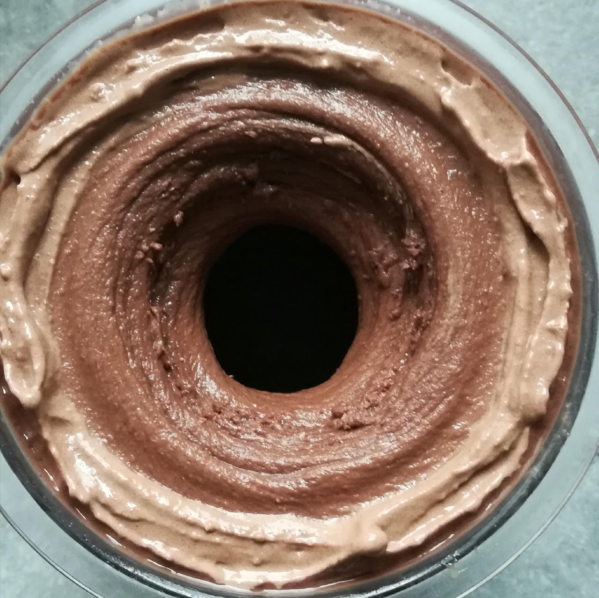

# Chocolate Caramel (Deluxe)

FroYo spin; very dense; a few small ice crystals. Taste of the cocoa and caramel combo is great.

> 

Might add some almond butter next time, or replace the yogurt with cream cheese.

# INGREDIENTS

ℹ️ Brand names are in square brackets `[...]`.

**Prep**

  - _100ml_ Water (boiling)
  - _30g_ Cocoa Powder 21% [Bensdorp Premium]

**Wet**

  - _300ml_ Skim Milk 1.5% [Weihenstephan]
  - _150g_ Greek Yogurt 9% [Lyttos]
  - _15g_ Glycerin (E422, VG) [hd-line] • Sweetness = 60%; GI = 5
  - _5 drops_ Caramel flavor drops [IronMaxx]
  - _5ml_ Vanilla Extract (w/ alcohol) [Native Vanilla]

**Dry**

  - _25g_ Xylitol • Sweetness = 100%; GI = 7
  - _25g_ Whey protein Caramel [MaxiNutrition]
  - _30g_ ICSv2 [Erythritol / CMC / Tara / XG / Inulin] • [http﹕//bit.ly/4frc4Vj](https://github.com/jhermann/ice-creamery/tree/main/recipes/Ice%20Cream%20Stabilizer%20%28ICS%29)

**Fill to MAX**

  - _40ml_ Water to MAX line

# DIRECTIONS

 1. Prepare specified ingredients by dissolving / hydrating in hot water.
 1. Add "wet" ingredients to empty Creami tub.
 1. Weigh and mix dry ingredients, easiest by adding to a jar with a secure lid and shaking vigorously.
 1. Pour into the tub and *QUICKLY* use an immersion blender on full speed to homogenize everything.
 1. Let blender run until thickeners are properly hydrated, up to 1-2 min. Or blend again after waiting that time.
 1. Add remaining ingredients (to the MAX line) and stir with a spoon.
 1. Put on the lid, freeze for 24h, then spin as usual. Flatten any humps before that.
 1. Process with RE-SPIN mode when not creamy enough after the first spin.

# NUTRITIONAL & OTHER INFO
- **Nutritional values per 100g/ml:** 100g; 95.1 kcal; fat 3.6g; carbs 11.2g; sugar 3.2g; protein 5.7g; salt 0.2g
- **Nutritional values per ½ Deluxe Tub:** 360g; 342.5 kcal; fat 13.0g; carbs 40.4g; sugar 11.5g; protein 20.4g; salt 0.6g
- **Nutritional values total:** 720g; 685.0 kcal; fat 26.1g; carbs 80.9g; sugar 23.0g; protein 40.8g; salt 1.2g
- **FPDF / PAC (target 20..30):** 26.40
- **Protein / Energy Ratio (ok=12%; hi=20%):** 23.84% • Low-Sugar • Hi-Protein
- **30g Ice Cream Stabilizer (ICSv2) is:** 14.3g erythritol, 1.43g Tylose powder (CMC, E466), 
0.5g tara gum (E417), 0.15g xanthan (E415),
14.3g inulin, 0.5g salt.
