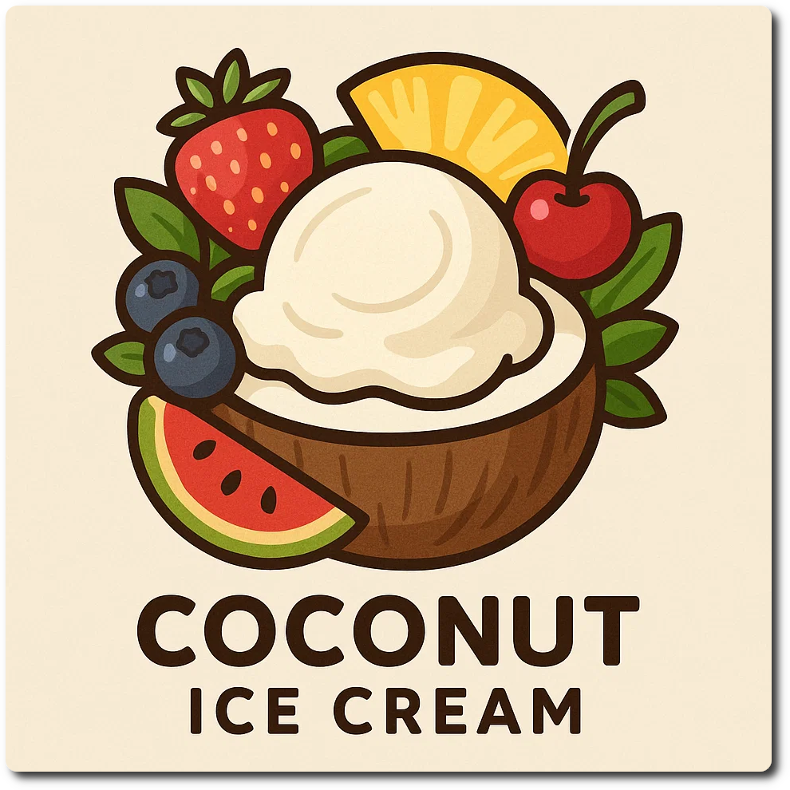
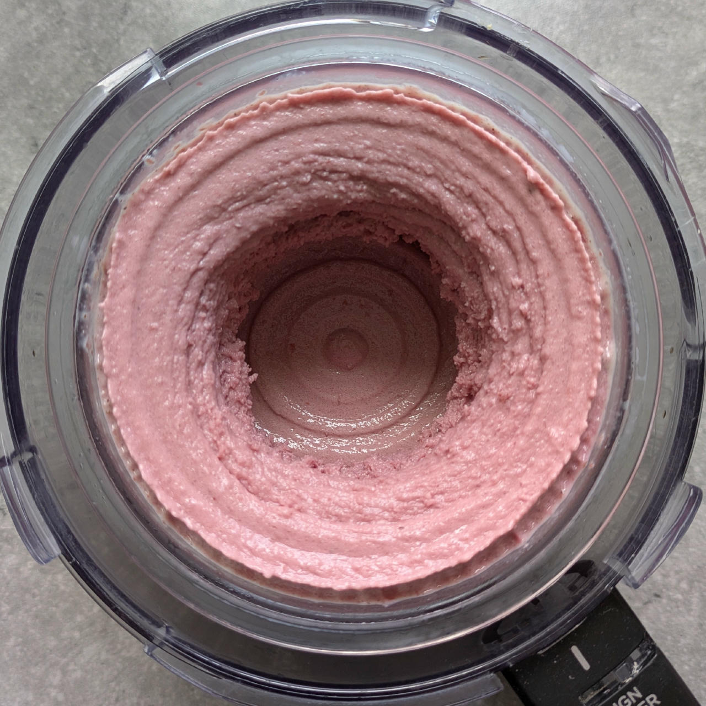
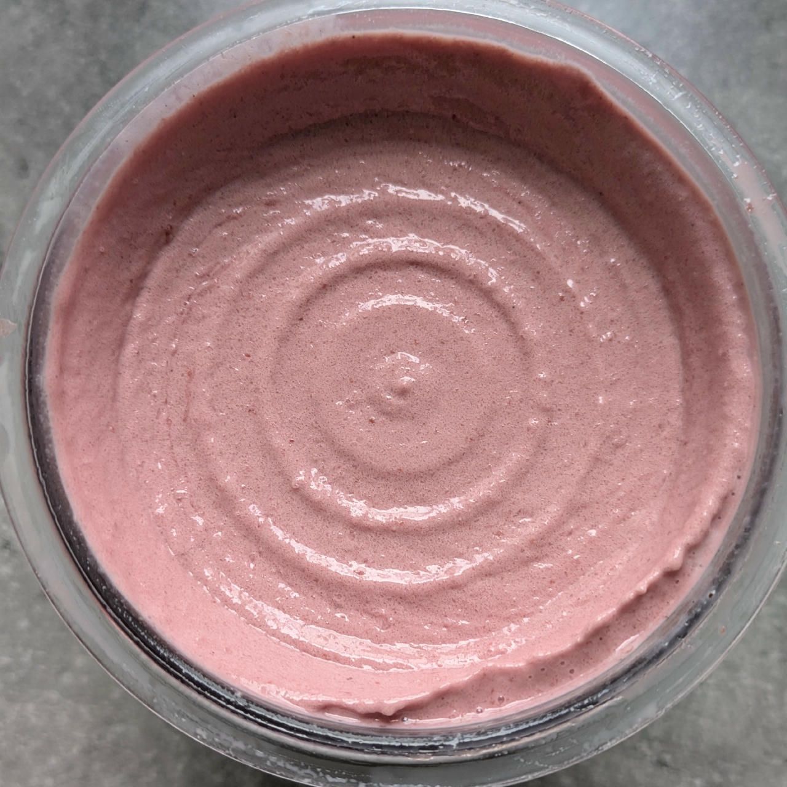
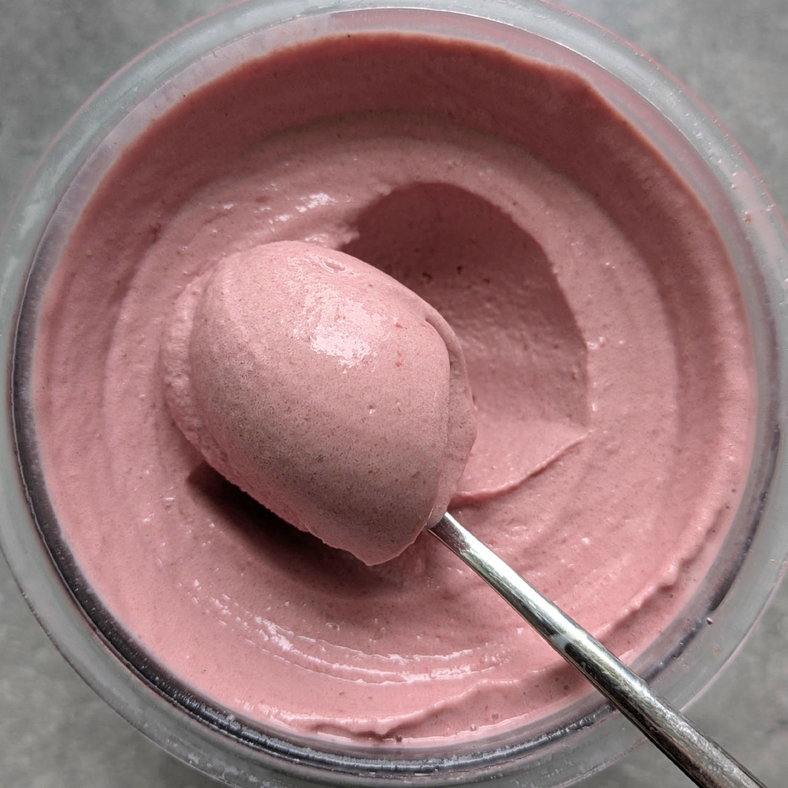

# Cocofruit (Deluxe)

Cocofruit is a flavorful ice cream with tropical vibes.

Made with coconut milk, soy milk, assorted fruits, and a protein boost from whey and casein,
it’s perfect for sunny days, snack attacks, or anytime you crave something cool and seriously satisfying.

You can vary by using different fruit, possibly mixing them, see below for inspirations.

> 
> 
> 
> *Banana and strawberry versions.*

Process on *Light Ice Cream*, do a scrape-down, and MIX-IN or RESPIN (choose depending on consistency you get after processing, and eventually want after 2nd spin).

> 
> 
> 
> 
> Rating: 😋🍓🍌🫐🥥 (Cherry / 2g Beet root; Light Ice Cream + Respin, very soft, no ice crystals)

# INGREDIENTS

ℹ️ Brand names are in square brackets `[...]`.

**Prep**

  - _175g_ Cherries • fresh or frozen [107kcal, 17g sugar]

**Wet**

  - _350ml_ [Soy milk 1.6% (sugar-free) \[Berief\]](/ice-creamery/info/ingredients/#soy-milk){target="_blank"}↗ • use any other preferred milk (~2% fat)
  - _20g_ [Glycerin (E422, VG) \[hd-line\]](/ice-creamery/info/ingredients/#vegetable-glycerin-glycerol-vg-e422){target="_blank"}↗ • Sweetness = 60%; GI = 5; Density = 1.26 g/ml
  - _10g_ [Brandy or Vodka 40 vol%](/ice-creamery/info/ingredients/#alcohol-ethanol){target="_blank"}↗ • *alternative:* 8g (additional) VG for a sober recipe

**Dry**

  - _65g_ [Coconut Milk Powder 54% \[Green Essence\]](/ice-creamery/info/ingredients/#coconut-milk){target="_blank"}↗ • *alternative:* 175ml coconut milk 22%, 100ml less soy milk
  - _30g_ [SweEX (Erythritol + Xylitol 3:2)](/ice-creamery/info/ingredients/#sweex-erythritol-xylitol-blend){target="_blank"}↗ • *alternative:* 40g allulose or dextrose
  - _15g_ [Salty Stability \[Inulin / GMS / CMC / Guar / XG / Salt\]](/ice-creamery/S/Salty%20Stability/){target="_blank"}↗ • *not-as-good substitute:* 1.5g guar, 0.5g xanthan, and 0.5g salt
  - _15g_ [Whey + Casein protein (grass-fed) \[Vilgain\]](/ice-creamery/info/ingredients/#whey-protein){target="_blank"}↗ • with stevia

**Fill to MAX**

  - _≈7 drops_ Flavor drops Vanilla (sucralose) [IronMaxx] • to taste

**Optional / Choices**

  - _150g_ Bananas (peeled) • peeled [162kcal, 24g sugar]
  - _175g_ Blueberries • fresh or frozen [84kcal, 16g sugar]
  - _175g_ Cherries • fresh or frozen [107kcal, 17g sugar]
  - _175g_ Kiwi • fresh [91kcal, 15g sugar]
  - _175g_ Mango • fresh or frozen [109kcal, 23g sugar]
  - _150g_ Pineapple in juice [Del Monte] • canned [102kcal, 23g sugar]
  - _175g_ Strawberries • fresh or frozen [54kcal, 10g sugar]

# DIRECTIONS

 1. Put the fruit into an empty Creami tub, and let it defrost a bit when frozen. Blend bananas with a bit of lemon juice.
 1. Heat the ‘wet’ ingredients to about 60°C, and whisk in the dry ones that you blended together beforehand.
 1. Pour into the Creami tub and blend together with the fruit to a smooth consistency.
 1. Add remaining ingredients (to the MAX line) and stir with a spoon.
 1. Put on the lid, freeze for 24h, then spin as usual. Flatten any humps before that.
 1. Process with RE-SPIN mode when not creamy enough after the first spin.

# NUTRITIONAL & OTHER INFO

- **Nutritional values per 100g/ml:** 100g; 127.4 kcal; fat 6.3g; carbs 17.2g; sugar 2.8g; protein 4.1g; salt 0.1g
- **Nutritional values per ½ Deluxe Tub:** 340g; 433.2 kcal; fat 21.4g; carbs 58.5g; sugar 9.7g; protein 14.1g; salt 0.5g
- **Nutritional values total:** 680g; 866.4 kcal; fat 42.8g; carbs 117.0g; sugar 19.3g; protein 28.2g; salt 1.0g
- **FPDF / [PAC](/ice-creamery/info/glossary/#potere-anti-congelante-pac){target="_blank"}↗ (target 20..30):** 30.08
- **Protein / Energy Ratio (ok=12%; hi=20%):** 13.01% • Low-Sugar
- **Milk Solids Non-Fat ([MSNF](/ice-creamery/info/glossary/#milk-solids-not-fat-msnf){target="_blank"}↗, 7-11%):** 57.8g • 8.5%
- **Net carbs:** 66.0g • *∝ 5 servings@136g:* 13.2g • *∝ 3 servings@227g:* 22g • *energy ratio (low <20%):* 30.5%
- **15g 'Salty Stability' is:** 11.0g Inulin • 1.8g Glycerol Monostearate (GMS / E471) • 0.9g Tylose powder (E466, Tylo, CMC) • 0.6g Guar gum (E412) • 0.5g Salt • 0.2g Xanthan gum (E415, XG).
