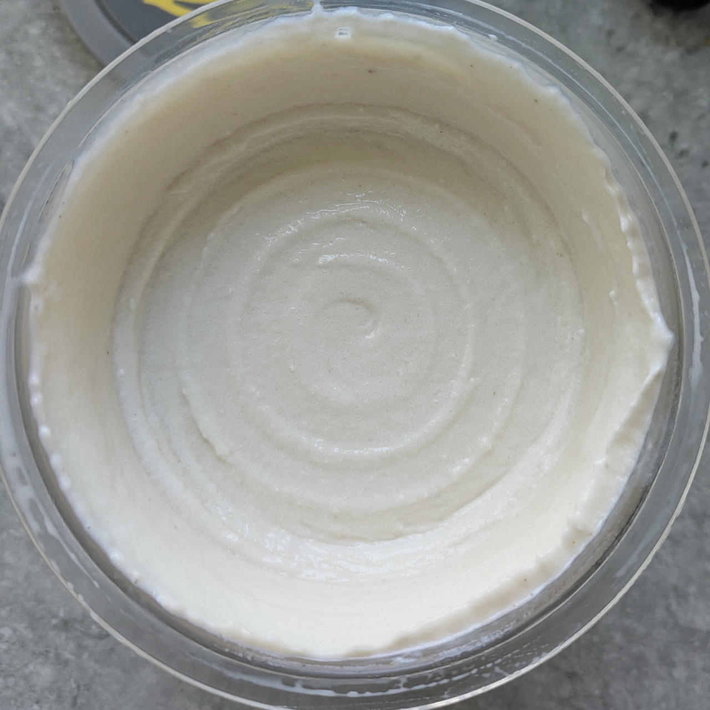
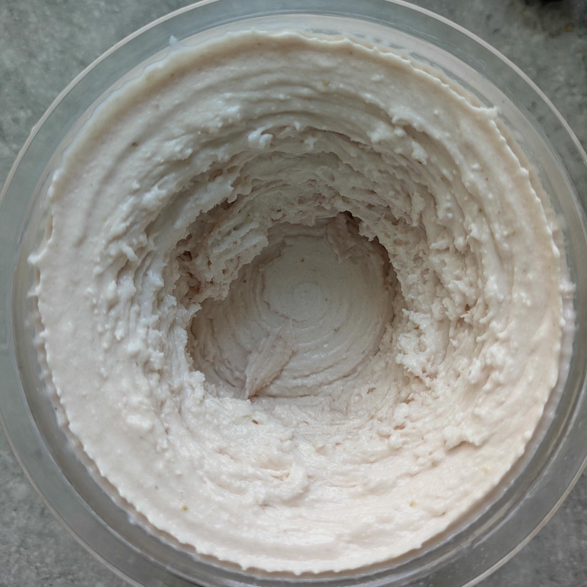

# Cocofruit (Deluxe)

Process on SORBET and MIX-IN or RE-SPIN (choose depending on consistency you get after processing, and eventually want after 2nd spin).

> 

Rating: 😋🍌🥥🥥

You can vary by replacing SMP → whey, and replace the banana by other fruit, e.g. strawberries.
Both variants were good, I liked the whey/strawberry one a little better.

> 

Rating: 😋🍓🥥🍓🥥

# INGREDIENTS

ℹ️ Brand names are in square brackets `[...]`.

**Wet**

  - _250ml_ Skim Milk 1.5% [Weihenstephan]
  - _125g_ Bananas (peeled)
  - _100ml_ Coconut milk 22% [REWE Bio]
  - _100g_ Cottage Cheese 4% [REWE Bio]
  - _15g_ Glycerin (E422, VG) [hd-line] • POD = 60%; GI = 5; Density = 1.26 g/ml
  - _10g_ Brandy “Williams Birne” 40 vol%
  - _7 drops_ Flavor drops Vanilla [IronMaxx] • with sucralose

**Dry**

  - _30g_ Xylitol • POD = 100%; GI = 7
  - _20g_ ICSv2 [Erythritol / CMC / Tara / XG / Inulin] • [http﹕//bit.ly/4frc4Vj](https://github.com/jhermann/ice-creamery/tree/main/recipes/Ice%20Cream%20Stabilizer%20%28ICS%29)
  - _20g_ Skim Milkpowder 1:10 [Vita2You]

**Fill to MAX**

  - _50ml_ Water to MAX line

# DIRECTIONS

 1. Add "wet" ingredients to empty Creami tub.
 1. Add the prepared dry ingredients, and blend QUICKLY using an immersion blender on full speed.
 1. Weigh and mix dry ingredients, easiest by adding to a jar with a secure lid and shaking vigorously.
 1. Pour into the tub and *QUICKLY* use an immersion blender on full speed to homogenize everything.
 1. Let blender run until thickeners are properly hydrated, up to 1-2 min. Or blend again after waiting that time.
 1. Add remaining ingredients (to the MAX line) and stir with a spoon.
 1. Put on the lid, freeze for 24h, then spin as usual. Flatten any humps before that.
 1. Process with RE-SPIN mode when not creamy enough after the first spin.

# NUTRITIONAL & OTHER INFO
- **Nutritional values per 100g/ml:** 100g; 113.6 kcal; fat 4.3g; carbs 15.3g; sugar 6.7g; protein 4.4g; salt 0.2g
- **Nutritional values per ½ Deluxe Tub:** 360g; 409.0 kcal; fat 15.3g; carbs 55.0g; sugar 24.0g; protein 16.0g; salt 0.8g
- **Nutritional values total:** 720g; 818.0 kcal; fat 30.7g; carbs 110.0g; sugar 48.1g; protein 32.0g; salt 1.6g
- **FPDF / PAC (target 20..30):** 32.53
- **Protein / Energy Ratio (ok=12%; hi=20%):** 15.65%
- **Milk Solids Non-Fat (MSNF, 7-11%):** 57.7g • 8.0%
- **30g Ice Cream Stabilizer (ICSv2) is:** 14.3g erythritol, 1.43g Tylose powder (CMC, E466), 
0.5g tara gum (E417), 0.15g xanthan (E415),
14.3g inulin, 0.5g salt.
