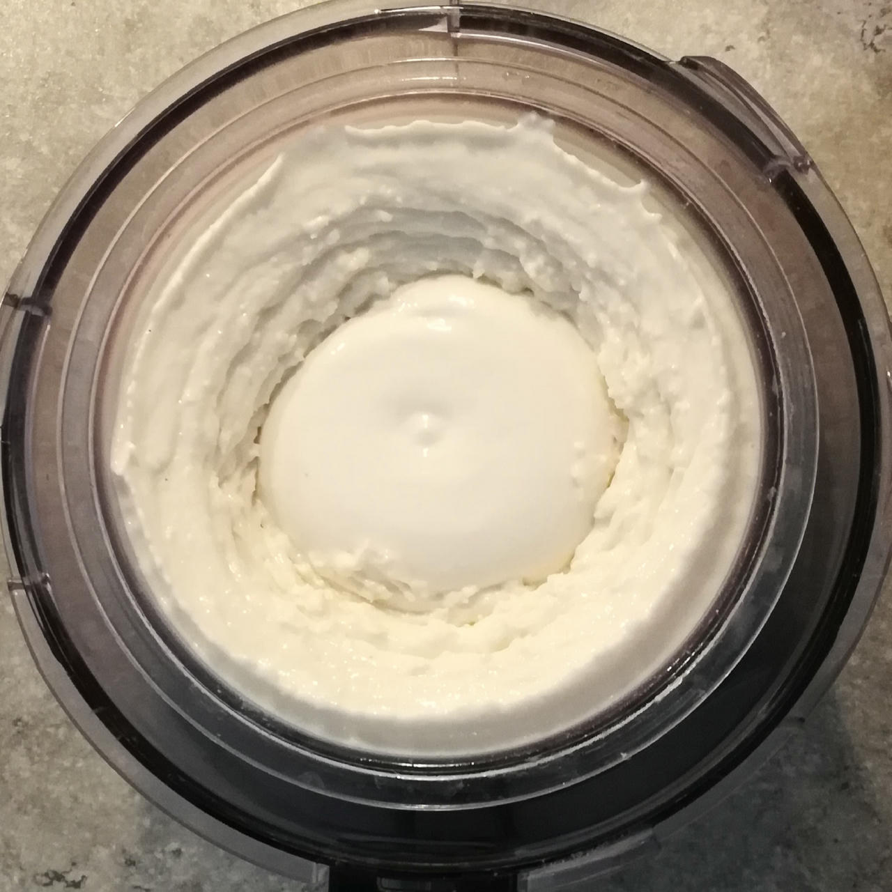
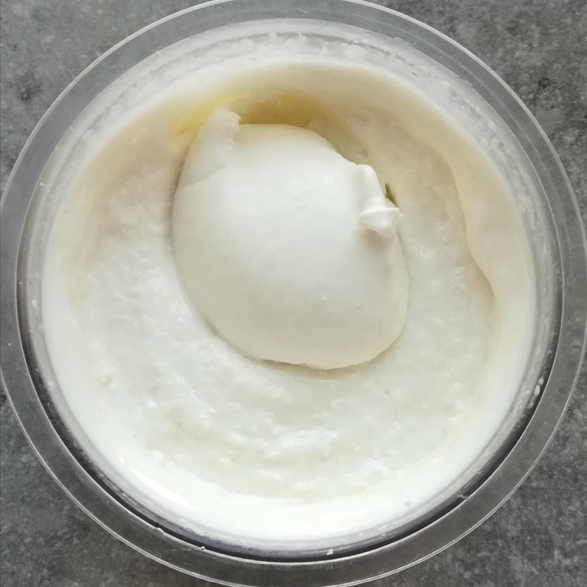

# Coconut (Deluxe)

Coconut is unsurprisingly the dominant flavor.

> 

Process on *Ice Cream*, scrape-down, and then a mix-in or respin as needed.

> 

Rating: 😋🥥  (new formula)

# INGREDIENTS

ℹ️ Brand names are in square brackets `[...]`.

**Prep**

  - _120ml_ Water (~95°C) • *alternative:* 180ml coconut milk 18.5%
  - _60g_ [Coconut Milk Powder 54% \[Green Essence\]](/ice-creamery/info/ingredients/#coconut-milk){target="_blank"}↗
  - _50g_ Coconut flakes (desiccated) [Biojoy]
  - _3g_ [Glycerol Monostearate (E471) \[Bulk\]](/ice-creamery/info/ingredients/#glycerol-monostearate-gms-e471){target="_blank"}↗ • *alternative:* lecithin

**Wet**

  - _350ml_ [Soy milk 1.6% (sugar-free) \[Berief\]](/ice-creamery/info/ingredients/#soy-milk){target="_blank"}↗ • *alternative*: any other preferred milk (~2% fat)
  - _30g_ [Jamaica Rum 43 vol%](/ice-creamery/info/ingredients/#alcohol-ethanol){target="_blank"}↗ • *alternative:* 24g (additional) VG for a sober recipe

**Dry**

  - _35g_ [SweEX (Erythritol + Xylitol 3:2)](/ice-creamery/info/ingredients/#sweex-erythritol-xylitol-blend){target="_blank"}↗ • *alternative:* 47g allulose or dextrose
  - _15g_ [Inulin \[Vit4ever\]](/ice-creamery/info/ingredients/#inulin){target="_blank"}↗ • Sweetness = 8%; GI ~= 0
  - _15g_ [Waxy Maize Starch (E1442) \[Ultratex\]](/ice-creamery/info/ingredients/#waxy-maize-starch-e1442){target="_blank"}↗ • *alternative:* [E1422](https://jhermann.github.io/ice-creamery/info/ingredients/#acetylated-distarch-adipate-e1422), or any instant starch
  - _1g_ Salt

**Adjust sweetness**

  - _≈5 drops_ Flavor drops Vanilla (sucralose) [IronMaxx] • to taste

# DIRECTIONS

 1. For the reconstituted coconut cream, mix the ‘prep’ ingredients (except the water) in a medium-sized bowl.
 1. Add the hot water and whisk until clump-free. Let it cool down a bit.
 1. Mix with the rest of the ‘wet’ ingredients in an empty Creami tub.
 1. Weigh and mix dry ingredients, easiest by adding to a jar with a secure lid and shaking vigorously.
 1. Pour into the tub and *QUICKLY* use an immersion blender on full speed to homogenize everything.
 1. Let blender run until thickeners are properly hydrated, up to 1-2 min. Or blend again after waiting that time.
 1. Add remaining ingredients (to the MAX line) and stir with a spoon.
 1. For better results, let the base age in the fridge (covered, lid on), for a few hours or over night. This helps flavor development and gum hydration, especially with unheated bases.
 1. Freeze for 24h with lid on, then spin as usual. Flatten any humps before that.
 1. Process with RE-SPIN mode when not creamy enough after the first spin.

# NUTRITIONAL & OTHER INFO

- **Nutritional values per 100g/ml:** 100g; 154.6 kcal; fat 10.3g; carbs 13.9g; sugar 0.8g; protein 2.6g; salt 0.2g
- **Nutritional values per ½ Deluxe Tub:** 340g; 525.8 kcal; fat 35.1g; carbs 47.4g; sugar 2.6g; protein 8.7g; salt 0.8g
- **Nutritional values total:** 679g; 1050.0 kcal; fat 70.1g; carbs 94.6g; sugar 5.2g; protein 17.4g; salt 1.5g
- **FPDF / [PAC](/ice-creamery/info/glossary/#potere-anti-congelante-pac){target="_blank"}↗ (target 20..30):** 30.10
- **Protein / Energy Ratio (ok=12%; hi=20%):** 6.64% • Low-Sugar
- **Milk Solids Non-Fat ([MSNF](/ice-creamery/info/glossary/#milk-solids-not-fat-msnf){target="_blank"}↗, 7-11%):** 41.9g • 6.2%
- **Net carbs:** 46.3g • *∝ 5 servings@136g:* 9.3g • *∝ 3 servings@226g:* 15.4g • *energy ratio (low <20%):* 17.6%
- **Jan 2, 2025:** Added alcohol & more cottage cheese; no SMP
- **Jan 4, 2025:** Coconut flakes, no whey, reintroduced SMP
- **Feb 28, 2025:** Reduce GMS to ~0.28%, and disperse in hot water
- **Jan 24, 2026:** Vegan, using coconut powder and new blends
