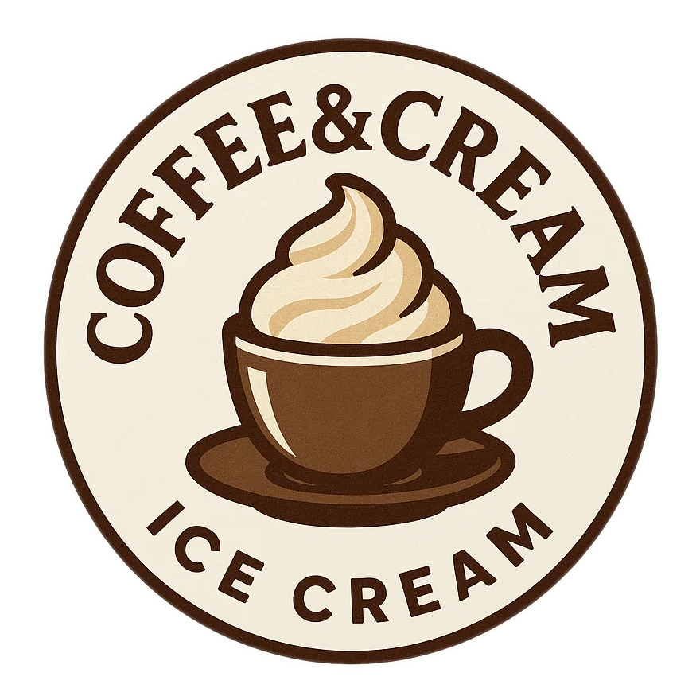

# Coffee&Cream (Deluxe)

Crafted with extra strong coffee, silky cream cheese, and a whisper of alcohol, it delivers a grown-up flavor profile with a smooth texture.

Spin on Sorbet, followed by a scrape-down and a re-spin.

> 

The coffee flavor is there but not dominant,
the consistency is soft and firms up after several hours in the freezer.

Rating: 😋😋😋☕☕

# INGREDIENTS

ℹ️ Brand names are in square brackets `[...]`.

**Wet**

  - _350ml_ Extra strong coffee
  - _100ml_ [Soy milk 1.6% (sugar-free) \[Berief\]](/ice-creamery/info/ingredients/#soy-milk){target="_blank"}↗
  - _50g_ [Cream Cheese 23% \[Exquisa\]](/ice-creamery/info/ingredients/#cream-cheese){target="_blank"}↗ • click the link for UK / US equivalents
  - _15g_ [Glycerin (E422, VG) \[hd-line\]](/ice-creamery/info/ingredients/#vegetable-glycerin-glycerol-vg-e422){target="_blank"}↗ • Sweetness = 60%; GI = 5; Density = 1.26 g/ml
  - _10g_ [Brandy or Vodka 40 vol%](/ice-creamery/info/ingredients/#alcohol-ethanol){target="_blank"}↗ • *alternative:* 8g (additional) VG for a sober recipe
  - _14g_ [❔Coffee Liqueur 25 vol% \[Caffè Borghetti\]](/ice-creamery/info/ingredients/#alcohol-ethanol){target="_blank"}↗ • if you have it, *instead of* the brandy/vodka

**Dry**

  - _40g_ [SweEX (Erythritol + Xylitol 3:2)](/ice-creamery/info/ingredients/#sweex-erythritol-xylitol-blend){target="_blank"}↗ • *alternative:* 53g allulose or dextrose
  - _10g_ [Salty Stability \[Inulin / GMS / CMC / Guar / XG / Salt\]](/ice-creamery/S/Salty%20Stability/){target="_blank"}↗ • *not-as-good substitute:* 1g guar, 0.3g xanthan, and 0.3g salt
  - _10g_ [Whey + Casein protein (grass-fed) \[Vilgain\]](/ice-creamery/info/ingredients/#whey-protein){target="_blank"}↗ • with stevia
  - _20g_ [Skim milk powder 1:10 (SMP) \[Vita2You\]](/ice-creamery/info/ingredients/#skim-milk-powder-smp){target="_blank"}↗
  - _3g_ ❔Instant Coffee [Mount Hagen] • *optional*, for a stronger coffee taste; 1.5g per 125ml
  - _3g_ [❔Cocoa Powder Organic 11% \[Sevenhills\]](/ice-creamery/info/ingredients/#cocoa-powder){target="_blank"}↗

**Fill to MAX**

  - _75ml_ Cream 32% [REWE Beste Wahl]
  - _≈3 drops_ Flavor drops Caramel (sucralose) [IronMaxx] • to taste

# DIRECTIONS

 1. Add "wet" ingredients to empty Creami tub.
 1. Weigh and mix dry ingredients, easiest by adding to a jar with a secure lid and shaking vigorously.
 1. Pour into the tub and *QUICKLY* use an immersion blender on full speed to homogenize everything.
 1. Let blender run until thickeners are properly hydrated, up to 1-2 min. Or blend again after waiting that time.
 1. Add remaining ingredients (to the MAX line) and stir with a spoon.
 1. Put on the lid, freeze for 24h, then spin as usual. Flatten any humps before that.
 1. Process with RE-SPIN mode when not creamy enough after the first spin.

# NUTRITIONAL & OTHER INFO

- **Nutritional values per 100g/ml:** 100g; 95.7 kcal; fat 5.6g; carbs 11.6g; sugar 2.2g; protein 3.3g; salt 0.2g
- **Nutritional values per ½ Deluxe Tub:** 340g; 325.4 kcal; fat 18.9g; carbs 39.6g; sugar 7.6g; protein 11.3g; salt 0.6g
- **Nutritional values total:** 680g; 650.8 kcal; fat 37.9g; carbs 79.2g; sugar 15.1g; protein 22.7g; salt 1.1g
- **FPDF / [PAC](/ice-creamery/info/glossary/#potere-anti-congelante-pac){target="_blank"}↗ (target 20..30):** 30.78
- **Protein / Energy Ratio (ok=12%; hi=20%):** 13.92% • Low-Sugar
- **Milk Solids Non-Fat ([MSNF](/ice-creamery/info/glossary/#milk-solids-not-fat-msnf){target="_blank"}↗, 7-11%):** 41.4g • 6.1%
- **Net carbs:** 24.3g • *∝ 5 servings@136g:* 4.9g • *∝ 3 servings@227g:* 8.1g • *energy ratio (low <20%):* 14.9%
- **10g 'Salty Stability' is:** 7.3g Inulin • 1.2g Glycerol Monostearate (GMS / E471) • 0.6g Tylose powder (E466, Tylo, CMC) • 0.4g Guar gum (E412) • 0.33g Salt • 0.13g Xanthan gum (E415, XG).
