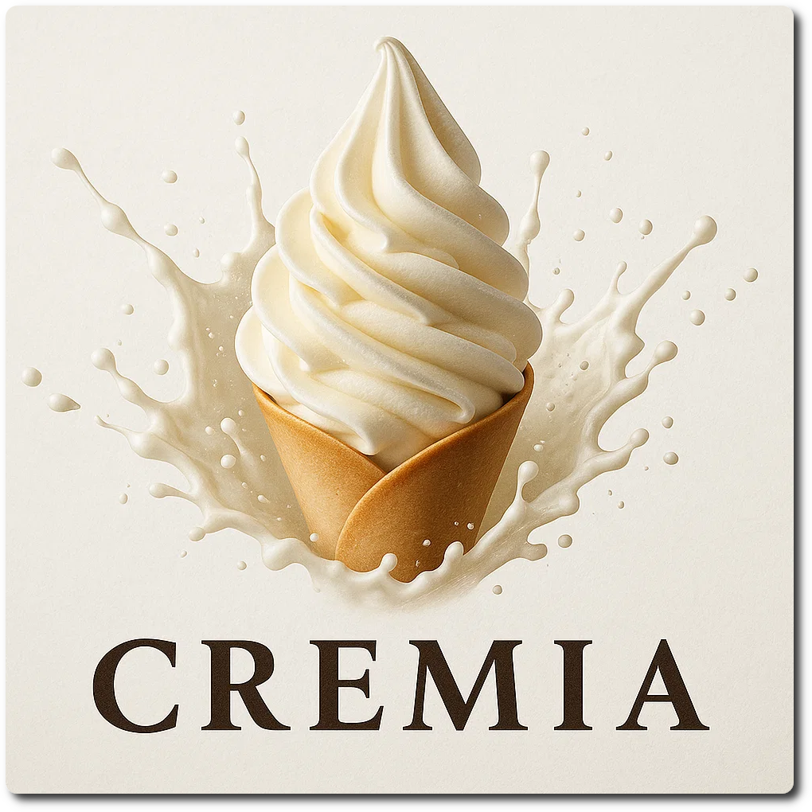
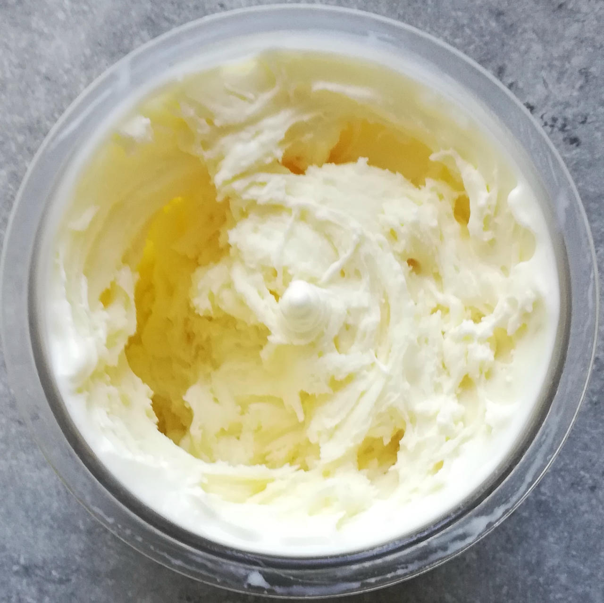
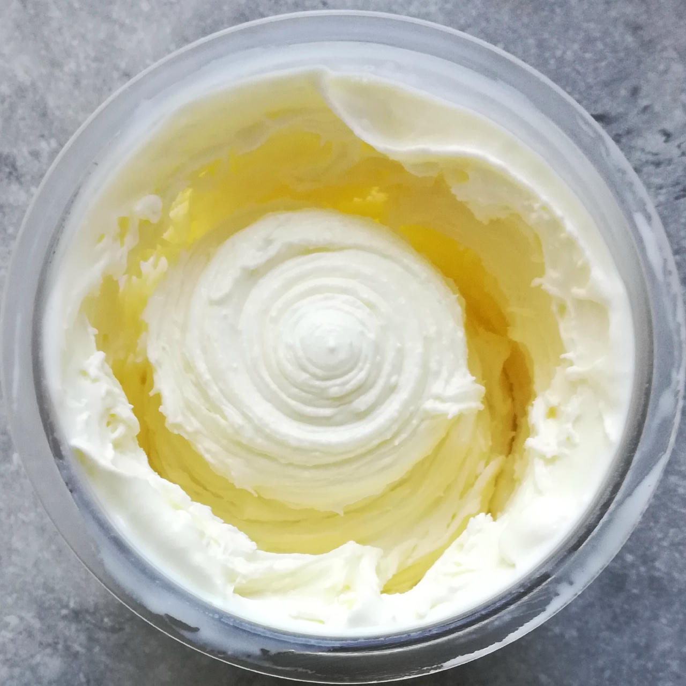
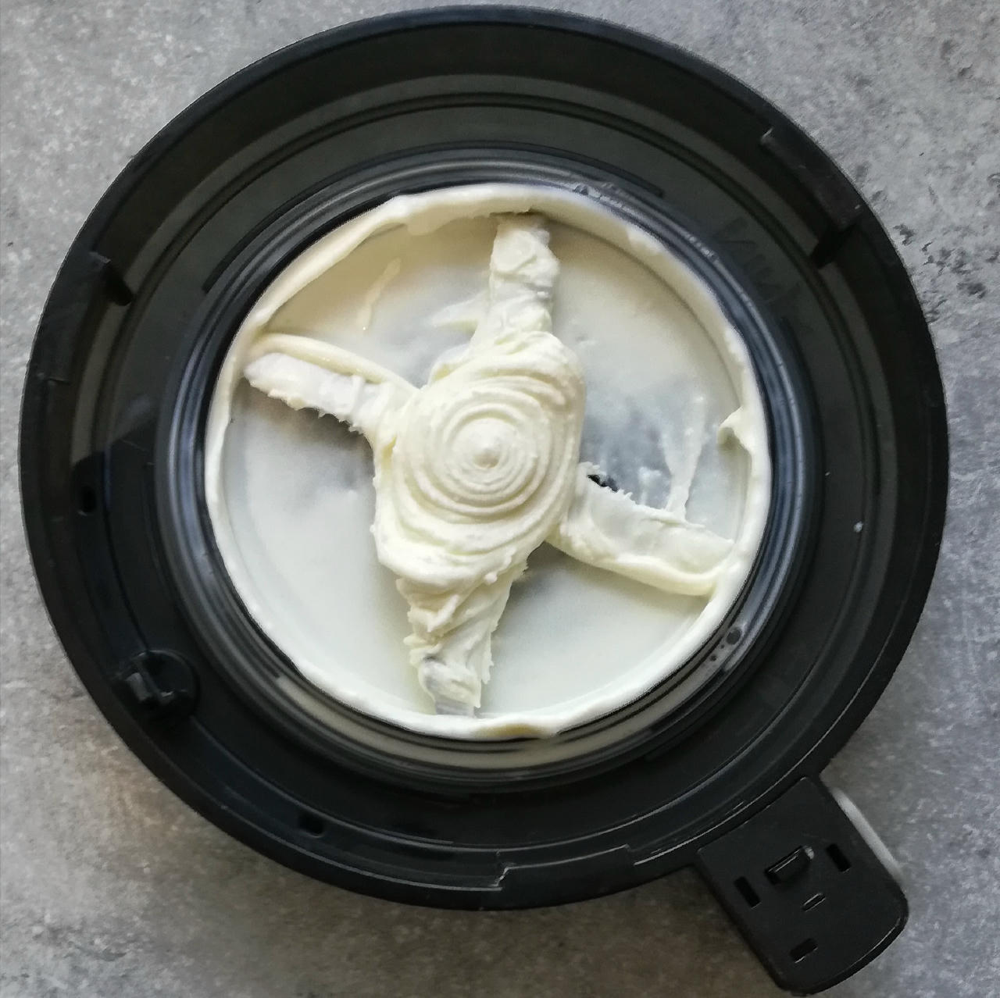
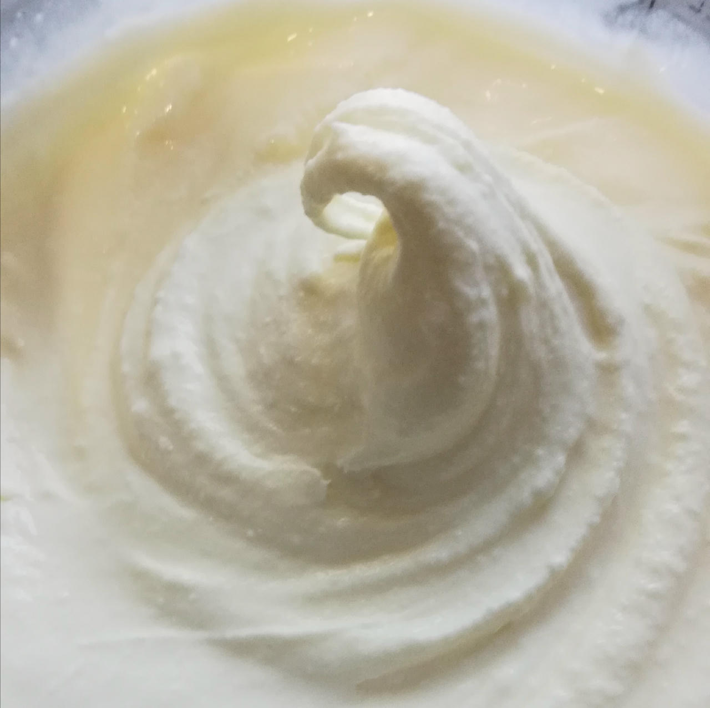
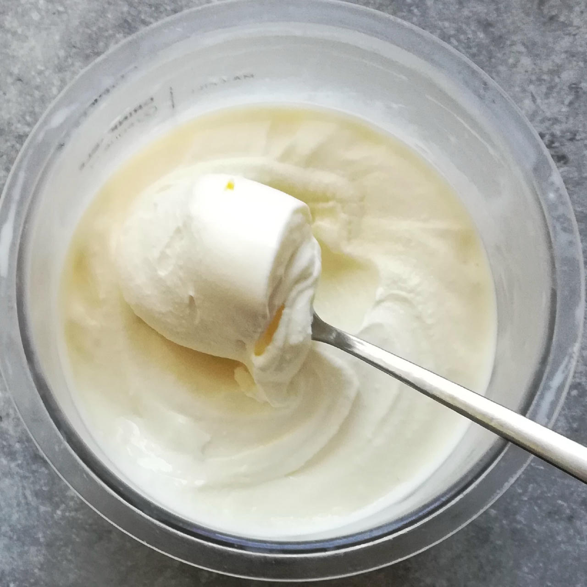
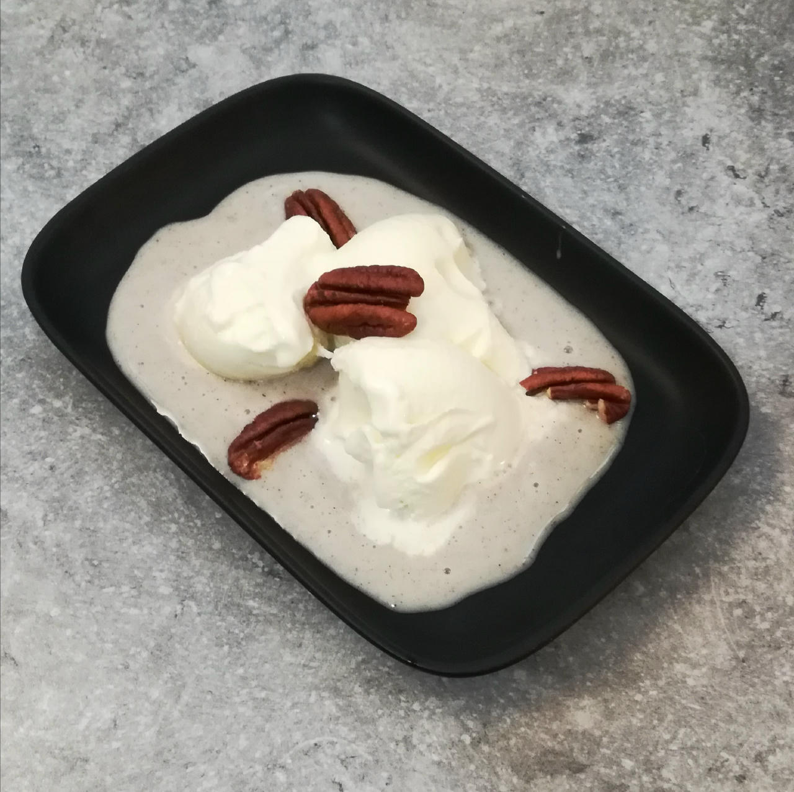

# Creamia (Deluxe)

Cremia is a premium Japanese soft-serve ice cream known for its rich, creamy texture and luxurious taste.
It's made with 25% fresh Hokkaido cream and 12.5% milk fat, giving it a higher butterfat content than typical soft-serve.
Cremia is typically served in a distinctive, buttery *langue de chat* (cat's tongue) cookie cone.

The original UK YouTube recipe uses double cream (48% fat, 160:380), leading to 16.3% fat in total.
It can be replacedd by Crème double or Mascarpone with 42% (190:355), or with whipping cream 32% (250:300).

I also added some stabilizer so it does not melt so fast, and replaced the sugar.

Spin on “Ice Cream”, scrape down is likely not needed, and mix-in if you want it even softer.

> 
> 
> 
> 
> *Tub after 'Ice Cream' and 'Mix-in', and the lid at the end.*

> 
> 
> 
> 
> *You can draw peaks with a spoon from this, and there are no butter nodules or other blemishes. Perfectly smooth.*

Rating: 😋🥛🥛🥛🐮 (milky explosion of decadence)

> *Adapted from [Milkiest Milk Ice Cream Recipe](https://www.tashcakes.com/2024/07/milkiest-milk-ice-cream-recipe-cremia.html).*

> ℹ️ Read [About 'Simple' Recipes](/ice-creamery/info/tips%2Btricks/#about-simple-recipes) regarding 'exotic' ingredients and their alternatives.

# INGREDIENTS

ℹ️ Brand names are in square brackets `[...]`.

**Wet**

  - _300ml_ Milk 3.5% [Weihenstephan]

**Dry**

  - _75g_ Full Fat Milkpowder [Mr. Brown]
  - _35g_ [Trehalose \[SaporePuro\]](/ice-creamery/info/ingredients/#trehalose-e965){target="_blank"}↗ • *alternative:* dextrose • POD = 45%; GI = 38
  - _30g_ [Xylitol (E967)](/ice-creamery/info/ingredients/#xylitol-e967){target="_blank"}↗ • *alternative:* sugar • POD = 100%; GI = 7
  - _5g_ [Salty Stability \[Inulin / GMS / CMC / Guar / XG / Salt\]](/ice-creamery/S/Salty%20Stability/){target="_blank"}↗ • *alternative:* 0.75g guar + .25g xanthan
  - _1.5g_ [Glycerol Monostearate (E471) \[Bulk\]](/ice-creamery/info/ingredients/#glycerol-monostearate-gms-e471){target="_blank"}↗ • *alternative:* lecithin

**Fill to MAX**

  - _250ml_ Cream 32% [REWE Beste Wahl]

# DIRECTIONS

 1. Weight and combine ‘dry’ ingredients in a bowl.
 1. Pour the milk into a small saucepan.
 1. Whisk in the ‘dry’ ingredients.
 1. Heat up the milk on medium heat to about 60°C, and add the cream.
 1. Let it cool down a bit in a water bath, add to an empty Creami tub.
 1. Put on the lid, freeze for 24h, then spin as usual. Flatten any humps before that.
 1. Process with RE-SPIN mode when not creamy enough after the first spin.

# NUTRITIONAL & OTHER INFO

- **Nutritional values per 100g/ml:** 100g; 222.0 kcal; fat 15.8g; carbs 16.4g; sugar 11.5g; protein 5.1g; salt 0.2g
- **Nutritional values per ½ Deluxe Tub:** 340g; 754.8 kcal; fat 53.8g; carbs 55.6g; sugar 39.0g; protein 17.3g; salt 0.8g
- **Nutritional values total:** 697g; 1546.2 kcal; fat 110.2g; carbs 113.9g; sugar 79.8g; protein 35.5g; salt 1.6g
- **FPDF / [PAC](/ice-creamery/info/glossary/#potere-anti-congelante-pac){target="_blank"}↗ (target 20..30):** 22.84
- **Protein / Energy Ratio (ok=12%; hi=20%):** 9.19%
- **Milk Solids Non-Fat ([MSNF](/ice-creamery/info/glossary/#milk-solids-not-fat-msnf){target="_blank"}↗, 7-11%):** 94.5g • 13.6%
- **Net carbs:** 80.2g • *∝ 5 servings@139g:* 16g • *∝ 3 servings@232g:* 26.7g • *energy ratio (low <20%):* 20.8%
- **5g 'Salty Stability' is:** 3.7g Inulin • 0.6g Glycerol Monostearate (GMS / E471) • 0.3g Tylose powder (E466, Tylo, CMC) • 0.2g Guar gum (E412) • 0.17g Salt • 0.07g Xanthan gum (E415, XG).
