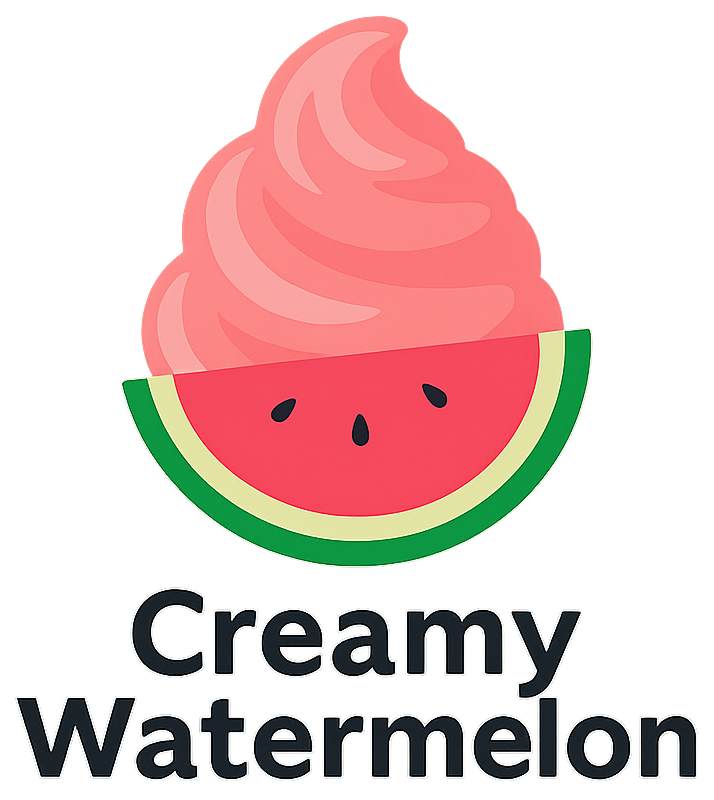
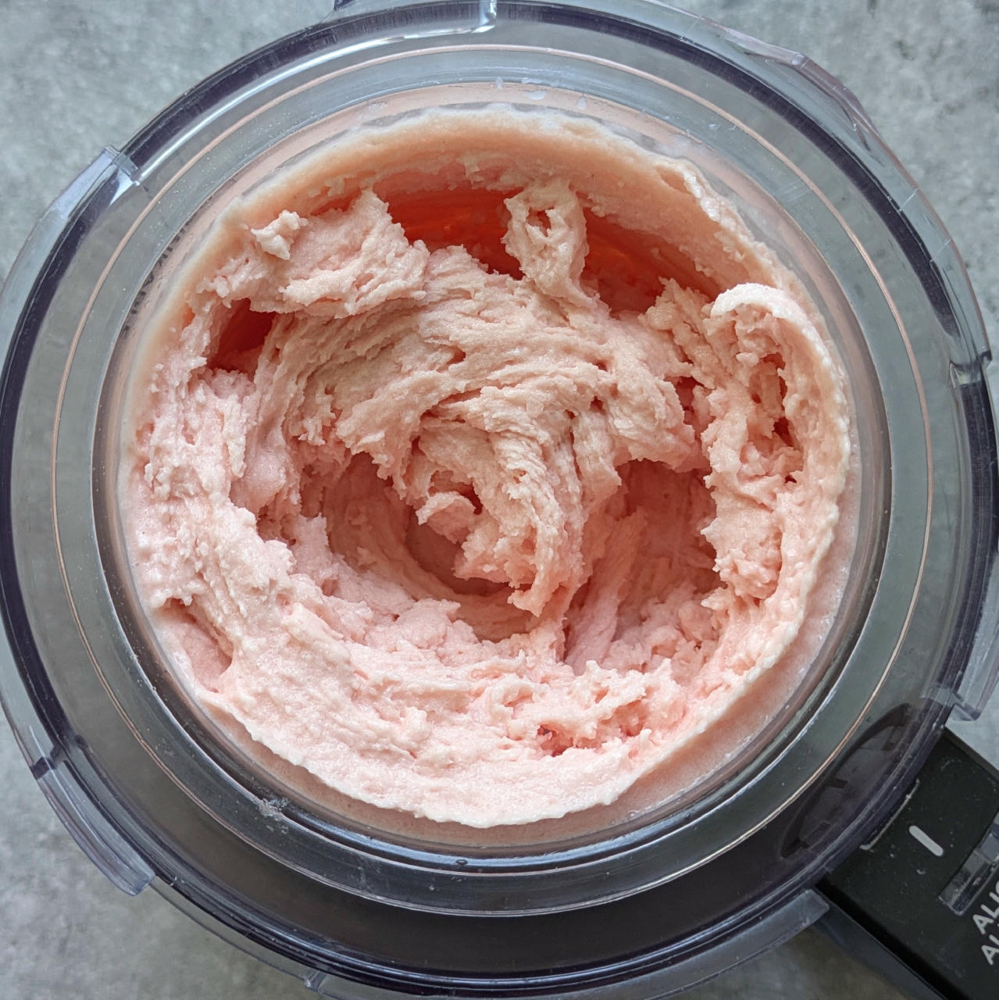
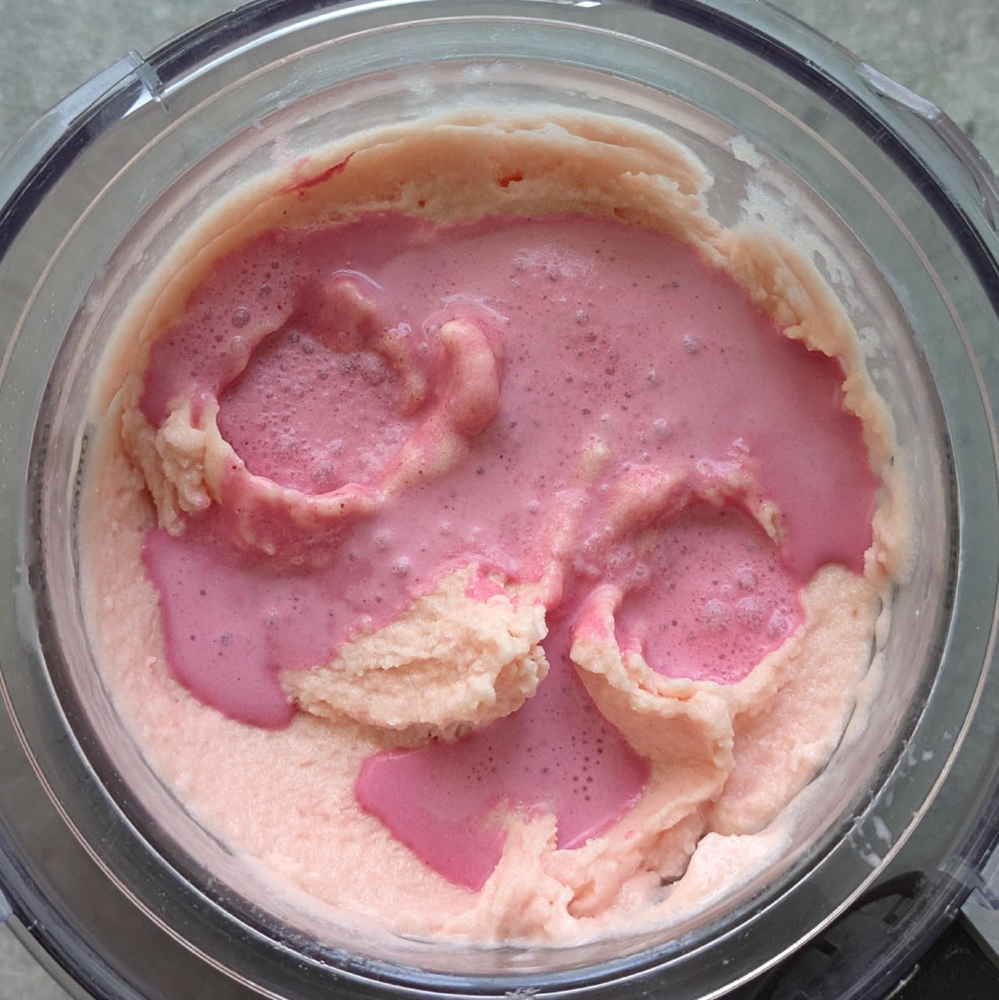
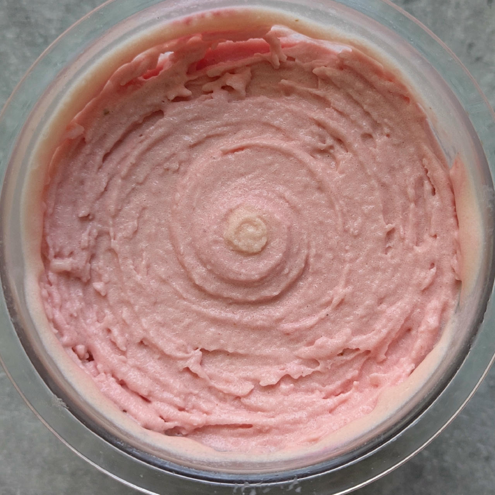
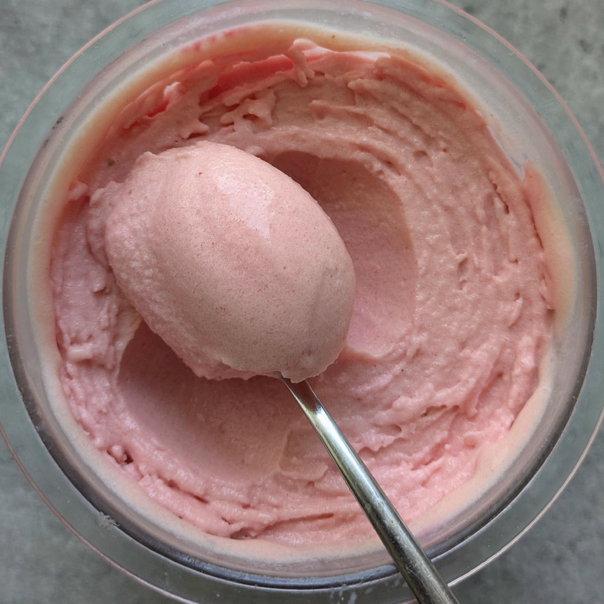
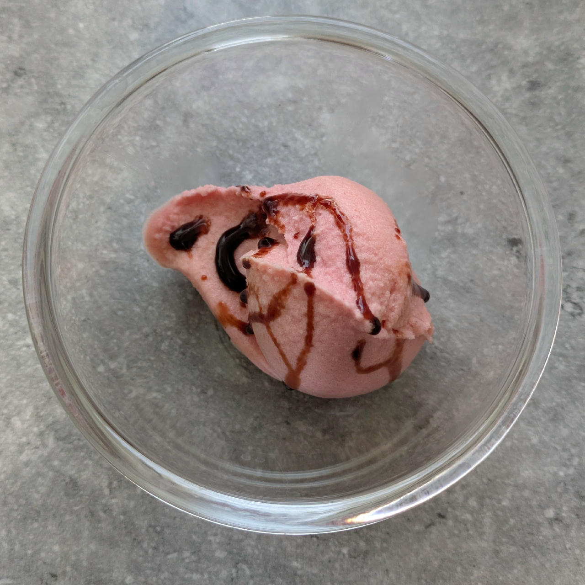

# Creamy Watermelon (Deluxe)

Sorbet mostly from strained watermelon pulp, with minimal additions to make it processable (soft, scoopable).

> *A variation of the "Just Fruit" recipe with protein powder and cream.*

Spin on “Sorbet”, scrape down, and mix-in with
[Red Swirl](/ice-creamery/T/Toppings/#red-swirl-mix-in).

> 
> 
> 
> 
> 

Rating: 😋🍉🍉🍉🥛

# INGREDIENTS

ℹ️ Brand names are in square brackets `[...]`.

**Wet**

  - _520g_ Watermelon (blended & strained)
  - _20g_ [Glycerin (E422, VG) \[hd-line\]](/ice-creamery/info/ingredients/#vegetable-glycerin-glycerol-vg-e422){target="_blank"}↗
  - _10ml_ Lemon juice

**Dry**

  - _35g_ [SweEX (Erythritol + Xylitol 3:2)](/ice-creamery/info/ingredients/#sweex-erythritol-xylitol-blend){target="_blank"}↗ • alternatives: 47g allulose or dextrose; POD ≈ 85%; GI < 7
  - _10g_ [Whey + Casein protein (grass-fed) \[Vilgain\]](/ice-creamery/info/ingredients/#whey-protein){target="_blank"}↗ • with stevia
  - _1.75g_ [Carboxymethyl Cellulose (CMC / E466) \[GoodBake\]](/ice-creamery/info/ingredients/#carboxymethyl-cellulose-cmc-e466){target="_blank"}↗ • alternatives: guar gum (same amount)
  - _0.75g_ [Xanthan gum (E415, XG)](/ice-creamery/info/ingredients/#xanthan-gum-xg-e415){target="_blank"}↗ • 1tsp ≈ 2.8g
  - _1.5g_ Salt
  - _1g_ Beet Root Powder (organic) [Mandoi] • *optional*, for color

**Fill to MAX**

  - _80ml_ Cream 32% [REWE Beste Wahl]
  - _≈5 drops_ Flavor drops Peach / Maracuja (sucralose) [IronMaxx] • to taste

# DIRECTIONS

 1. Scoop the pulp out of a medium-sized watermelon, blend it, and strain it through a mesh.
 1. Add "wet" ingredients to empty Creami tub.
 1. Weigh and mix dry ingredients, easiest by adding to a jar with a secure lid and shaking vigorously.
 1. Pour into the tub and *QUICKLY* use an immersion blender on full speed to homogenize everything.
 1. Let blender run until thickeners are properly hydrated, up to 1-2 min. Or blend again after waiting that time.
 1. Add remaining ingredients (to the MAX line) and stir with a spoon.
 1. Put on the lid, freeze for 24h, then spin as usual. Flatten any humps before that.
 1. Process with RE-SPIN mode when not creamy enough after the first spin.

# NUTRITIONAL & OTHER INFO

- **Nutritional values per 100g/ml:** 100g; 85.4 kcal; fat 4.0g; carbs 14.8g; sugar 5.3g; protein 2.0g; salt 0.2g
- **Nutritional values per ½ Deluxe Tub:** 340g; 290.2 kcal; fat 13.6g; carbs 50.2g; sugar 18.0g; protein 6.7g; salt 0.8g
- **Nutritional values total:** 680g; 580.4 kcal; fat 27.1g; carbs 100.4g; sugar 36.0g; protein 13.3g; salt 1.7g
- **FPDF / [PAC](/ice-creamery/info/glossary/#potere-anti-congelante-pac){target="_blank"}↗ (target 20..30):** 32.03
- **Protein / Energy Ratio (ok=12%; hi=20%):** 9.19%
- **Milk Solids Non-Fat ([MSNF](/ice-creamery/info/glossary/#milk-solids-not-fat-msnf){target="_blank"}↗, 7-11%):** 14.1g • 2.1%
- **Net carbs:** 55.4g • *∝ 5 servings@136g:* 11.1g • *∝ 3 servings@227g:* 18.5g • *energy ratio (low <20%):* 38.2%
