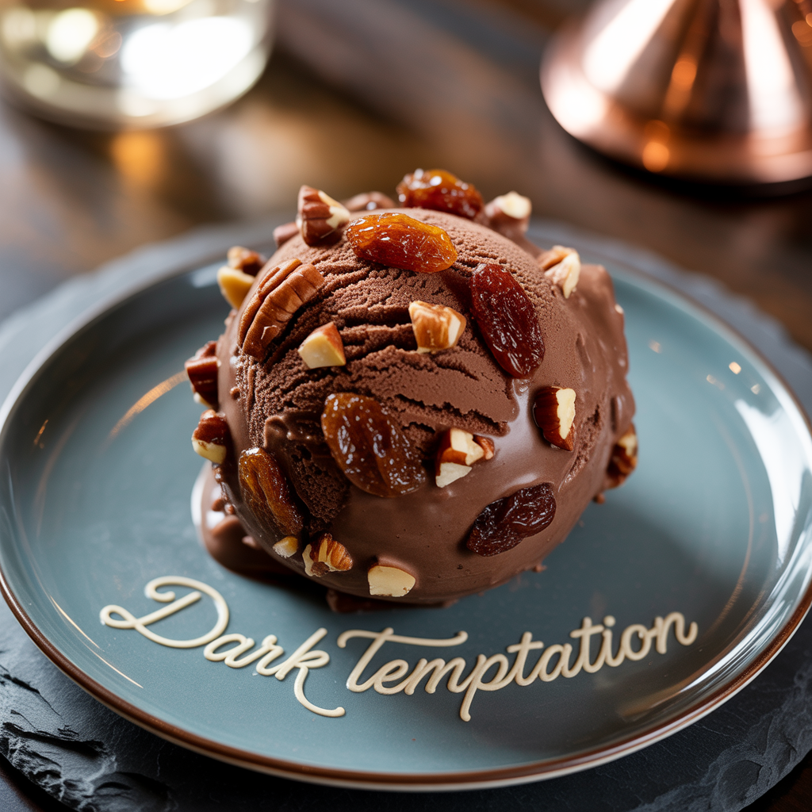

# Dark Temptation (Deluxe)

Rum-raisin pecan chocolate ice cream, using both cocoa powder and dark chocolate, and a coffee note.

Spin on “Sorbet”, scrape down, and re-mix.

> 

Rating: 😋🍫 (untested)

# INGREDIENTS

ℹ️ Brand names are in square brackets `[...]`.

**Prep**

  - _200ml_ Water (boiling)
  - _50g_ [Cocoa Powder Organic 11% \[Sevenhills\]](/ice-creamery/info/ingredients/#cocoa-powder){target="_blank"}↗
  - _50g_ Dark chocolate 85% [Moser-Roth/Aldi] • Portion = 25g
  - _3g_ Instant Coffee [Mount Hagen] • 1.5g per 125ml
  - _30g_ [Whey + Casein protein (grass-fed) \[Vilgain\]](/ice-creamery/info/ingredients/#whey-protein){target="_blank"}↗ • with stevia

**Wet**

  - _200ml_ [Soy milk 1.6% (sugar-free) \[Berief\]](/ice-creamery/info/ingredients/#soy-milk){target="_blank"}↗
  - _15g_ [Glycerin (E422, VG) \[hd-line\]](/ice-creamery/info/ingredients/#vegetable-glycerin-glycerol-vg-e422){target="_blank"}↗ • POD = 60%; GI = 5; Density = 1.26 g/ml
  - _35g_ [Jamaica Rum 43 vol%](/ice-creamery/info/ingredients/#alcohol-ethanol){target="_blank"}↗ • from soaking the raisins
  - _10ml_ Soy sauce • ½ tbsp

**Dry**

  - _15g_ [Salty Stability \[Inulin / GMS / CMC / Guar / XG / Salt\]](/ice-creamery/S/Salty%20Stability/){target="_blank"}↗ • unsweetened “ICSv2”
  - _50g_ [SweEX (Erythritol + Xylitol 3:2)](/ice-creamery/info/ingredients/#sweex-erythritol-xylitol-blend){target="_blank"}↗ • POD ≈ 90%; GI < 7

**Fill to MAX**

  - _62ml_ [Soy milk 1.6% (sugar-free) \[Berief\]](/ice-creamery/info/ingredients/#soy-milk){target="_blank"}↗
  - _≈4 drops_ Flavor drops Vanilla (sucralose) [IronMaxx] • to taste

**Mix-ins**

  - _15g_ Pecan nuts (organic) [Biojoy] • coarsely chopped [108kcal, 1g sugar]
  - _15g_ Sultanas (organic) [Biojoy] • soaked overnight [45kcal, 10g sugar]
  - _15g_ [Jamaica Rum 43 vol%](/ice-creamery/info/ingredients/#alcohol-ethanol){target="_blank"}↗ • soaked up by the raisins

# DIRECTIONS

 1. Soak 15g raisins overnight in 50g rum, in a closed container, fully covered.
 1. Mix the boiling water with the cocoa powder to bloom it, dissolve the coffee and protein powder.
 1. Melt the chocolate pieces into the hot paste, then let it cool down.
 1. Add "wet" ingredients and the chocolate paste to empty Creami tub.
 1. Weigh and mix dry ingredients, easiest by adding to a jar with a secure lid and shaking vigorously.
 1. Pour into the tub and *QUICKLY* use an immersion blender on full speed to homogenize everything.
 1. Let blender run until thickeners are properly hydrated, up to 1-2 min. Or blend again after waiting that time.
 1. Add remaining ingredients (to the MAX line) and stir with a spoon.
 1. Put on the lid, freeze for 24h, then spin as usual. Flatten any humps before that.
 1. Process with RE-SPIN mode when not creamy enough after the first spin.
 1. Process with MIX-IN after adding mix-ins evenly. For that, add partial amounts into a hole going down to the bottom, and fold the ice cream over, building pockets of mix-ins.

# NUTRITIONAL & OTHER INFO
- **Nutritional values per 100g/ml:** 100g; 149.6 kcal; fat 6.2g; carbs 15.3g; sugar 2.8g; protein 7.0g; salt 0.4g
- **Nutritional values per ½ Deluxe Tub:** 360g; 538.6 kcal; fat 22.4g; carbs 55.1g; sugar 10.0g; protein 25.4g; salt 1.3g
- **Nutritional values total:** 765g; 1144.6 kcal; fat 47.5g; carbs 117.2g; sugar 21.3g; protein 53.9g; salt 2.7g
- **FPDF / [PAC](/ice-creamery/info/glossary/#potere-anti-congelante-pac){target="_blank"}↗ (target 20..30):** 30.55
- **Protein / Energy Ratio (ok=12%; hi=20%):** 18.83% • Low-Sugar
- **Milk Solids Non-Fat ([MSNF](/ice-creamery/info/glossary/#milk-solids-not-fat-msnf){target="_blank"}↗, 7-11%):** 37.6g • 4.9%
- **Net carbs:** 48.6g • *∝ 5 servings@153g:* 9.7g • *∝ 3 servings@255g:* 16.2g • *energy ratio (low <20%):* 17%
- **15g 'Salty Stability' is:** 11.0g Inulin • 1.8g Glycerol Monostearate (GMS / E471) • 0.9g Tylose powder (E466, Tylo, CMC) • 0.6g Guar gum (E412) • 0.5g Salt • 0.2g Xanthan gum (E415, XG).
