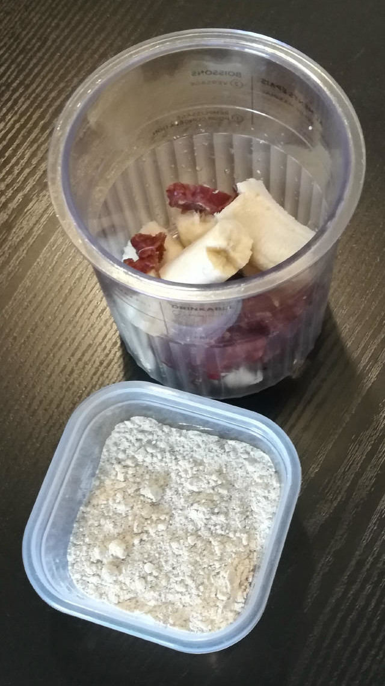

# Datanacoco (Deluxe)

Dates, banana, and coconut milk ice cream — a/k/a “What I had in my fridge and pantry.”

> 

Process on *Sorbet*, [hold it shortly under running water](https://jhermann.github.io/ice-creamery/info/tips%2Btricks/#handling-of-icy-sides-bottom)
*after* that. Then a scrape-down and a respin or re-mix.

> 

Rating: 😋🍌🥥 (untested)

# INGREDIENTS

ℹ️ Brand names are in square brackets `[...]`.

**Prep**

  - _125g_ Bananas (peeled) • 1 large and ripe banana, eat any surplus 😋
  - _40g_ Medjool dates (organic) [Seba Garden] • 2 dates; distinctive caramel taste with hints of vanilla
  - _5ml_ Lemon juice

**Wet**

  - _250ml_ [Soy milk 1.6% (sugar-free) \[Berief\]](/ice-creamery/info/ingredients/#soy-milk){target="_blank"}↗
  - _100ml_ [Coconut milk 22% \[REWE Bio\]](/ice-creamery/info/ingredients/#coconut-milk){target="_blank"}↗
  - _20g_ [Glycerin (E422, VG) \[hd-line\]](/ice-creamery/info/ingredients/#vegetable-glycerin-glycerol-vg-e422){target="_blank"}↗ • Sweetness = 60%; GI = 5; Density = 1.26 g/ml
  - _15g_ [Brandy or Vodka 40 vol%](/ice-creamery/info/ingredients/#alcohol-ethanol){target="_blank"}↗

**Dry**

  - _20g_ [Soy protein isolate (nature) \[Powerstar\]](/ice-creamery/info/ingredients/#soy-protein-isolate){target="_blank"}↗ • 1kg bag, unsweetened, unflavored
  - _15g_ [SweEX (Erythritol + Xylitol 3:2)](/ice-creamery/info/ingredients/#sweex-erythritol-xylitol-blend){target="_blank"}↗ • POD ≈ 90%; GI < 7
  - _7g_ [Salty Stability \[Inulin / GMS / CMC / Guar / XG / Salt\]](/ice-creamery/S/Salty%20Stability/){target="_blank"}↗ • unsweetened “ICSv2”
  - _3g_ Vanilla Bean Powder [InterVanilla]

**Fill to MAX**

  - _80ml_ [Soy milk 1.6% (sugar-free) \[Berief\]](/ice-creamery/info/ingredients/#soy-milk){target="_blank"}↗
  - _≈5 drops_ Flavor drops Vanilla (sucralose) [IronMaxx] • to taste

# DIRECTIONS

 1. Cut the dates into halves by their long side, and make sure they’re pitted and not spoiled.
 1. Blend the bananas, dates, and the lemon juice in an empty Creami tub, to a smooth paste.
 1. Add "wet" ingredients to the puree.
 1. Weigh and mix dry ingredients, easiest by adding to a jar with a secure lid and shaking vigorously.
 1. Pour into the tub and *QUICKLY* use an immersion blender on full speed to homogenize everything.
 1. Let blender run until thickeners are properly hydrated, up to 1-2 min. Or blend again after waiting that time.
 1. Add remaining ingredients (to the MAX line) and stir with a spoon.
 1. Put on the lid, freeze for 24h, then spin as usual. Flatten any humps before that.
 1. Process with RE-SPIN mode when not creamy enough after the first spin.

# NUTRITIONAL & OTHER INFO

- **Nutritional values per 100g/ml:** 100g; 118.9 kcal; fat 4.2g; carbs 15.5g; sugar 7.5g; protein 4.7g; salt 0.2g
- **Nutritional values per ½ Deluxe Tub:** 340g; 404.1 kcal; fat 14.3g; carbs 52.8g; sugar 25.6g; protein 16.1g; salt 0.5g
- **Nutritional values total:** 680g; 808.3 kcal; fat 28.6g; carbs 105.6g; sugar 51.3g; protein 32.1g; salt 1.1g
- **FPDF / [PAC](/ice-creamery/info/glossary/#potere-anti-congelante-pac){target="_blank"}↗ (target 20..30):** 31.49
- **Protein / Energy Ratio (ok=12%; hi=20%):** 15.91%
- **Milk Solids Non-Fat ([MSNF](/ice-creamery/info/glossary/#milk-solids-not-fat-msnf){target="_blank"}↗, 7-11%):** 31.8g • 4.7%
- **Net carbs:** 75.4g • *∝ 5 servings@136g:* 15.1g • *∝ 3 servings@227g:* 25.1g • *energy ratio (low <20%):* 37.3%
- **7g 'Salty Stability' is:** 5.1g Inulin • 0.84g Glycerol Monostearate (GMS / E471) • 0.42g Tylose powder (E466, Tylo, CMC) • 0.28g Guar gum (E412) • 0.23g Salt • 0.09g Xanthan gum (E415, XG).
