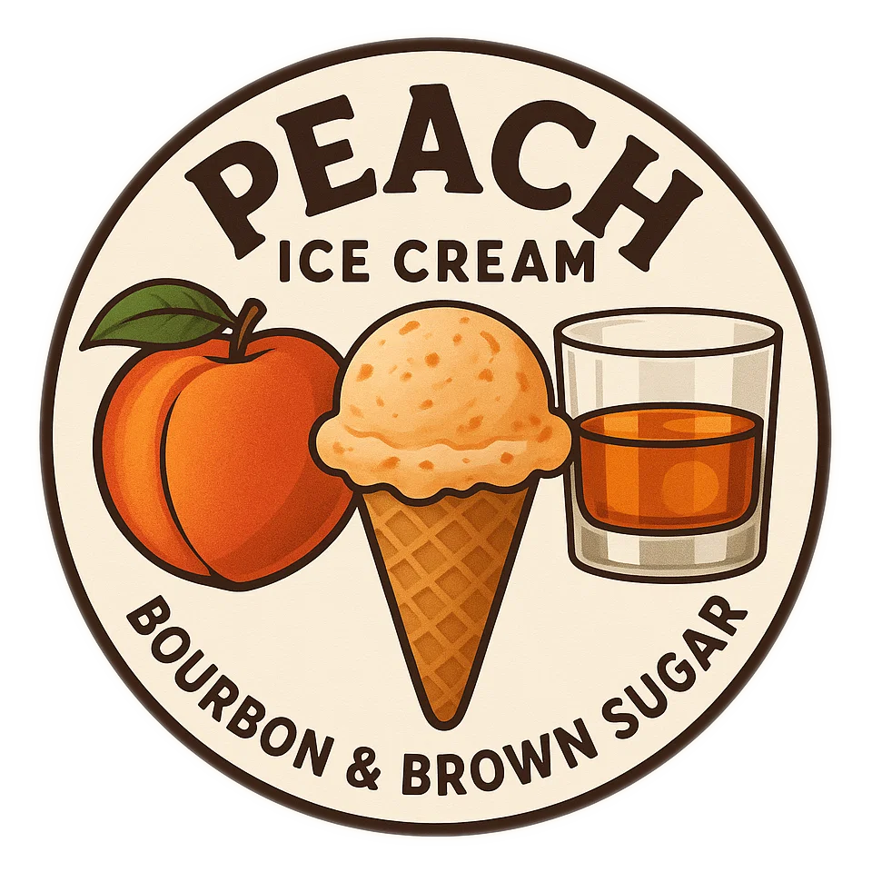
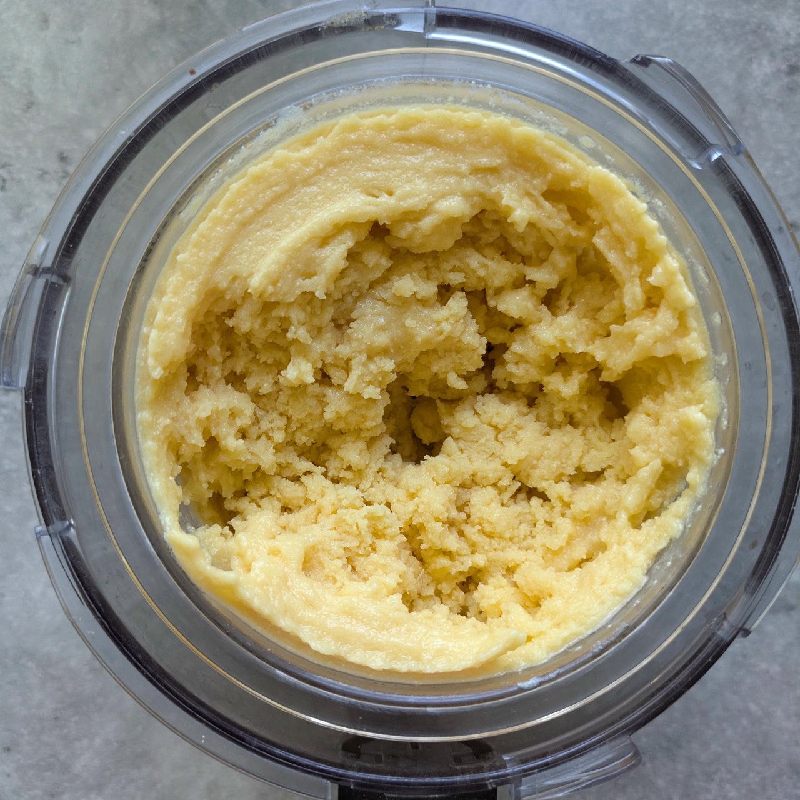
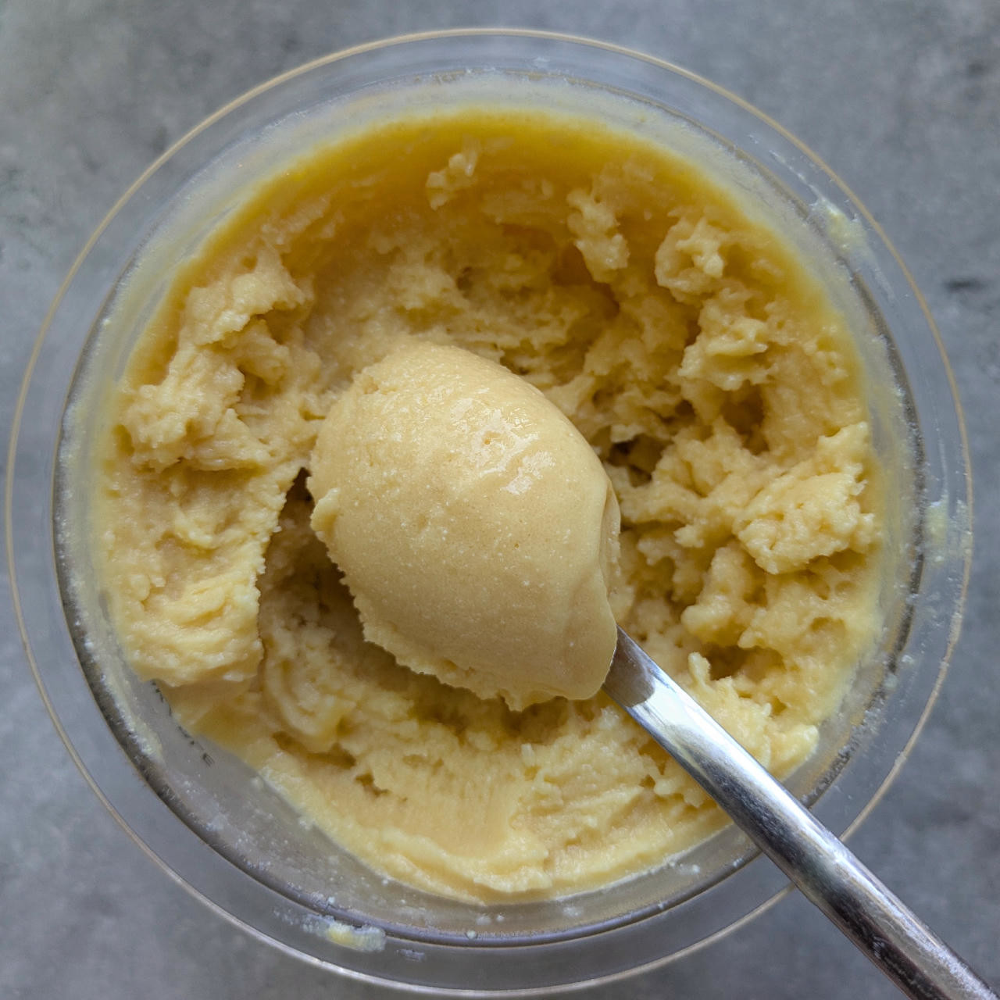
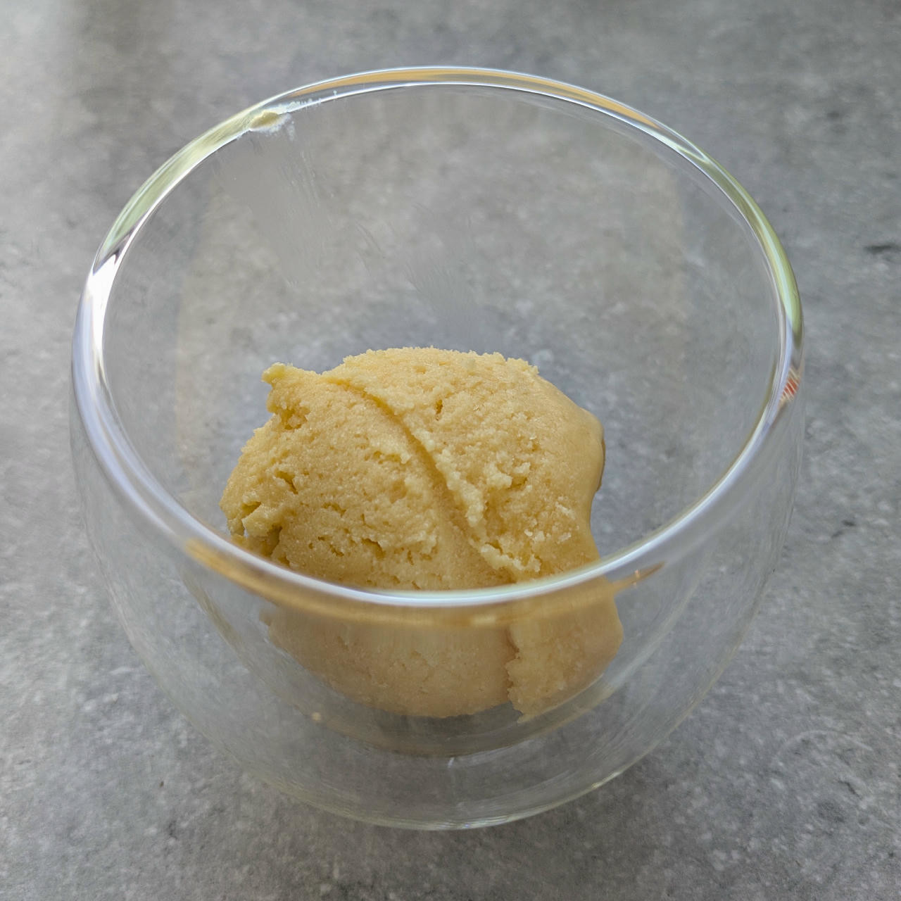
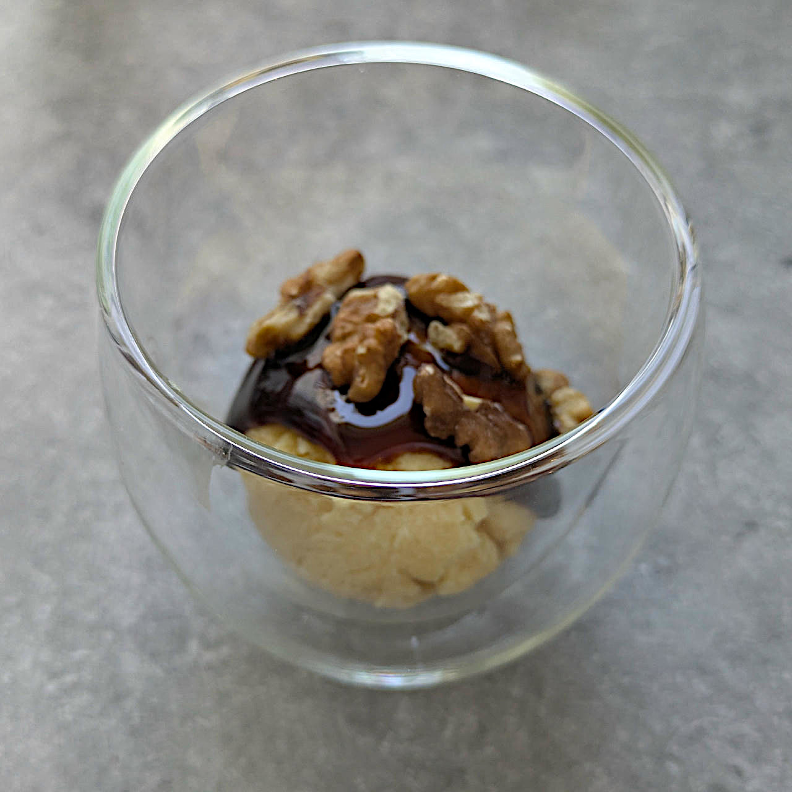

# Dirty Peach Bourbon (Deluxe)

> 🌿 **Vegan & Dairy-free** Recipe is using only soy milk and tofu.

The “dirty” refers to the molasses that is used instead of brown sugar.

You can use other alcohol without a strong flavor profile, like Grappa with 38–44 vol%.

Process on *Sorbet*, [hold it shortly under running water](https://jhermann.github.io/ice-creamery/info/tips%2Btricks/#handling-of-icy-sides-bottom)
*after* that.
Then a scrape-down and a respin or re-mix. 

> 
> 
> 
> 

Rating: 😋😋😋🍑🍑

> Inspired by [u/formercotsachick](https://www.reddit.com/user/formercotsachick/)

# INGREDIENTS

ℹ️ Brand names are in square brackets `[...]`.

**Prep**

  - _50g_ [Tofu (plain) \[REWE Bio\]](/ice-creamery/info/ingredients/#tofu){target="_blank"}↗ • use 75g of silken tofu if you have it
  - _40g_ Bourbon 40 vol% (80 proof)
  - _5g_ Molasses [Grafschafter Goldsaft] • Sweetness = 66%

**Wet**

  - _400g_ Peaches in Grape Juice [Libby’s] • Can = 410g
  - _125ml_ [Soy milk 1.6% (sugar-free) \[Berief\]](/ice-creamery/info/ingredients/#soy-milk){target="_blank"}↗

**Dry**

  - _30g_ [Xylitol (E967)](/ice-creamery/info/ingredients/#xylitol-e967){target="_blank"}↗ • POD = 100%; GI = 7
  - _20g_ ICSv2 [Erythritol / Inulin / CMC / Guar / XG / Salt] • [http﹕//bit.ly/4frc4Vj](https://jhermann.github.io/ice-creamery/I/Ice%20Cream%20Stabilizer%20(ICS)/)

**Fill to MAX**

  - _50ml_ Water to MAX line
  - _≈7 drops_ Flavor drops Peach / Maracuja (sucralose) [IronMaxx] • to taste

# DIRECTIONS

 1. In an empty Creami tub, blend the tofu with the other ‘prep’ ingredients to a smooth paste. Add a splash of soy milk, if needed, to combine things.
 1. Add "wet" ingredients to the puree.
 1. Weigh and mix dry ingredients, easiest by adding to a jar with a secure lid and shaking vigorously.
 1. Pour into the tub and *QUICKLY* use an immersion blender on full speed to homogenize everything.
 1. Let blender run until thickeners are properly hydrated, up to 1-2 min. Or blend again after waiting that time.
 1. Add remaining ingredients (to the MAX line) and stir with a spoon.
 1. Put on the lid, freeze for 24h, then spin as usual. Flatten any humps before that.
 1. Process with RE-SPIN mode when not creamy enough after the first spin.

# NUTRITIONAL & OTHER INFO
- **Nutritional values per 100g/ml:** 100g; 74.2 kcal; fat 0.8g; carbs 14.3g; sugar 5.6g; protein 1.7g; salt 0.1g
- **Nutritional values per ½ Deluxe Tub:** 360g; 267.1 kcal; fat 2.9g; carbs 51.3g; sugar 20.1g; protein 6.2g; salt 0.3g
- **Nutritional values total:** 720g; 534.1 kcal; fat 5.8g; carbs 102.6g; sugar 40.3g; protein 12.4g; salt 0.5g
- **FPDF / [PAC](/ice-creamery/info/glossary/#potere-anti-congelante-pac){target="_blank"}↗ (target 20..30):** 30.18
- **Protein / Energy Ratio (ok=12%; hi=20%):** 9.28% • LOW-FAT • Low-Salt
- **Milk Solids Non-Fat ([MSNF](/ice-creamery/info/glossary/#milk-solids-not-fat-msnf){target="_blank"}↗, 7-11%):** 7.8g • 1.1%
- **Net carbs:** 54.5g • *∝ 5 servings@144g:* 10.9g • *∝ 3 servings@240g:* 18.2g
- **20g Ice Cream Stabilizer (ICSv2) is:** 9.2g Erythritol (E968) • 9.2g Inulin • 0.92g Tylose powder (E466, Tylo, CMC) • 0.32g Guar gum (E412) • 0.32g Salt • 0.09g Xanthan gum (E415, XG).
