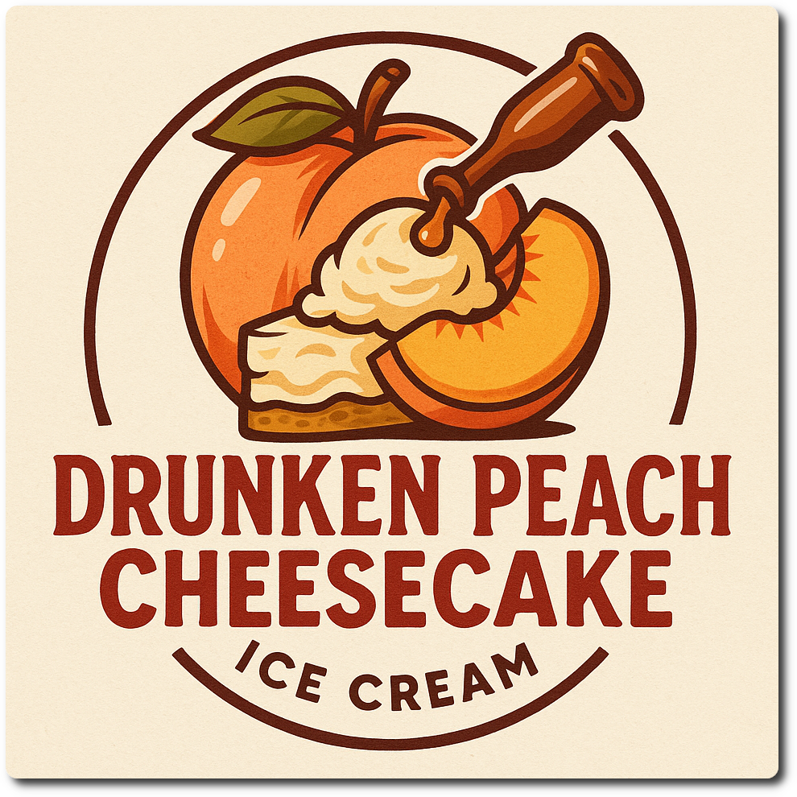
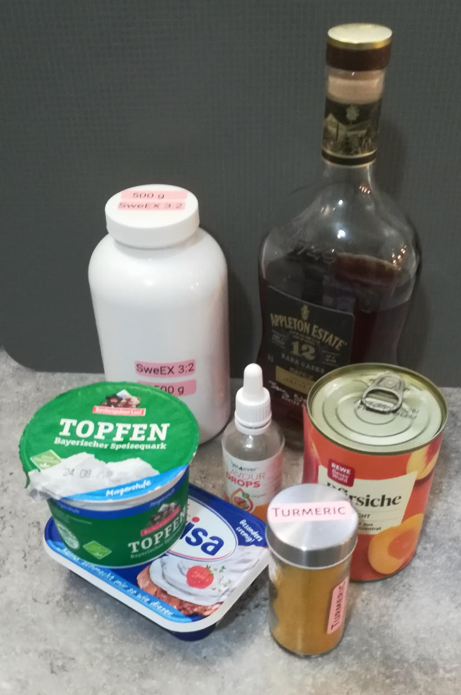
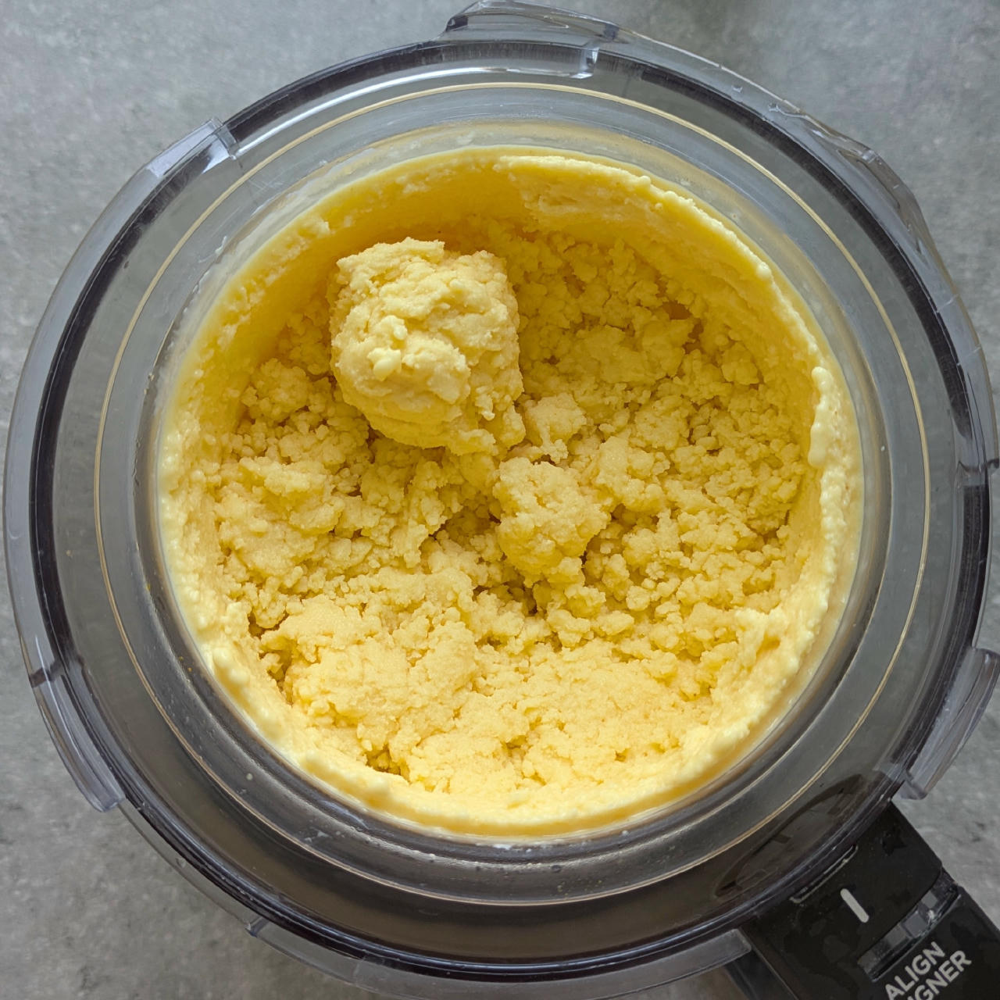
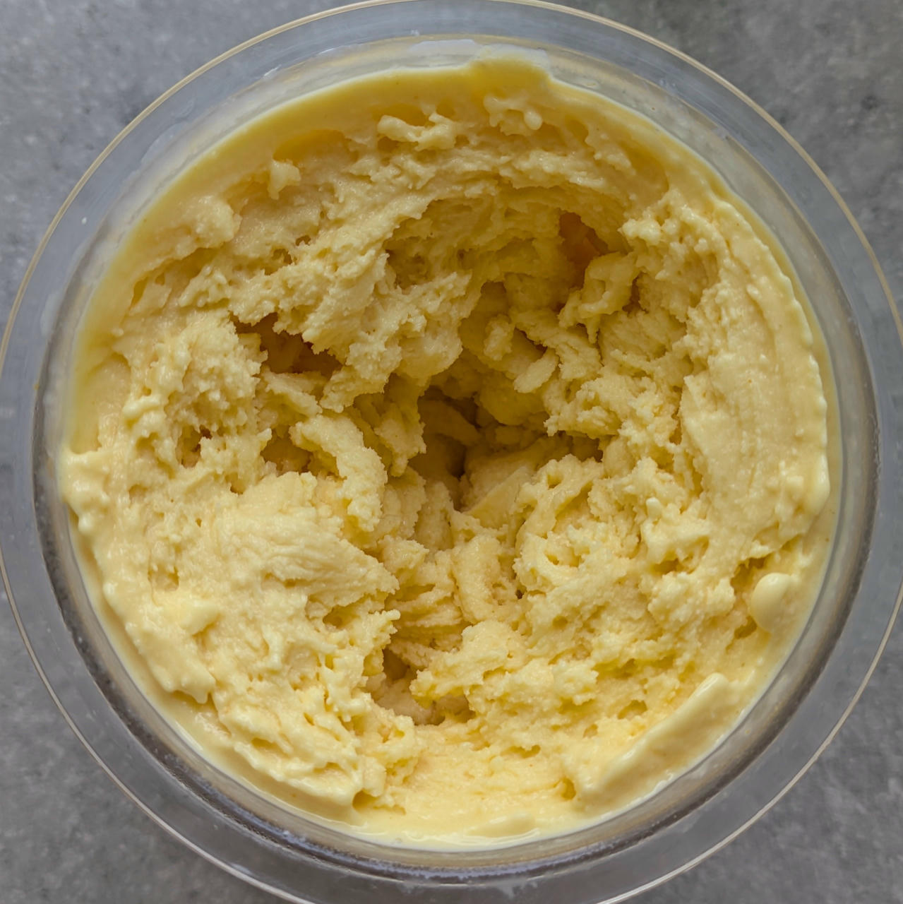
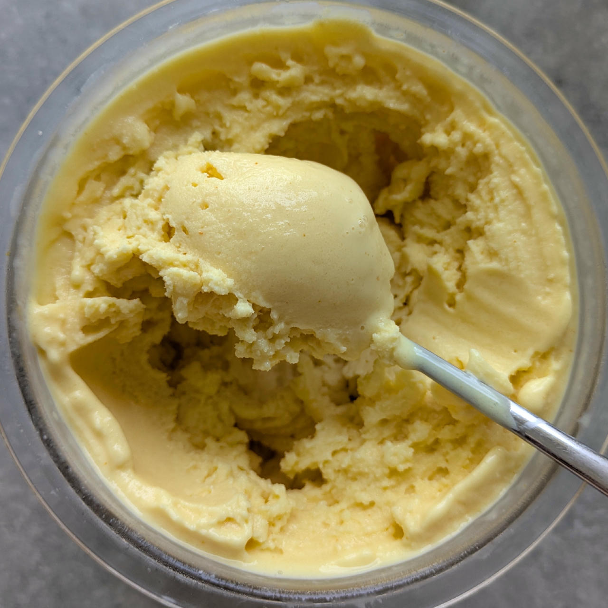
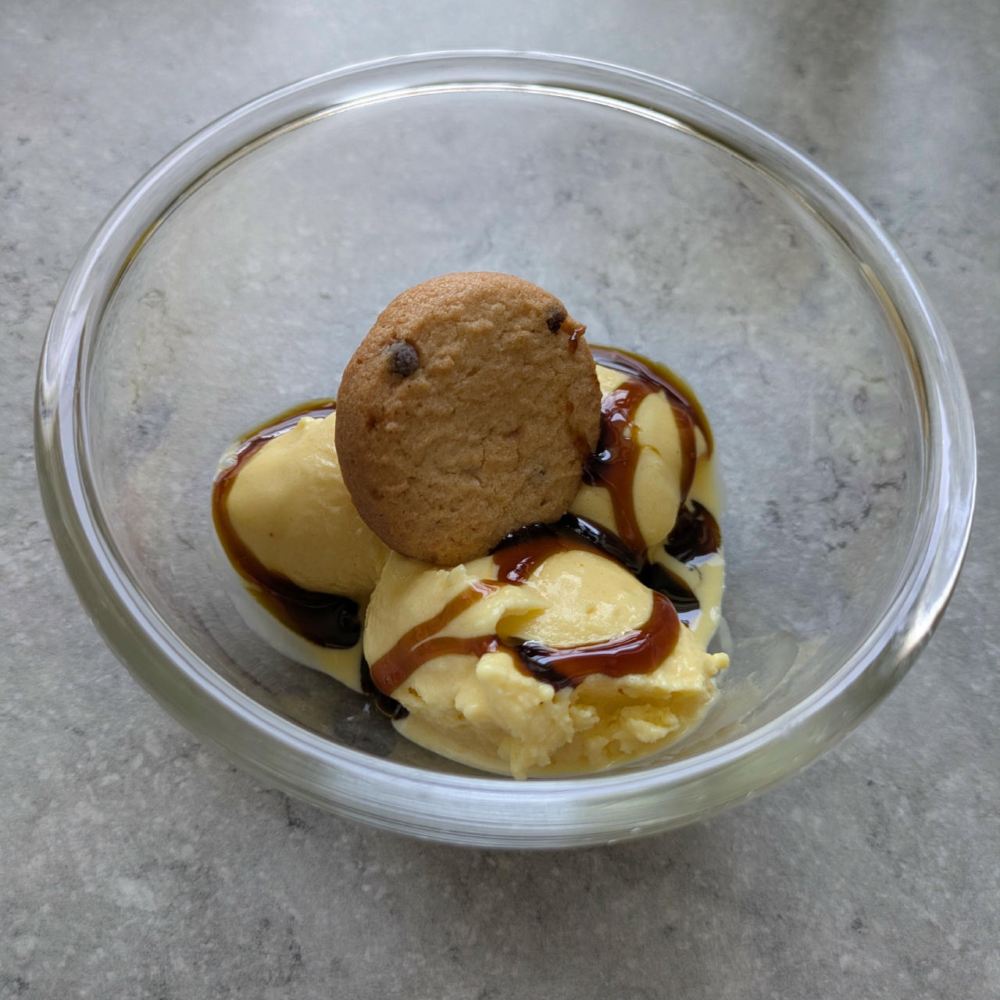
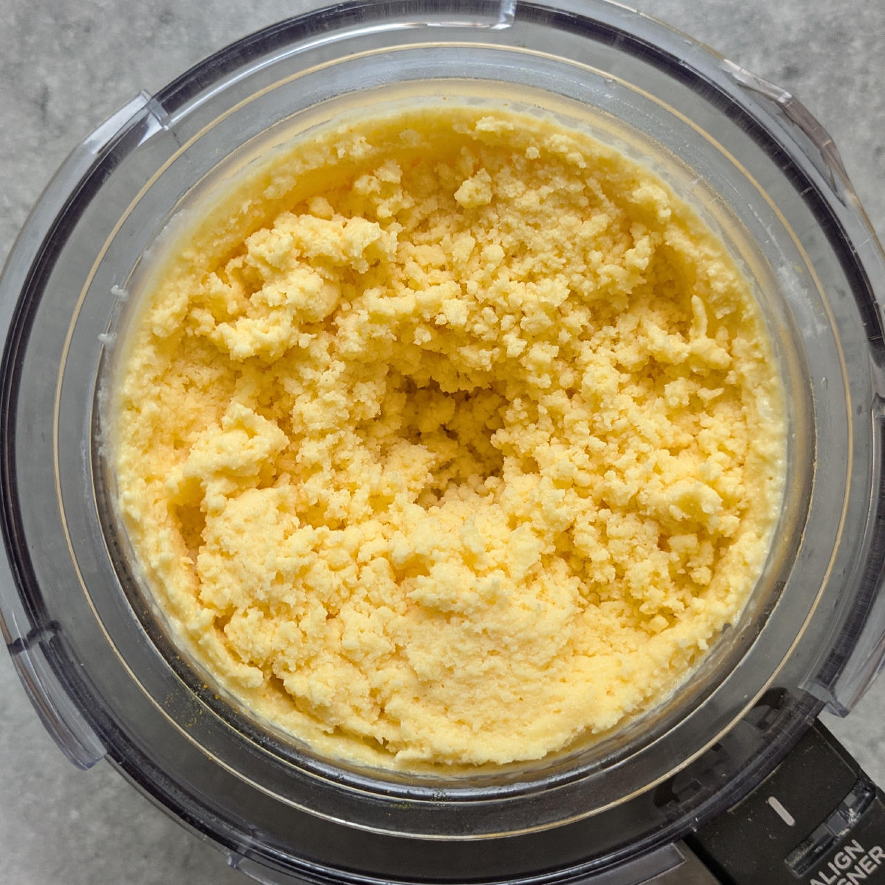
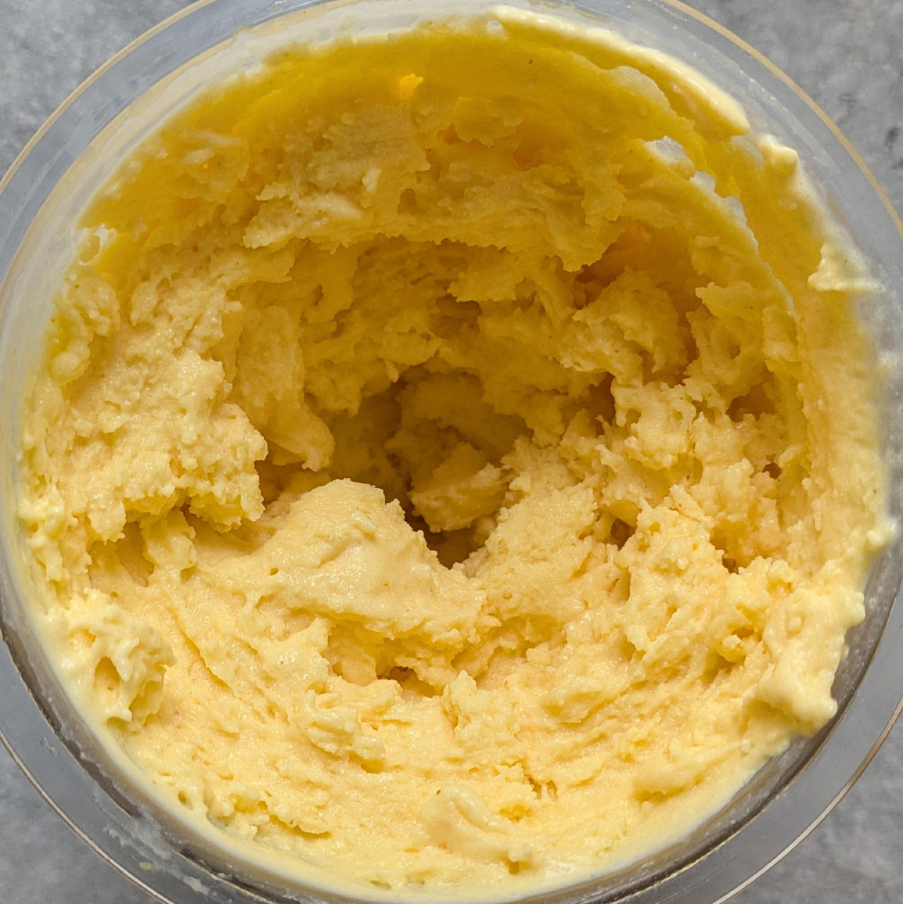
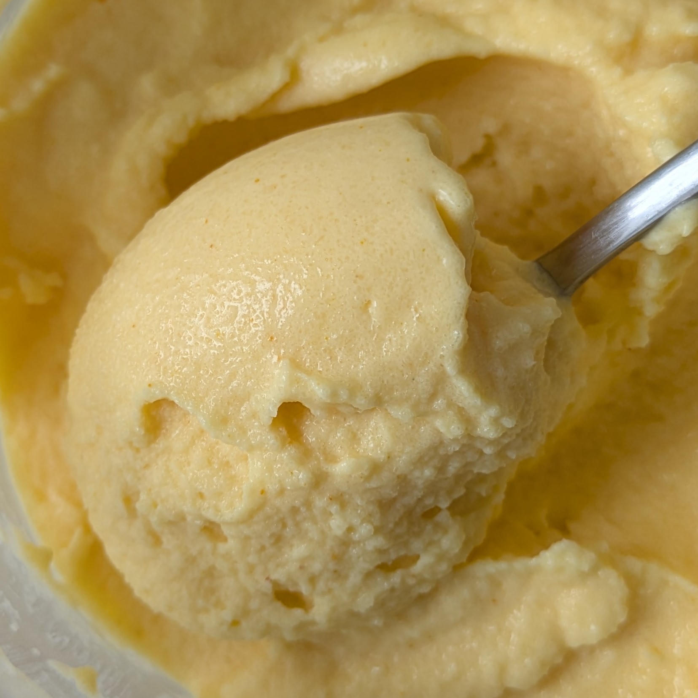

# Drunken Peach Cheesecake (Deluxe)

Canned peaches, quark (or cream cheese), and rum or bourbon. What could go wrong?

> 

Process on *Sorbet*, [hold it shortly under running water](https://jhermann.github.io/ice-creamery/info/tips%2Btricks/#handling-of-icy-sides-bottom)
*after* that.
Then a scrape-down and a respin or mix-in. 

> 
> 
> 

Rating: 😋🍑🍑🍑🍰 (used sorbet + mix-in; dense, cheesy, and very peachy)

> 

Spun on *Ice Cream*, respin, and *Ice Cream* again.

> 
> 
> 

!!! info "Simple Recipe"

    Read [About 'Simple' Recipes](/ice-creamery/info/tips%2Btricks/#about-simple-recipes)    regarding 'exotic' ingredients and their alternatives.

# INGREDIENTS

ℹ️ Brand names are in square brackets `[...]`.

**Wet**

  - _375g_ Peaches in Grape Juice [Libby’s] (≈1 cup + 4 oz + 1 tbsp) • Can = 410g <a id="id-8c13927" href="https://jhermann.github.io/ice-creamery/info/nutrition/#id-8c13927">ℹ️</a>
  - _240g_ [Topfen / Quark 14.4% \[Berchtesgadener\]](/ice-creamery/info/ingredients/#quark-topfen){target="_blank"}↗ (≈1 cup) • 250g container; *alternative:* 180g ricotta 9% and 60ml cream 32% <a id="id-8def8e1" href="https://jhermann.github.io/ice-creamery/info/nutrition/#id-8def8e1">ℹ️</a>
  - _40g_ [Jamaica Rum 43 vol%](/ice-creamery/info/ingredients/#alcohol-ethanol){target="_blank"}↗ (≈1 oz + 2 ¼ tsp) • *alternative:* bourbon, or other 40 vol% alcohol <a id="id-fc50a2a" href="https://jhermann.github.io/ice-creamery/info/nutrition/#id-fc50a2a">ℹ️</a>

**Dry**

  - _35g_ [SweEX (Erythritol + Xylitol 3:2)](/ice-creamery/info/ingredients/#sweex-erythritol-xylitol-blend){target="_blank"}↗ (≈1 oz + 1 ¼ tsp) • *alternative:* 47g allulose or dextrose <a id="id-f44b101" href="https://jhermann.github.io/ice-creamery/info/nutrition/#id-f44b101">ℹ️</a>
  - _1 pinch_ Turmeric • *optional*, for color

**Fill to MAX**

  - _≈4 drops_ Flavor drops Peach / Maracuja (sucralose) [IronMaxx] • to taste

**Topping Options**

  - _8g_ Molasses [Grafschafter Goldsaft] (≈1 ½ tsp) • add as a topping [24kcal, 5.3g sugar] <a id="id-e1cd5af" href="https://jhermann.github.io/ice-creamery/info/nutrition/#id-e1cd5af">ℹ️</a>
  - _8g_ Walnuts (organic) [Biojoy] (≈1 ½ tsp) • add as a topping [54kcal, 0.6g sugar] <a id="id-f5e36f4" href="https://jhermann.github.io/ice-creamery/info/nutrition/#id-f5e36f4">ℹ️</a>
  - _8g_ Pecan nuts (organic) [Biojoy] (≈1 ½ tsp) • 10 halves = 15g; add as a topping [58kcal, 0.3g sugar] <a id="id-9272ff3" href="https://jhermann.github.io/ice-creamery/info/nutrition/#id-9272ff3">ℹ️</a>

# DIRECTIONS

 1. Put ‘wet’ and ‘dry’ ingredients into an empty Creami tub (on a scale), and blend until smooth.
 1. Adapt sweetness to taste using the flavor drops, stir thoroughly.
 1. For better results, let the base age in the fridge (covered, lid on), for a few hours or over night. This helps flavor development and gum hydration, especially with unheated bases.
 1. Freeze for 24h with lid on, then spin as usual. Flatten any humps before that.
 1. Process with RE-SPIN mode when not creamy enough after the first spin.

# NUTRITIONAL & OTHER INFO

| 🥗 Value | 100g | Serving | Total |
| :--- | ---: | ---: | ---: |
| ⚖️ Weight (g) | 100 | 340 | 690 |
| 🔥 Energy (kcal) | 114.0 | 387.7 | 786.7 |
| 🫒 Fat (g) | 5.0 | 17.0 | 34.6 |
| 🍞 Carbohydrates (g) | 12.8 | 43.7 | 88.6 |
| 🍬 Sugars (g) | 6.1 | 20.9 | 42.4 |
| 💪 Protein (g) | 3.2 | 10.9 | 22.0 |
| 🧂 Salt (g) | 0.0 | 0.1 | 0.2 |

- **FPDF / [PAC](/ice-creamery/info/glossary/#potere-anti-congelante-pac){target="_blank"}↗ (target 20..30):** 32.85
- **Protein / Energy Ratio (ok=12%; hi=20%):** 11.20% • Low-Salt
- **Milk Solids Non-Fat ([MSNF](/ice-creamery/info/glossary/#milk-solids-not-fat-msnf){target="_blank"}↗, 7-11%):** 15.8g • 2.3%
- **Net carbs:** 53.6g • *∝ 5 servings@138g:* 10.7g • *∝ 3 servings@230g:* 17.9g • *energy ratio (low <20%):* 27.3%
