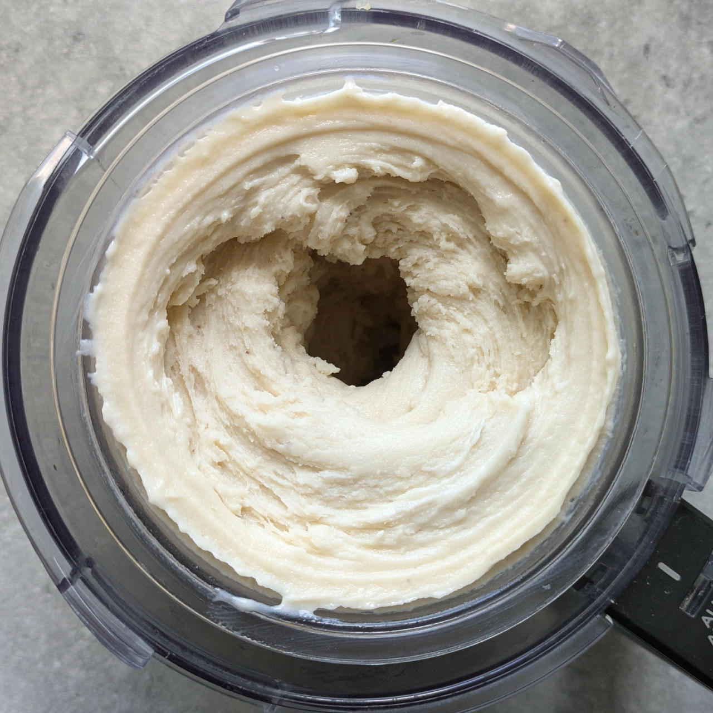
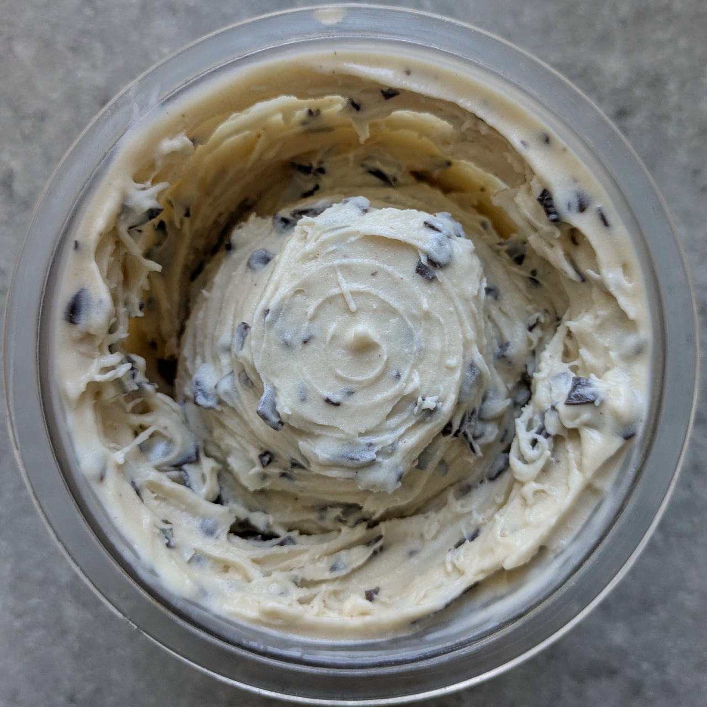
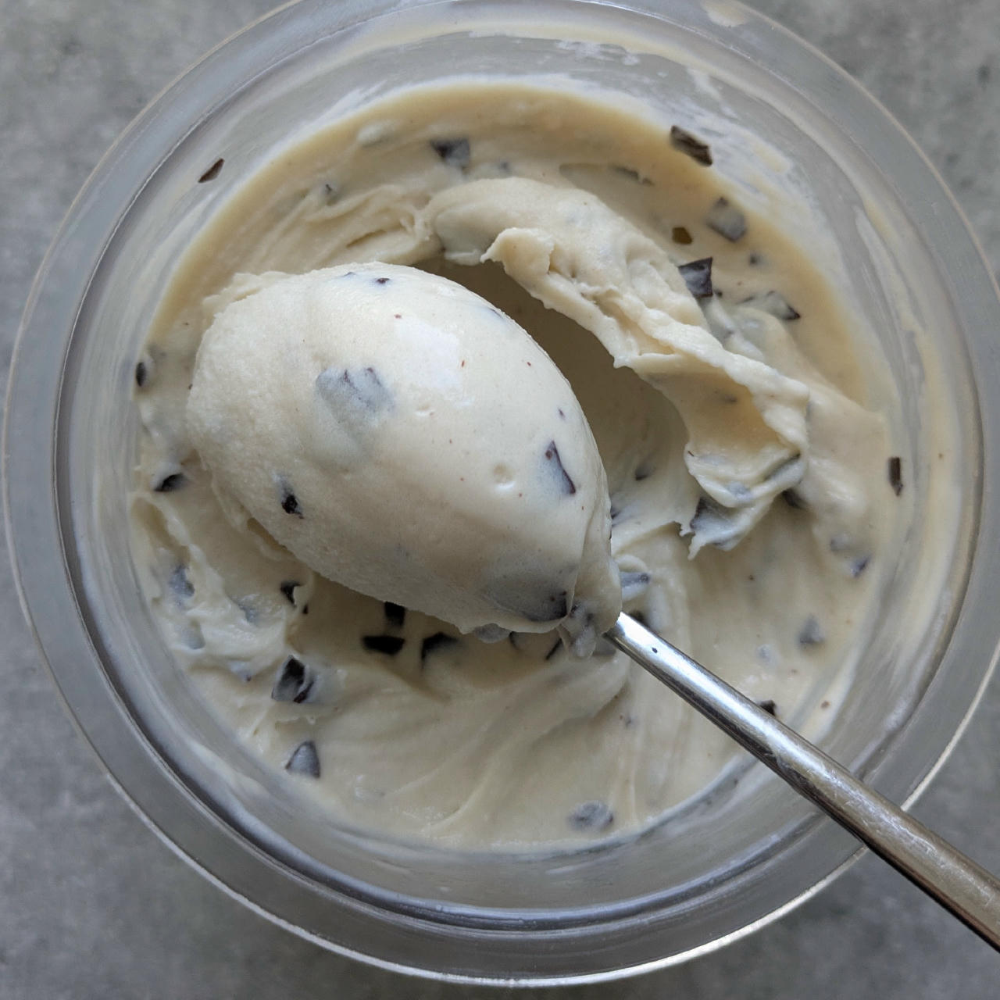
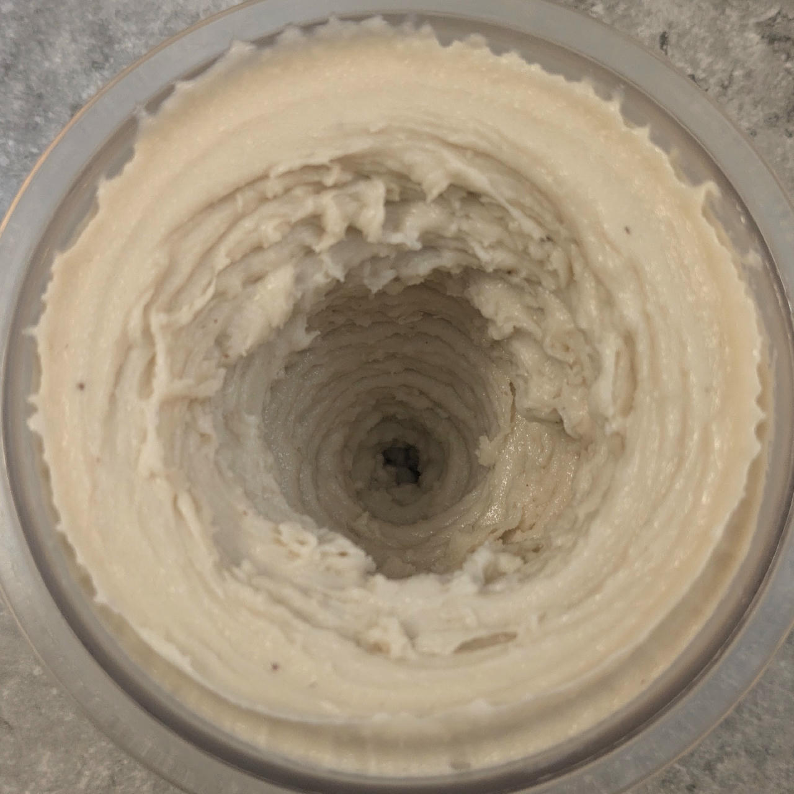

# Easy Peely (Deluxe)

Banana recipe with fewer ingredients and 50% bananas.

> 🌿 **Vegan & Dairy-free** Skip the optional cream for that.

Spin on “Light Ice Cream”, scrape down, and re-mix.

> 
> 
> 

Rating: 😋🍌🍌🍌🍫 (smooth and creamy, with a dark chocolate mix-in)

> 
> 
> 
>
> *2025-11-10: Light Ice Cream and respin, with manually mixed in dark chocolate shavings.*

# INGREDIENTS

ℹ️ Brand names are in square brackets `[...]`.

**Prep**

  - _340g_ Bananas (peeled) • ≈3 medium pieces
  - _15ml_ Lemon juice

**Wet**

  - _250ml_ [Soy milk 1.6% (sugar-free) \[Berief\]](/ice-creamery/info/ingredients/#soy-milk){target="_blank"}↗ • use any other preferred milk (~2% fat)
  - _15g_ [Glycerin (E422, VG) \[hd-line\]](/ice-creamery/info/ingredients/#vegetable-glycerin-glycerol-vg-e422){target="_blank"}↗

**Dry**

  - _35g_ [SweEX (Erythritol + Xylitol 3:2)](/ice-creamery/info/ingredients/#sweex-erythritol-xylitol-blend){target="_blank"}↗ • *alternative:* 47g allulose or dextrose
  - _15g_ [Inulin \[Vit4ever\]](/ice-creamery/info/ingredients/#inulin){target="_blank"}↗
  - _15g_ [Waxy Maize Starch (E1442) \[Ultratex\]](/ice-creamery/info/ingredients/#waxy-maize-starch-e1442){target="_blank"}↗ • *alternative:* [E1422](https://jhermann.github.io/ice-creamery/info/ingredients/#acetylated-distarch-adipate-e1422) / *any* modified starch
  - _1g_ Salt

**Fill to MAX**

  - _20ml_ Cream 32% [REWE Beste Wahl] • *optional* leave out to keep it vegan
  - _≈8 drops_ Flavor drops Vanilla (sucralose) [IronMaxx] • to taste

# DIRECTIONS

 1. Blend the bananas and the other ‘prep’ ingredients in an empty tub to a smooth puree.
 1. Add "wet" ingredients to the banana puree, and blend to combine.
 1. Weigh and mix dry ingredients, easiest by adding to a jar with a secure lid and shaking vigorously.
 1. Pour into the tub and *QUICKLY* use an immersion blender on full speed to homogenize everything.
 1. Let blender run until thickeners are properly hydrated, up to 1-2 min. Or blend again after waiting that time.
 1. Add remaining ingredients (to the MAX line) and stir with a spoon.
 1. Put on the lid, freeze for 24h, then spin as usual. Flatten any humps before that.
 1. Process with RE-SPIN mode when not creamy enough after the first spin.

# NUTRITIONAL & OTHER INFO

- **Nutritional values per 100g/ml:** 100g; 98.7 kcal; fat 1.8g; carbs 22.0g; sugar 8.0g; protein 1.7g; salt 0.2g
- **Nutritional values per ½ Deluxe Tub:** 340g; 335.5 kcal; fat 6.0g; carbs 74.9g; sugar 27.2g; protein 5.9g; salt 0.7g
- **Nutritional values total:** 706g; 696.7 kcal; fat 12.5g; carbs 155.4g; sugar 56.5g; protein 12.3g; salt 1.4g
- **FPDF / [PAC](/ice-creamery/info/glossary/#potere-anti-congelante-pac){target="_blank"}↗ (target 20..30):** 30.61
- **Protein / Energy Ratio (ok=12%; hi=20%):** 7.04% • LOW-FAT
- **Milk Solids Non-Fat ([MSNF](/ice-creamery/info/glossary/#milk-solids-not-fat-msnf){target="_blank"}↗, 7-11%):** 11.3g • 1.6%
- **Net carbs:** 99.6g • *∝ 5 servings@141g:* 19.9g • *∝ 3 servings@235g:* 33.2g • *energy ratio (low <20%):* 57.2%
