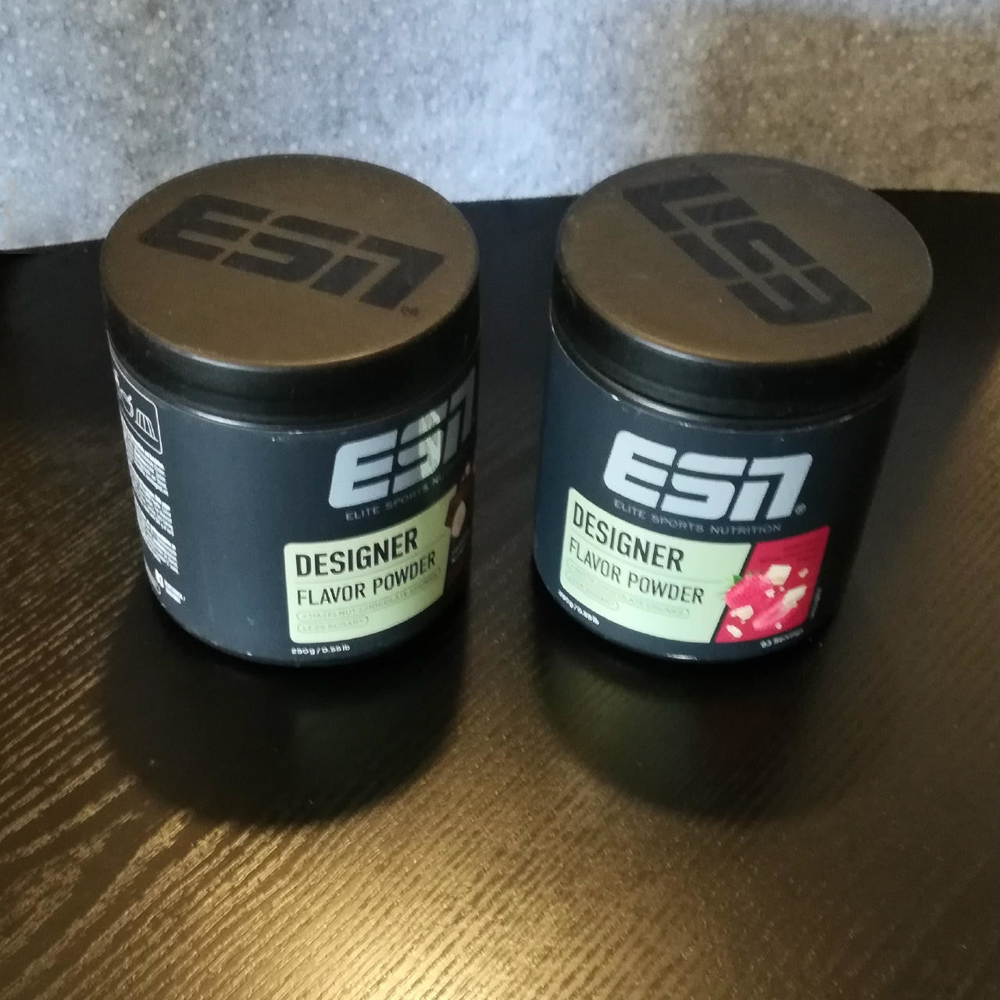
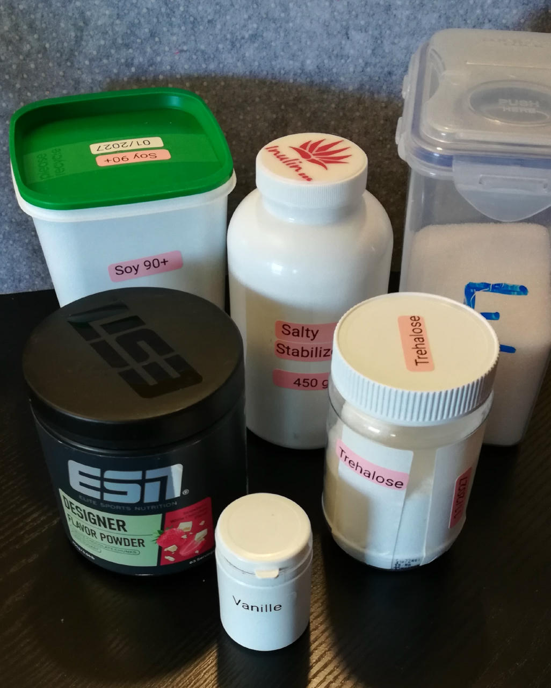
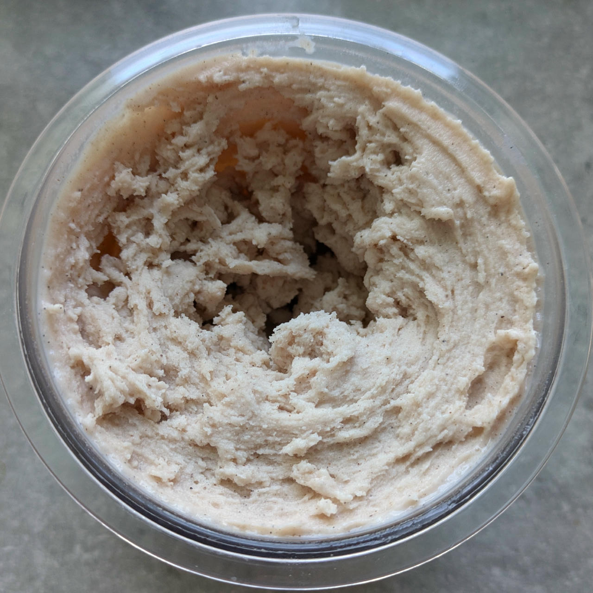
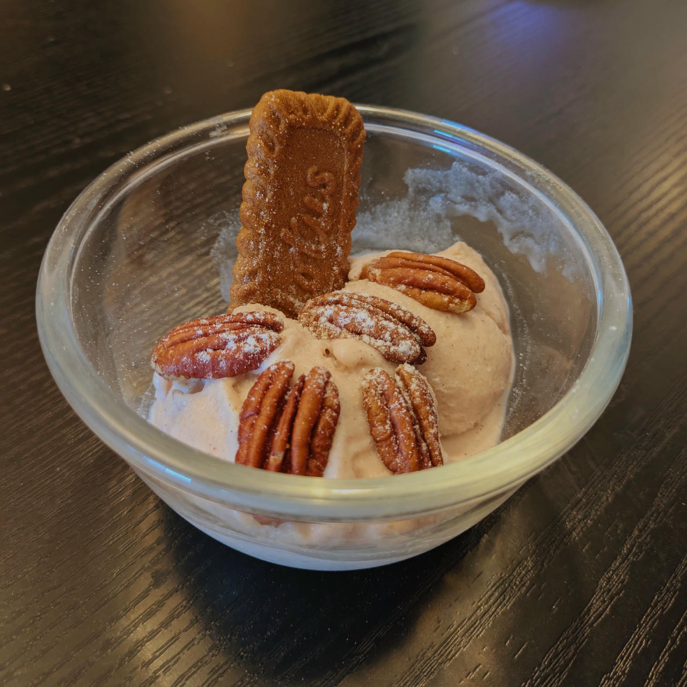

# Epic Spoons of Nom (Deluxe)

> *Scoop big. Nom bigger. Taste the ESN.*
> 
> 

This is a recipe specifically for ESN’s “Designer Flavor Powder”
— it is a low-sugar soy milk base with a touch of vanilla and only mild sweetness without the flavor powder.

> 
> 
> üåø **Vegan & Dairy-free** Recipe is using only soy milk and protein.

Spin on “FroYo”, scrape down, and mix-in.

> 
> 
> 
>
> *Made with buttermilk, spun on sorbet followed by a respin.*

Rating: üòãüòãüòãüòã (when using 12g, fixed)

> 
>
> Firmed up, served with pecans and a cookie.

!!! tip "You can also use 500ml buttermilk instead of soy milk, and leave out 10g of the sweetener (use 30g)."

# INGREDIENTS

ℹ️ Brand names are in square brackets `[...]`.

**Wet**

  - _500ml_ [Soy milk 1.6% (sugar-free) \[Berief\]](/ice-creamery/info/ingredients/#soy-milk){target="_blank"}↗ • *alternative*: any other preferred milk (~2% fat)
  - _15g_ [Glycerin (E422, VG) \[hd-line\]](/ice-creamery/info/ingredients/#vegetable-glycerin-glycerol-vg-e422){target="_blank"}↗ • POD = 60%; GI = 5; Density = 1.26 g/ml
  - _15g_ [Brandy or Vodka 40 vol%](/ice-creamery/info/ingredients/#alcohol-ethanol){target="_blank"}↗ • *alternative:* 12g (additional) VG for a sober recipe

**Dry**

  - _40g_ [SweEX (Erythritol + Xylitol 3:2)](/ice-creamery/info/ingredients/#sweex-erythritol-xylitol-blend){target="_blank"}↗ • *alternative:* 53g allulose or dextrose
  - _15g_ [Salty Stability \[Inulin / GMS / CMC / Guar / XG / Salt\]](/ice-creamery/S/Salty%20Stability/){target="_blank"}↗ • *not-as-good substitute:* 1.5g guar, 0.5g xanthan, and 0.5g salt
  - _20g_ [Soy protein isolate (nature) \[Powerstar\]](/ice-creamery/info/ingredients/#soy-protein-isolate){target="_blank"}↗ • 1kg bag, unsweetened, unflavored
  - _8g_ Designer Flavor Powder [ESN] • ≈70% inulin
  - _2g_ Vanilla Bean Powder [InterVanilla]

**Fill to MAX**

  - _60ml_ [Soy milk 1.6% (sugar-free) \[Berief\]](/ice-creamery/info/ingredients/#soy-milk){target="_blank"}↗ • *alternative*: any other preferred milk (~2% fat)
  - _≈1 drops_ Flavor drops Vanilla (sucralose) [IronMaxx] • to taste

# DIRECTIONS

 1. Add "wet" ingredients to empty Creami tub.
 1. Weigh and mix dry ingredients, easiest by adding to a jar with a secure lid and shaking vigorously.
 1. Pour into the tub and *QUICKLY* use an immersion blender on full speed to homogenize everything.
 1. Let blender run until thickeners are properly hydrated, up to 1-2 min. Or blend again after waiting that time.
 1. Add remaining ingredients (to the MAX line) and stir with a spoon.
 1. For better results, let the base age in the fridge (covered, lid on), for a few hours or over night. This helps flavor development and gum hydration, especially with unheated bases.
 1. Freeze for 24h with lid on, then spin as usual. Flatten any humps before that.
 1. Process with RE-SPIN mode when not creamy enough after the first spin.

# NUTRITIONAL & OTHER INFO

- **Nutritional values per 100g/ml:** 100g; 67.7 kcal; fat 1.5g; carbs 11.2g; sugar 0.4g; protein 5.2g; salt 0.2g
- **Nutritional values per ¬Ω Deluxe Tub:** 340g; 230.2 kcal; fat 5.1g; carbs 38.1g; sugar 1.3g; protein 17.6g; salt 0.7g
- **Nutritional values total:** 675g; 456.9 kcal; fat 10.2g; carbs 75.6g; sugar 2.7g; protein 34.9g; salt 1.5g
- **FPDF / [PAC](/ice-creamery/info/glossary/#potere-anti-congelante-pac){target="_blank"}‚Üó (target 20..30):** 31.62
- **Protein / Energy Ratio (ok=12%; hi=20%):** 30.60% • LOW-FAT • Low-Sugar • Hi-Protein
- **Milk Solids Non-Fat ([MSNF](/ice-creamery/info/glossary/#milk-solids-not-fat-msnf){target="_blank"}↗, 7-11%):** 41.0g • 6.1%
- **Net carbs:** 16.6g • *∝ 5 servings@135g:* 3.3g • *∝ 3 servings@225g:* 5.5g • *energy ratio (low <20%):* 14.5%
- **15g 'Salty Stability' is:** 11.0g Inulin • 1.8g Glycerol Monostearate (GMS / E471) • 0.9g Tylose powder (E466, Tylo, CMC) • 0.6g Guar gum (E412) • 0.5g Salt • 0.2g Xanthan gum (E415, XG).
