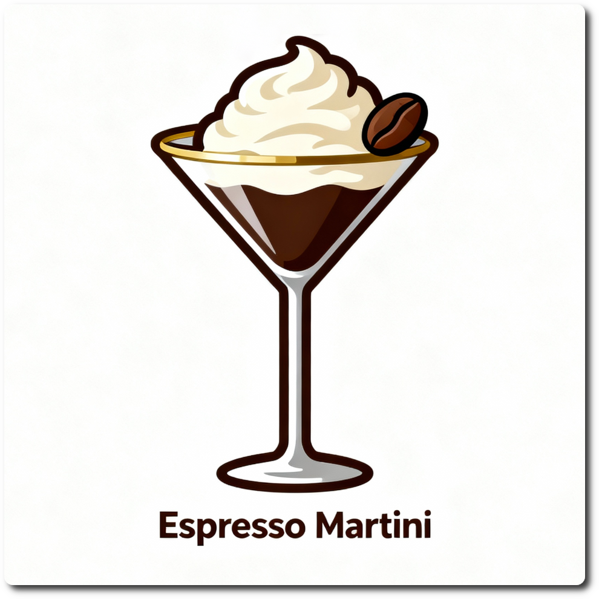

# Espresso Martini Light (Deluxe)

This imitates an *espresso martini*, a cocktail made with espresso, vodka, coffee liqueur, and a touch of sweetness.
It contains no gin or vermouth, but it's served in a martini glass.
The drink is known for its rich coffee flavor and potential to provide a caffeine boost.

This recipe adds no cream or other embellishments beyond the coffee and alcoholic beverages,
and has only about 250kcal in the whole Deluxe pint (or 500kcal if you make it more boozy).

Spin on “Sorbet”, scrape down, and mix-in if needed.

Pour in the additional alcohol after the 1st spin. It roughly doubles the energy value.

Rating: 😋🍸☕ (untested)
> 

# INGREDIENTS

ℹ️ Brand names are in square brackets `[...]`.

**Wet**

  - _450ml_ Strong Coffee (from 45g coffee beans)
  - _50ml_ [Coffee Liqueur 25 vol% \[Caffè Borghetti\]](/ice-creamery/info/ingredients/#alcohol-ethanol){target="_blank"}↗ • 1 bottle = 700ml
  - _15g_ [Vodka 40 vol%](/ice-creamery/info/ingredients/#alcohol-ethanol){target="_blank"}↗

**Dry**

  - _25g_ [Xylitol (E967)](/ice-creamery/info/ingredients/#xylitol-e967){target="_blank"}↗ • POD = 100%; GI = 7
  - _10g_ [Salty Stability \[Inulin / GMS / CMC / Guar / XG / Salt\]](/ice-creamery/S/Salty%20Stability/){target="_blank"}↗ • unsweetened “ICSv2”

**Fill to MAX**

  - _50ml_ Water to MAX line
  - _≈5 drops_ Flavor drops Vanilla (sucralose) [IronMaxx] • to taste

**Mix-ins**

  - _80g_ [Vodka 40 vol%](/ice-creamery/info/ingredients/#alcohol-ethanol){target="_blank"}↗ • *optional:* more booze as a mix-in [224kcal]

# DIRECTIONS

 1. Add "wet" ingredients to empty Creami tub.
 1. Weigh and mix dry ingredients, easiest by adding to a jar with a secure lid and shaking vigorously.
 1. Pour into the tub and *QUICKLY* use an immersion blender on full speed to homogenize everything.
 1. Let blender run until thickeners are properly hydrated, up to 1-2 min. Or blend again after waiting that time.
 1. Add remaining ingredients (to the MAX line) and stir with a spoon.
 1. Put on the lid, freeze for 24h, then spin as usual. Flatten any humps before that.
 1. Process with RE-SPIN mode when not creamy enough after the first spin.
 1. Process with MIX-IN after adding mix-ins evenly. For that, add partial amounts into a hole going down to the bottom, and fold the ice cream over, building pockets of mix-ins.

# NUTRITIONAL & OTHER INFO

- **Nutritional values per 100g/ml:** 100g; 41.4 kcal; fat 0.1g; carbs 7.6g; sugar 2.0g; protein 0.0g; salt 0.1g
- **Nutritional values per ½ Deluxe Tub:** 340g; 140.7 kcal; fat 0.2g; carbs 25.7g; sugar 6.8g; protein 0.0g; salt 0.2g
- **Nutritional values total:** 600g; 248.2 kcal; fat 0.4g; carbs 45.3g; sugar 12.1g; protein 0.0g; salt 0.4g
- **FPDF / [PAC](/ice-creamery/info/glossary/#potere-anti-congelante-pac){target="_blank"}↗ (target 20..30):** 31.08
- **Protein / Energy Ratio (ok=12%; hi=20%):** 0.05% • LOW-FAT • Low-Sugar • Low-Salt
- **Milk Solids Non-Fat ([MSNF](/ice-creamery/info/glossary/#milk-solids-not-fat-msnf){target="_blank"}↗, 7-11%):** 0.0g • 0.0%
- **Net carbs:** 13.0g • *∝ 5 servings@120g:* 2.6g • *∝ 3 servings@200g:* 4.3g • *energy ratio (low <20%):* 20.9%
- **10g 'Salty Stability' is:** 7.3g Inulin • 1.2g Glycerol Monostearate (GMS / E471) • 0.6g Tylose powder (E466, Tylo, CMC) • 0.4g Guar gum (E412) • 0.33g Salt • 0.13g Xanthan gum (E415, XG).
