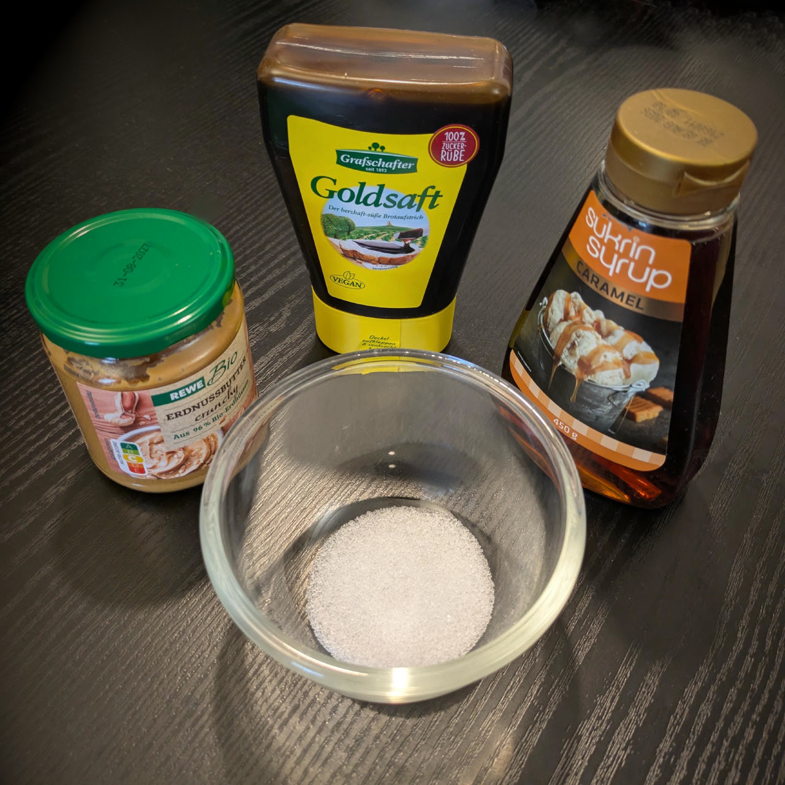

# Forget-Me-Nut Swirl

A scandalously smooth frozen memento of caramel nostalgia and unapologetically nutty, impossible to forget once tasted.

> 

Combine with your favorite vanilla or chocolate base.

> 

Rating: 😋🥜 (untested)

# INGREDIENTS

ℹ️ Brand names are in square brackets `[...]`.

  - _40ml_ Syrup Caramel (low-sugar) [Sukrin] • 14g sorbitol, erythritol, stevia
  - _20g_ Peanut butter (crunchy, organic) [REWE] • 250g glass jar
  - _10g_ [Erythritol (E968)](/ice-creamery/info/ingredients/#erythritol-e968){target="_blank"}↗ • POD = 75%
  - _5g_ Molasses [Grafschafter Goldsaft] • Sweetness = 66%

# DIRECTIONS

 1. Weigh and mix all ingredients in a small bowl.

# NUTRITIONAL & OTHER INFO
- **Nutritional values per 100g/ml:** 100g; 264.1 kcal; fat 13.6g; carbs 31.1g; sugar 6.6g; protein 6.8g; salt 0.2g
- **Nutritional values per serving (for 1 tub):** 75g; 198.1 kcal; fat 10.2g; carbs 23.4g; sugar 4.9g; protein 5.1g; salt 0.1g
- **FPDF / [PAC](/ice-creamery/info/glossary/#potere-anti-congelante-pac){target="_blank"}↗ (target 20..30):** 42.64
- **Net carbs:** 9.4g • *∝ 5 servings@15g:* 1.9g • *∝ 3 servings@25g:* 3.1g
