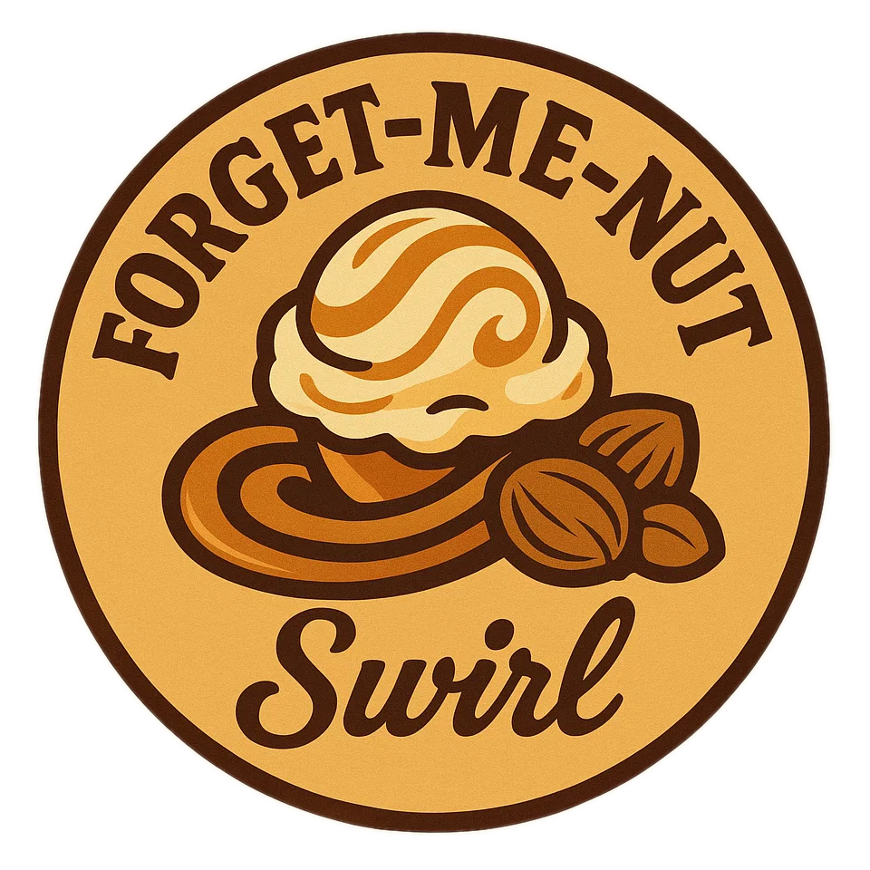
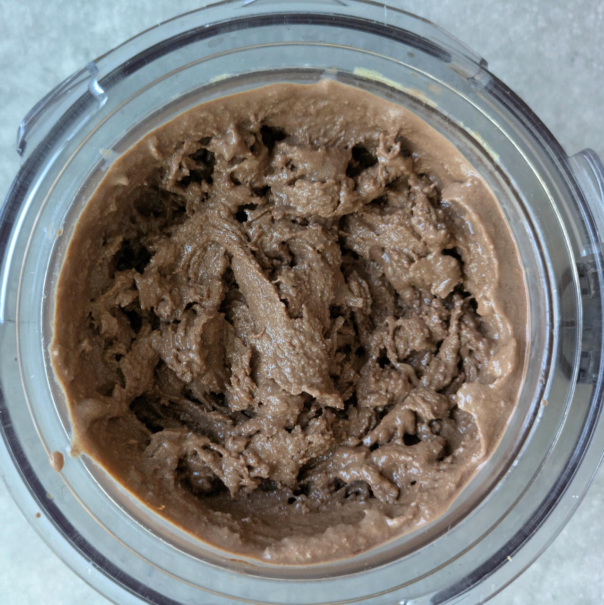
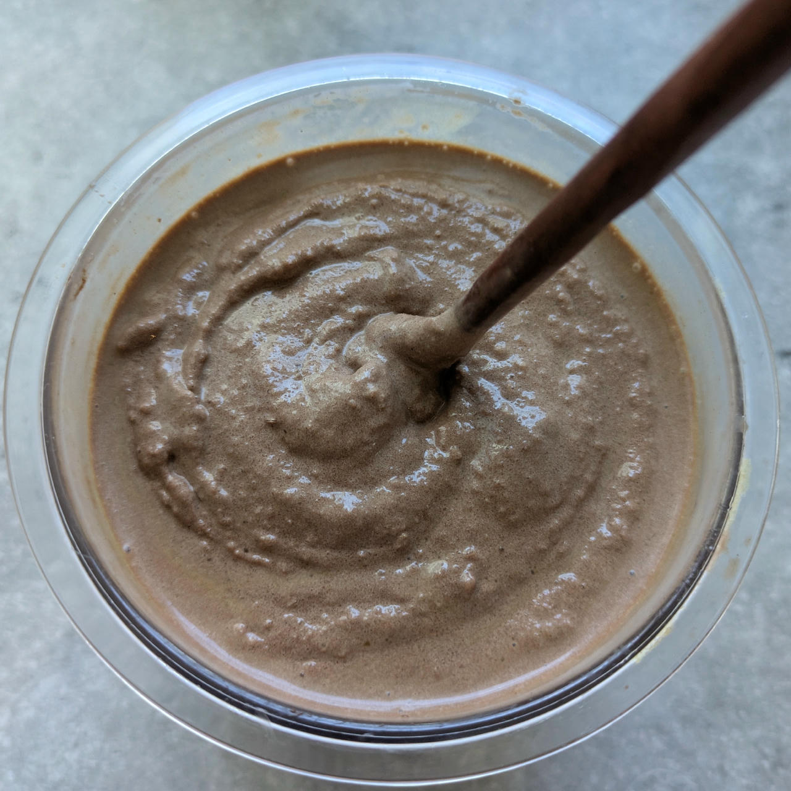
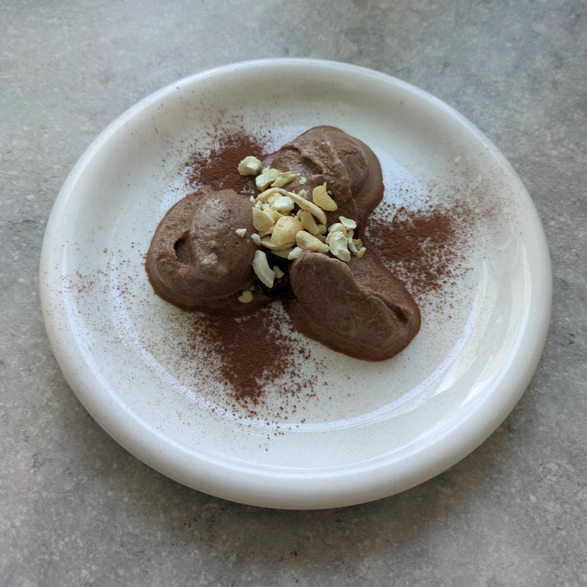

# Forget-Me-Nut Swirl

A scandalously smooth frozen memento of caramel nostalgia and unapologetically nutty, impossible to forget once tasted.

> 

Combine with your favorite vanilla or chocolate base.

> 
> 
> 
> 
> *Spun on Sorbet, swirl poured on top and folded in with a chopstick. Served on cherry confit, topped with crushed cashews.*

Rating: 😋😋😋🥜🥜

# INGREDIENTS

ℹ️ Brand names are in square brackets `[...]`.

  - _40ml_ Syrup Caramel (low-sugar) [Sukrin] • 14g sorbitol, erythritol, stevia
  - _30ml_ Cream 32% [REWE Beste Wahl]
  - _20g_ Peanut butter (crunchy, organic) [REWE] • 250g glass jar
  - _10g_ [Brandy or Vodka 40 vol%](/ice-creamery/info/ingredients/#alcohol-ethanol){target="_blank"}↗
  - _5g_ [Glycerin (E422, VG) \[hd-line\]](/ice-creamery/info/ingredients/#vegetable-glycerin-glycerol-vg-e422){target="_blank"}↗ • POD = 60%; GI = 5; Density = 1.26 g/ml

# DIRECTIONS

 1. Weigh and mix all ingredients in a small bowl.

# NUTRITIONAL & OTHER INFO
- **Nutritional values per 100g/ml:** 100g; 306.4 kcal; fat 18.9g; carbs 15.0g; sugar 2.5g; protein 5.5g; salt 0.1g
- **Nutritional values per serving (for 1 tub):** 105g; 321.7 kcal; fat 19.8g; carbs 15.8g; sugar 2.6g; protein 5.8g; salt 0.2g
- **FPDF / [PAC](/ice-creamery/info/glossary/#potere-anti-congelante-pac){target="_blank"}↗ (target 20..30):** 47.58
- **Net carbs:** 9.3g • *∝ 5 servings@21g:* 1.9g • *∝ 3 servings@35g:* 3.1g
- **Jun 28, 2025:** Erythritol → Brandy + VG; no molasses
