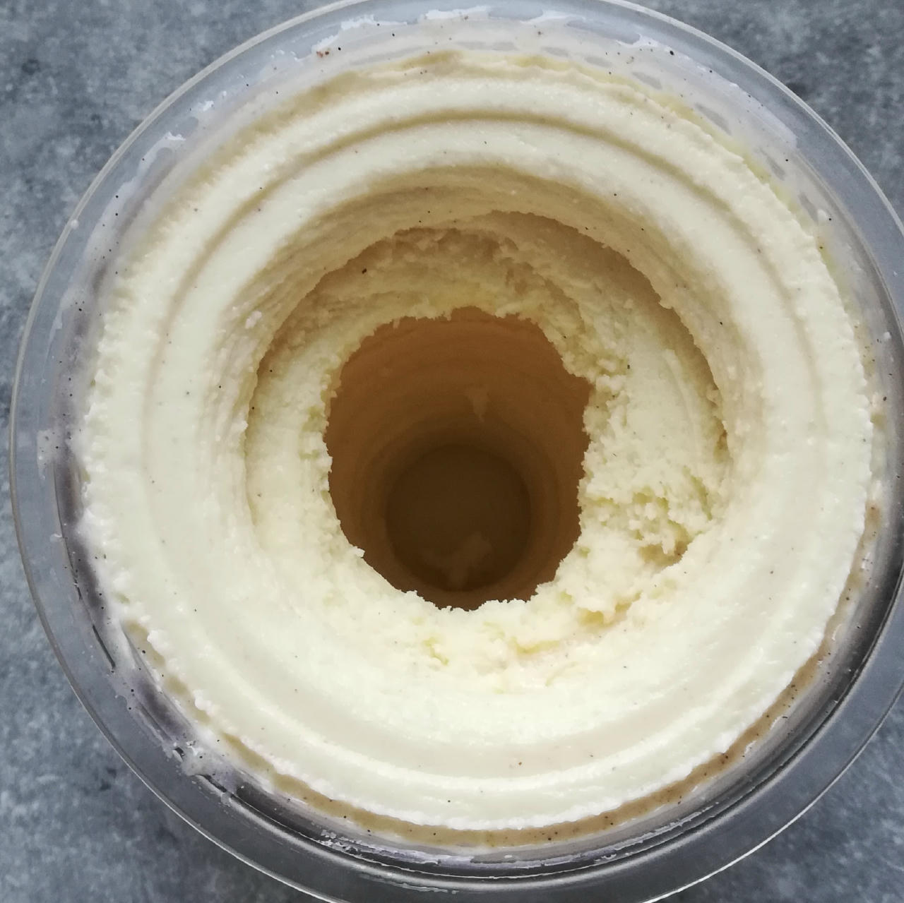
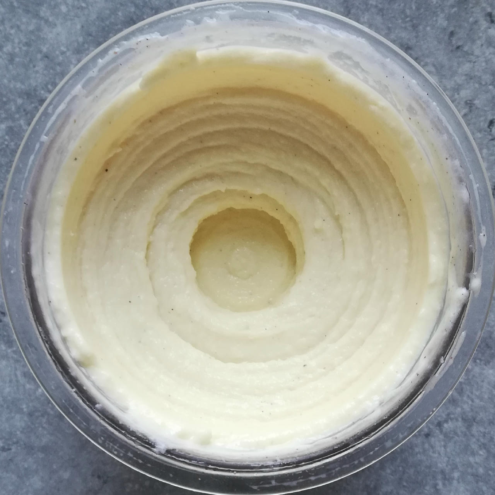
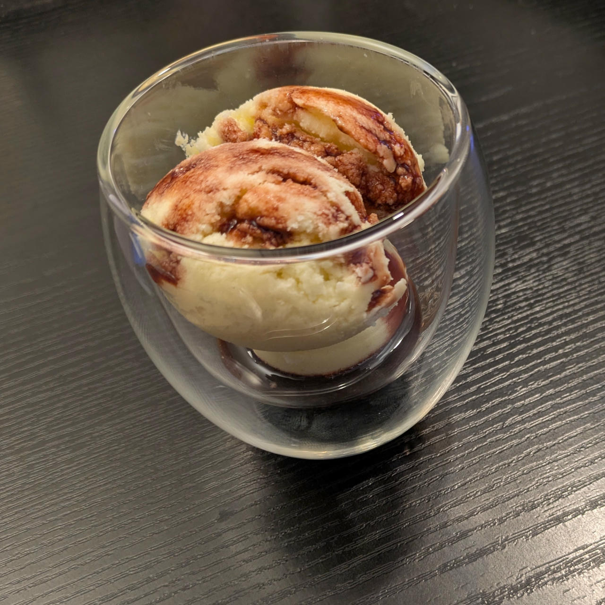
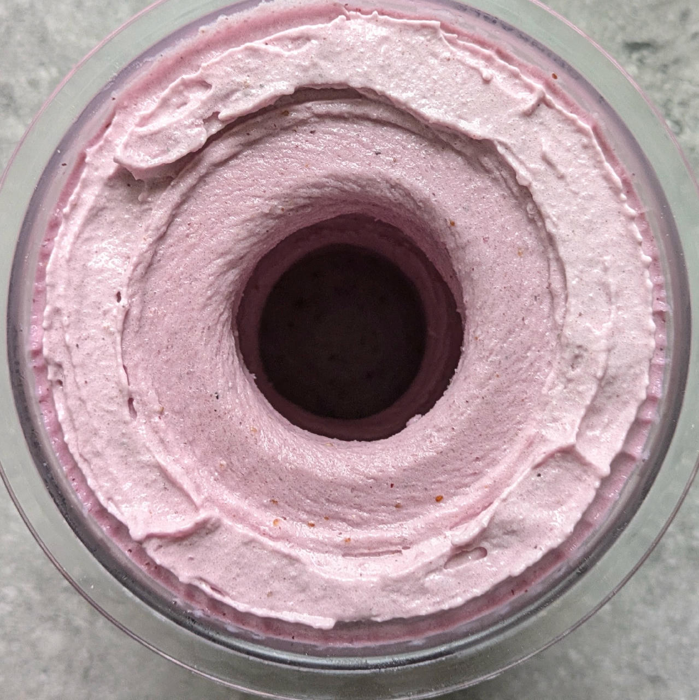
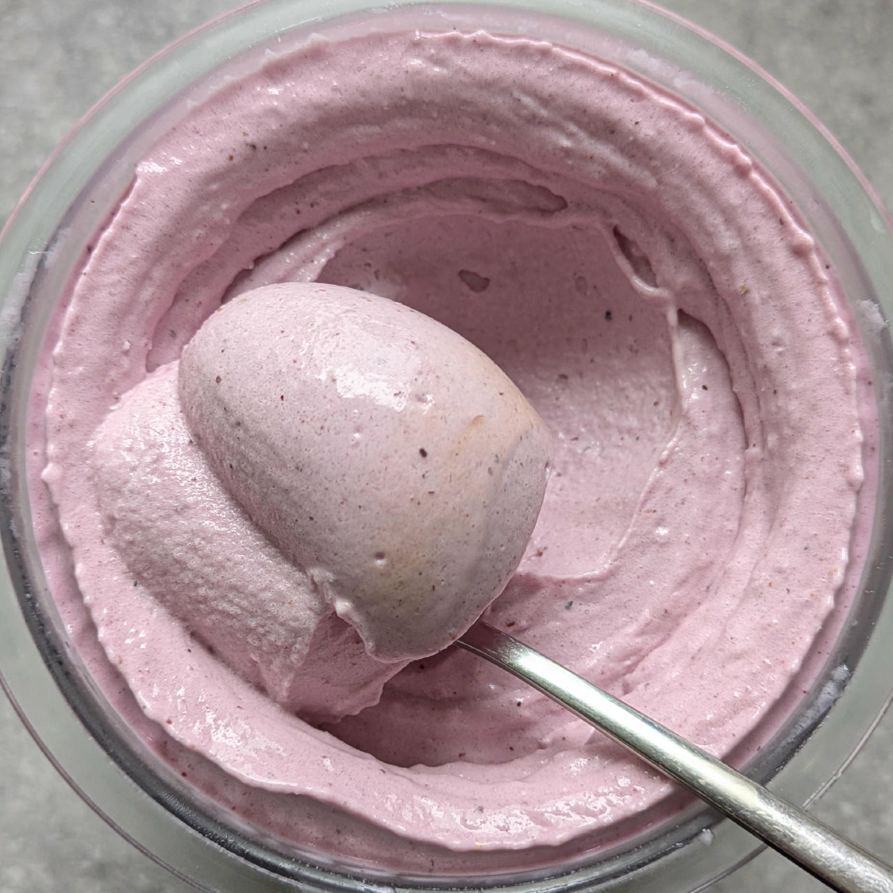
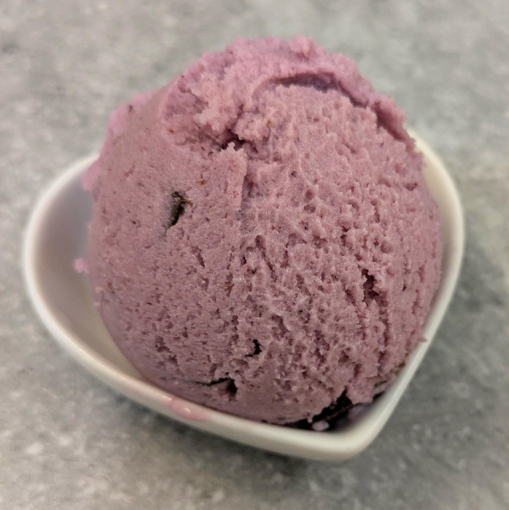

# Fruit Kefir (Deluxe)

This recipe blends mild kefir and various fruit options for a creamy ice cream with a gentle, tangy taste.

It’s lightly sweetened and includes some added protein, making it a satisfying but not overly rich dessert.
It’ll stay smooth and easy to scoop straight from the freezer.

See “*Optional / Choices*” for inspiration on other fruit with about the same or better macros

Process on *Frozen Yogurt*, [hold it shortly under running water](https://jhermann.github.io/ice-creamery/info/tips%2Btricks/#handling-of-icy-sides-bottom)
*after* that.Then a scrape-down and a respin.

With an older version of the recipe, the base went from almost -18°C to -7°C after the respin.
Served after 1h refreezing with pomegranate syrup.

> 
> 
> 
> 
> Rating: 😋😋😋 (flavor is good, but needs to be creamier)

This is a combination of blueberries and strawberries (1:1) using the new formulation from September 2025.

> 
> 
> 
> 
> 
> Rating: 😋🫐🫐🍓🍓 (FroYo & Respin, very creamy and soft)

# INGREDIENTS

ℹ️ Brand names are in square brackets `[...]`.

**Wet**

  - _400g_ Kefir mild 1.5% [Milsani / Aldi] • 500g container • Alternative: Buttermilk
  - _225g_ Blueberries • fresh or frozen [108kcal, 20g sugar]
  - _15g_ [Glycerin (E422, VG) \[hd-line\]](/ice-creamery/info/ingredients/#vegetable-glycerin-glycerol-vg-e422){target="_blank"}↗ • Sweetness = 60%; GI = 5; Density = 1.26 g/ml
  - _10g_ [Brandy or Vodka 40 vol%](/ice-creamery/info/ingredients/#alcohol-ethanol){target="_blank"}↗ • *alternative:* 8g (additional) VG for a sober recipe

**Dry**

  - _30g_ [SweEX (Erythritol + Xylitol 3:2)](/ice-creamery/info/ingredients/#sweex-erythritol-xylitol-blend){target="_blank"}↗ • *alternative:* 40g allulose or dextrose
  - _20g_ [Whey + Casein protein (grass-fed) \[Vilgain\]](/ice-creamery/info/ingredients/#whey-protein){target="_blank"}↗ • with stevia; use plant protein for vegan
  - _15g_ [Salty Stability \[Inulin / GMS / CMC / Guar / XG / Salt\]](/ice-creamery/S/Salty%20Stability/){target="_blank"}↗ • *not-as-good substitute:* 1.5g guar, 0.5g xanthan, and 0.5g salt

**Fill to MAX**

  - _≈7 drops_ Flavor drops Strawberry (sucralose) [IronMaxx] • to taste

**Optional / Choices**

  - _225g_ Blueberries • fresh or frozen [108kcal, 20g sugar]
  - _175g_ Cherries • fresh or frozen [107kcal, 17g sugar]
  - _200g_ Kiwi • fresh [104kcal, 17g sugar]
  - _200g_ Mango • fresh or frozen [124kcal, 26g sugar]
  - _175g_ Pineapple in juice [Del Monte] • canned [119kcal, 26g sugar]
  - _225g_ Strawberries • fresh or frozen [70kcal, 13g sugar]

# DIRECTIONS

 1. Add "wet" ingredients to empty Creami tub.
 1. Weigh and mix dry ingredients, easiest by adding to a jar with a secure lid and shaking vigorously.
 1. Pour into the tub and *QUICKLY* use an immersion blender on full speed to homogenize everything.
 1. Let blender run until thickeners are properly hydrated, up to 1-2 min. Or blend again after waiting that time.
 1. Add remaining ingredients (to the MAX line) and stir with a spoon.
 1. Put on the lid, freeze for 24h, then spin as usual. Flatten any humps before that.
 1. Process with RE-SPIN mode when not creamy enough after the first spin.

# NUTRITIONAL & OTHER INFO

- **Nutritional values per 100g/ml:** 100g; 74.7 kcal; fat 1.2g; carbs 13.4g; sugar 5.4g; protein 4.2g; salt 0.2g
- **Nutritional values per ½ Deluxe Tub:** 340g; 253.8 kcal; fat 4.0g; carbs 45.7g; sugar 18.3g; protein 14.1g; salt 0.5g
- **Nutritional values total:** 715g; 533.8 kcal; fat 8.4g; carbs 96.1g; sugar 38.4g; protein 29.7g; salt 1.1g
- **FPDF / [PAC](/ice-creamery/info/glossary/#potere-anti-congelante-pac){target="_blank"}↗ (target 20..30):** 28.92
- **Protein / Energy Ratio (ok=12%; hi=20%):** 22.29% • LOW-FAT • Hi-Protein
- **Milk Solids Non-Fat ([MSNF](/ice-creamery/info/glossary/#milk-solids-not-fat-msnf){target="_blank"}↗, 7-11%):** 48.1g • 6.7%
- **Net carbs:** 47.6g • *∝ 5 servings@143g:* 9.5g • *∝ 3 servings@238g:* 15.9g • *energy ratio (low <20%):* 35.6%
- **15g 'Salty Stability' is:** 11.0g Inulin • 1.8g Glycerol Monostearate (GMS / E471) • 0.9g Tylose powder (E466, Tylo, CMC) • 0.6g Guar gum (E412) • 0.5g Salt • 0.2g Xanthan gum (E415, XG).
