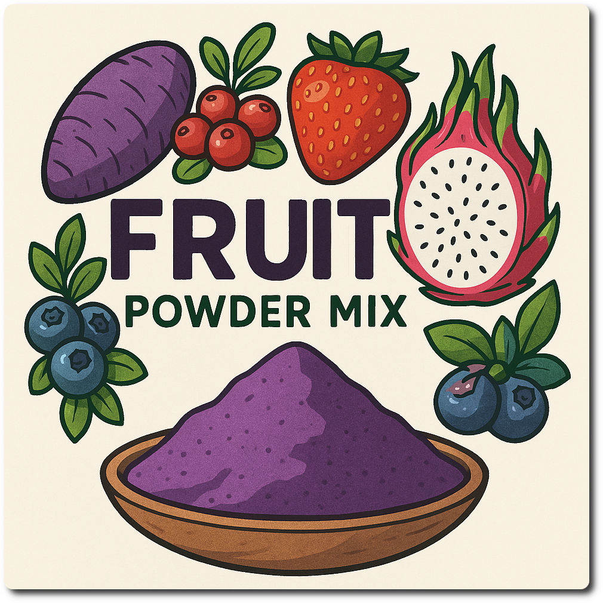

# Fruit Powder Mix (Deluxe)

This one is a favorite, so it gets its own recipe mix for convenient indulgence…

It works for fruit or root powders with a sugar content from low (Ube, 10%) to high (Lingonberry, 73%).
Counting the pre-made mix as one, it is a 6 ingredients recipe for the final base, including the water.

Use 93g of the mix in your final base (or 62g for a regular 16oz tub).

Spun in Light Ice Cream mode, plus a mix-in run with 10g freeze-dried strawberry slices.
Comes out as soft-serve, I put it back into the cold for 45min for a firmer consistency.

> 

To make your life easier, take the “prep” ingredients times 5, mix them,
and store in an air-tight 1l container (the powder has a low density and needs space).
To mix, take a BIG bowl like used for baking, measure the ingredients,
and whisk them carefully but thoroughly. A ball whisk works best.

**Serves:** 5 tubs          
**Total:** 463 g          
**Per tub:** 93 g          

 * 75 g Whey protein Vanilla [MaxiNutrition]
 * 150 g Xylitol
 * 75 g Skim Milkpowder 1:10 [Vita2You]
 * 75 g Erythritol (E968)
 * 75 g Inulin [Vit4ever]
 * 7.50 g Tylose powder (E466, Tylo, CMC)
 * 2.50 g Tara gum (E417)
 * 2.50 g Salt
 * 0.75 g Xanthan gum (E415, XG)

# INGREDIENTS

ℹ️ Brand names are in square brackets `[...]`.

**Prep**

  - _15g_ [Whey protein Vanilla \[MaxiNutrition\]](/ice-creamery/info/ingredients/#whey-protein){target="_blank"}↗
  - _30g_ [Xylitol](/ice-creamery/info/ingredients/#xylitol-e967){target="_blank"}↗ • Sweetness = 100%; GI = 7
  - _15g_ [Skim Milkpowder 1:10 \[Vita2You\]](/ice-creamery/info/ingredients/#skim-milk-powder-smp){target="_blank"}↗
  - _15g_ [Erythritol (E968)](/ice-creamery/info/ingredients/#erythritol-e968){target="_blank"}↗ • Sweetness = 75%
  - _15g_ [Inulin \[Vit4ever\]](/ice-creamery/info/ingredients/#inulin){target="_blank"}↗ • Sweetness = 8%; GI ~= 0
  - _1.5g_ [Tylose powder (E466, Tylo, CMC)](/ice-creamery/info/ingredients/#carboxymethyl-cellulose-cmc-e466){target="_blank"}↗
  - _0.5g_ [Tara gum (E417)](/ice-creamery/info/ingredients/#tara-gum-e417){target="_blank"}↗
  - _0.5g_ Salt
  - _0.15g_ [Xanthan gum (E415, XG)](/ice-creamery/info/ingredients/#xanthan-gum-xg-e415){target="_blank"}↗

**Wet**

  - _400ml_ [Soy milk 1.6% (sugar-free) \[Berief\]](/ice-creamery/info/ingredients/#soy-milk){target="_blank"}↗
  - _100g_ [Cottage Cheese 4% \[REWE Bio\]](/ice-creamery/info/ingredients/#cottage-cheese){target="_blank"}↗
  - _15g_ [Glycerin (E422, VG) \[hd-line\]](/ice-creamery/info/ingredients/#vegetable-glycerin-glycerol-vg-e422){target="_blank"}↗ • Sweetness = 60%; GI = 5
  - _10g_ [Brandy “Williams Birne” 40 vol%](/ice-creamery/info/ingredients/#alcohol-ethanol){target="_blank"}↗

**Dry**

  - _20g_ Blueberry powder [Bio Leis]

**Fill to MAX**

  - _82.35ml_ Water to MAX line

# DIRECTIONS

 1. Add "wet" ingredients to empty Creami tub.
 1. Add the prepared dry ingredients mixed with the chosen fruit powder, and blend *QUICKLY* using an immersion blender on full speed.
 1. Let blender run until thickeners are properly hydrated, up to 1-2 min. Or blend again after waiting that time.
 1. Add remaining ingredients (to the MAX line) and stir with a spoon.
 1. Put on the lid, freeze for 24h, then spin as usual. Flatten any humps before that.
 1. Process with RE-SPIN mode when not creamy enough after the first spin.

# NUTRITIONAL & OTHER INFO
- **Nutritional values per 100g/ml:** 100g; 81.9 kcal; fat 1.7g; carbs 12.2g; sugar 2.9g; protein 5.9g; salt 0.2g
- **Nutritional values per ½ Deluxe Tub:** 360g; 295.0 kcal; fat 6.2g; carbs 43.9g; sugar 10.4g; protein 21.3g; salt 0.9g
- **Nutritional values total:** 720g; 590.0 kcal; fat 12.4g; carbs 87.9g; sugar 20.8g; protein 42.7g; salt 1.8g
- **FPDF / [PAC](/ice-creamery/info/glossary/#potere-anti-congelante-pac){target="_blank"}↗ (target 20..30):** 31.60
- **Protein / Energy Ratio (ok=12%; hi=20%):** 28.95% • LOW-FAT • Low-Sugar • Hi-Protein
- **Milk Solids Non-Fat ([MSNF](/ice-creamery/info/glossary/#milk-solids-not-fat-msnf){target="_blank"}↗, 7-11%):** 43.5g • 6.0%
