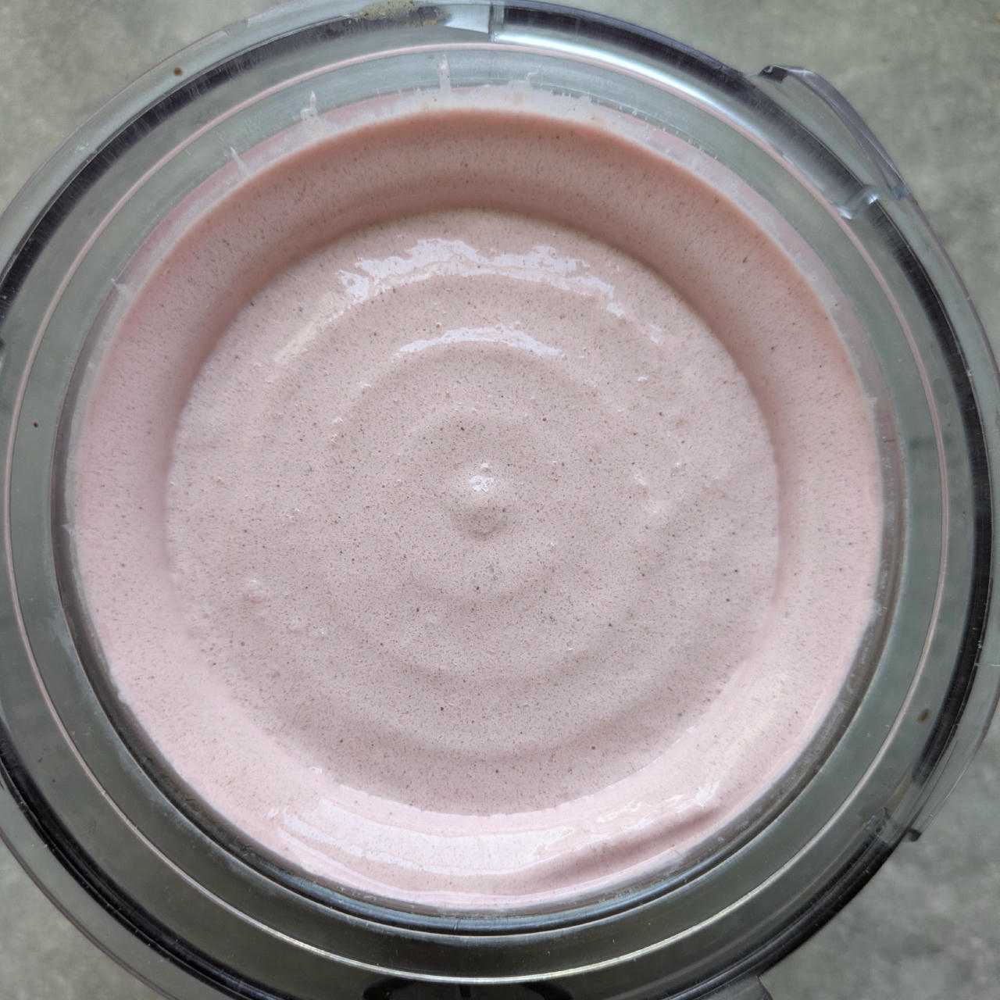

# Fruit Powder Mix (Deluxe)

This one is a favorite, so it gets its own recipe mix for convenient indulgence…

It works for fruit or root powders with a sugar content from low (Ube, 10%) to high (Lingonberry, 73%).
Counting the pre-made mix as one, it is a 6 ingredients recipe for the final base, including the water.

Use 93g of the mix in your final base (or 62g for a regular 16oz tub).

> 🌿 **Vegan & Dairy-free Option** Replace the SMP & whey with soy protein isolate, and the cottage cheese with silken tofu.

Spun in Light Ice Cream mode, plus a scrape-down and a mix-in run — optionally with 10g freeze-dried fruit, e.g. strawberry slices.
Comes out as soft-serve, put it back into the cold for 45min for a firmer consistency.

> 
> 
> 
> *Processed strawberry and ube ice cream.*

To make your life easier, take the “prep” ingredients times 5 (see list below), mix them,
and store in an air-tight 1l container (the powder has a low density and needs space).
To mix, take a **BIG** bowl like used for baking, measure the ingredients on a scale,
and whisk them carefully but thoroughly. A ball whisk works best.

**Serves:** 5 tubs           
**Total:** 463 g           
**Per tub:** 93 g           

 * 150 g Erythritol (E968)
 * 75 g Inulin [Vit4ever]
 * 75 g Skim Milkpowder 1:10 [Vita2You]
 * 75 g Whey protein Vanilla [MaxiNutrition]
 * 75 g Xylitol
 * 7.50 g Tylose powder (E466, Tylo, CMC)
 * 2.50 g Guar gum (E412)
 * 2.50 g Salt
 * 0.75 g Xanthan gum (E415, XG)

# INGREDIENTS

ℹ️ Brand names are in square brackets `[...]`.

**Prep**

  - _30g_ [Erythritol (E968)](/ice-creamery/info/ingredients/#erythritol-e968){target="_blank"}↗ • Sweetness = 75%
  - _15g_ [Inulin \[Vit4ever\]](/ice-creamery/info/ingredients/#inulin){target="_blank"}↗ • Sweetness = 8%; GI ~= 0
  - _15g_ [Skim Milkpowder 1:10 \[Vita2You\]](/ice-creamery/info/ingredients/#skim-milk-powder-smp){target="_blank"}↗
  - _15g_ [Whey protein Vanilla \[MaxiNutrition\]](/ice-creamery/info/ingredients/#whey-protein){target="_blank"}↗
  - _15g_ [Xylitol](/ice-creamery/info/ingredients/#xylitol-e967){target="_blank"}↗ • Sweetness = 100%; GI = 7
  - _1.5g_ [Tylose powder (E466, Tylo, CMC)](/ice-creamery/info/ingredients/#carboxymethyl-cellulose-cmc-e466){target="_blank"}↗
  - _0.5g_ [Guar gum (E412)](/ice-creamery/info/ingredients/#guar-gum-e412){target="_blank"}↗
  - _0.5g_ Salt
  - _0.15g_ [Xanthan gum (E415, XG)](/ice-creamery/info/ingredients/#xanthan-gum-xg-e415){target="_blank"}↗

**Wet**

  - _400ml_ [Soy milk 1.6% (sugar-free) \[Berief\]](/ice-creamery/info/ingredients/#soy-milk){target="_blank"}↗
  - _100g_ [Cottage Cheese 4% \[REWE Bio\]](/ice-creamery/info/ingredients/#cottage-cheese){target="_blank"}↗
  - _15g_ [Glycerin (E422, VG) \[hd-line\]](/ice-creamery/info/ingredients/#vegetable-glycerin-glycerol-vg-e422){target="_blank"}↗ • Sweetness = 60%; GI = 5
  - _10g_ [Brandy or Vodka 40 vol%](/ice-creamery/info/ingredients/#alcohol-ethanol){target="_blank"}↗

**Dry**

  - _25g_ Ube Yam Root powder [Fil Choice] • like vanilla+pistachio

**Fill to MAX**

  - _77.35ml_ Water to MAX line

# DIRECTIONS

 1. Take all the ‘prep’ ingredients from your ready-to-use mix — the list per tub is just there for reference!
 1. Add "wet" ingredients to empty Creami tub.
 1. Add the prepared dry ingredients mixed with the chosen fruit powder, and blend *QUICKLY* using an immersion blender on full speed.
 1. Let blender run until thickeners are properly hydrated, up to 1-2 min. Or blend again after waiting that time.
 1. Add remaining ingredients (to the MAX line) and stir with a spoon.
 1. Put on the lid, freeze for 24h, then spin as usual. Flatten any humps before that.
 1. Process with RE-SPIN mode when not creamy enough after the first spin.

# NUTRITIONAL & OTHER INFO
- **Nutritional values per 100g/ml:** 100g; 80.2 kcal; fat 1.6g; carbs 13.4g; sugar 1.8g; protein 6.0g; salt 0.3g
- **Nutritional values per ½ Deluxe Tub:** 360g; 288.9 kcal; fat 5.8g; carbs 48.3g; sugar 6.5g; protein 21.6g; salt 0.9g
- **Nutritional values total:** 720g; 577.7 kcal; fat 11.6g; carbs 96.6g; sugar 12.9g; protein 43.2g; salt 1.9g
- **FPDF / [PAC](/ice-creamery/info/glossary/#potere-anti-congelante-pac){target="_blank"}↗ (target 20..30):** 31.82
- **Protein / Energy Ratio (ok=12%; hi=20%):** 29.92% • LOW-FAT • Low-Sugar • Hi-Protein
- **Milk Solids Non-Fat ([MSNF](/ice-creamery/info/glossary/#milk-solids-not-fat-msnf){target="_blank"}↗, 7-11%):** 43.5g • 6.0%
- **Net carbs:** 36.6g • *∝ 5 servings@144g:* 7.3g • *∝ 3 servings@240g:* 12.2g
