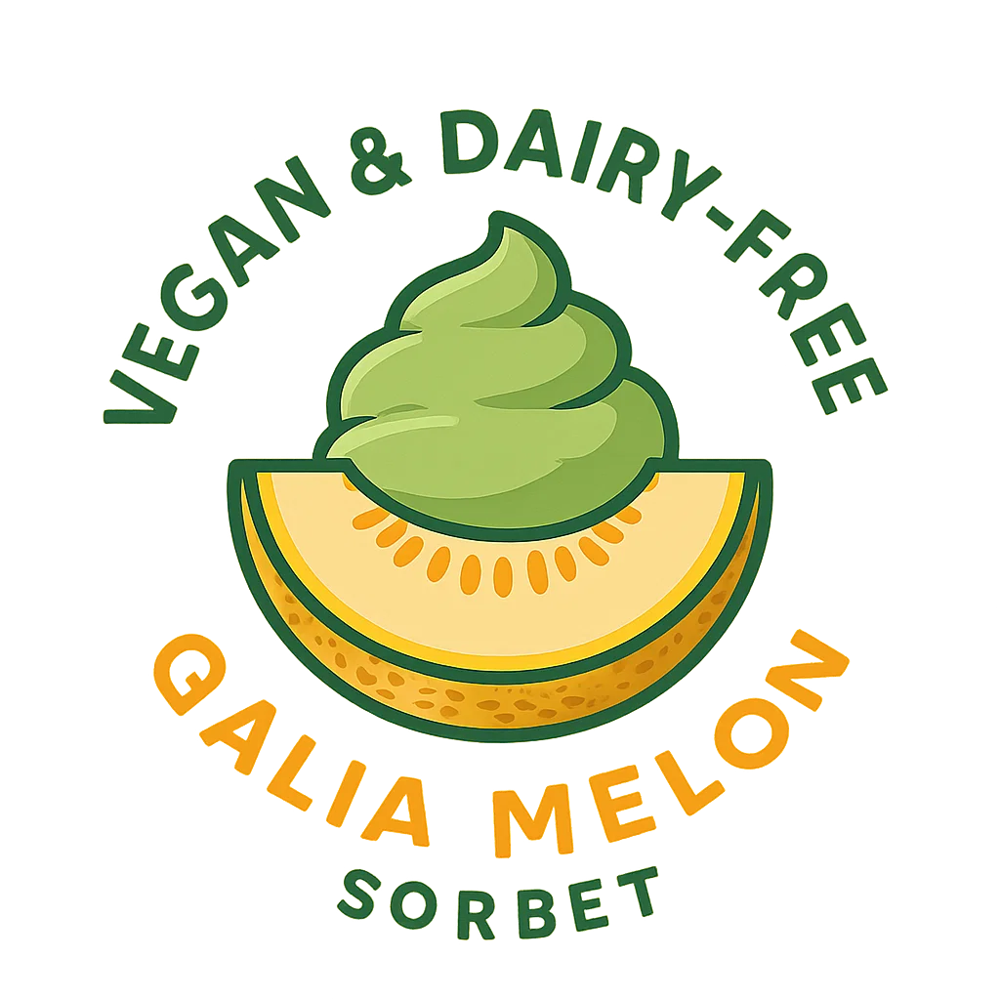
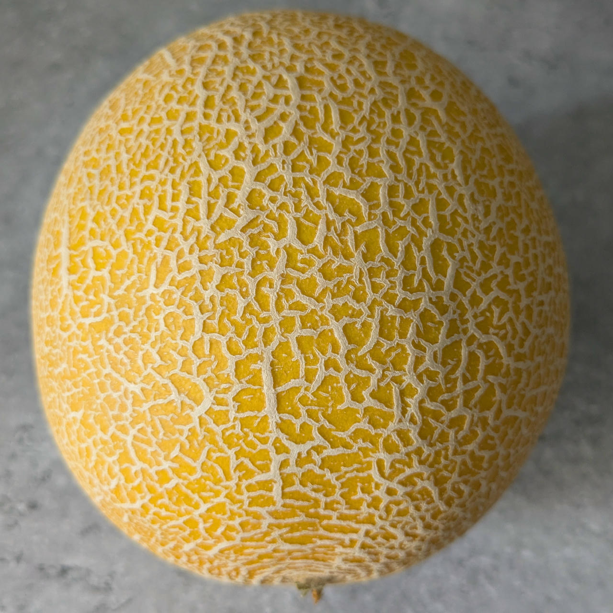
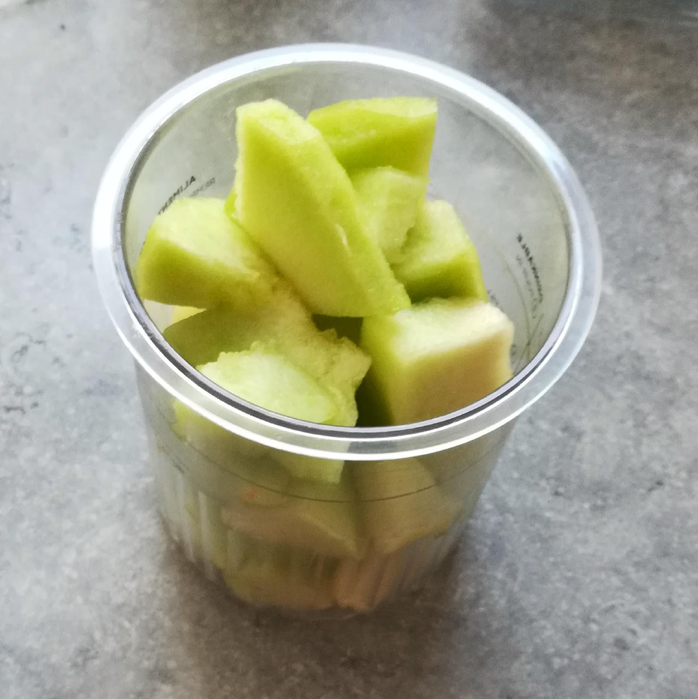
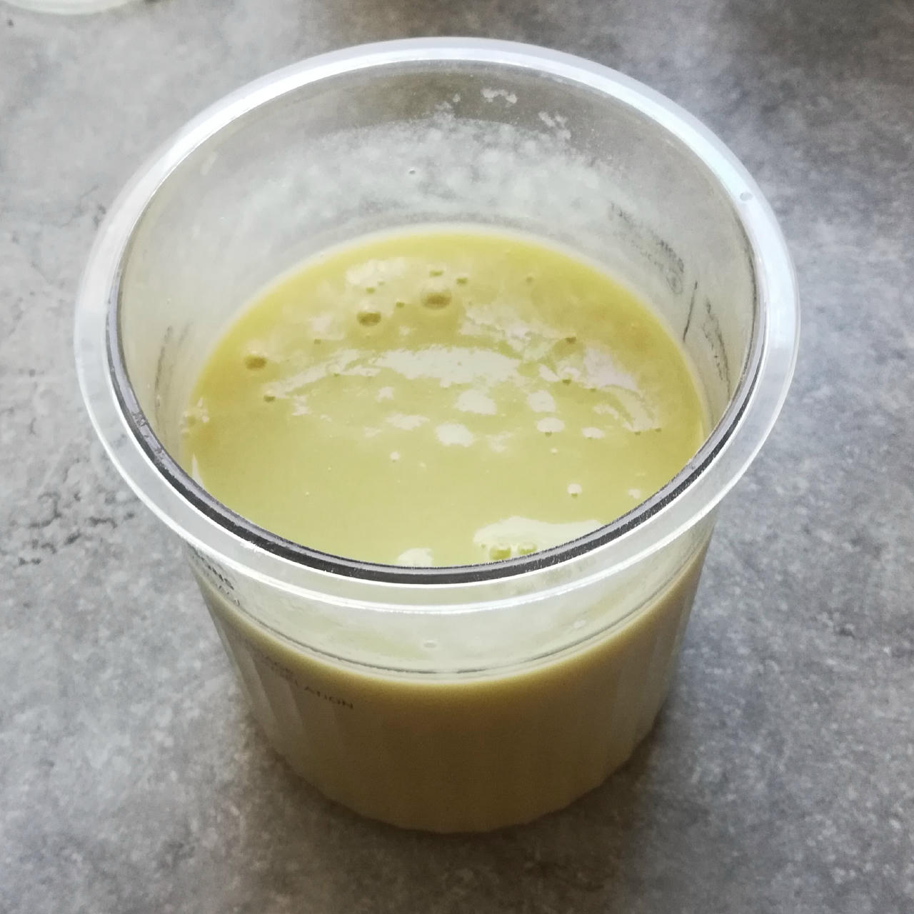
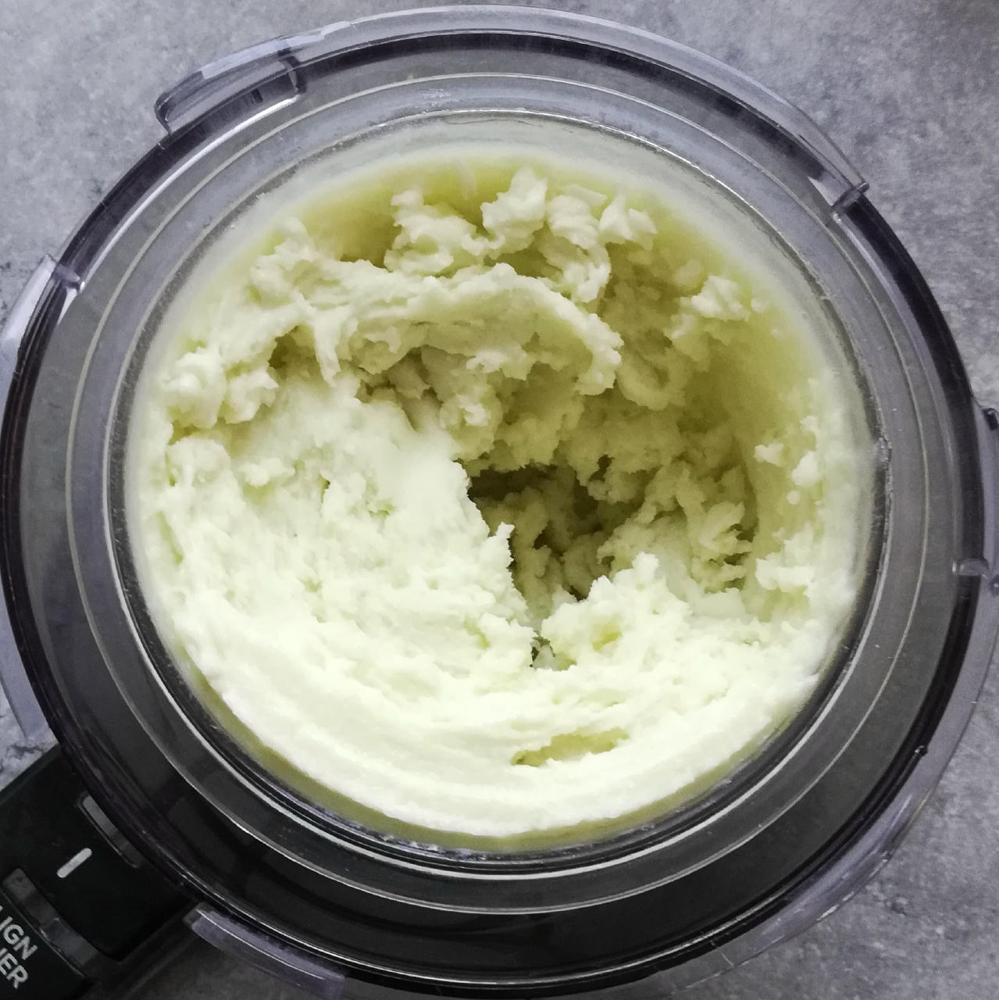
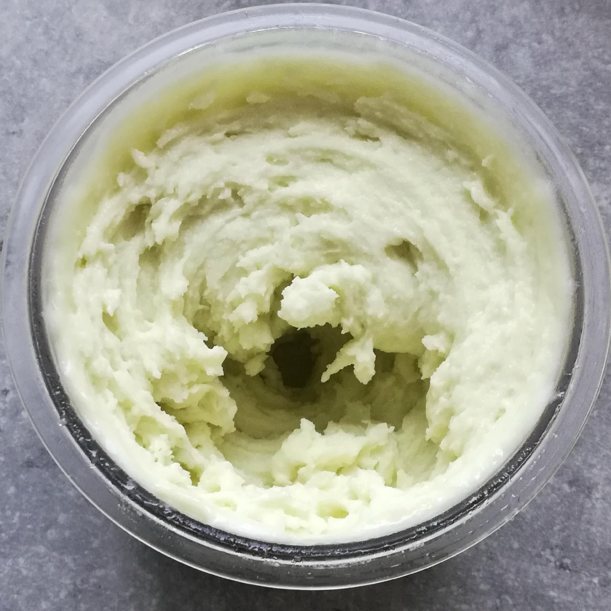
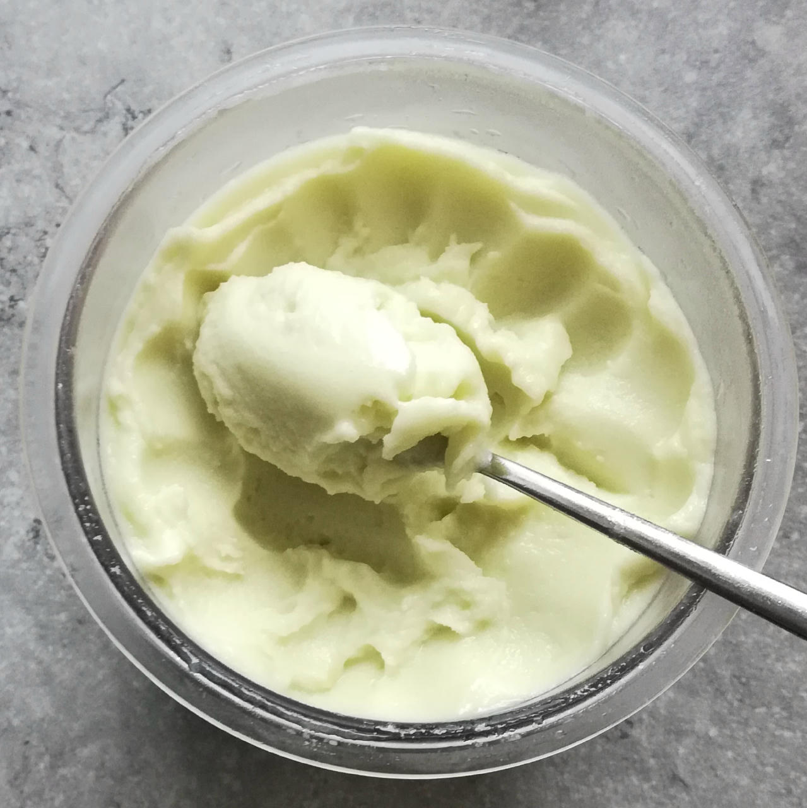

# GaMe On (Deluxe)

Galia melon sherbet composed of two thirds melon pulp plus soy milk and protein to make it creamier.

> 🌿 **Vegan & Dairy-free** Recipe is using only soy milk and protein.

Split the melon along its ‘equator’, spoon out the seeds and any soft flesh, remove the ‘polar caps’.
Then use a vegetable knife to remove the skin, and cut into manageable pieces.
Finally follow the directions below. 

> 
> 
> 

Spin on “Sorbet”, scrape down, and re-mix.

> 
> 
> 

Rating: 😋😋😋🍈🍈

# INGREDIENTS

ℹ️ Brand names are in square brackets `[...]`.

**Wet**

  - _500g_ Galia melon (organic) • 1 melon = 1.3kg, 60–70% yield
  - _75ml_ [Soy milk 1.6% (sugar-free) \[Berief\]](/ice-creamery/info/ingredients/#soy-milk){target="_blank"}↗
  - _15g_ [Glycerin (E422, VG) \[hd-line\]](/ice-creamery/info/ingredients/#vegetable-glycerin-glycerol-vg-e422){target="_blank"}↗ • Sweetness = 60%; GI = 5; Density = 1.26 g/ml
  - _10g_ [Brandy or Vodka 40 vol%](/ice-creamery/info/ingredients/#alcohol-ethanol){target="_blank"}↗
  - _10ml_ Lemon juice

**Dry**

  - _35g_ [Xylitol (E967)](/ice-creamery/info/ingredients/#xylitol-e967){target="_blank"}↗ • POD = 100%; GI = 7
  - _15g_ ICSv2 [Erythritol / Inulin / CMC / Guar / XG / Salt] • [http﹕//bit.ly/4frc4Vj](https://jhermann.github.io/ice-creamery/I/Ice%20Cream%20Stabilizer%20(ICS)/)
  - _20g_ [Soy protein isolate (nature) \[Powerstar\]](/ice-creamery/info/ingredients/#soy-protein-isolate){target="_blank"}↗ • 1kg bag, unsweetened, unflavored

**Fill to MAX**

  - _40ml_ [Soy milk 1.6% (sugar-free) \[Berief\]](/ice-creamery/info/ingredients/#soy-milk){target="_blank"}↗
  - _≈5 drops_ Flavor drops Peach / Maracuja (sucralose) [IronMaxx] • to taste

# DIRECTIONS

 1. Add "wet" ingredients to empty Creami tub.
 1. Weigh and mix dry ingredients, easiest by adding to a jar with a secure lid and shaking vigorously.
 1. Pour into the tub and *QUICKLY* use an immersion blender on full speed to homogenize everything.
 1. Let blender run until thickeners are properly hydrated, up to 1-2 min. Or blend again after waiting that time.
 1. Add remaining ingredients (to the MAX line) and stir with a spoon.
 1. Put on the lid, freeze for 24h, then spin as usual. Flatten any humps before that.
 1. Process with RE-SPIN mode when not creamy enough after the first spin.

# NUTRITIONAL & OTHER INFO
- **Nutritional values per 100g/ml:** 100g; 59.6 kcal; fat 0.4g; carbs 13.0g; sugar 4.0g; protein 3.3g; salt 0.2g
- **Nutritional values per ½ Deluxe Tub:** 360g; 214.4 kcal; fat 1.3g; carbs 46.9g; sugar 14.4g; protein 12.0g; salt 0.6g
- **Nutritional values total:** 720g; 428.8 kcal; fat 2.6g; carbs 93.7g; sugar 28.7g; protein 24.0g; salt 1.2g
- **FPDF / [PAC](/ice-creamery/info/glossary/#potere-anti-congelante-pac){target="_blank"}↗ (target 20..30):** 30.20
- **Protein / Energy Ratio (ok=12%; hi=20%):** 22.35% • LOW-FAT • Low-Sugar • Hi-Protein
- **Milk Solids Non-Fat ([MSNF](/ice-creamery/info/glossary/#milk-solids-not-fat-msnf){target="_blank"}↗, 7-11%):** 18.6g • 2.6%
- **Net carbs:** 45.1g • *∝ 5 servings@144g:* 9g • *∝ 3 servings@240g:* 15g • *energy ratio (low <20%):* 42.1%
- **15g 'ICSv2' is:** 6.9g Erythritol (E968) • 6.9g Inulin • 0.69g Tylose powder (E466, Tylo, CMC) • 0.24g Guar gum (E412) • 0.24g Salt • 0.07g Xanthan gum (E415, XG).
