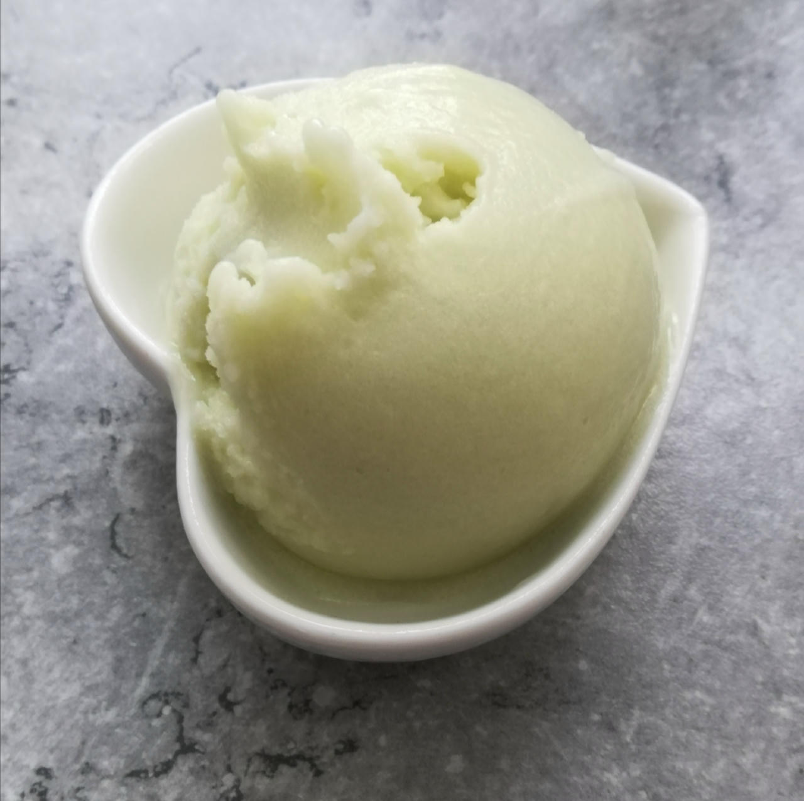
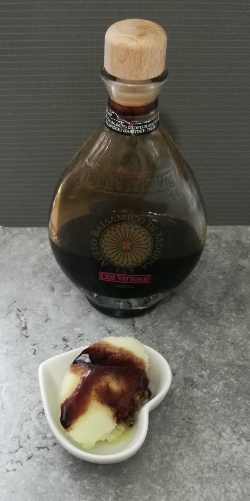
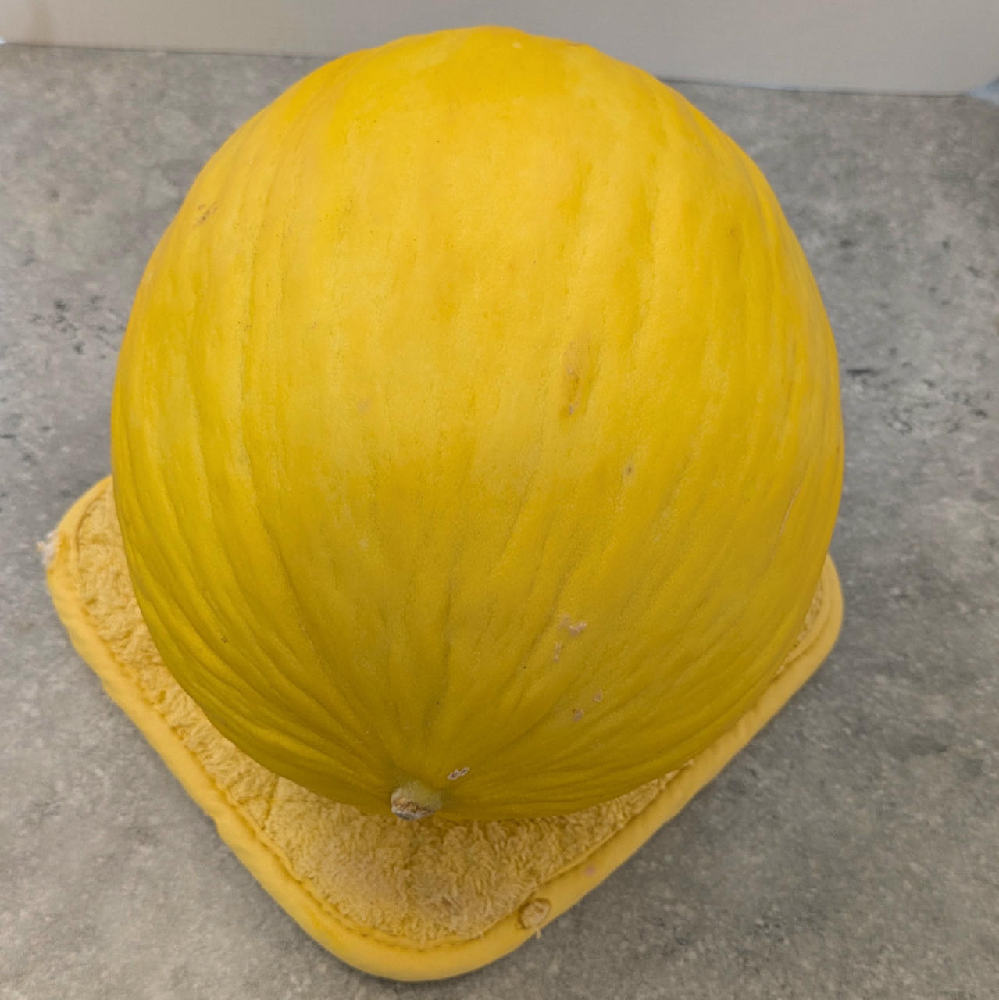
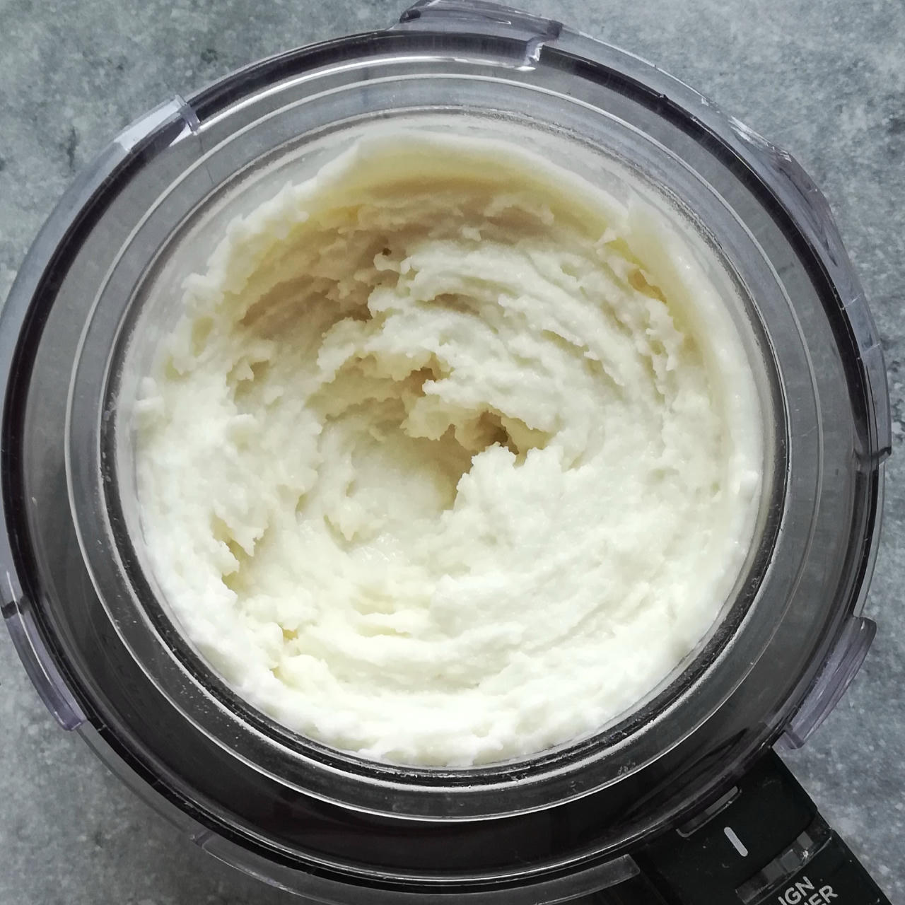
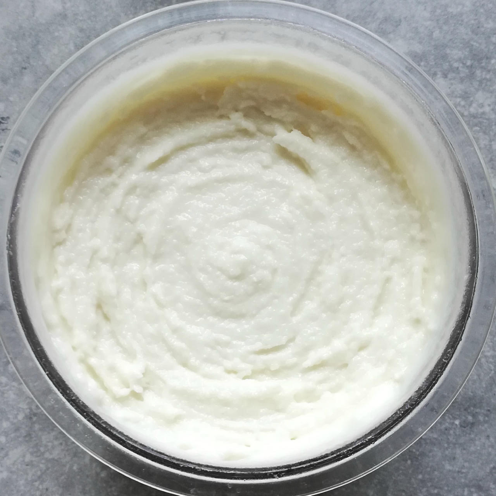
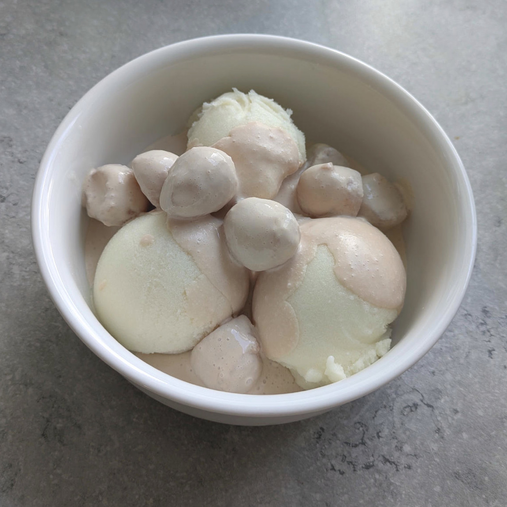
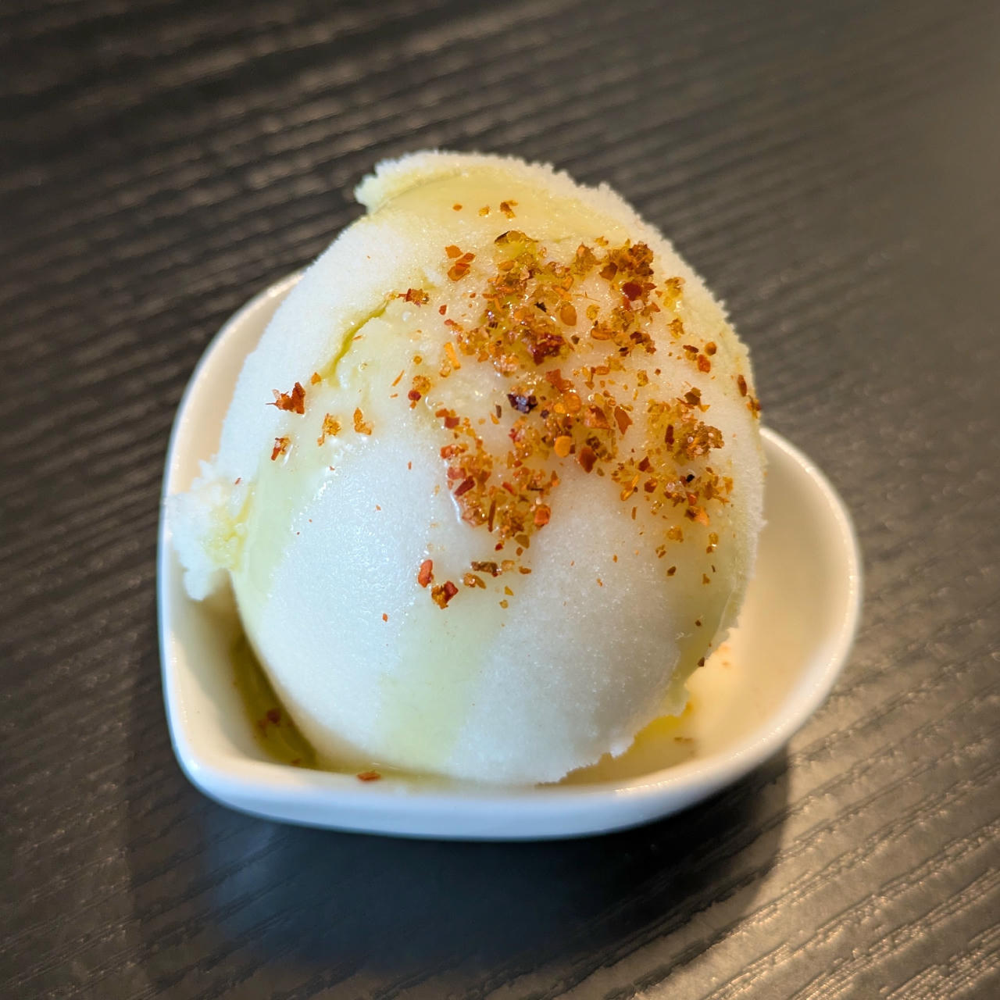

# GaMe On (Deluxe)

Galia melon sherbet composed of two thirds melon pulp plus soy milk and protein to make it creamier.

> 🌿 **Vegan & Dairy-free** Recipe is using only soy milk and protein.

Split the melon along its ‘equator’, spoon out the seeds and any soft flesh, remove the ‘polar caps’.
Then use a vegetable knife to remove the skin, and cut into manageable pieces.
Finally follow the directions below. 

> 
> 
> 

Spin on “Sorbet”, scrape down, and re-mix.

> 
> 
> 

Rating: 😋😋😋🍈🍈

> 
> 

The honey melon I also tried this with had a harder shell, possibly was less ripe than the Galia one.

> 
> 
> 

The yield was around 66%, about half the melon for 500g pulp. I had to strain it after blending, since there were too many fibrous pieces in there.
When removing the skin, go by knife resistance to know how much to cut off, and taste-test a piece that you think is soft enough.

> 
> 
>
> *Served with melon balls infused in brandy and cream, and an olive oil drizzle plus tajin.*

# INGREDIENTS

ℹ️ Brand names are in square brackets `[...]`.

**Wet**

  - _500g_ Galia melon (organic) • 1 melon = 1.3kg, 60–70% yield
  - _75ml_ [Soy milk 1.6% (sugar-free) \[Berief\]](/ice-creamery/info/ingredients/#soy-milk){target="_blank"}↗
  - _15g_ [Glycerin (E422, VG) \[hd-line\]](/ice-creamery/info/ingredients/#vegetable-glycerin-glycerol-vg-e422){target="_blank"}↗ • Sweetness = 60%; GI = 5; Density = 1.26 g/ml
  - _10g_ [Brandy or Vodka 40 vol%](/ice-creamery/info/ingredients/#alcohol-ethanol){target="_blank"}↗
  - _10ml_ Lemon juice

**Dry**

  - _40g_ [SweEX (Erythritol + Xylitol 3:2)](/ice-creamery/info/ingredients/#sweex-erythritol-xylitol-blend){target="_blank"}↗ • POD ≈ 90%; GI < 7
  - _10g_ [Salty Stability \[Inulin / GMS / CMC / Guar / XG / Salt\]](/ice-creamery/S/Salty%20Stability/){target="_blank"}↗ • unsweetened “ICSv2”
  - _20g_ [Soy protein isolate (nature) \[Powerstar\]](/ice-creamery/info/ingredients/#soy-protein-isolate){target="_blank"}↗ • 1kg bag, unsweetened, unflavored
  - _1g_ Matcha green tea powder (organic) [Mandoi] • optional, for color; ½ tsp = 1g

**Fill to MAX**

  - _40ml_ [Soy milk 1.6% (sugar-free) \[Berief\]](/ice-creamery/info/ingredients/#soy-milk){target="_blank"}↗
  - _≈5 drops_ Flavor drops Peach / Maracuja (sucralose) [IronMaxx] • to taste

**Optional**

  - _500g_ Galia melon (organic) • [130kcal, 28g sugar]
  - _500g_ Honeydew melon (organic) • [180kcal, 41g sugar]

# DIRECTIONS

 1. Add "wet" ingredients to empty Creami tub.
 1. Weigh and mix dry ingredients, easiest by adding to a jar with a secure lid and shaking vigorously.
 1. Pour into the tub and *QUICKLY* use an immersion blender on full speed to homogenize everything.
 1. Let blender run until thickeners are properly hydrated, up to 1-2 min. Or blend again after waiting that time.
 1. Add remaining ingredients (to the MAX line) and stir with a spoon.
 1. Put on the lid, freeze for 24h, then spin as usual. Flatten any humps before that.
 1. Process with RE-SPIN mode when not creamy enough after the first spin.

# NUTRITIONAL & OTHER INFO
- **Nutritional values per 100g/ml:** 100g; 56.0 kcal; fat 0.4g; carbs 13.0g; sugar 4.0g; protein 3.4g; salt 0.2g
- **Nutritional values per ½ Deluxe Tub:** 360g; 201.8 kcal; fat 1.5g; carbs 47.0g; sugar 14.4g; protein 12.1g; salt 0.7g
- **Nutritional values total:** 720g; 403.5 kcal; fat 2.9g; carbs 93.9g; sugar 28.8g; protein 24.2g; salt 1.3g
- **FPDF / [PAC](/ice-creamery/info/glossary/#potere-anti-congelante-pac){target="_blank"}↗ (target 20..30):** 31.13
- **Protein / Energy Ratio (ok=12%; hi=20%):** 24.02% • LOW-FAT • Low-Sugar • Hi-Protein
- **Milk Solids Non-Fat ([MSNF](/ice-creamery/info/glossary/#milk-solids-not-fat-msnf){target="_blank"}↗, 7-11%):** 23.2g • 3.2%
- **Net carbs:** 46.5g • *∝ 5 servings@144g:* 9.3g • *∝ 3 servings@240g:* 15.5g • *energy ratio (low <20%):* 46.1%
- **10g 'Salty Stability' is:** 7.3g Inulin • 1.2g Glycerol Monostearate (GMS / E471) • 0.6g Tylose powder (E466, Tylo, CMC) • 0.4g Guar gum (E412) • 0.33g Salt • 0.13g Xanthan gum (E415, XG).
