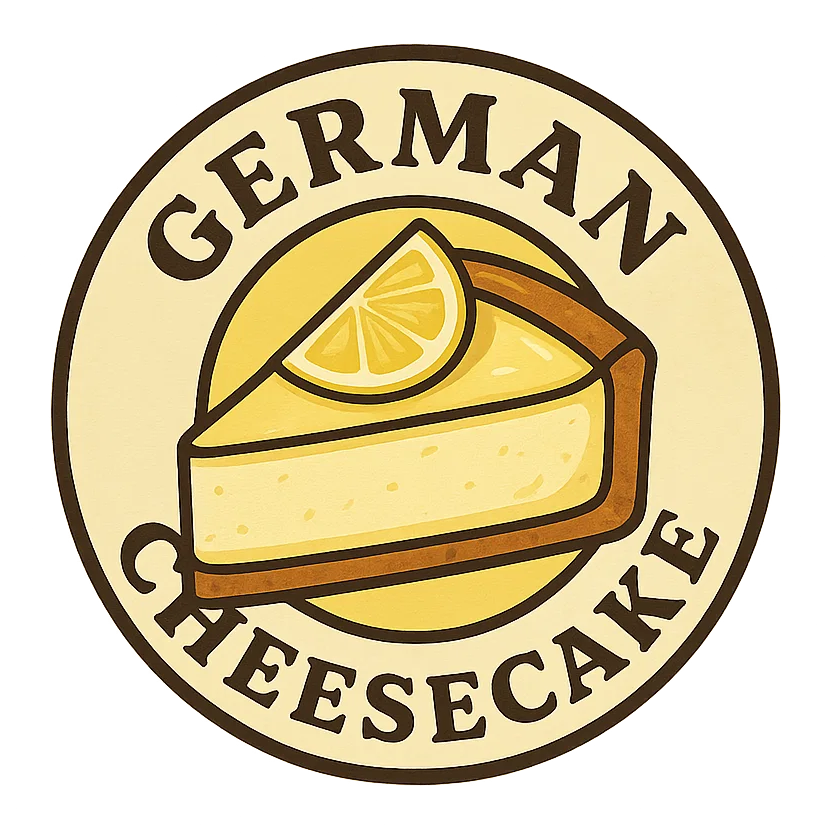
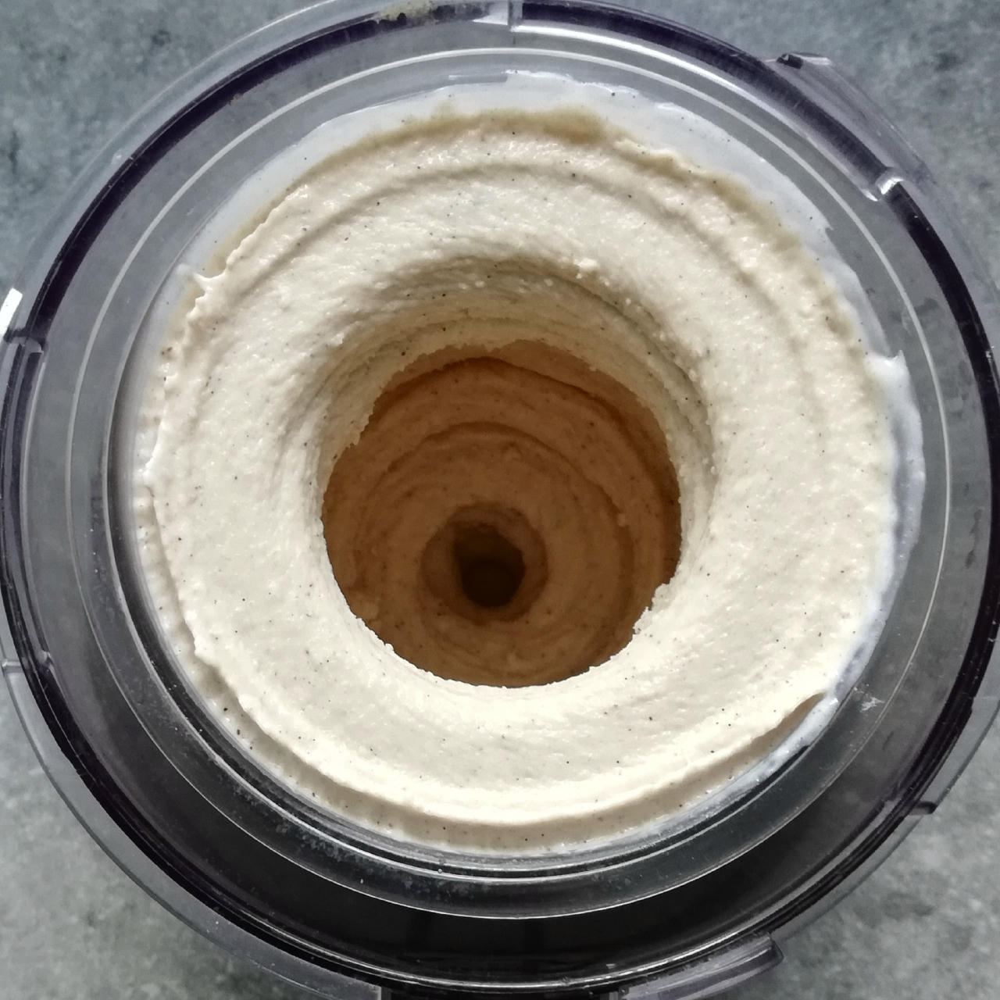
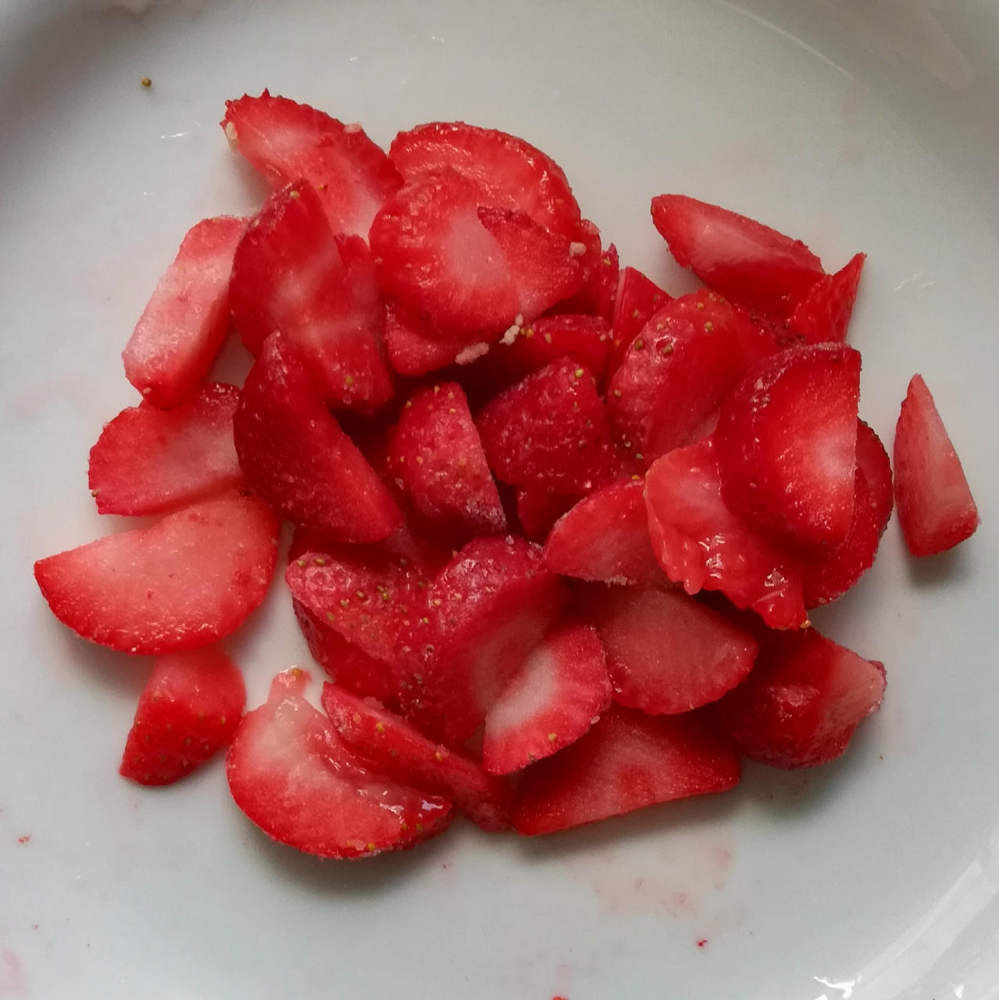
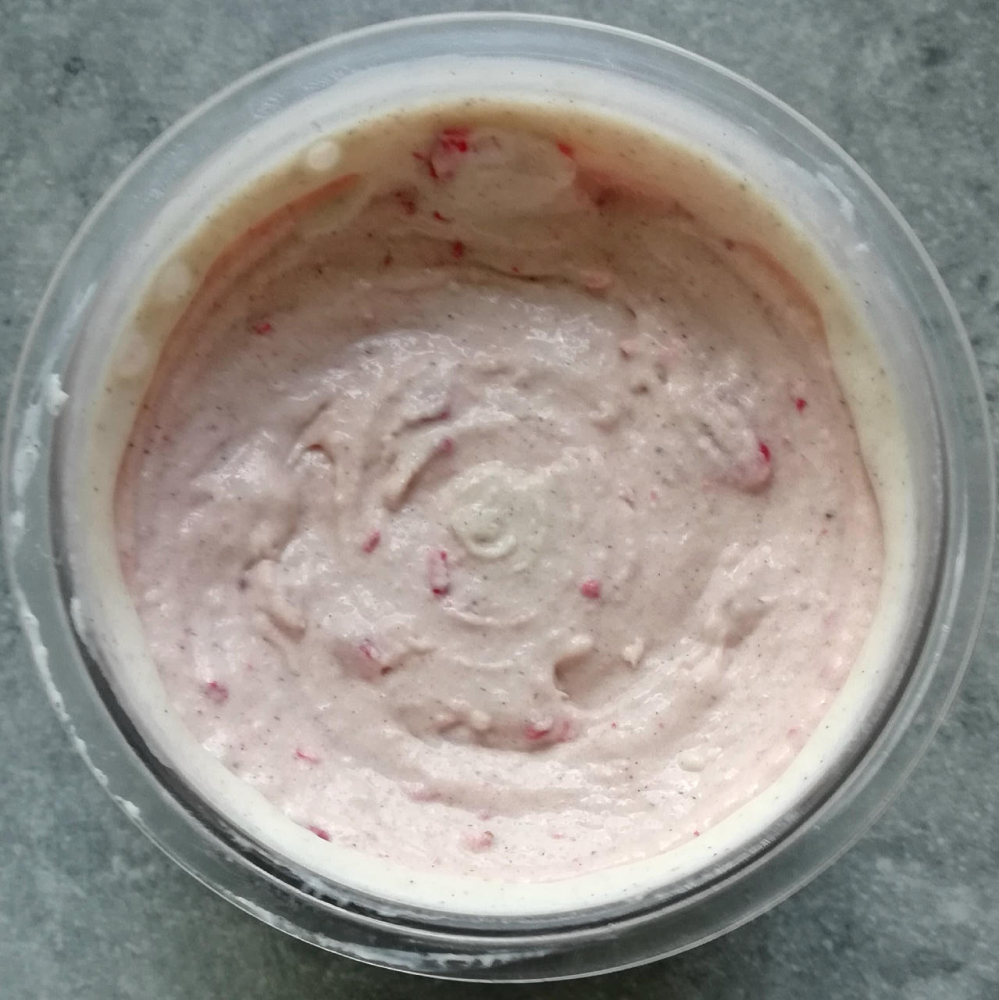
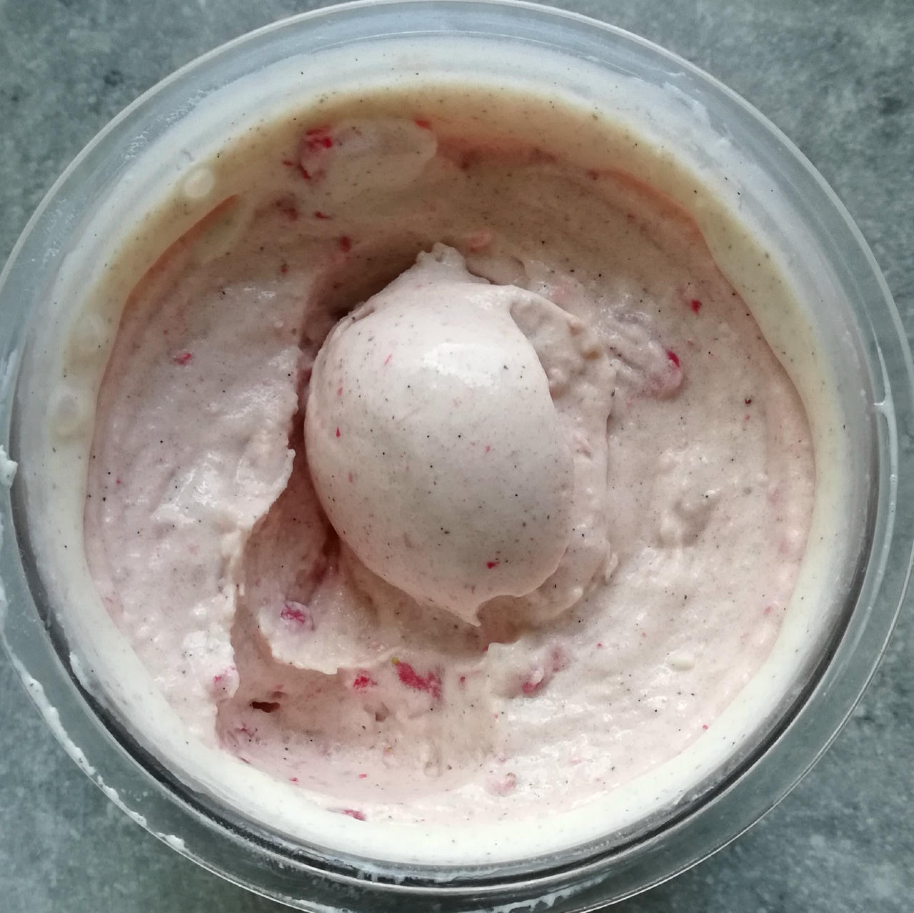
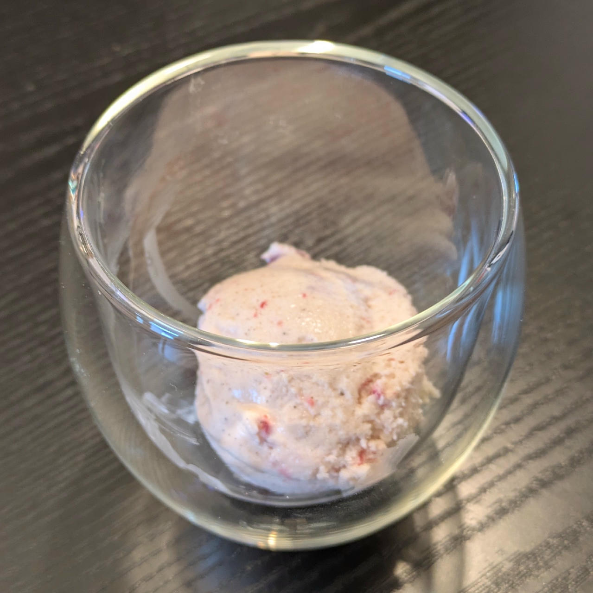
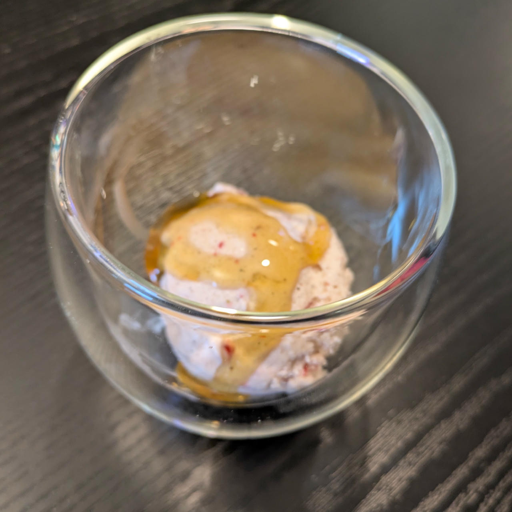

# German Cheesecake (Deluxe)

Inspired by German cheesecake, which is made with ‘Quark’ or ‘Topfen’
– think of a cross between yogurt, cottage cheese and ricotta.

The lemon juice and soured milk add the necessary tanginess.

> 

Spin on *FroYo*, do a scrape-down, and finish with a mix-in or respin run.

> 

Serve with graham crackers or butter cookies to stand in for the pie crust.

Rating: 😋😋😋😋😋

> 
> 
> 
> 
> 
> 
> 
> *Spun on FroYo, with 80g slightly thawed and chopped frozen strawberries as a mix-in, and served with low-sugar caramel syrup.*

# INGREDIENTS

ℹ️ Brand names are in square brackets `[...]`.

**Wet**

  - _400g_ [Soured milk 3.5% \[Schwälbchen\]](/ice-creamery/info/ingredients/#soured-milk){target="_blank"}↗ • 500g container
  - _200g_ [Topfen / Quark 14.4% \[Berchtesgadener\]](/ice-creamery/info/ingredients/#quark-topfen){target="_blank"}↗ • 250g container
  - _15g_ [Glycerin (E422, VG) \[hd-line\]](/ice-creamery/info/ingredients/#vegetable-glycerin-glycerol-vg-e422){target="_blank"}↗ • POD = 60%; GI = 5; Density = 1.26 g/ml
  - _15ml_ Lemon juice
  - _10g_ [Brandy or Vodka 40 vol%](/ice-creamery/info/ingredients/#alcohol-ethanol){target="_blank"}↗

**Dry**

  - _20g_ ICSv2 [Erythritol / Inulin / CMC / Guar / XG / Salt] • [http﹕//bit.ly/4frc4Vj](https://jhermann.github.io/ice-creamery/I/Ice%20Cream%20Stabilizer%20(ICS)/)
  - _30g_ [Xylitol (E967)](/ice-creamery/info/ingredients/#xylitol-e967){target="_blank"}↗ • POD = 100%; GI = 7
  - _2g_ Vanilla Bean Powder [InterVanilla]

**Fill to MAX**

  - _25ml_ Cream 32% [REWE Beste Wahl]
  - _≈3 drops_ Flavor drops Vanilla (sucralose) [IronMaxx] • to taste
  - _≈10 drops_ Flavor drops Cookies&Cream (stevia) [Nick’s] • to taste

**Mix-ins**

  - _50g_ Frozen Fruit • add chopped as a mix-in [31kcal, 5g sugar]
  - _20g_ Sultanas (organic) [Biojoy] • add chopped as a mix-in [60kcal, 13g sugar]

**Topping Options**

  - _3-4 pieces_ Graham crackers / Butter cookies
  - _3-4 pieces_ Wafers (cream-filled)
  - _20ml_ Syrup Caramel (low-sugar) [Sukrin] • 14% sorbitol, erythritol, stevia [30kcal, 0.4g sugar]

# DIRECTIONS

 1. Add "wet" ingredients to empty Creami tub.
 1. Weigh and mix dry ingredients, easiest by adding to a jar with a secure lid and shaking vigorously.
 1. Pour into the tub and *QUICKLY* use an immersion blender on full speed to homogenize everything.
 1. Let blender run until thickeners are properly hydrated, up to 1-2 min. Or blend again after waiting that time.
 1. Add remaining ingredients (to the MAX line) and stir with a spoon.
 1. Put on the lid, freeze for 24h, then spin as usual. Flatten any humps before that.
 1. Process with RE-SPIN mode when not creamy enough after the first spin.
 1. Process with MIX-IN after adding mix-ins evenly. For that, add partial amounts into a hole going down to the bottom, and fold the ice cream over, building pockets of mix-ins.

# NUTRITIONAL & OTHER INFO
- **Nutritional values per 100g/ml:** 100g; 123.0 kcal; fat 7.1g; carbs 12.4g; sugar 3.5g; protein 4.3g; salt 0.1g
- **Nutritional values per ½ Deluxe Tub:** 360g; 442.9 kcal; fat 25.5g; carbs 44.5g; sugar 12.7g; protein 15.4g; salt 0.5g
- **Nutritional values total:** 717g; 882.1 kcal; fat 50.8g; carbs 88.7g; sugar 25.2g; protein 30.7g; salt 1.1g
- **FPDF / [PAC](/ice-creamery/info/glossary/#potere-anti-congelante-pac){target="_blank"}↗ (target 20..30):** 29.01
- **Protein / Energy Ratio (ok=12%; hi=20%):** 13.92% • Low-Sugar
- **Milk Solids Non-Fat ([MSNF](/ice-creamery/info/glossary/#milk-solids-not-fat-msnf){target="_blank"}↗, 7-11%):** 48.8g • 6.8%
- **Net carbs:** 33.1g • *∝ 5 servings@143g:* 6.6g • *∝ 3 servings@239g:* 11g
- **20g Ice Cream Stabilizer (ICSv2) is:** 9.2g Erythritol (E968) • 9.2g Inulin • 0.92g Tylose powder (E466, Tylo, CMC) • 0.32g Guar gum (E412) • 0.32g Salt • 0.09g Xanthan gum (E415, XG).
