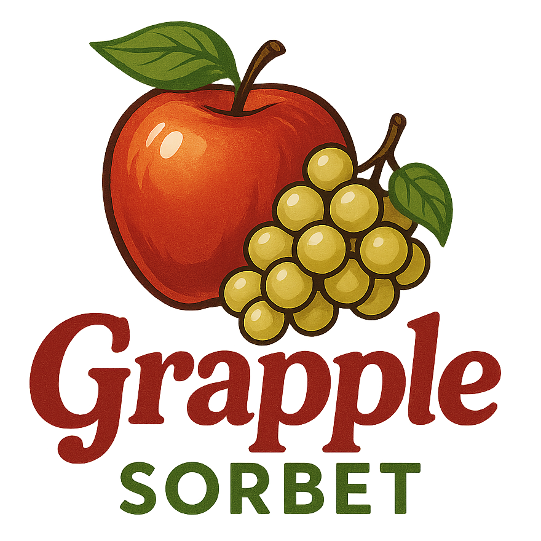
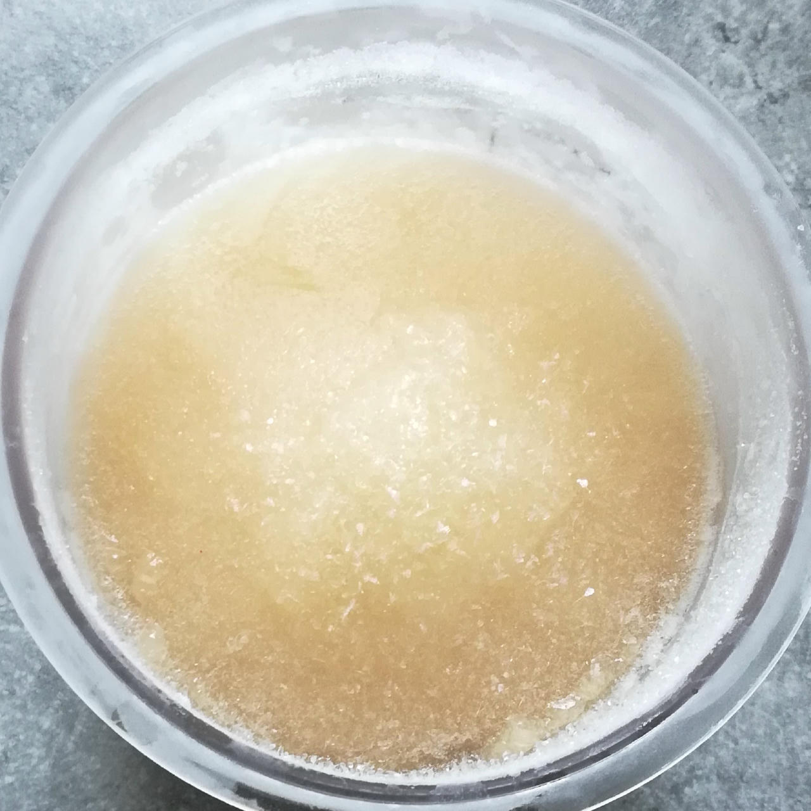
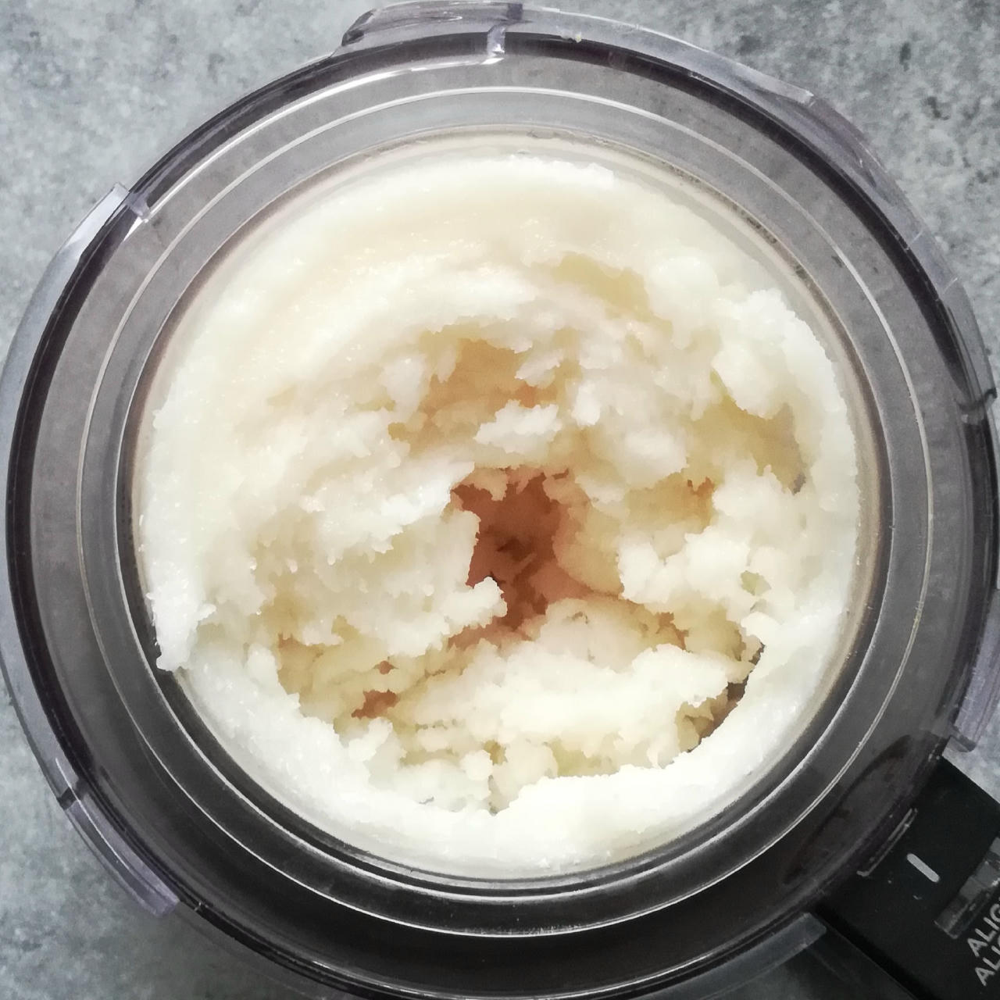
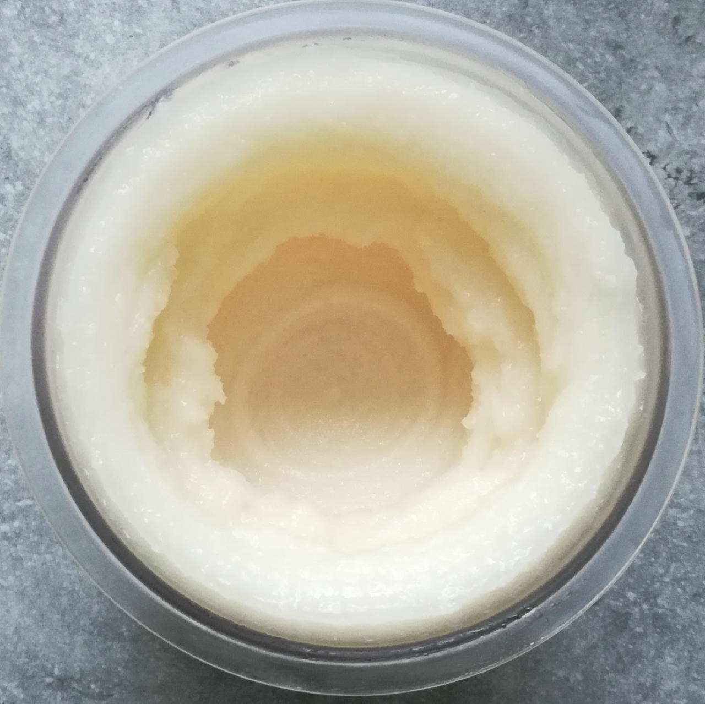
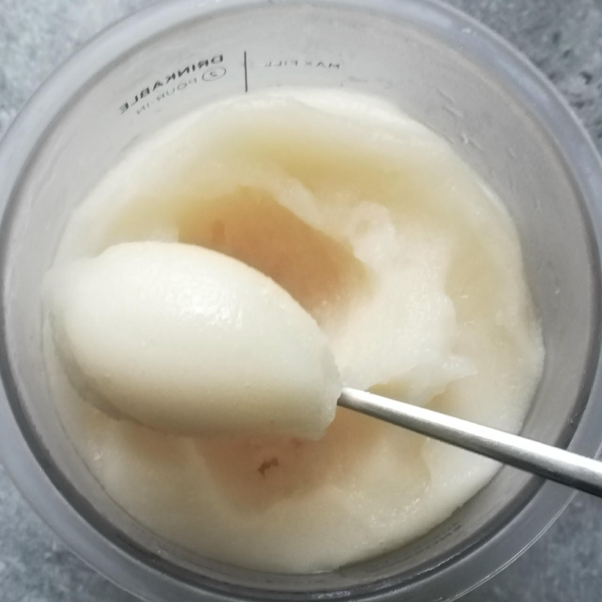
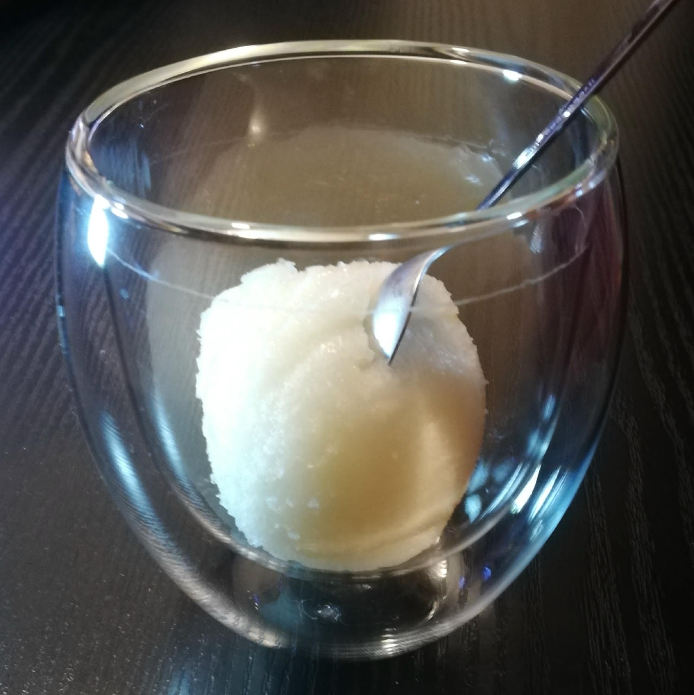

# Grapple Sorbet (Deluxe)

This sorbet blends clear apple juice and white grape juice into a light, refreshing dessert with a smooth texture and a clean finish.
It’s simple, bright, and easy to enjoy — perfect as a palate cleanser or a cool treat on warm days.

> 🌿 **Vegan & Dairy-free**

This is an experiment to get to a (possibly) translucent
ice cream, using just “clear” ingredients.

You can replace the water — used to improve the macros (less sugar) — with juice,
but then you have to compensate by lowering VG and/or the sweetener.

Spin on “Sorbet”, scrape down, and re-mix.

> 
> 
> 
> 
> 
>
> Apple + Pear juice • Rating: 😋🍎🍏🍐❄️ (non-sharp ice crystals due to the low solids, as sorbet-like as it gets)

# INGREDIENTS

ℹ️ Brand names are in square brackets `[...]`.

**Wet**

  - _300ml_ Apple Juice (clear, filtered)
  - _150ml_ Grape Juice (white)
  - _160ml_ Water (cold)
  - _20g_ [Glycerin (E422, VG) \[hd-line\]](/ice-creamery/info/ingredients/#vegetable-glycerin-glycerol-vg-e422){target="_blank"}↗

**Dry**

  - _35g_ [SweEX (Erythritol + Xylitol 3:2)](/ice-creamery/info/ingredients/#sweex-erythritol-xylitol-blend){target="_blank"}↗ • *alternative:* 47g allulose or dextrose
  - _20g_ [Waxy Maize Starch (E1442) \[Ultratex\]](/ice-creamery/info/ingredients/#waxy-maize-starch-e1442){target="_blank"}↗ • dissolves easily; use 1-5%
  - _0.75g_ Citric Acid • 0.5–1g ≈ 15ml lemon juice
  - _0.5g_ [Xanthan gum (E415, XG)](/ice-creamery/info/ingredients/#xanthan-gum-xg-e415){target="_blank"}↗ • 1tsp ≈ 2.8g

**Fill to MAX**

  - _≈8 drops_ [Stevia drops “natural” \[Nick’s\]](/ice-creamery/info/ingredients/#stevia-e960){target="_blank"}↗ • to taste • unflavored

**Optional / Choices**

  - _225ml_ Pear Juice (clear, filtered) • instead of grape juice, reduce water accordingly [106kcal, 24g sugar]

# DIRECTIONS

 1. Add "wet" ingredients to empty Creami tub.
 1. Weigh and mix dry ingredients, easiest by adding to a jar with a secure lid and shaking vigorously.
 1. Pour into the tub and *QUICKLY* use an immersion blender on full speed to homogenize everything.
 1. Let blender run until thickeners are properly hydrated, up to 1-2 min. Or blend again after waiting that time.
 1. Add remaining ingredients (to the MAX line) and stir with a spoon.
 1. Put on the lid, freeze for 24h, then spin as usual. Flatten any humps before that.
 1. Process with RE-SPIN mode when not creamy enough after the first spin.

# NUTRITIONAL & OTHER INFO

- **Nutritional values per 100g/ml:** 100g; 66.2 kcal; fat 0.1g; carbs 19.6g; sugar 8.3g; protein 0.1g; salt 0.0g
- **Nutritional values per ½ Deluxe Tub:** 340g; 225.2 kcal; fat 0.4g; carbs 66.8g; sugar 28.2g; protein 0.4g; salt 0.1g
- **Nutritional values total:** 686g; 454.6 kcal; fat 0.8g; carbs 134.7g; sugar 56.9g; protein 0.9g; salt 0.2g
- **FPDF / [PAC](/ice-creamery/info/glossary/#potere-anti-congelante-pac){target="_blank"}↗ (target 20..30):** 32.34
- **Protein / Energy Ratio (ok=12%; hi=20%):** 0.78% • LOW-FAT • Low-Salt
- **Milk Solids Non-Fat ([MSNF](/ice-creamery/info/glossary/#milk-solids-not-fat-msnf){target="_blank"}↗, 7-11%):** 0.0g • 0.0%
- **Net carbs:** 89.7g • *∝ 5 servings@137g:* 17.9g • *∝ 3 servings@229g:* 29.9g • *energy ratio (low <20%):* 79%
