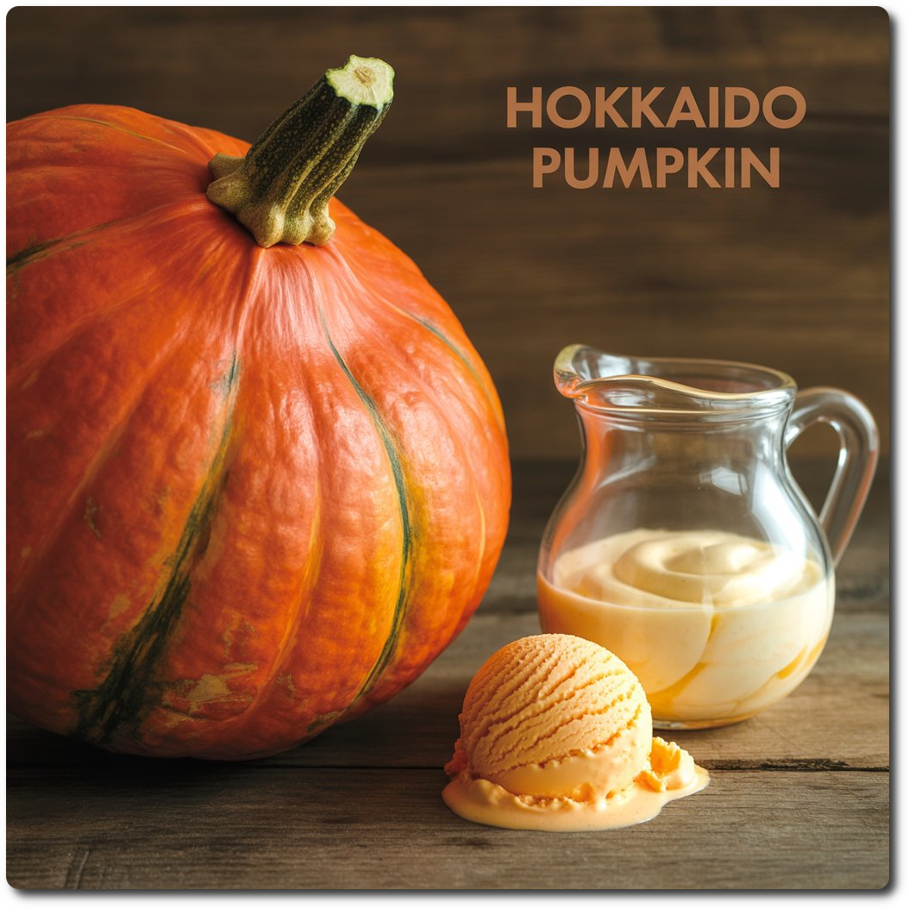
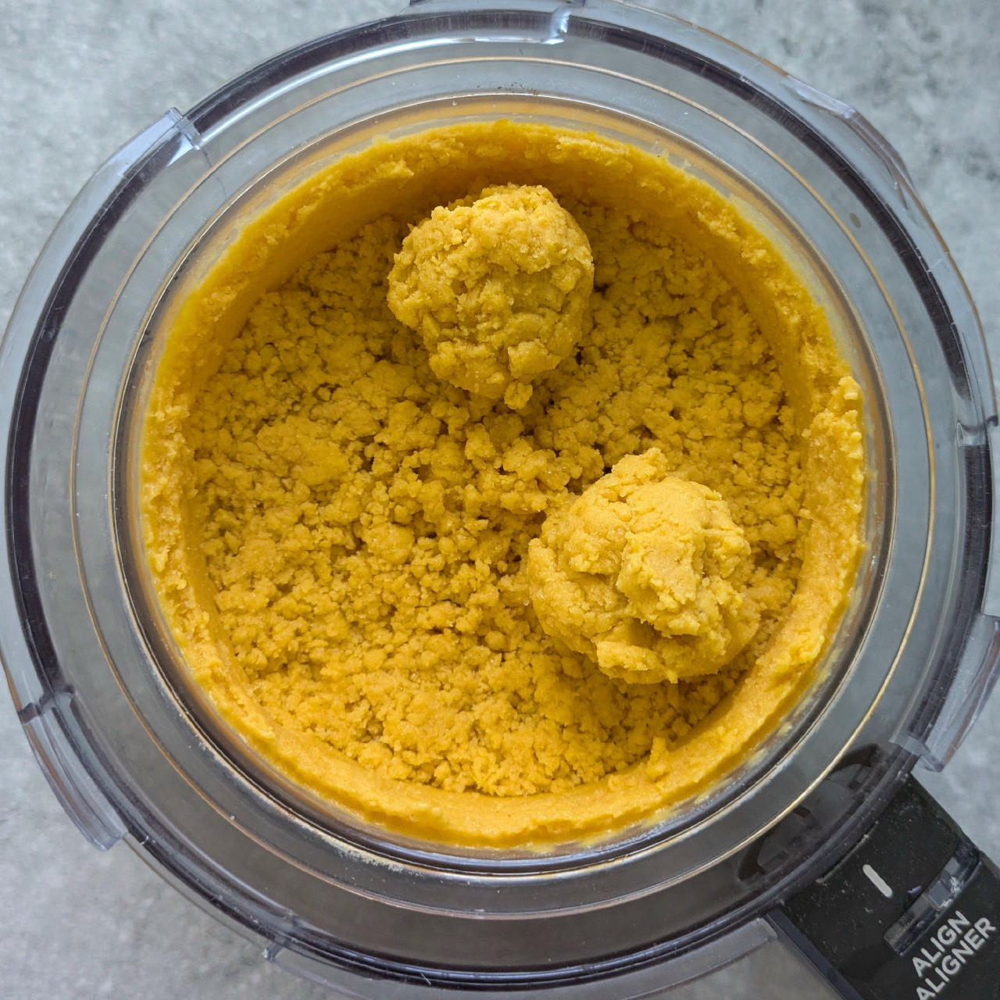
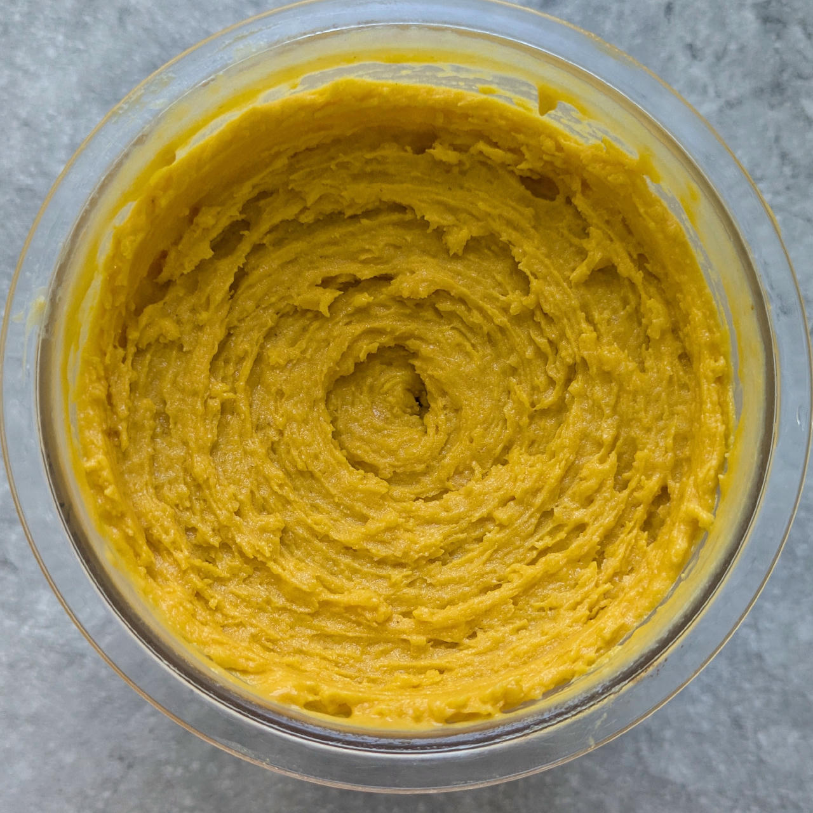
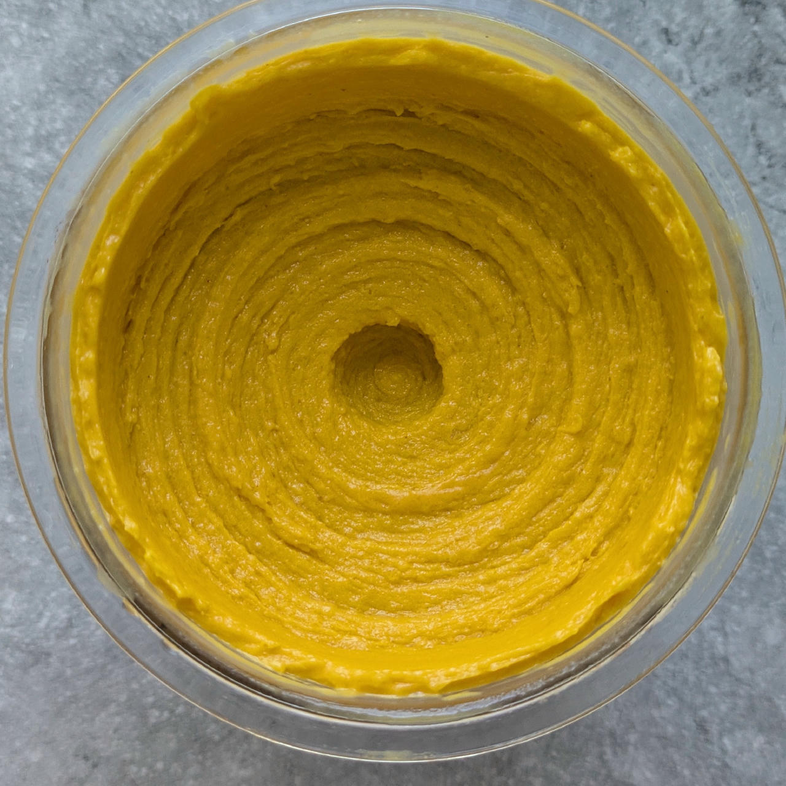
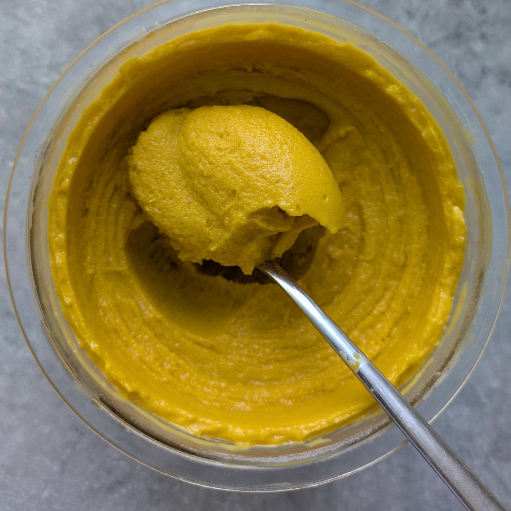

# Hokkaido Pumpkin (Deluxe)

Hokkaido pumpkin, also known as Red Kuri squash or Japanese squash, is a small, orange-red winter squash
with a distinct nutty flavor and edible skin.

Split the melon along its ‘equator’, spoon out the seeds and any soft flesh, remove the ‘polar caps’.
Then use a vegetable knife or sharp peeler to remove the skin, and cut into manageable pieces.

Finally follow the directions below.

One pumpkin yields about 450 – 500g cooked puree.
 

Spun on “Sorbet”, cold water treatment and scrape down, then “Ice Cream”, and finally a respin.

> 
> 
> 
> 

Rating: 😋🎃🎃❄️ (very unique flavor, but needs to be passed through a strainer)

> 💡 **Alcohol Replacement** 
> If you don't want alcohol in your ice cream, or prepare it for kids,
> replace the small amount of alcohol with vegetable glycerin.
> For 10g booze (40 vol%) use 8g VG instead.

# INGREDIENTS

ℹ️ Brand names are in square brackets `[...]`.

**Prep**

  - _450g_ Hokkaido pumpkin

**Wet**

  - _75ml_ [Soy milk 1.6% (sugar-free) \[Berief\]](/ice-creamery/info/ingredients/#soy-milk){target="_blank"}↗
  - _16g_ [Glycerin (E422, VG) \[hd-line\]](/ice-creamery/info/ingredients/#vegetable-glycerin-glycerol-vg-e422){target="_blank"}↗ • Sweetness = 60%; GI = 5; Density = 1.26 g/ml
  - _16g_ [Brandy or Vodka 40 vol%](/ice-creamery/info/ingredients/#alcohol-ethanol){target="_blank"}↗
  - _16g_ Honey

**Dry**

  - _20g_ [SweEX (Erythritol + Xylitol 3:2)](/ice-creamery/info/ingredients/#sweex-erythritol-xylitol-blend){target="_blank"}↗ • POD ≈ 90%; GI < 7
  - _10g_ [Soy protein isolate (nature) \[Powerstar\]](/ice-creamery/info/ingredients/#soy-protein-isolate){target="_blank"}↗ • unsweetened, unflavored
  - _5g_ [Salty Stability \[Inulin / GMS / CMC / Guar / XG / Salt\]](/ice-creamery/S/Salty%20Stability/){target="_blank"}↗ • unsweetened “ICSv2”

**Fill to MAX**

  - _50ml_ Cream 32% [REWE Beste Wahl]
  - _22ml_ [Soy milk 1.6% (sugar-free) \[Berief\]](/ice-creamery/info/ingredients/#soy-milk){target="_blank"}↗
  - _≈7 drops_ Flavor drops Vanilla (sucralose) [IronMaxx] • to taste

# DIRECTIONS

 1. Put the pumpkin pieces into a saucepan, add very little water and a bit of salt, nutmeg, ginger, and tumeric.
 1. Put on a lid and steam the pumpkin flesh on low heat until soft, about 20–30 min. Stir occasionally, add a splash of water if needed.
 1. Let the puree cool down a bit, add to an empty Creami tub together with the ‘wet’ ingredients.
 1. Blend until smooth.
 1. Weigh and mix dry ingredients, easiest by adding to a jar with a secure lid and shaking vigorously.
 1. Pour into the tub and *QUICKLY* use an immersion blender on full speed to homogenize everything.
 1. Let blender run until thickeners are properly hydrated, up to 1-2 min. Or blend again after waiting that time.
 1. Add remaining ingredients (to the MAX line) and stir with a spoon.
 1. Put on the lid, freeze for 24h, then spin as usual. Flatten any humps before that.
 1. Process with RE-SPIN mode when not creamy enough after the first spin.

# NUTRITIONAL & OTHER INFO

- **Nutritional values per 100g/ml:** 100g; 79.1 kcal; fat 2.6g; carbs 11.2g; sugar 4.7g; protein 2.7g; salt 0.1g
- **Nutritional values per ½ Deluxe Tub:** 340g; 268.8 kcal; fat 8.9g; carbs 38.2g; sugar 15.8g; protein 9.1g; salt 0.3g
- **Nutritional values total:** 680g; 537.7 kcal; fat 17.8g; carbs 76.5g; sugar 31.6g; protein 18.1g; salt 0.6g
- **FPDF / [PAC](/ice-creamery/info/glossary/#potere-anti-congelante-pac){target="_blank"}↗ (target 20..30):** 30.02
- **Protein / Energy Ratio (ok=12%; hi=20%):** 13.47% • LOW-FAT • Low-Sugar • Low-Salt
- **Milk Solids Non-Fat ([MSNF](/ice-creamery/info/glossary/#milk-solids-not-fat-msnf){target="_blank"}↗, 7-11%):** 16.3g • 2.4%
- **Net carbs:** 52.8g • *∝ 5 servings@136g:* 10.6g • *∝ 3 servings@227g:* 17.6g • *energy ratio (low <20%):* 39.3%
- **5g 'Salty Stability' is:** 3.7g Inulin • 0.6g Glycerol Monostearate (GMS / E471) • 0.3g Tylose powder (E466, Tylo, CMC) • 0.2g Guar gum (E412) • 0.17g Salt • 0.07g Xanthan gum (E415, XG).
