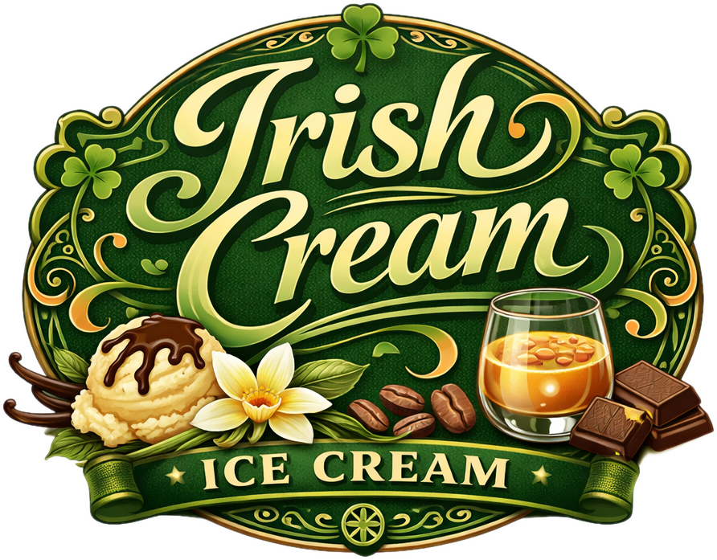

# Irish Cream (Deluxe)

*Irish Cream* ice cream with subtle notes of vanilla, coffee, and chocolate,
for an easygoing, grown‑up treat.

Spin on “Light Ice Cream”, scrape down, and re-mix if needed.

> 
> 
> 

Rating: 😋 (untested)

# INGREDIENTS

ℹ️ Brand names are in square brackets `[...]`.

**Prep**

  - _50ml_ Water (almost boiling, 90°C)
  - _15g_ [Cocoa Powder Organic 11% \[Sevenhills\]](/ice-creamery/info/ingredients/#cocoa-powder){target="_blank"}↗

**Wet**

  - _350ml_ [Soy milk 1.6% (sugar-free) \[Berief\]](/ice-creamery/info/ingredients/#soy-milk){target="_blank"}↗ • *alternative*: any other preferred milk (~2% fat)
  - _70g_ Irish Whiskey 40% [Jameson]

**Dry**

  - _30g_ [Milk powder 1:10 (skim, SMP) \[Vita2You\]](/ice-creamery/info/ingredients/#skim-milk-powder-smp){target="_blank"}↗
  - _15g_ [Salty Stability \[Inulin / GMS / CMC / Guar / XG / Salt\]](/ice-creamery/S/Salty%20Stability/){target="_blank"}↗ • *not-as-good substitute:* 1.5g guar, 0.5g xanthan, and 0.5g salt
  - _4g_ Instant Coffee [Mount Hagen] • 1.5g per 125ml
  - _2g_ Vanilla Bean Powder [InterVanilla]
  - _15 pcs_ Sweetener Tablets [LightSüß] • 1 tablet ≃ 4g sugar

**Fill to MAX**

  - _150ml_ Cream 32% [REWE Beste Wahl]
  - _≈3 drops_ Flavor drops Vanilla (sucralose) [IronMaxx] • to taste

# DIRECTIONS

 1. Mix the hot water with the cocoa powder to bloom it, then let it cool down.
 1. Add "wet" ingredients and the bloomed cocoa to empty Creami tub.
 1. Weigh and mix dry ingredients, easiest by adding to a jar with a secure lid and shaking vigorously.
 1. Pour into the tub and *QUICKLY* use an immersion blender on full speed to homogenize everything.
 1. Let blender run until thickeners are properly hydrated, up to 1-2 min. Or blend again after waiting that time.
 1. Add remaining ingredients (to the MAX line) and stir with a spoon.
 1. For better results, let the base age in the fridge (covered, lid on), for a few hours or over night. This helps flavor development and gum hydration, especially with unheated bases.
 1. Freeze for 24h with lid on, then spin as usual. Flatten any humps before that.
 1. Process with RE-SPIN mode when not creamy enough after the first spin.

# NUTRITIONAL & OTHER INFO

- **Nutritional values per 100g/ml:** 100g; 142.2 kcal; fat 8.2g; carbs 5.9g; sugar 3.1g; protein 4.2g; salt 0.2g
- **Nutritional values per ½ Deluxe Tub:** 340g; 483.6 kcal; fat 27.8g; carbs 20.1g; sugar 10.5g; protein 14.4g; salt 0.6g
- **Nutritional values total:** 686g; 975.8 kcal; fat 56.1g; carbs 40.6g; sugar 21.2g; protein 29.0g; salt 1.3g
- **FPDF / [PAC](/ice-creamery/info/glossary/#potere-anti-congelante-pac){target="_blank"}↗ (target 20..30):** 31.52
- **Protein / Energy Ratio (ok=12%; hi=20%):** 11.89% • Low-Sugar
- **Milk Solids Non-Fat ([MSNF](/ice-creamery/info/glossary/#milk-solids-not-fat-msnf){target="_blank"}↗, 7-11%):** 51.7g • 7.5%
- **Net carbs:** 29.6g • *∝ 5 servings@137g:* 5.9g • *∝ 3 servings@229g:* 9.9g • *energy ratio (low <20%):* 12.1%
- **15g 'Salty Stability' is:** 11.0g Inulin • 1.8g Glycerol Monostearate (GMS / E471) • 0.9g Tylose powder (E466, Tylo, CMC) • 0.6g Guar gum (E412) • 0.5g Salt • 0.2g Xanthan gum (E415, XG).
