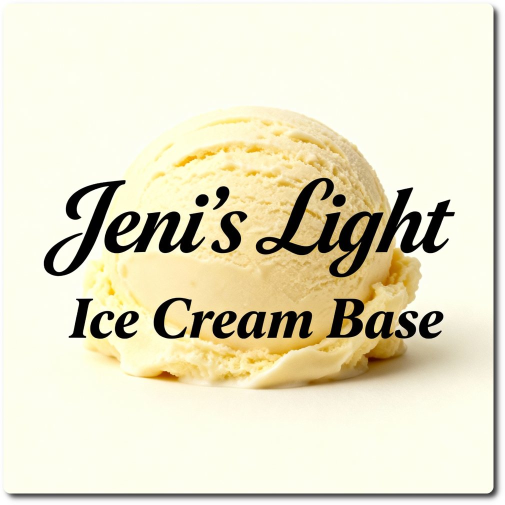

# Jeni's Light (Deluxe)

*Light* base recipe that yields ice cream that aims to have the same taste, texture, consistency, and finish
as Jeni’s ice cream base.
The original version can be found in the book “Jeni's Splendid Ice Creams at Home” (with recipes for lots of flavors).

Energy is reduced from almost 1500kcal to about 850kcal, fat roughly halved, and sugars are reduced to 6% compared to the original.

> *Source:* [saveur.com](https://www.saveur.com/article/Recipes/Jenis-Ice-Cream-Base/)

**Scaled to a Creami Deluxe tub, using “European ingredients” (mostly regarding fat content), and sane units of measurement.**

Add any flavor to your liking, e.g. 1-2 tsp vanilla extract.

> 
> 
> 

# INGREDIENTS

ℹ️ Brand names are in square brackets `[...]`.

**Prep**

  - _50ml_ [Soy milk 1.6% (sugar-free) \[Berief\]](/ice-creamery/info/ingredients/#soy-milk){target="_blank"}↗ • *alternative*: use any other preferred milk (~2% fat)
  - _10g_ Corn starch

**Wet**

  - _350ml_ [Soy milk 1.6% (sugar-free) \[Berief\]](/ice-creamery/info/ingredients/#soy-milk){target="_blank"}↗ • *alternative*: use any other preferred milk (~2% fat)
  - _50g_ [Cream Cheese 23% \[Exquisa\]](/ice-creamery/info/ingredients/#cream-cheese){target="_blank"}↗ • click the link for UK / US equivalents
  - _15g_ [Glycerin (E422, VG) \[hd-line\]](/ice-creamery/info/ingredients/#vegetable-glycerin-glycerol-vg-e422){target="_blank"}↗ • POD = 60%; GI = 5; Density = 1.26 g/ml

**Dry**

  - _40g_ [SweEX (Erythritol + Xylitol 3:2)](/ice-creamery/info/ingredients/#sweex-erythritol-xylitol-blend){target="_blank"}↗ • *alternative:* 53g allulose or dextrose
  - _35g_ [Inulin \[Vit4ever\]](/ice-creamery/info/ingredients/#inulin){target="_blank"}↗ • Sweetness = 8%; GI ~= 0
  - _35g_ [Isomalt (E953) \[GoodBake\]](/ice-creamery/info/ingredients/#isomalt-e953){target="_blank"}↗ • Very low GI, 50% sweetness
  - _0.75g_ Salt
  - _0.75g_ [Xanthan gum (E415, XG)](/ice-creamery/info/ingredients/#xanthan-gum-xg-e415){target="_blank"}↗ • ¼ tsp; *optional:* for better melting, and freezer stability

**Fill to MAX**

  - _100ml_ Cream 32% [REWE Beste Wahl]
  - _≈3 drops_ [Stevia drops “natural” \[Nick’s\]](/ice-creamery/info/ingredients/#stevia-e960){target="_blank"}↗ • to taste

# DIRECTIONS

 1. **Mix cornstarch slurry**: In a small bowl, whisk the cornstarch with a few tablespoons of the milk until smooth.
 1. **Heat base**: In a saucepan, whisk the dry ingredients into the remaining milk. Bring to a gentle boil over medium heat.
 1. **Thicken**: Stir in the cornstarch slurry and simmer for 1–2 minutes until slightly thickened.
 1. **Add cream cheese and VG**: Remove from heat, add VG, and whisk in the softened cream cheese until fully incorporated.
 1. **Chill**: Cool the mixture quickly (ice bath or fridge) until completely cold — ideally overnight.
 1. Add remaining ingredients (to the MAX line) and stir with a spoon.
 1. Put on the lid, freeze for 24h, then spin as usual. Flatten any humps before that.
 1. Process with RE-SPIN mode when not creamy enough after the first spin.

# NUTRITIONAL & OTHER INFO

- **Nutritional values per 100g/ml:** 100g; 123.5 kcal; fat 7.2g; carbs 20.5g; sugar 1.1g; protein 2.5g; salt 0.2g
- **Nutritional values per ½ Deluxe Tub:** 340g; 419.8 kcal; fat 24.6g; carbs 69.6g; sugar 3.7g; protein 8.6g; salt 0.8g
- **Nutritional values total:** 687g; 847.6 kcal; fat 49.7g; carbs 140.6g; sugar 7.6g; protein 17.3g; salt 1.6g
- **FPDF / [PAC](/ice-creamery/info/glossary/#potere-anti-congelante-pac){target="_blank"}↗ (target 20..30):** 28.18
- **Protein / Energy Ratio (ok=12%; hi=20%):** 8.19% • Low-Sugar
- **Milk Solids Non-Fat ([MSNF](/ice-creamery/info/glossary/#milk-solids-not-fat-msnf){target="_blank"}↗, 7-11%):** 27.1g • 4.0%
- **Net carbs:** 26.9g • *∝ 5 servings@137g:* 5.4g • *∝ 3 servings@229g:* 9g • *energy ratio (low <20%):* 12.7%
